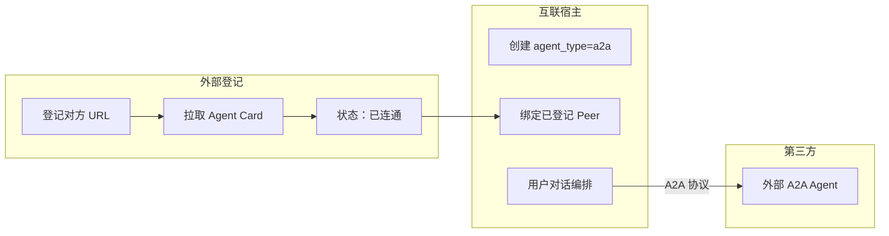
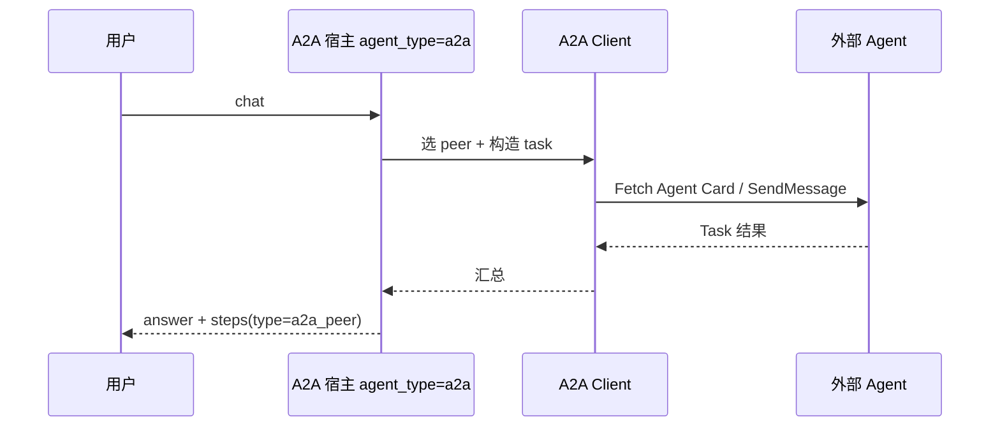

# A2A 协议互联智能体（外部 Agent 对接）

> 版本：v1.0 | 日期：2026-05-21  
> 状态：**P0–P2** ✅ 类型/Tab、Peer 登记、custom 引用、A2A 宿主；**P3+** 本平台对外暴露 Card  
> 协议参考：[A2A Protocol v1.0](https://a2a-protocol.org/v1.0.0/specification/)

---

## 1. 定义

**A2A（Agent2Agent）** 指基于开放协议的 **跨系统、跨厂商** 智能体互联，核心包括：

| 要素 | 说明 |
|------|------|
| **Agent Card** | 对方发布的 JSON 能力描述，常通过 `GET /.well-known/agent-card.json` 发现 |
| **标准调用** | Send Message / Stream Message、Task 生命周期等 |
| **隔离** | 不暴露对方内部 memory、tools、prompt |

**不等于** 本平台 `agt_sub_agent_bindings` 的内部协同（见 [internal-agent-orchestration.md](./internal-agent-orchestration.md)）。

---

## 2. 产品说明：外部登记与互联宿主

智能体列表 **「A2A 互联」** Tab 下有两个子模块，职责不同、前后衔接：



### 2.1 外部登记（`agt_a2a_peers`）

| 维度 | 说明 |
|------|------|
| **是什么** | 租户级「外部 Agent 目录」，一条记录对应一个第三方/其他厂商的 A2A 服务 |
| **做什么** | 登记根地址 → 拉取 `/.well-known/agent-card.json` → 缓存能力（skills、接口等） |
| **不负责** | 不直接对用户对话；不做任务编排 |
| **典型操作** | 登记、探测连通、同步 Card、删除 |
| **类比** | 通讯录：录入合作伙伴系统的地址与能力说明 |

**作用**：统一发现与校验外部能力；仅 **已连通**（Card 同步成功）的 Peer 可被宿主绑定或被自定义智能体引用。

### 2.2 互联宿主（`agent_type=a2a` + `agt_a2a_peer_bindings`）

| 维度 | 说明 |
|------|------|
| **是什么** | 平台内一种智能体，专门做 **跨系统 A2A 编排** |
| **做什么** | 绑定 1～8 个已登记 Peer → 用户只与宿主对话 → 按规则/规划调用外部 Agent → 汇总回复 |
| **不负责** | 不绑知识库、可视化流程、平台内子智能体 |
| **典型操作** | 新建宿主、选成员、配规则关键词与调用策略、对话工作台聊天 |
| **类比** | 总机：用户只打总机，由总机转接各合作方 |

**作用**：对外一个对话入口，对内按 A2A 协议调度多个外部 Agent；适合「多外部协同、以编排为主」的场景。

### 2.3 二者关系

- **联系**：登记是 **准备素材**（谁、在哪、能干什么）；宿主是 **使用素材**（对谁说话、何时调谁）。
- **依赖**：须先在外部登记中同步 Card，互联宿主才能选择成员；仅有登记而无宿主时，只维护目录、无统一编排入口。
- **与互联宿主的区别**：**智能体** Tab（`custom`）可在本地 RAG/内部协同基础上 **引用** 外部 A2A（`agt_agent_a2a_peer_refs`）；互联宿主则 **以调用外部成员为主**。详见 [custom-agent-a2a-refs.md](./custom-agent-a2a-refs.md)。

### 2.4 推荐使用顺序

1. **A2A 互联 → 外部登记**：登记第三方服务并 **同步 Card** 至「已连通」
2. **A2A 互联 → 互联宿主**：创建宿主，勾选成员，配置规则词（如「合作伙伴」「转接」）
3. **对话工作台**：选择该宿主对话，在 `steps` 中查看 `a2a_peer` 调用轨迹

| 业务场景 | 建议 |
|----------|------|
| 单智能体 + 偶尔问外部 | **智能体** Tab 创建 + 引用外部 A2A |
| 专门做多外部 Agent 协同中枢 | **互联宿主** |

---

## 3. 智能体类型 `agent_type`

| 值 | 含义 |
|----|------|
| `custom` | 自定义智能体（默认），可含内部协同 |
| `a2a` | A2A 互联智能体：编排并调用 **外部** A2A Agent |

存量数据默认 `custom`。**已绑子智能体的 custom 不迁移为 a2a。**

---

## 4. 目标数据模型

```text
agt_a2a_peers
  id, tenant_id, name, description
  agent_card_url          -- 或 base_url，拉取 well-known
  agent_card_json         -- 缓存 Agent Card
  auth_config             -- OAuth / API Key 等
  status, last_synced_at

agt_a2a_peer_bindings
  parent_agent_id         -- agent_type=a2a 的宿主智能体
  peer_id, role_hint, sort_order, enabled
```

**custom 引用外部（已实现）**：`agt_agent_a2a_peer_refs`

- 仅 `agent_type=custom` 可引用 `agt_a2a_peers`（非子智能体）
- `trigger_keywords`：规则命中则强制调用该 peer
- `config.a2a_invoke_policy`：`rules_then_plan`（默认）| `rules_only` | `plan_only`
- 对话：先本智能体 RAG/协同，再按规则/规划调外部 A2A，最后汇总

`agent_type=a2a` 的宿主：

- 绑定 **外部 peer**（`agt_a2a_peer_bindings`），非 `sub_agent_bindings`
- v1 禁止：`a2a` 宿主使用 `sub_agents` / `kb_ids` / `published_flow_id` 作为主路径

---

## 5. 运行时



编排层可复用 DeepAgents，但 **tool 实现为 A2A Client**，而非 `chat_as_child`。

---

## 6. 本平台作为 A2A Server（P3 可选）

为指定 `custom` 智能体发布：

- `GET /.well-known/agent-card.json`
- 符合 Card 的 skills / interfaces

供外部系统发现与调用本平台能力。

---

## 6. 实施分期

| 阶段 | 交付 |
|------|------|
| **P0** ✅ | `agent_type` 字段；列表 Tab「全部/自定义/A2A」；A2A Tab 空状态；文案区分内部协同 |
| **P1** ✅ | `agt_a2a_peers` + Card 同步/探测 + **`agt_agent_a2a_peer_refs`（custom 引用）** + 对话 `rules_then_plan` |
| **P2** ✅ | `agent_type=a2a` 互联宿主创建 + `run_a2a_host_chat` 对话编排 |
| **P3** | 本平台 A2A Server（对外暴露 Card） |
| **P4** | 审计、限流、与 MCP 并列的外部能力目录 |

---

## 8. UI

- **智能体 Tab**（`agent_type=custom`）：平台内能力 + 可选内部协同 / 引用外部 A2A
- **A2A 互联 Tab → 外部登记**：登记、探测、同步 Card
- **A2A 互联 Tab → 互联宿主**：创建/编辑 `agent_type=a2a` 宿主

---

## 9. API

```
GET    /api/v1/agents?agent_type=a2a
GET    /api/v1/a2a/peers
POST   /api/v1/a2a/peers
POST   /api/v1/a2a/peers/probe
POST   /api/v1/a2a/peers/{id}/sync-card
DELETE /api/v1/a2a/peers/{id}
POST   /api/v1/agents/{id}/chat       # a2a 宿主走 A2A 编排链（P2）
```
