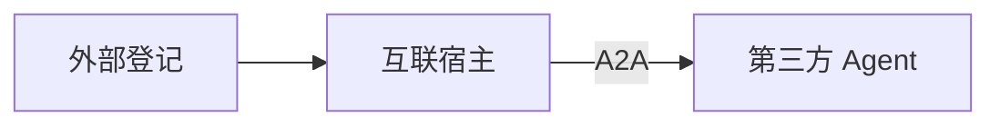

# A2A 外部互联

> 类型：智能体 | 状态：部分实现（登记/引用/宿主 ✅；对外暴露 Card 待做）  
> 协议：[A2A Protocol v1.0](https://a2a-protocol.org/v1.0.0/specification/) | 关联：[platform-agents.md](./platform-agents.md)

**A2A** = 跨厂商 Agent Card + 标准消息调用。**不等于** `agt_sub_agent_bindings` 内部协同。

## 外部登记 vs 互联宿主

| | 外部登记 `agt_a2a_peers` | 互联宿主 `agent_type=a2a` |
|--|--------------------------|---------------------------|
| 作用 | 登记 URL、同步 Card、维护目录 | 绑定 Peer，统一对话入口 |
| 类比 | 通讯录 | 总机转接 |
| 前置 | 须 **已连通** 方可被引用或绑定 | 依赖已登记 Peer |



**智能体 Tab**（`custom`）可在本地 RAG/内部协同后 **引用** 外部 Peer；**互联宿主** 以调用外部为主。

| 场景 | 建议 |
|------|------|
| 单智能体偶尔问外部 | custom + `agt_agent_a2a_peer_refs` |
| 多外部协同中枢 | `agent_type=a2a` 宿主 |

## 平台内引用外部（custom）

- 表：`agt_agent_a2a_peer_refs`（`peer_id`、`trigger_keywords`、`role_hint`）
- 与 `agt_sub_agent_bindings` **分表**
- 策略（`config.a2a_invoke_policy`，默认 `rules_then_plan`）：
  1. 先本智能体 RAG/内部协同
  2. 规则命中 `trigger_keywords` → 强制调该 Peer
  3. 否则规划层选 Peer（`plan_only` / `rules_only`）
  4. `invoke_a2a_peer` 后由主模型汇总
- `max_a2a_calls_per_turn` 默认 2；Peer 须登记且 `active`

## 数据模型

```text
agt_a2a_peers          # 登记与 Card 缓存
agt_a2a_peer_bindings  # 宿主 → peer
agt_agent_a2a_peer_refs # custom → peer
```

`a2a` 宿主：禁止主路径使用 `sub_agents` / `kb_ids` / `published_flow_id`。

## 运行时

宿主对话：`run_a2a_host_chat` → A2A Client → 外部 Agent；`steps` 含 `type=a2a_peer`。

custom 有 peer_refs：在 RAG/协同/流程结果上 `augment_response_with_a2a`。

模块：`backend/app/app_tenant/a2a/`（`card_client.py`、`invoke.py`）。

## UI

- **A2A 互联 Tab → 外部登记**：登记、探测、同步 Card
- **A2A 互联 Tab → 互联宿主**：创建/编辑 `agent_type=a2a`
- **智能体 Tab**：可选引用外部 A2A（表单第 4 步）

## API

```
GET/POST   /api/v1/a2a/peers
POST       /api/v1/a2a/peers/probe
POST       /api/v1/a2a/peers/{id}/sync-card
GET        /api/v1/agents?agent_type=a2a
POST       /api/v1/agents/{id}/chat    # 宿主或 custom 增强
```

## 待做

- 本平台对外 `/.well-known/agent-card.json`（指定 custom 暴露为 Server）
- 审计、限流
