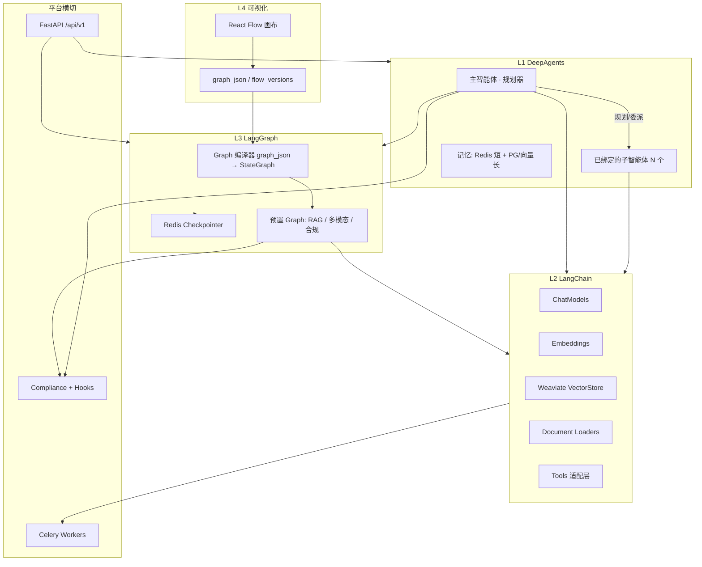
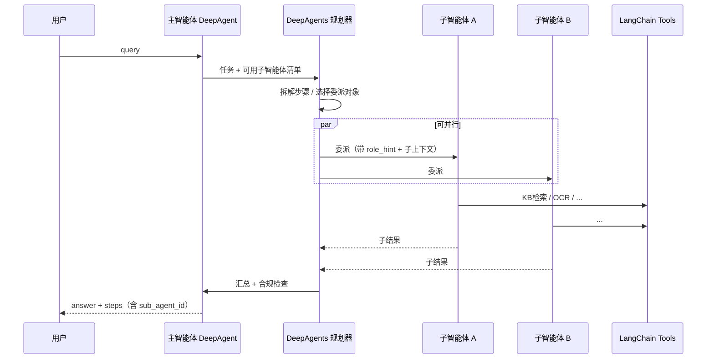

# 智能体增强技术方案：LangChain + LangGraph + DeepAgents

> 版本：v0.3 | 日期：2026-05-21  
> 状态：**P6-1 LangChain**；**P6-2 RAG LangGraph**；**P6-3 画布 LangGraph**；**P6-4 DeepAgents**（见 [deepagents-subagents](./deepagents-subagents.md)）已接 `create_deep_agent` + 平台降级  
> 关联：[flow-runtime.md](./flow-runtime.md)、[技术方案.md](./技术方案.md)

---

## 1. 目标与原则

### 1.1 目标

在**不推翻**现有多租户、RBAC、Celery、Weaviate、合规钩子、应用市场架构的前提下，将智能体与编排能力升级为四层栈：

| 层级 | 职责 | 对应开源能力 |
|------|------|----------------|
| **L4 可视化编排** | 拖拽画布、版本、调试 | 现有 **React Flow** + `flow_versions.graph_json`（上层产品能力） |
| **L3 流程引擎** | 有状态、分支、循环、可恢复 | **LangGraph** |
| **L2 能力底座** | RAG、模型、工具、文档 | **LangChain** |
| **L1 自主智能体** | 规划、拆解、多 Agent、长记忆 | **DeepAgents**（`langchain-ai/deepagents`） |

> **命名说明**：需求中的「Langflow 可视化」在本仓库落地为 React Flow + LangGraph（[flow-runtime.md](./flow-runtime.md)），**无** PyPI `langflow` 依赖。L4 → L3：`graph_json` 编译为 LangGraph `StateGraph`。

### 1.2 设计原则

1. **绞杀者模式（Strangler）**：新栈包在旧实现外侧，逐条链路切换，保留回滚开关。
2. **租户贯穿**：`tenant_id` / `user_id` 进入 LangGraph `configurable` 与 DeepAgents 上下文，禁止跨租户记忆与检索。
3. **合规不可绕过**：敏感词、钩子作为 LangGraph **固定节点** 或 **Middleware**，与现 `ComplianceService`、`HookRunner` 复用。
4. **异步边界清晰**：Web 只做短推理；长 Graph / 批量 RAG 走 Celery，状态写 Redis + PG。
5. **依赖可选分组**：`pip install aiengine[agent-stack]`，避免 P1 部署镜像膨胀。

---

## 2. 现状盘点（As-Is）

### 2.1 已有能力

| 模块 | 路径 | 行为 |
|------|------|------|
| 智能体对话 | `app_tenant/agents/services/agent.py` | `published_flow_id` → LangGraph 画布；否则 RAG Graph / 线性 legacy |
| 流程执行 | `flow_runtime.nodes` + `ai_stack/langgraph` | 节点 registry + 画布编译执行 |
| 向量/RAG | `app/ai/embedding.py`、`app/core/weaviate_store.py` | 直连 sentence-transformers + Weaviate |
| 模型调用 | `app/core/llm_client.py` | 按 `ModelConfig` OpenAI 兼容 HTTP |
| 工具 | `app_tenant/tools/invoke.py` | calculator / http / knowledge_search + 自定义 HTTP 工具 |
| 合规/钩子 | `compliance`、`hooks` | 对话前后已接入 `AgentService.chat` |
| 异步 | `workers/tasks`、`kb/services/ingest.py` | 解析、向量化 |

### 2.2 缺口（相对你的需求）

- 无 **分支/循环/重试** 的一等公民（RAG 质量差不能自动重检索）。
- 无 **统一 AI 抽象**（模型、Embedding、VectorStore、Tool 分散）。
- 无 **自主规划**（固定 prompt 链，不能动态选工具顺序）。
- 无 **多 Agent 协同**（主智能体不能可选绑定多个子智能体分工）。
- 无 **DeepAgents 规划层**（不能根据任务动态调度已绑定的子智能体）。
- 画布与执行引擎 **未分离**：`graph_json` 与 Builtin 节点强绑定，难升级。

---

## 3. 目标架构（To-Be）



### 3.1 执行路由（智能体三种模式）

在 `Agent.config` 增加 `runtime_mode`（兼容旧数据默认 `legacy`）：

| 模式 | 说明 | 执行路径 |
|------|------|----------|
| `legacy` | 回退 | 线性 `_rag_chat`（`use_langgraph_rag: false`） |
| `workflow` | 固定流程、可观测 | LangGraph（来自 `published_flow_id` 编译图或内置 `rag_v1`） |
| `autonomous` | 开放任务、自主工具与**子智能体协同** | **DeepAgents 规划** + LangChain Tools |

`POST /agents/{id}/chat` 统一入口 → `AgentRuntimeRouter` 按模式分发。

**路由优先级（强制规则）**：

```
若 agent 绑定了 ≥1 个子智能体（agt_sub_agent_bindings）
  → runtime_mode 必须为 autonomous
  → planner 必须为 deepagents（不可退回 legacy/workflow 硬编码调度）
若未绑定子智能体
  → 按 runtime_mode 走 legacy / workflow / autonomous（无绑定时 autonomous 仍可用平台内置工具）
```

### 3.2 多子智能体绑定（可选）+ DeepAgents 规划

#### 3.2.1 产品语义

- **主智能体（Parent）**：对用户暴露的对话入口，持有总目标、合规边界、可选 KB/流程/模型。
- **子智能体（Child）**：同租户下已存在的 `agt_agents` 记录，**可选、可多个**，每个子智能体保留自己的 `system_prompt`、KB、技能包、MCP、模型配置。
- **规划器**：凡启用子智能体绑定的主智能体，**统一由 DeepAgents** 做任务拆解、选择调用哪个子智能体、是否并行、何时汇总结果（不用 if/else 写死调度）。

#### 3.2.2 数据模型

新增关联表（与 `agt_kb_bindings` 同级）：

```sql
-- agt_sub_agent_bindings
parent_agent_id  UUID  NOT NULL  -- 主智能体
child_agent_id   UUID  NOT NULL  -- 子智能体
role_hint        VARCHAR(64)     -- 可选：retrieval | ocr | summary | compliance | custom
sort_order       INT DEFAULT 0
enabled          BOOLEAN DEFAULT true
PRIMARY KEY (parent_agent_id, child_agent_id)
```

约束（Service 层校验）：

| 规则 | 说明 |
|------|------|
| 同租户 | `parent.tenant_id == child.tenant_id` |
| 禁止自绑定 | `parent_agent_id != child_agent_id` |
| 禁止成环 | 保存时 DFS/BFS 检测（A→B→A） |
| 数量上限 | 建议 `max_sub_agents = 8`（可配置） |
| 仅一层委派 | v1 子智能体**不能再挂**子智能体（`child` 作为 leaf worker） |

`Agent.config` 增量字段：

```json
{
  "runtime_mode": "autonomous",
  "planner": "deepagents",
  "max_plan_iterations": 12,
  "max_subagent_calls": 20,
  "subagent_parallel": true
}
```

| 字段 | 说明 |
|------|------|
| `planner` | 固定 `deepagents`（绑定子智能体时由后端写入，前端只读） |
| `max_plan_iterations` | DeepAgents 规划/反思轮次上限 |
| `max_subagent_calls` | 单次对话调用子智能体次数上限 |
| `subagent_parallel` | 是否允许 DeepAgents 并行 spawn 多个子智能体 |

#### 3.2.3 DeepAgents 如何消费「绑定的子智能体」



实现要点（`ai_stack/deepagents/orchestrator.py`）：

1. **加载绑定**：`list_bound_sub_agents(parent_id)` → 完整 `Agent` 行 + KB/MCP/技能包。
2. **注册 Subagent**：每个 `child` 映射为 DeepAgents 的一个 subagent spec：
   - `name`：子智能体 `name`
   - `description`：`description` + `role_hint`
   - `system_prompt`：子智能体 `system_prompt`（及技能包/MCP 块，复用 `build_skill_mcp_prompt_block`）
   - `tools`：由子智能体 `kb_ids`、绑定的流程、平台工具集推导（LangChain Tool）
3. **主智能体 system prompt** 注入「可用子智能体目录」表格（id、名称、role_hint、适用场景），供规划器选择。
4. **委派执行**：子智能体内部可走轻量 `workflow`（固定 RAG 图）或 `legacy` 单轮能力，但**调度顺序由 DeepAgents 决定**，不由主智能体代码写死。
5. **可观测**：`ChatResponse.steps` 增加字段 `{ "type": "subagent", "sub_agent_id", "sub_agent_name", "input_preview", "output_preview" }`。

**与「内置角色 Subagent」关系**：

| 类型 | 来源 | 何时使用 |
|------|------|----------|
| **租户子智能体** | `agt_sub_agent_bindings` | 用户在主智能体上显式绑定，**DeepAgents 优先委派** |
| **平台内置 worker** | `ai_stack/deepagents/subagents.py` 硬编码 | 未绑定对应能力时降级（如未绑 OCR 子智能体则调 `paddle_ocr_tool`） |

#### 3.2.4 API / 前端（草案）

| 变更 | 说明 |
|------|------|
| `AgentCreate` / `AgentUpdate` | `sub_agent_ids: list[UUID] = []`（可选） |
| `AgentOut` | `sub_agents: list[{ id, name, role_hint, status }]` |
| 校验 | 绑定非空时自动 `runtime_mode=autonomous`、`planner=deepagents` |
| 工作台 UI | 主智能体编辑页：多选子智能体 + 可选 `role_hint` + 排序 |

---

## 4. 工程改造：目录与依赖

### 4.1 建议新增包结构

```
backend/app/
├── ai_stack/                      # 新：LangChain/LangGraph/DeepAgents 统一入口
│   ├── __init__.py
│   ├── config.py                  # 功能开关、版本锁定
│   ├── langchain/
│   │   ├── chat_models.py         # ModelConfig → BaseChatModel
│   │   ├── embeddings.py          # 包装 app.ai.embedding
│   │   ├── vectorstores.py        # WeaviateVectorStore（tenant filter）
│   │   ├── document_loaders.py    # 包装 parsers + MinIO
│   │   ├── text_splitters.py      # KB 分片策略
│   │   └── tools/                 # 平台 Tool → StructuredTool
│   ├── langgraph/
│   │   ├── checkpointer.py        # Redis / PG 双写
│   │   ├── compiler.py            # graph_json → StateGraph
│   │   ├── graphs/
│   │   │   ├── rag_qa.py          # 标准 RAG 工作流
│   │   │   ├── multimodal_image.py
│   │   │   └── flow_from_canvas.py
│   │   └── nodes/                 # 节点实现（调用 langchain + 合规）
│   ├── deepagents/
│   │   ├── factory.py             # 创建 deep agent 实例
│   │   ├── subagents.py           # 检索/OCR/总结/审核
│   │   └── memory.py              # 短/长记忆适配
│   └── runtime/
│       ├── router.py              # AgentRuntimeRouter
│       └── celery_tasks.py        # 长任务 Graph 执行
├── flow_runtime/                  # 保留：legacy 与渐进迁移
└── app_tenant/agents/
    └── services/agent.py          # 瘦身为调用 ai_stack.runtime
```

### 4.2 依赖（`pyproject.toml` 建议）

```toml
[project.optional-dependencies]
agent-stack = [
    "langchain>=0.3",
    "langchain-core>=0.3",
    "langchain-openai>=0.2",
    "langchain-community>=0.3",
    "langgraph>=0.2",
    "langgraph-checkpoint-redis>=0.1",  # 或自研 Redis checkpointer
    "deepagents>=0.2",                   # langchain-ai/deepagents
]
```

版本需在 Spike 中锁定；与现有 `sentence-transformers`、`weaviate-client` 共存。

---

## 5. 分层落地说明

### 5.1 LangChain（L2）—— 统一 AI 底座

**策略**：先 **Adapter 包装现有实现**，再逐步替换为 LangChain 原生组件。

| 能力 | 现状 | 改造 |
|------|------|------|
| Chat | `llm_client.chat_completion` | `PlatformChatModel`：内部仍调 `ModelConfig`，对外 `BaseChatModel` |
| Embedding | `embed_query` / `embed_texts` | `PlatformEmbeddings` → 同一模型名与维度 |
| VectorStore | `weaviate_store.search_vectors` | `TenantWeaviateStore`：强制 `tenant_id` + `kb_id` filter |
| 文档加载 | `ai/parsers/*` + ingest | `Loader` 链：MinIO → Parser → `Document` |
| 分片 | ingest 内逻辑 | `RecursiveCharacterTextSplitter` + KB 配置项 |
| 工具 | `tools/invoke.py` | `@tool` 注册：OCR、MinIO 读、Weaviate 检索、配置查询、审计日志 |

**Celery**：Worker 内 Runnable 序列化任务 payload（`tenant_id`, `doc_id`, `kb_id`），禁止在 task 内新建无租户上下文的 Store。

**Redis 缓存**（可选 LangChain Cache）：

- LLM 响应 cache key：`t:{tenant}:llm:{hash}`
- 检索 cache：`t:{tenant}:rag:{kb}:{query_hash}`

### 5.2 LangGraph（L3）—— 流程编排引擎

#### 5.2.1 标准 RAG Graph（替代 `_rag_chat` 硬编码）

状态示例 `RAGState`：

```python
# 概念字段
query, kb_ids, hits, ocr_aux, prompt, answer, retry_count, compliance_flags
```

节点链路：

```
input_guard → retrieve → [grade_documents] → branch
    ├─ 无结果 → fallback_answer
    └─ 有结果 → [optional ocr_enrich] → generate → output_guard → END
         └─ grade 低分 → retry_retrieve (循环，上限 N)
```

- `input_guard` / `output_guard`：调用现有 `ComplianceService` + `HookRunner`。
- `retrieve`：LangChain retriever + 多 KB merge（复用现逻辑）。
- **Checkpointer**：`thread_id = f"{tenant_id}:{agent_id}:{session_id}"` 存 Redis（须 Redis Stack 或 Redis 8+；普通 Redis 回退内存，见 [langgraph-rag-workflow.md](./langgraph-rag-workflow.md)「使用提示」）。

#### 5.2.2 多模态图片问答 Graph

```
receive_image → paddle_ocr_tool → clip_search → fuse_context → llm → output_guard
```

- OCR：Celery 队列或同步 tool（大图走异步，Graph 挂起 checkpoint 续跑）。
- CLIP：二期；一期可文本占位 + 图片 metadata 向量。

#### 5.2.3 与可视化画布（L4）对接

**阶段 A（快）**：预置 Graph 模板 ID，画布仅选模板 + 参数（与现 `rag_flow.json` 类似）。

**阶段 B（完整）**：`compiler.py` 将 `graph_json` 节点类型映射为 LangGraph 节点：

| graph_json type | LangGraph 节点 |
|-----------------|----------------|
| TextInput | 入口 state 注入 |
| KnowledgeSearch | `retrieve` |
| LLMCall | `generate` |
| PromptTemplate | `prompt_build` |
| 自定义 OCR/Cache | 注册表扩展 |

`flow_runtime` **保留节点与类型**；Builtin 执行器已移除，画布仅 LangGraph。RAG 仍可用 `runtime_mode=legacy` 走线性链。

#### 5.2.4 Celery + Redis

| 场景 | 做法 |
|------|------|
| 调试 run 超时 | `POST /flows/{id}/run` 同步，限制步数 |
| 长流程 | `celery_tasks.run_graph_async`，前端轮询 `/tasks/{id}` |
| 状态 | LangGraph checkpoint + `celery_task_records` 关联 |

### 5.3 DeepAgents（L1）—— 规划器 + 多子智能体协同

基于官方 [**deepagents**](https://github.com/langchain-ai/deepagents)（LangChain + LangGraph 之上）。

**核心定位**：凡主智能体配置了 **≥1 个绑定子智能体**，对话链路的 **任务规划、步骤拆解、子智能体选择与调用顺序** 全部由 DeepAgents 完成，平台不在 `AgentService` 内写死调度逻辑。

| 能力 | 落地 |
|------|------|
| **多子智能体绑定** | `agt_sub_agent_bindings`；见 §3.2 |
| **任务规划** | DeepAgents planning tool：根据用户 query + 子智能体目录生成计划 |
| **委派执行** | `spawn_subagent` → 执行对应 `child_agent_id` 的 prompt + tools |
| **平台工具** | 主/子智能体均可使用 L2 `PlatformTool`（检索、OCR、MinIO…） |
| **内置降级 worker** | 未绑定专门子智能体时，使用内置 retrieval/ocr/summary/compliance worker |
| **记忆** | 短期：Redis（`thread_id`）；长期：PG `agent_memory` |
| **纠错** | 子智能体失败 → DeepAgents 重试或换子智能体；仍走合规 middleware |

**与 LangGraph 分工**：

| 场景 | 引擎 |
|------|------|
| 主智能体 **未绑** 子智能体，且 `runtime_mode=workflow` | LangGraph 固定图 |
| 主智能体 **已绑** 子智能体 | **仅 DeepAgents**（子智能体内部可用 LangGraph 作「工位技能」） |
| 主智能体未绑子智能体，`runtime_mode=autonomous` | DeepAgents + 平台工具，无租户子智能体 |

**禁止**：绑定子智能体后仍走 `legacy` 线性 RAG 或主路径 Builtin `flow_runtime` 作为主规划器（子智能体自身可保留 `published_flow_id` 作为被调用时的能力实现）。

---

## 6. 数据模型与 API 变更（草案）

### 6.1 表/字段

| 变更 | 说明 |
|------|------|
| **`agt_sub_agent_bindings`（新表）** | 主智能体 ↔ 多子智能体，含 `role_hint`、`sort_order` |
| `agents.config.runtime_mode` | `legacy` \| `workflow` \| `autonomous` |
| `agents.config.planner` | `deepagents`（有子智能体绑定时强制） |
| `agents.config.max_plan_iterations` 等 | DeepAgents 配额 |
| `agents.config.graph_template_id` | 内置 LangGraph 模板（子智能体工位用） |
| `agent_sessions`（新表） | session_id, agent_id, checkpoint_ref, metadata |
| `agent_memory`（新表） | 长期记忆条目，tenant 隔离 |
| `flow_versions.compiled_graph_ref` | 可选缓存编译结果 |

### 6.2 API（增量）

| 方法 | 路径 | 说明 |
|------|------|------|
| POST/PATCH | `/agents` | `sub_agent_ids` 可选；保存时校验环与租户 |
| POST | `/agents/{id}/chat` | 增加 `session_id`；有绑定时强制 DeepAgents 规划 |
| GET | `/agents/{id}/sub-agents` | 列出已绑定子智能体（调试） |
| GET | `/agents/{id}/sessions/{sid}/state` | 查看 Graph 状态（调试） |
| POST | `/flows/{id}/compile` | graph_json → LangGraph 校验/预览 |
| POST | `/agents/{id}/chat/async` | 长任务，返回 task_id |

权限：沿用 `agents:*`；编译与调试可加 `flows:debug`。

---

## 7. 分阶段实施计划（建议 P6）

| 阶段 | 周期 | 交付 | 验收 |
|------|------|------|------|
| **P6-0 Spike** | 1 周 | 依赖锁定；最小 LangGraph RAG；Redis checkpoint POC；租户隔离测试 | 单租户对话可恢复；无跨租户泄漏 |
| **P6-1 LangChain 底座** | 2–3 周 | `ai_stack/langchain/*`；Tools 注册；ingest 走 Loader+Splitter（可开关） | 现有 E2E 用例通过；开关回退 legacy |
| **P6-2 LangGraph 工作流** | 3–4 周 | `rag_qa`、`multimodal_image`（OCR 分支）；`workflow` 模式；合规节点固化 | 分支/重检索可观测；步骤日志入 `ChatResponse.steps` |
| **P6-3 画布编译** | 2–3 周 | `compiler.py`；主要节点映射；`flow run` 走 LangGraph | 画布保存 → run 与 Builtin 结果一致（golden test） |
| **P6-4 DeepAgents + 多子智能体** | 3–4 周 | `agt_sub_agent_bindings`；DeepAgents 规划委派；API/UI 多选绑定；`steps` 含子智能体轨迹 | 主智能体绑 2+ 子智能体，复杂任务自动分工 |
| **P6-5 生产化** | 2 周 | Celery 长 Graph、监控指标、文档、依赖镜像 | Flower/日志可追 thread_id |

**总估**：12–16 人周（1 后端 + 0.5 前端联调），可并行 P6-1 与 P6-0 后续。

---

## 8. 与现有模块集成要点

| 横切能力 | 集成方式 |
|----------|----------|
| 多租户 | 所有 Runnable `config={"configurable": {"tenant_id": ...}}` |
| 合规 | LangGraph 入口/出口节点；DeepAgents tool 包装层统一 `check_output` |
| 钩子 | `BEFORE_CALL` / `AFTER_CALL` 在 router 层；Graph 内 `ON_ERROR` 边 |
| MCP/技能包 | 注入 system prompt（现 `context.py`）+ 注册为 Dynamic Tools |
| 应用市场 | manifest 增加 `runtime_mode`、`graph_template_id` |
| 监控 | LangSmith（可选）；自建 span：`graph_node`, `tool_name`, `tenant_id` |

---

## 9. 风险与对策

| 风险 | 对策 |
|------|------|
| 依赖体积与冲突 | optional `agent-stack`；CI 双镜像（slim / full） |
| LangChain 同步 vs FastAPI async | 节点内 `asyncio.to_thread` 或选用 async 版 API |
| graph_json 与 LangGraph 语义不等价 | 阶段 A 仅模板；阶段 B 编译器 + golden test |
| DeepAgents 成本与失控循环 | `max_plan_iterations`、`max_subagent_calls`、租户配额 |
| 子智能体成环 / 过深嵌套 | 保存时环检测；v1 仅允许一层 child |
| 子智能体配置漂移 | 委派时快照 child 的 prompt/工具版本号（可选 `binding_version`） |
| 记忆隐私 | 长期记忆按 tenant+user 分区；支持删除与导出 |
| 回滚 | `runtime_mode=legacy` 全局开关 +  per-agent 覆盖 |

---

## 10. 需要你方确认的产品决策（评审前）

1. **L4 是否坚持 React Flow**，还是未来引入 Langflow 官方画布？（影响编译器投入）
2. **默认模式**：新智能体默认 `workflow` 还是保持 `legacy` 一段时间？
3. **子智能体数量上限**：默认 8 是否合适？是否按租户套餐分级？
4. **role_hint**：是否强制从枚举选择（retrieval/ocr/…）还是允许纯自定义文本？
5. **DeepAgents 开放范围**：未绑子智能体时，是否仍允许 `autonomous`？
6. **LangSmith**：是否采购/自建追踪（影响可观测性方案）？
7. **多模态 CLIP**：是否与 P6-2 同期，还是单独 P7？

---

## 11. 附录：与需求四层表述的对照

| 你的表述 | 本方案落地 |
|----------|------------|
| Langflow 可视化（上层） | React Flow + `graph_json` → **LangGraph 编译器** |
| LangGraph（中层） | `ai_stack/langgraph`，替代 Builtin 主路径 |
| LangChain（底层） | `ai_stack/langchain`，包装现有 Weaviate/LLM/OCR |
| DeepAgents（顶层） | 绑定子智能体 → **DeepAgents 规划**；`agt_sub_agent_bindings` + `planner=deepagents` |

评审通过后可拆为 `docs/superpowers/specs/` 实施计划（按 [writing-plans](.) 技能）并进入 P6-0 Spike。
