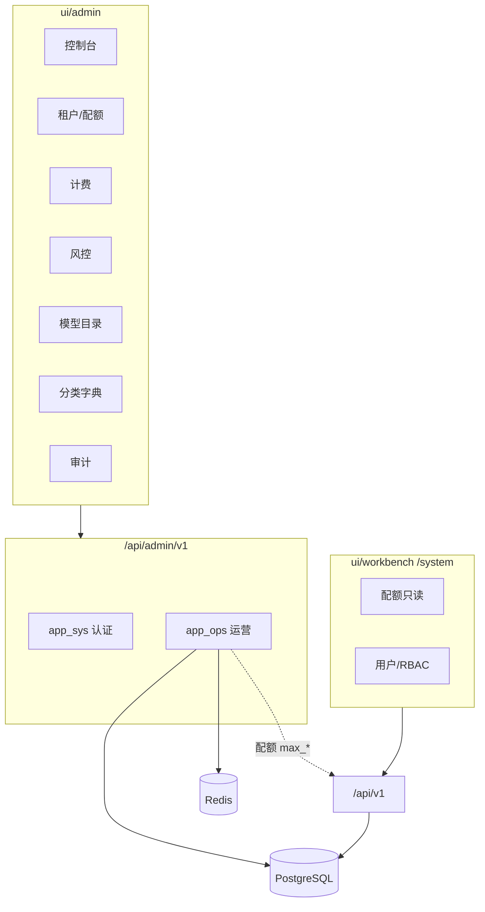
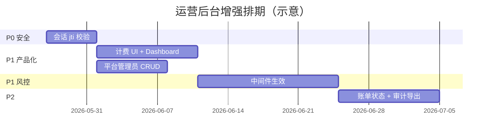

# 运营后台 — 技术增强方案

**日期：** 2026-05-27  
**状态：** Phase 0–5 已实现；Phase 4 计费/审计产品化已完成  
**As-Is 规格：** [features/admin-ops.md](../features/admin-ops.md)（基线能力）  
**关联：** [technical-design.md §运营域](./technical-design.md#42-运营域)、[system-management-design.md](./system-management-design.md)、[prd.md §模块1a](../product/prd.md#as-is-module-1)

---

## 1. 定位与边界

运营后台（`ui/admin` · `/api/admin/v1`）是**平台平面**，与租户工作台（`ui/workbench` · `/api/v1`）严格分离：

| 维度 | 租户工作台 | 运营后台 |
|------|------------|----------|
| 操作者 | 租户管理员 / 成员 | 平台管理员 |
| 认证 | `sys_users` JWT | `adm_admins` JWT（`type=admin_access`） |
| 数据范围 | 单租户 `tenant_id` | 全平台租户与全局字典 |
| 典型职责 | RBAC、业务配置、本租户审计 | 租户生命周期、**配额**、计费、风控、内置模型、全局分类 |



### 1.1 设计原则

1. **配额修改唯一入口在运营后台** — 租户 `/system/quota` 只读；`PATCH /tenants/{id}/quota` 仅 admin API（见 [system-management-design §4.3](./system-management-design.md#43-资源配额)）。
2. **风控规则必须可运行时生效** — `adm_ip_blacklist`、`adm_rate_limit_rules` 不能只做配置 CRUD。
3. **会话与租户 JWT 同等严格** — Redis 存 jti，鉴权必须校验；登出/吊销后 token 立即失效。
4. **写操作必审计** — 运营侧统一 `write_audit_log`，与租户 `aud_logs` 分离（`adm_audit_logs`）。
5. **应用市场审核按部署模式切换** — 见 [marketplace-review-design.md](./marketplace-review-design.md)：`review_mode=platform|tenant|off`，SaaS 默认平台审，私有化默认租户审。

### 1.2 明确不做（本方案范围外）

| 项 | 说明 |
|----|------|
| 租户内用户/角色管理 | 租户 `/system/*` |
| 应用市场审核（固定单模式） | 见 [marketplace-review-design.md](./marketplace-review-design.md) Phase R0–R3 |
| 基础设施 `.env` 编辑 | 部署级；租户侧已做只读 + test-connection |
| 支付网关 / 在线收款 | 账单仅运营侧「出具/标记」 |
| Redis 缓存前缀清理 UI | 与租户系统管理方案一致，暂不纳入 |

---

## 2. 现状（As-Is）

> 文档 [admin-ops.md](../features/admin-ops.md) 标「已实现」偏乐观。以下按 **API / UI / Runtime** 三层描述真实状态。

### 2.1 分层状态总览

| 子模块 | API | UI | Runtime / 生效 | 备注 |
|--------|-----|----|------------------|------|
| 认证登录 | ✅ | ✅ | ⚠️ | Redis 写 jti，**鉴权未校验 jti** |
| 改密 / 会话列表 | ✅ | ✅ profile | ⚠️ | 前端 logout **未调** `POST /auth/logout`；会话吊销 UI 缺失 |
| 平台管理员 CRUD | ❌ | ❌ | — | 仅 seed 单账号 `platform` |
| 租户 CRUD + 配额 | ✅ | ✅ | ✅ | 含硬删 `purge_tenant_data` |
| 计费套餐 | ✅ CRUD | ⚠️ 只读 | ⚠️ | 前端无创建/编辑 |
| 账单 | ✅ 生成/查询 | ⚠️ 列表 | ⚠️ | 无 `paid`/`void` 流转 API |
| 风控事件 | ✅ 列表/resolve | ✅ | ❌ | **无 RiskEvent 写入方** |
| IP 黑名单 | ✅ CRUD | ✅ | ❌ | **未接入请求链** |
| 限流规则 | ✅ CRUD | ✅ | ❌ | **未接入请求链** |
| 运营审计 | ✅ 分页 | ✅ | ⚠️ | 覆盖面不完整；无导出 |
| 内置模型目录 | ✅ | ✅ | ✅ | publish/deprecate |
| sys / mkt 分类 | ✅ | ✅ | ✅ | |
| 控制台 | — | ✅ | — | 前端聚合多 API，无专用 dashboard API |
| 角色 RBAC | ⚠️ | — | ❌ | `require_admin_role` **未挂载** |

### 2.2 后端结构（保持并扩展）

```
backend/app/admin/
├── router.py                    # /api/admin/v1
├── app_sys/
│   ├── views/auth.py
│   ├── services/auth.py
│   ├── deps.py                    # AdminContext, require_admin_role
│   └── repositories/admin.py
├── app_ops/
│   ├── router.py
│   ├── views/{tenants,billing,risk,audit,model_catalog,sys_categories,marketplace_categories}.py
│   ├── services/
│   └── repositories/
└── models/                        # adm_* 表
```

### 2.3 核心数据模型

| 表 | 说明 |
|----|------|
| `adm_admins` | 平台管理员；`role` 字段已有，未 enforced |
| `adm_billing_plans` | 套餐；`features` JSONB |
| `adm_tenant_bills` / `adm_bill_line_items` | 账单 |
| `adm_audit_logs` | 运营审计 |
| `adm_risk_events` | 风险事件 |
| `adm_ip_blacklist` | IP 黑名单 |
| `adm_rate_limit_rules` | 路径模式限流 |
| `sys_tenants` | 租户 + `max_*` 配额（运营写、租户读） |
| `agt_model_configs`（tenant_id NULL） | 内置模型目录 |

**Admin 会话（Redis）**

```
admin:session:{admin_id}   → jti（当前实现仅存字符串，鉴权未读）
```

实现：`app/admin/app_sys/services/auth.py` · `app/utils/redis_keys.py`。

### 2.4 前端页面（`ui/admin/app/`）

| 路径 | 状态 |
|------|------|
| `/login` | ✅ |
| `/` 控制台 | ✅ `GET /dashboard/summary` |
| `/tenants` · `/tenants/[id]` | ✅ |
| `/model-catalog` | ✅ |
| `/marketplace-review` | ✅（`review_mode=platform`） |
| `/sys-categories` · `/marketplace-categories` | ✅ |
| `/billing` | ✅ 套餐 CRUD、生成账单、paid/void |
| `/risk` | ✅ UI + 中间件生效 |
| `/audit` | ✅ 筛选 + CSV 导出 |
| `/admins` | ✅（`super_admin`） |
| `/profile` | ✅ 改密、会话吊销 |

壳层：`ui/admin/components/layout/AdminShell` · `AdminUserMenu`（右上角：账号安全 / 退出）。

### 2.5 与 PRD / 文档差距

| 来源 | 差距 |
|------|------|
| PRD As-Is「风控 ✅」 | 仅配置层，无拦截 |
| PRD As-Is「平台管理员 ✅」 | 无多管理员治理 |
| admin-ops §8 测试 | **无** `backend/tests` admin 专项 |
| admin-ops API 列表 | 缺 `GET /billing/bills/{id}` 文档（代码已有） |

---

## 3. 目标架构

### 3.1 请求链（增强后）

```
HTTP Request
  → [可选] AdminRiskMiddleware        # IP 黑名单 + 限流（仅 /api/admin/v1 或全站可配置）
  → get_platform_admin                # JWT + Redis jti 校验
  → require_admin_role(...)           # 敏感路由
  → app_ops Service
  → write_audit_log（写操作）
  → Repository / PG / Redis
```

**限流与黑名单作用域（推荐）**

| 规则类型 | 作用路径 | 说明 |
|----------|----------|------|
| `adm_rate_limit_rules` | `/api/v1/*` 租户 API | 种子默认 300/min；运营可配 |
| `adm_ip_blacklist` | 全站或 `/api/v1/*` | 命中返回 403 + 写 RiskEvent |
| Admin 登录 | `POST /api/admin/v1/auth/login` | 独立登录失败计数 → RiskEvent |

租户 API 中间件可复用 `app/middlewares/` 新模块，与 admin 路由解耦配置。

### 3.2 审计写入规范

**action 命名：** `admin.{resource}.{verb}` 或沿用现有 `tenant.create` 等。

| 写操作 | action（建议） | 现状 |
|--------|----------------|------|
| 租户 CRUD/配额 | `tenant.*` | ✅ 部分 |
| 套餐 CRUD | `plan.create/update` | ⚠️ 仅 create |
| 账单生成/状态 | `bill.generate/paid/void` | ⚠️ 仅 generate |
| 模型 publish/deprecate | `model.publish/deprecate` | ❌ |
| 分类 CRUD | `category.create/update/delete` | ❌ |
| 风控 resolve / 规则变更 | `risk.resolve/rule.*` | ❌ |
| 管理员 CRUD | `admin.create/update/disable` | ❌ |

统一 helper：`app/admin/app_ops/services/audit.py` → `write_audit_log(db, ctx, ...)`。

### 3.3 角色模型（Phase 2 启用）

| role | 权限范围 |
|------|----------|
| `super_admin` | 全部 + 管理员 CRUD |
| `ops` | 租户、配额、分类、模型目录 |
| `billing` | 计费计划、账单 |
| `security` | 风控、审计只读+导出 |
| `viewer` | 全模块只读 |

`require_admin_role("ops", "super_admin")` 按路由挂载；`super_admin` 绕过（现有 deps 逻辑已支持）。

---

## 4. 分阶段实施

### Phase 0 — 安全闭环（P0，约 1 周）

**目标：** 消除已知安全与一致性债务。

| # | 任务 | 后端 | 前端 |
|---|------|------|------|
| 0.1 | Admin JWT 校验 Redis jti | `get_platform_admin` 读 `admin:session:{id}` 比对 jti；logout/revoke 删 key + 可选 blacklist | — |
| 0.2 | 服务端登出 | 已有 `POST /auth/logout` | `AdminUserMenu` / store 调用 API 再清本地 |
| 0.3 | 强制下线其他会话 | 已有 `DELETE /auth/sessions/{admin_id}` | `/profile` 增加「下线」按钮 |
| 0.4 | 改密后失效旧 token | 改密后 delete session + 要求重新登录 | profile 跳转 login |
| 0.5 | 审计补全改密 | `admin.change_password` 写 `adm_audit_logs` | — |

**验收：** 登出后旧 token 401；吊销会话后对应 admin 立即失效；前端 logout 走服务端。

---

### Phase 1 — 前端接线 + 控制台（P1，约 1–2 周）

**目标：** 已有 API 全部可达；控制台数据可靠。

| # | 任务 | 说明 |
|---|------|------|
| 1.1 | 计费套餐 CRUD UI | `/billing` Tab：计划列表 + 创建/编辑 Dialog |
| 1.2 | 账单生成 UI | 选租户 + 账期 → `POST /billing/bills/generate` |
| 1.3 | 账单详情 Drawer | 已有 `GET /billing/bills/{id}`，展示 line items |
| 1.4 | Dashboard API | `GET /dashboard/summary` 聚合租户/风险/账单/审计计数，替代前端 N+1 |
| 1.5 | 审计筛选 | `admin_id` / `action` / 日期 Query；对齐租户 audit 页 |
| 1.6 | 租户列表增强 | 套餐名、配额摘要列；跳转详情 |

**API 新增（建议）**

```
GET /dashboard/summary
```

**验收：** 运营可在 UI 完成「建套餐 → 改租户套餐 → 生成账单」闭环；控制台一次请求加载。

---

### Phase 2 — 平台管理员治理（P1，约 1 周）

**目标：** 多管理员可运维，敏感操作有角色门槛。

| # | 任务 | 说明 |
|---|------|------|
| 2.1 | 管理员 CRUD API | `GET/POST/PATCH/DELETE /admins`（仅 `super_admin`） |
| 2.2 | 重置密码 | `POST /admins/{id}/reset-password` |
| 2.3 | 禁用账号 | `is_active=false` + 删 Redis session |
| 2.4 | 路由挂 role | 租户删、配额、admins CRUD → `super_admin`/`ops` |
| 2.5 | 前端 `/admins` 页 | 列表 + 新建 + 重置密码 |
| 2.6 | 导航 | admin-nav 增加「平台管理员」（super_admin 可见） |

**数据：** 沿用 `adm_admins`，可选增加 `last_login_at`。

**验收：** super_admin 可创建 ops 账号；ops 无法访问 `/admins`；禁用后立即 401。

---

### Phase 3 — 风控运行时生效（P1，约 2 周）

**目标：** 风控从「配置台」变为「防护层」。

| # | 任务 | 说明 |
|---|------|------|
| 3.1 | IP 黑名单中间件 | 启动时或 Redis 缓存规则；命中 403 + `RiskEvent` |
| 3.2 | 限流中间件 | 按 `adm_rate_limit_rules.path_pattern` + Redis 滑动窗口 |
| 3.3 | RiskEvent 生产 | 登录失败、限流触发、黑名单命中、可疑 admin 操作 |
| 3.4 | 规则热更新 | CRUD 后发布 Redis pub/sub 或短 TTL 本地缓存 |
| 3.5 | 风控页增强 | 事件详情 `detail` JSON；resolve 写审计 |
| 3.6 | 租户登录限流 | 复用规则引擎，`POST /api/v1/auth/login` 纳入 |

**实现位置：** `app/middlewares/admin_risk.py`（或 `tenant_risk.py` 共用 core）。

**验收：** 添加黑名单 IP 后租户 API 403；调低限流阈值后触发 429 + 事件列表可见。

---

### Phase 4 — 计费与审计产品化（P2，约 1–2 周）

| # | 任务 | 说明 |
|---|------|------|
| 4.1 | 账单状态 API | `PATCH /billing/bills/{id}` → `paid` / `void` |
| 4.2 | 套餐停用 | `is_active` 字段；停用后不可新绑租户 |
| 4.3 | 审计全覆盖 | Phase 0–3 所有写操作补 audit |
| 4.5 | 租户用量报表 | `GET /tenants/{id}/usage` 或详情页图表（KB/Agent/Flow/Token） |
| 4.6 | 模型目录 list 性能 | `count()` 替代 `len(all rows)` |

**验收：** 账单可标记已付；审计可在线检索；模型/分类变更可在 audit 检索。

---

### Phase 5 — 应用市场审核双模式（P1，约 1–2 周）

**目标：** SaaS 与私有化同一套代码，按 `MARKETPLACE_REVIEW_MODE` 切换。

详见 [marketplace-review-design.md](./marketplace-review-design.md)。

| # | 任务 |
|---|------|
| 5.1 | R0：`review_mode` 配置 + 租户 review API 在 `platform` 下 403 + meta 暴露 |
| 5.2 | R1：Admin 审核 API + `ui/admin/app/marketplace-review` |
| 5.3 | R2：`tenant` 模式审核范围（审核租户 ID 或仅本租户） |
| 5.4 | R3：`off` 模式 + 发布方「待平台审核」只读 UI |

**验收：** SaaS 下仅 admin 可审；私有化 `tenant` 下工作台可审且权限边界清晰。

---

## 5. 模块详细设计

### 5.1 认证与会话（Phase 0）

**鉴权增强伪代码：**

```python
async def get_platform_admin(...):
    payload = decode_admin_jwt(...)
    jti = payload.get("jti")
    stored = await redis.get(RedisKeys.admin_session(admin_id))
    if not stored or stored != jti:
        raise UnauthorizedError("会话已失效")
    ...
```

**与租户对齐：** 参考 `app/tenant/auth/services/session_store.py` 黑名单模式（可选 `admin:blacklist:{jti}`）。

### 5.2 租户与配额（维持 + 小增强）

现有能力为主；Phase 1 增强：

- 列表返回 `plan_name`、`agents_used/max_agents` 等摘要（Service 层 join / 子查询）。
- 详情页「用量趋势」只读图表（Phase 4）。

**不变约束：** 租户 API `PATCH /tenants/{id}` 若存在，Service 继续 strip `max_*`（非运营上下文不可写配额）。

### 5.3 计费（Phase 1 + 4）

**账单状态机：**

```
draft → issued → paid
              ↘ void
```

| 状态 | 含义 |
|------|------|
| `issued` | 当前 generate 默认 |
| `paid` | 运营标记已结清 |
| `void` | 作废 |

**生成逻辑：** 保持现有「月费 + 超量 token/存储」公式；后续可配置化写入 `BillingPlan.features`。

### 5.4 风控（Phase 3）

**RiskEvent 结构（现有表扩展 detail 即可）：**

```json
{
  "kind": "rate_limit | ip_blocked | login_failed",
  "path": "/api/v1/auth/login",
  "ip": "1.2.3.4",
  "tenant_id": null,
  "rule_id": "uuid"
}
```

**限流键：** `ratelimit:{rule_id}:{ip_or_tenant_id}:{window_bucket}`。

### 5.5 控制台 Dashboard（Phase 1）

**`GET /dashboard/summary` 响应示例：**

```json
{
  "tenants_total": 12,
  "tenants_active": 10,
  "risk_open": 3,
  "bills_issued_month": 8,
  "audit_today": 24,
  "plans_active": 3
}
```

### 5.6 前端信息架构（Phase 1–2）

```
控制台 /
租户管理 /tenants · /tenants/[id]
计费管理 /billing          （套餐 + 账单 Tab）
风控中心 /risk
审计日志 /audit
模型目录 /model-catalog
工作台分类 /sys-categories
市场分类 /marketplace-categories
平台管理员 /admins         （Phase 2，super_admin）
账号安全 /profile          （改密、会话）
```

右上角 `AdminUserMenu`：用户信息 · 账号安全 · 退出（已实现，Phase 0 接 logout API）。

---

## 6. 测试计划

| 阶段 | 用例 |
|------|------|
| Phase 0 | admin login → logout → 旧 token 401；revoke session；改密失效 |
| Phase 1 | UI 创建套餐；生成账单；dashboard summary 与 DB 一致 |
| Phase 2 | super_admin 创建 ops；ops 403 on DELETE tenant；禁用 admin |
| Phase 3 | 黑名单 IP 403；超限 429；risk 列表有事件 |
| Phase 4 | 账单 paid；audit 在线检索；模型 publish 有 audit |

建议新增：`backend/tests/test_admin_auth.py`、`test_admin_risk_middleware.py`。

**隔离：** 租户 JWT 访问 `/api/admin/v1` 恒 401/403（已有，需自动化）。

---

## 7. 文件清单（按 Phase）

| Phase | 后端（新建/改） | 前端（`ui/admin/`，新建/改） |
|-------|----------------|------------------------------|
| 0 | `app_sys/deps.py`, `session_store.py`, `services/auth.py` | `lib/api.ts`, `AdminUserMenu`, `app/profile/page.tsx` |
| 1 | `app_ops/views/dashboard.py`, `services/dashboard.py` | `app/billing/page.tsx`, `app/page.tsx` |
| 2 | `app_ops/views/admins.py`, `services/admins.py` | `app/admins/page.tsx`, `lib/admin-nav.ts` |
| 3 | `app/middlewares/platform_risk.py`, `app_ops/services/risk_enforce.py` | `app/risk/page.tsx` |
| 4 | `audit` 列表, `billing` status patch | `app/audit/page.tsx` |
| 5 | `app/marketplace/review_*.py`, `app_ops/views/marketplace_review.py` | `app/marketplace-review/page.tsx` |

---

## 8. 里程碑与依赖



**依赖：**

- Phase 3 依赖 Redis 可用（与现网一致）。
- Phase 2 可与 Phase 1 并行（不同开发者）。
- 租户 [system-management-design](./system-management-design.md) Phase 1 配额只读已落地，运营配额页为唯一写入口。

---

## 9. 文档与状态维护

实施后同步更新：

- [features/admin-ops.md](../features/admin-ops.md) — API 列表、页面表、分层状态
- [product/prd.md](../product/prd.md) As-Is 模块 1a — 风控/管理员/计费描述
- 本文件 **状态** 字段：Phase 完成后改为「Phase 0–N 已实现」

---

## 10. 参考

- [features/admin-ops.md](../features/admin-ops.md)
- [features/system-management.md](../features/system-management.md)
- [guides/model-providers.md](../guides/model-providers.md)
- [operations/deployment.md](../operations/deployment.md)
