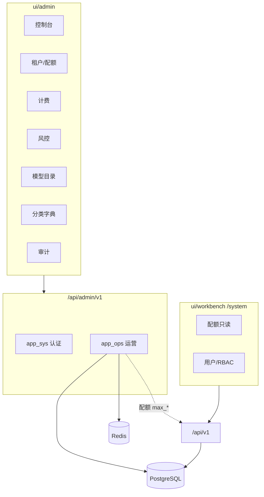

# 运营后台 — 技术增强方案

**状态：** 已实现  
**As-Is 规格：** [features/admin-ops.md](../features/admin-ops.md)（基线能力）  
**关联：** [technical-design.md §运营域](./technical-design.md#4-分层与模块)、[system-management-design.md](./system-management-design.md)、[prd.md §模块1a](../product/prd.md#as-is-module-1)

---

## 1. 定位与边界

运营后台（`ui/admin` · `/api/admin/v1`）是**平台平面**，与租户工作台（`ui/workbench` · `/api/v1`）严格分离：

| 维度 | 租户工作台 | 运营后台 |
|------|------------|----------|
| 操作者 | 租户管理员 / 成员 | 平台管理员 |
| 认证 | `sys_users` JWT | `adm_admins` JWT（`type=admin_access`） |
| 数据范围 | 单租户 `tenant_id` | 全平台租户与全局字典 |
| 典型职责 | RBAC、业务配置、本租户审计 | 租户生命周期、**配额**、计费、风控、内置模型、全局分类 |



### 1.1 设计原则

1. **配额修改唯一入口在运营后台** — 租户 `/system/quota` 只读；`PATCH /tenants/{id}/quota` 仅 admin API（见 [system-management-design §4.3](./system-management-design.md#43-租户与配额)）。
2. **风控规则必须可运行时生效** — `adm_ip_blacklist`、`adm_rate_limit_rules` 不能只做配置 CRUD。
3. **会话与租户 JWT 同等严格** — Redis 存 jti，鉴权必须校验；登出/吊销后 token 立即失效。
4. **写操作必审计** — 运营侧统一 `write_audit_log`，与租户 `aud_logs` 分离（`adm_audit_logs`）。
5. **应用市场审核按部署模式切换** — 见 [marketplace-review-design.md](./marketplace-review-design.md)：`review_mode=platform|tenant|off`，SaaS 默认平台审，私有化默认租户审。

### 1.2 明确不做（本方案范围外）

| 项 | 说明 |
|----|------|
| 租户内用户/角色管理 | 租户 `/system/*` |
| 应用市场审核（固定单模式） | 见 [marketplace-review-design.md](./marketplace-review-design.md) |
| 基础设施 `.env` 编辑 | 部署级；租户侧已做只读 + test-connection |
| 支付网关 / 在线收款 | 账单仅运营侧「出具/标记」 |
| Redis 缓存前缀清理 UI | 与租户系统管理方案一致，暂不纳入 |

---

## 2. 现状（As-Is）

> 文档 [admin-ops.md](../features/admin-ops.md) 标「已实现」偏乐观。以下按 **API / UI / Runtime** 三层描述真实状态。

### 2.1 分层状态总览

| 子模块 | API | UI | Runtime / 生效 | 备注 |
|--------|-----|----|------------------|------|
| 认证登录 | ✅ | ✅ | ✅ | Redis 写 jti，鉴权比对 jti |
| 改密 / 会话列表 | ✅ | ✅ profile | ✅ | logout 调服务端；会话吊销 UI 已接 |
| 平台管理员 CRUD | ✅ | ✅ | ✅ | 创建 / 修改 / 禁用 + 重置密码 |
| 租户 CRUD + 配额 | ✅ | ✅ | ✅ | 含硬删 `purge_tenant_data` |
| 计费套餐 | ✅ CRUD | ✅ | ✅ | |
| 账单 | ✅ 生成 / 查询 / 状态 | ✅ | ✅ | `paid` / `void` 流转 |
| 风控事件 | ✅ 列表 / resolve | ✅ | ✅ | 中间件写入 RiskEvent |
| IP 黑名单 | ✅ CRUD | ✅ | ✅ | 已接入请求链 |
| 限流规则 | ✅ CRUD | ✅ | ✅ | 已接入请求链 |
| 运营审计 | ✅ 分页 | ✅ | ✅ | 在线检索；导出不立项 |
| 内置模型目录 | ✅ | ✅ | ✅ | publish/deprecate |
| sys / mkt 分类 | ✅ | ✅ | ✅ | |
| 控制台 | ✅ `GET /dashboard/summary` | ✅ | ✅ | |
| 角色 RBAC | ✅ | — | ✅ | `require_admin_role` 已挂载 |

### 2.2 后端结构（保持并扩展）

```
backend/packages/miles-admin/src/miles_admin/
├── router.py                    # /api/admin/v1
├── app_sys/
│   ├── views/auth.py
│   ├── services/auth.py
│   ├── deps.py                    # AdminContext, require_admin_role
│   └── repositories/admin.py
├── app_ops/
│   ├── router.py
│   ├── views/{tenants,billing,risk,audit,model_catalog,sys_categories,marketplace_categories}.py
│   ├── services/
│   └── repositories/
└── models/                        # adm_* 表
```

### 2.3 核心数据模型

| 表 | 说明 |
|----|------|
| `adm_admins` | 平台管理员；`role` 字段已有，未 enforced |
| `adm_billing_plans` | 套餐；`features` JSONB |
| `adm_tenant_bills` / `adm_bill_line_items` | 账单 |
| `adm_audit_logs` | 运营审计 |
| `adm_risk_events` | 风险事件 |
| `adm_ip_blacklist` | IP 黑名单 |
| `adm_rate_limit_rules` | 路径模式限流 |
| `sys_tenants` | 租户 + `max_*` 配额（运营写、租户读） |
| `agt_model_configs`（tenant_id NULL） | 内置模型目录 |

**Admin 会话（Redis）**

```
admin:session:{admin_id}   → jti（当前实现仅存字符串，鉴权未读）
```

实现：`app/admin/app_sys/services/auth.py` · `app/utils/redis_keys.py`。

### 2.4 前端页面（`ui/admin/app/`）

| 路径 | 状态 |
|------|------|
| `/login` | ✅ |
| `/` 控制台 | ✅ `GET /dashboard/summary` |
| `/tenants` · `/tenants/[id]` | ✅ |
| `/model-catalog` | ✅ |
| `/marketplace-review` | ✅（`review_mode=platform`） |
| `/sys-categories` · `/marketplace-categories` | ✅ |
| `/billing` | ✅ 套餐 CRUD、生成账单、paid/void |
| `/risk` | ✅ UI + 中间件生效 |
| `/audit` | ✅ 筛选 + CSV 导出 |
| `/admins` | ✅（`super_admin`） |
| `/profile` | ✅ 改密、会话吊销 |

壳层：`ui/admin/components/layout/AdminShell` · `AdminUserMenu`（右上角：账号安全 / 退出）。

### 2.5 与 PRD / 文档差距

当前无阻断项；审计 / 日志导出经产品确认**不立项**（保留在线查询）。专项测试见 `backend/tests/admin/`。

---

## 3. 目标架构

### 3.1 请求链（增强后）

```
HTTP Request
  → [可选] AdminRiskMiddleware        # IP 黑名单 + 限流（仅 /api/admin/v1 或全站可配置）
  → get_platform_admin                # JWT + Redis jti 校验
  → require_admin_role(...)           # 敏感路由
  → app_ops Service
  → write_audit_log（写操作）
  → Repository / PG / Redis
```

**限流与黑名单作用域（推荐）**

| 规则类型 | 作用路径 | 说明 |
|----------|----------|------|
| `adm_rate_limit_rules` | `/api/v1/*` 租户 API | 种子默认 300/min；运营可配 |
| `adm_ip_blacklist` | 全站或 `/api/v1/*` | 命中返回 403 + 写 RiskEvent |
| Admin 登录 | `POST /api/admin/v1/auth/login` | 独立登录失败计数 → RiskEvent |

租户 API 中间件可复用 `app/middlewares/` 新模块，与 admin 路由解耦配置。

### 3.2 审计写入规范

**action 命名：** `admin.{resource}.{verb}` 或沿用现有 `tenant.create` 等。

| 写操作 | action（建议） | 现状 |
|--------|----------------|------|
| 租户 CRUD/配额 | `tenant.*` | ✅ 部分 |
| 套餐 CRUD | `plan.create/update` | ⚠️ 仅 create |
| 账单生成/状态 | `bill.generate/paid/void` | ⚠️ 仅 generate |
| 模型 publish/deprecate | `model.publish/deprecate` | ❌ |
| 分类 CRUD | `category.create/update/delete` | ❌ |
| 风控 resolve / 规则变更 | `risk.resolve/rule.*` | ❌ |
| 管理员 CRUD | `admin.create/update/disable` | ❌ |

统一 helper：`app/admin/app_ops/services/audit.py` → `write_audit_log(db, ctx, ...)`。

### 3.3 角色模型

| role | 权限范围 |
|------|----------|
| `super_admin` | 全部 + 管理员 CRUD |
| `ops` | 租户、配额、分类、模型目录 |
| `billing` | 计费计划、账单 |
| `security` | 风控、审计只读+导出 |
| `viewer` | 全模块只读 |

`require_admin_role("ops", "super_admin")` 按路由挂载；`super_admin` 绕过（现有 deps 逻辑已支持）。

---

## 4. 模块详细设计

### 4.1 认证与会话

**鉴权增强伪代码：**

```python
async def get_platform_admin(...):
    payload = decode_admin_jwt(...)
    jti = payload.get("jti")
    stored = await redis.get(RedisKeys.admin_session(admin_id))
    if not stored or stored != jti:
        raise UnauthorizedError("会话已失效")
    ...
```

**与租户对齐：** 参考 `app/tenant/auth/services/session_store.py` 黑名单模式（可选 `admin:blacklist:{jti}`）。

### 4.2 租户与配额

现有能力：

- 列表返回 `plan_name`、`agents_used/max_agents` 等摘要（Service 层 join / 子查询）。
- 详情页「用量趋势」只读图表。

**不变约束：** 租户 API `PATCH /tenants/{id}` 若存在，Service 继续 strip `max_*`（非运营上下文不可写配额）；租户侧 [system-management-design](./system-management-design.md) 配额只读，运营配额页为唯一写入口。

### 4.3 计费

**账单状态机：**

```
draft → issued → paid
              ↘ void
```

| 状态 | 含义 |
|------|------|
| `issued` | 当前 generate 默认 |
| `paid` | 运营标记已结清 |
| `void` | 作废 |

**生成逻辑：** 保持现有「月费 + 超量 token/存储」公式；后续可配置化写入 `BillingPlan.features`。

### 4.4 风控

**RiskEvent 结构（现有表扩展 detail 即可）：**

```json
{
  "kind": "rate_limit | ip_blocked | login_failed",
  "path": "/api/v1/auth/login",
  "ip": "1.2.3.4",
  "tenant_id": null,
  "rule_id": "uuid"
}
```

**限流键：** `ratelimit:{rule_id}:{ip_or_tenant_id}:{window_bucket}`。

### 4.5 控制台 Dashboard

**`GET /dashboard/summary` 响应示例：**

```json
{
  "tenants_total": 12,
  "tenants_active": 10,
  "risk_open": 3,
  "bills_issued_month": 8,
  "audit_today": 24,
  "plans_active": 3
}
```

### 4.6 前端信息架构

```
控制台 /
租户管理 /tenants · /tenants/[id]
计费管理 /billing          （套餐 + 账单 Tab）
风控中心 /risk
审计日志 /audit
模型目录 /model-catalog
工作台分类 /sys-categories
市场分类 /marketplace-categories
平台管理员 /admins         （super_admin）
账号安全 /profile          （改密、会话）
```

右上角 `AdminUserMenu`：用户信息 · 账号安全 · 退出（logout 走服务端）。

---

## 5. 测试

`backend/tests/admin/`：`test_admin_auth.py`、`test_admin_admins.py`、`test_admin_billing_plan.py`、`test_admin_risk_enforce.py`。

**验收要点：** 登出 / 吊销后旧 token 401；UI 完成「建套餐 → 生成账单 → 标记 paid」闭环；黑名单 IP 403、超限 429 且写入 RiskEvent；租户 JWT 访问 `/api/admin/v1` 恒 401/403。

---

## 6. 文件清单

| 后端 | 前端（`ui/admin/`） |
|------|--------------------|
| `app_sys/{deps.py,session_store.py,services/auth.py}` | `lib/api.ts`, `AdminUserMenu`, `app/profile/page.tsx` |
| `app_ops/views/{dashboard,admins,billing,tenants}.py` | `app/{page.tsx,billing/,admins/,tenants/}` |
| `app/middlewares/platform_risk.py`, `app_ops/services/risk_enforce.py` | `app/risk/page.tsx`, `app/audit/page.tsx` |
| `app_ops/views/marketplace_review.py`, `app/marketplace/review_*.py` | `app/marketplace-review/page.tsx` |

---

## 7. 参考

- [features/admin-ops.md](../features/admin-ops.md)
- [features/system-management.md](../features/system-management.md)
- [guides/model-providers.md](../guides/model-providers.md)
- [operations/deployment.md](../operations/deployment.md)
