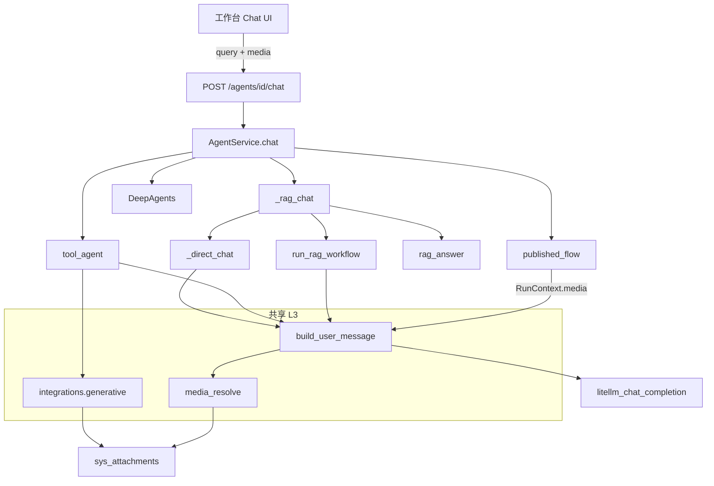

# 智能体 — 多模态技术设计

**日期：** 2026-05-26  
**状态：** 已实现（设计归档）  
**As-Is 规格：** [features/attachments-media-generative.md](../features/attachments-media-generative.md)、[features/platform-agents.md](../features/platform-agents.md)  
**产品说明：** [multimodal-capabilities.md](../product/multimodal-capabilities.md) · **路线图：** [multimodal-roadmap.md](./multimodal-roadmap.md)  
**关联：** [multimodal-capabilities.md](../product/multimodal-capabilities.md)、[multimodal-roadmap.md](./multimodal-roadmap.md)、[realtime-transport-design.md](./realtime-transport-design.md)、[features/agent-chat-websocket.md](../features/agent-chat-websocket.md)、[features/attachments-media-generative.md](../features/attachments-media-generative.md)、[platform-agents.md](../guides/platform-agents.md)、[flow-llm-multimodal-design.md](./flow-llm-multimodal-design.md)、[flow-generative-media-design.md](./flow-generative-media-design.md)、[model-providers.md](../guides/model-providers.md)

---

## 1. 文档定位与能力矩阵

智能体对话入口为 **`POST /api/v1/agents/{id}/chat`**（`AgentService.chat`）。多模态需覆盖 **所有命中路径**，而非只改 RAG。

| 技术线 | 产品能力 | 智能体现状 | 设计状态 |
|--------|----------|------------|----------|
| **A. 生文** | 文本问答、RAG、工具调用 | ✅ 多路径已实现 | 保持 |
| **B. 识图** | 用户附图 + 问题 → 文本回答 | ✅ `ChatRequest.media` + vision 路由 | 本文 §4 |
| **C. 生图 / 生视频** | 对话中生成媒体 | ✅ `generate_*` 工具 + `artifacts`；生视频默认异步 | 本文 §5 + [flow-generative-media-design.md](./flow-generative-media-design.md) |
| **D. 入库理解** | 图片进 KB 后 RAG | ✅ OCR/占位（`[multimodal]`） | 非对话多模态，见 §2.3 |

**与流程文档分工：**

| 文档 | 范围 |
|------|------|
| [flow-llm-multimodal-design.md](./flow-llm-multimodal-design.md) | 画布 `LLMCall` + `RunContext.media` |
| [flow-generative-media-design.md](./flow-generative-media-design.md) | 画布 `ImageGenerate` / `VideoGenerate` |
| **本文** | `ChatRequest` / `ChatResponse`、各 **chat 路由**、工作台对话 UI |

共享实现应落在 **`integrations/`**（消息组装、生成 API），智能体与流程仅 **注入与展示** 不同。

---

## 2. 现状（As-Is）

### 2.1 对话 API

```python
class ChatRequest(BaseModel):
    query: str = Field(..., min_length=1)
    inputs: dict = {}
    conversation_id: str | None = None
    tool_confirmed: bool = False
    pending_tool_slug: str | None = None
    pending_tool_params: dict = ...
```

```python
class ChatResponse(BaseModel):
    answer: str
    sources: list[dict] = []
    steps: list[dict] = []
    pending_tool: PendingToolCall | None = None
```

前端 `api.chatAgent(agentId, query, { conversationId })` 仅传 **文本**；`workbench/agents/chat` 无上传控件。

### 2.2 `AgentService.chat` 路由（命中即返回）

```text
合规 + Hook
  → A2A Host（agent_type=a2a）
  → 子智能体 DeepAgents（agt_sub_agent_bindings）
  → A2A Peer 增强
  → 已发布流程 published_flow_id → get_flow_runtime().run
  → _rag_chat（LangGraph RAG | 线性 RAG | tool_agent | _direct_chat）
```

各路径消息构造 **均为字符串 user content**：

| 路径 | 消息构造位置 | 多模态 |
|------|----------------|--------|
| `_direct_chat` | `ainvoke_chat([system, user:text])` | ❌ |
| `_rag_chat` → `run_rag_workflow` | `rag_qa` 图内 `query` 字符串 | ❌ |
| `_rag_chat` → `rag_answer` | 线性 RAG 文本 | ❌ |
| `run_tool_calling_chat` | `messages = [system, user: query]` | ❌ |
| `published_flow` | `RunContext.inputs = {query}`，无 `media` | ❌ |
| `run_subagent_planned_chat` | 子任务 `chat_as_child` 仍 `ChatRequest` | ❌ |
| A2A 外部 | 协议相关，本文不展开 | — |

### 2.3 知识库 vs 对话识图

| 场景 | 机制 | 用户感知 |
|------|------|----------|
| 文档含图入库 KB | `rag/parse` + 可选 OCR → 文本分片检索 | 「根据资料回答」，非「看这张图」 |
| 对话附图 | ✅ 已实现 | `ChatRequest.media` + vision 模型；见 [features/attachments-media-generative.md](../features/attachments-media-generative.md) §4.1 |

二者可并存：同一智能体既绑 KB，又在单轮对话中附图。

### 2.4 模型与合规

- 模型目录含 `vision` / `image_gen` / `video_gen`；对话链仅校验并使用 **chat 类**（`litellm_chat_completion`）。  
- 合规 `check_input` / `check_output` 扫描 **文本** `query` / `answer`；附图 v1 不扫描像素。

---

## 3. 目标与非目标

### 3.1 目标（To-Be）

1. **识图（B）**：`ChatRequest.media[]` 携带图片附件；各 chat 路径在调用 LLM 前组装多模态 messages。  
2. **生图 / 生视频（C）**：通过 **平台工具**（`generate_image` / `generate_video`）或 `config` 开关挂载；`ChatResponse` 可返回 `artifacts[]`（附件/URL）。  
3. **流程智能体**：`published_flow` 执行时把 `ChatRequest.media` 注入 `RunContext.media`（与 [flow-llm-multimodal-design.md](./flow-llm-multimodal-design.md) 一致）。  
4. **多轮**：`conversation_id` 下可选保留 **文本历史**；v1 每轮 media 仅当轮有效（不进 checkpoint 状态），避免状态爆炸。  
5. **子智能体**：`chat_as_child` 继承父轮 `media` 或按策略不传（可配置）。

### 3.2 非目标（v1）

| 项 | 说明 |
|----|------|
| 对话 **流式** + 图片渐进显示 | 见 [realtime-transport-design.md](./realtime-transport-design.md)（对话 WebSocket R2；生成任务仍 SSE） |
| 视频 **输入** 直送 LLM | 走 KB 转写或后续 |
| 自动把生成图 **写入 KB** | 可选 Phase 3 |
| 改造 A2A 协议 | 仅平台内 `custom` 智能体 |
| 替换 `ChatResponse.answer` 为富文本 DOM 协议 | v1 用 `artifacts`  sidecar |

---

## 4. 识图输入（Vision）

### 4.1 共享模型（与流程对齐）

复用 [flow-llm-multimodal-design.md](./flow-llm-multimodal-design.md) §3：

```python
class ChatMediaIn(BaseModel):
    attachment_id: UUID | None = None
    url: str | None = None  # v1 禁用；识图仅 attachment_id，由服务端读存储转 data URL
    detail: str = "auto"

class ChatRequest(BaseModel):
    query: str = Field(..., min_length=1)
    media: list[ChatMediaIn] = Field(default_factory=list)
    # ... 现有字段 ...
```

解析服务：**同一套** `resolve_media_refs()`（建议 `tenant/attachments/services/media_resolve.py` 或 `integrations/chat/multimodal.py`）。

### 4.2 消息组装

```python
def build_user_message(*, query: str, media_parts: list[dict]) -> dict:
    """返回 OpenAI 形状 user message。"""
    if not media_parts:
        return {"role": "user", "content": query}
    content: list[dict] = [{"type": "text", "text": query}]
    content.extend(media_parts)  # image_url parts
    return {"role": "user", "content": content}
```

**模型校验：**

- 含 `image_url` 时要求 `model_type in (llm, reasoning, vision)` 且厂商支持；推荐 UI 引导选 **vision** 模型。  
- 非 vision 的 `llm` 若 LiteLLM 仍接受则放行并记录 warning；否则 400。

### 4.3 各路径改造要点

| 路径 | 改造 |
|------|------|
| `_direct_chat` | `user_msg = build_user_message(query, media)` |
| `run_tool_calling_chat` | 首条 user 用 multimodal；tool 循环中 assistant/tool 消息后 **新 user 轮** 可再带 media（v1 仅首轮） |
| `run_rag_workflow` / `rag_answer` | **方案 1（推荐）**：检索仍用 **文本 query**；生成阶段 `build_user_message(query, media)` 拼进 generate 节点输入。**方案 2**：retrieve 节点也传图（成本高，v2） |
| `rag_qa` LangGraph | `state["query"]` 保持文本；`generate` 节点读取 `state["media"]` 或 thread 变量组装 messages |
| `published_flow` | `_flow_run_context(..., media=body.media)` → `RunContext.media` |
| `chat_as_child` | 默认 **不继承** 父 media；`config.inherit_parent_media=true` 时继承 |
| DeepAgents | 规划器只见 **文本** `query`；子任务描述含「用户附 N 张图」；子 Agent 是否看图由子 Agent 模型决定（v2 可把 media 传入子 `ChatRequest`） |

### 4.4 合规与 Hook

| 点 | 行为 |
|----|------|
| `check_input` | 仍扫描 `query` 文本；`hook_payload` 增加 `media_count`、`attachment_ids` |
| `BEFORE_CALL` / `BEFORE_REASONING` | `modify.query` 仍允许；不修改 media |
| 审计日志 | 记录附件 id，不记录 base64 |

### 4.5 前端（工作台对话）

| 能力 | 说明 |
|------|------|
| 输入区 | 粘贴/选择图片 → `POST /attachments`（`purpose=chat`）→ 暂存 `pendingMedia[]` |
| 发送 | `chatAgent` body 增加 `media: [{ attachment_id }]` |
| 消息泡 | 用户消息展示缩略图；助手消息仍文本（v1） |
| 会话存储 | `chat-sessions` localStorage 存 `media` 元数据（`attachment_id`、filename）；预览用本地 Object URL 或鉴权内容 API，不存二进制 |

---

## 5. 生成类输出（生图 / 生视频）

### 5.1 原则

生成 **不走** `ainvoke_chat` 字符串扩展，而与流程共用 **`integrations/generative`**（见 [flow-generative-media-design.md](./flow-generative-media-design.md)）。

智能体侧重 **工具调用** 暴露能力，便于 LLM 自主决定何时生图。

### 5.2 平台工具（建议）

| slug | 说明 | 参数概要 |
|------|------|----------|
| `generate_image` | 文生图 | `prompt`, `size?`, `model_config_id?`（默认智能体模型或 config 指定） |
| `generate_video` | 文/图生视频 | `prompt`, `image_attachment_id?`, `duration?`, `wait?` |

实现：`integrations/langchain/tools.py` 注册；内部调 `generate_image_for_model` / `submit_video_task`。

**与 `enable_tool_calling`：**

| `config` | 行为 |
|----------|------|
| `enable_generative_tools: true` | 自动挂载 `generate_image` / `generate_video`（可与 RAG 共存，走 tool_agent + knowledge_search） |
| 未开启 | 不挂载；仅画布 `ImageGenerate` 节点（流程侧） |

有 KB 时路径见 [platform-agents.md](../guides/platform-agents.md)：`should_use_skill_tools_with_kb` 已支持 tool_agent + `knowledge_search`，可同样挂载生成工具。

### 5.3 `ChatResponse` 扩展

```python
class ChatArtifact(BaseModel):
    kind: Literal["image", "video", "audio"]
    attachment_id: UUID
    mime_type: str | None = None
    caption: str | None = None
    # 预览：前端凭 attachment_id 调鉴权内容 API，不返回签名 URL

class ChatResponse(BaseModel):
    answer: str
    sources: list[dict] = []
    steps: list[dict] = []
    pending_tool: PendingToolCall | None = None
    artifacts: list[ChatArtifact] = Field(default_factory=list)
```

- 工具执行成功后 append `artifacts`；`answer` 可含 Markdown 图片链接。  
- 前端对话泡：解析 `artifacts` 展示图/视频预览。

### 5.4 确认策略

`generate_video` 默认 **不**要求确认（开启生视频工具即同意直接入队）；进行中任务可取消。生图在 `n≥2` 等条件下仍可触发确认。其它高风险工具（如 `skill_run_script`）仍可 `require_confirmation=True`。

---

## 6. 架构总览



---

## 7. 配置项（`Agent.config`）

| 键 | 类型 | 默认 | 说明 |
|----|------|------|------|
| `enable_tool_calling` | bool | false | 已有 |
| `enable_generative_tools` | bool | false | 挂载生图/生视频工具 |
| `generative_image_model_id` | uuid? | null | 覆盖生图模型，否则用智能体模型 |
| `generative_video_model_id` | uuid? | null | 生视频模型 |
| `inherit_parent_media` | bool | false | 子智能体是否继承父轮附图 |
| `max_media_per_turn` | int | 4 | 每轮附图上限 |

`GET /agents/meta` 可不扩展；生成能力由工具列表与模型页说明。

---

## 8. 分阶段交付

### Phase 1 — 识图 + 直连 / 工具路径

| 项 | 交付 |
|----|------|
| `ChatRequest.media` + `media_resolve` + `build_user_message` | 后端 |
| `_direct_chat`、`run_tool_calling_chat` | 改造 |
| 前端对话上传 + 展示 | UI |
| 测试 | 带图对话 mock LiteLLM |

### Phase 2 — RAG / LangGraph

| 项 | 交付 |
|----|------|
| `rag_qa` generate 节点支持 `media` | `integrations/langgraph` |
| `run_rag_workflow` 传入 state | |
| 线性 `rag_answer` 生成步 | |

### Phase 3 — 流程 + 生成工具

| 项 | 交付 |
|----|------|
| `_flow_run_context` + `RunContext.media` | 与流程文档 Phase 2 对齐 |
| `generate_image` / `generate_video` 工具 + `ChatResponse.artifacts` | 依赖 [flow-generative-media-design.md](./flow-generative-media-design.md) P1/P2 |
| `enable_generative_tools` | |

### Phase 4 — 子智能体与体验

| 项 | 交付 |
|----|------|
| DeepAgents 子任务传递 media（可选） | |
| 多轮历史中的 media 策略 | |
| 架构预览展示「支持识图/生成」能力标签 | |

---

## 9. 风险与对策

| 风险 | 对策 |
|------|------|
| 部分路径漏改导致「有图无图」行为不一致 | 集中 `build_user_message`；单测覆盖路由表 |
| RAG 检索被图片 query 干扰 | 检索始终用文本 `query` |
| tool_agent 多轮 messages 膨胀 | 仅首轮带图；历史 media 用文本摘要（v2） |
| 生成工具滥用 | 确认框 + 配额 |
| vision 模型未配置 | 400 + 前端提示切换模型 |

---

## 10. 测试计划

| 类型 | 用例 |
|------|------|
| API | `chat` 带 `media`，mock vision 返回 |
| 路由 | 无 KB `_direct_chat`、tool_agent、LangGraph RAG 各一条 |
| 流程 | `published_flow` + `media` 传入 `RunContext` |
| 回归 | 无 `media` 时与现网响应一致 |
| 前端 | 上传发送、会话回放缩略图 |
| 工具 | `generate_image` mock → `artifacts[0].kind==image` |

---

## 11. 代码入口（实施时）

| 模块 | 路径 |
|------|------|
| 对话入口 | `tenant/agents/views/agents.py` |
| 编排 | `tenant/agents/services/agent.py` |
| Schema | `tenant/agents/schemas/agent.py` |
| 直连 / RAG | `_direct_chat`、`_rag_chat` |
| LangGraph RAG | `integrations/langgraph/runner.py`、`graphs/rag_qa.py` |
| 工具循环 | `integrations/langchain/tool_agent.py` |
| 消息/媒体 | `integrations/chat/multimodal.py`（建议新建） |
| 生成 | `integrations/generative/` |
| 附件 | `tenant/attachments/services/` |
| 流程上下文 | `flow_runtime/types.py` |
| 前端 | `app/workbench/agents/chat/page.tsx`、`lib/api.ts` |

---

## 12. 变更记录

| 日期 | 说明 |
|------|------|
| 2026-05-26 | 初版：能力矩阵、chat 路由、识图/生成、分阶段与流程文档对齐 |
