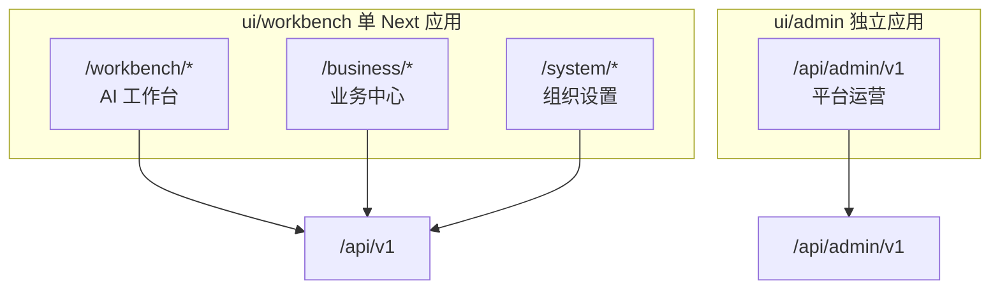
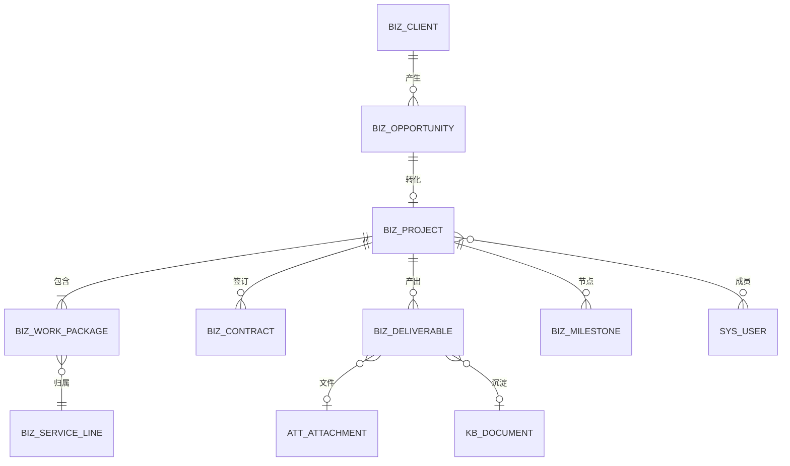

# 业务中心 — 技术方案

> **⚠️ 已归档（2026-09-07）**：业务中心（广告试点）全量代码已从主分支摘除，进入重设计。
> 本文档保留作为重设计素材；实现代码恢复见 tag `archive/business-center-p0-p4`。
> `biz_*` 数据表已于 2026-09-08 从开发库删除（无存量数据迁移），重设计时按新模型重建。

**日期：** 2026-06-01（2026-06-01 修订：后端 `app/biz/` 与 `tenant` 同级）  
**状态：** 设计稿（待分期实施）  
**As-Is 规格：** [features/business-center.md](../features/business-center.md)（未实现，目标规格）  
**关联：** [technical-design.md §5](./technical-design.md#5-多租户与权限)、[system-management-design.md](./system-management-design.md)、[frontend/design.md §4](../frontend/design.md#4-布局结构)

---

## 1. 定位与边界

### 1.1 三分区模型

租户工作台由 **两个分区** 扩展为 **三个分区**，职责不重叠：

| 分区 | 入口 | API | 操作者 | 职责 |
|------|------|-----|--------|------|
| **AI 工作台** | `ui/workbench` `/workbench/*` | `/api/v1` | 全员（按权限） | 智能体、知识库、流程、素材生成等 **生产力** |
| **业务中心** | `ui/workbench` `/business/*` | `/api/v1` | 商务、项目经理、制作等 | 客户、商机、项目、工作包、交付、预算等 **业务运营** |
| **组织设置** | `ui/workbench` `/system/*` | `/api/v1` | 租户管理员 | 用户、RBAC、配额只读、审计、会话（原「系统管理」） |



### 1.2 为何不在 workbench 外另建前端

| 维度 | 扩展现有 `ui/workbench` | 独立 `ui/business` |
|------|---------------------------|-------------------|
| 登录与会话 | 共用 JWT、`auth-store` | 需跨应用 token 同步或 SSO |
| 项目 → AI 跳转 | 同路由 `?projectId=` / 上下文 store | 跨域/跨应用传参 |
| UI 与列表范式 | 复用 `ResourceListLayout`、`usePagedList` | 重复建设或强依赖 `ui/shared` |
| API | 同一 `/api/v1`、同一 RBAC | 相同，但客户端重复 |
| 部署 | 单端口、单版本 | 双应用对齐发版 |

**结论：** 业务中心作为 workbench 第三分区；`ui/admin` 独立是因为 **平台运营 vs 租户** 双平面，与业务中心场景不同。

### 1.3 设计原则

- 租户数据一律带 `tenant_id`；Service 层 `tenant_filters` + `assert_tenant_access`。
- **业务元数据** 存 PG；**文件二进制** 仍走 MinIO + 现有 `attachments` / `media-assets`，通过 ID 关联，不重复上传体系。
- **八条业务线** 不建八个独立子系统，统一为 **项目 + 工作包（Work Package）+ 服务线模板**。
- AI 能力不复制：业务中心负责「为谁做、做到哪、交什么、收多少钱」；AI 工作台负责「怎么做创意与文档」；二者通过 `project_id` / `work_package_id` 关联。
- 政府/涉密客户：客户级 **保密等级** 控制案例入库与 RAG 范围（默认禁止涉密文档进知识库）。

---

## 2. 业务域建模（广告公司试点）

### 2.1 试点背景

首家试点租户为 **广告公司**，主营业务线如下（同一客户项目常为多线组合）：

| 服务线 | 编码建议 | 典型客户 |
|--------|----------|----------|
| 品牌形象 | `brand_identity` | 政府机关、企事业单位 |
| 影视拍摄 | `video_production` | 政府、企业、园区 |
| 展览展示 | `exhibition` | 政府展馆、企业展厅、商业综合体、大型展会 |
| 活动策划 | `event` | 政府、企事业单位、品牌企业 |
| 会务培训 | `training` | 各级地方政府机关 |
| 标识设计 | `signage` | 园区、政府大院、景区、商业综合体 |
| 文创产品 | `cultural_product` | 政府文旅、景区、展馆、国企事业单位 |
| 宣传品设计印刷 | `print` | 政府、企业、门店、机构 |

### 2.2 核心对象



| 对象 | 说明 |
|------|------|
| **Client（客户）** | 机关/企业/园区等；联系人、行业标签、保密等级 |
| **Opportunity（商机）** | 线索 → 方案 → 比稿 → 赢单/输单 |
| **Project（项目）** | 签约后总容器；可含多个工作包 |
| **Work Package（工作包）** | 项目内按服务线拆分；独立阶段、负责人、预算 |
| **Milestone（里程碑）** | 阶段节点；模板按服务线预置 |
| **Deliverable（交付物）** | 成片、画册、效果图等；关联附件/素材 |
| **Contract / Quote（合同/报价）** | 二期；变更留审计 |

**组合项目示例：** 政府展馆 = `exhibition`（主）+ `signage` + `video_production` + `print`。

### 2.3 服务线阶段模板（可配置）

| 服务线 | 典型阶段 |
|--------|----------|
| `brand_identity` | 调研 → VI 方案 → 升级实施 → 手册交付 |
| `video_production` | 脚本 → 分镜 → 拍摄 → 剪辑 → 成片 |
| `exhibition` | 概念 → 空间布局 → 效果图 → 施工图 → 落地 |
| `event` | 方案 → 预算 → 执行 → 复盘 |
| `training` | 需求 → 课程设计 → 师资 → 执行 → 评估 |
| `signage` | 点位规划 → 造型设计 → 效果图 → 工艺清单 |
| `cultural_product` | 产品线规划 → 设计 → 打样 → 量产 |
| `print` | 版式 → 装帧 → 打样 → 印刷 → 入库 |

阶段定义存 **租户可配置模板**（`biz_service_line_templates`），MVP 可种子内置八条线。

---

## 3. 与现有 MilesAI 模块的映射

| 已有模块 | 业务中心用法 |
|----------|--------------|
| 知识库 | 行业案例、VI 规范、政府公文风格；结项 **案例沉淀**（脱敏后） |
| 附件 / 生成素材 | 交付物存储；`deliverable.attachment_id` / `media_asset_id` |
| 流程编排 | 标准化流程：比稿方案生成、活动执行 checklist |
| 智能体 | 按服务线预置 Agent；从项目详情 deep link 打开对话 |
| 任务中心 | 长时 AI 生成、视频处理与 `project_id` 关联 |
| 合规 | 政府项目文案敏感词 |
| 标签 / 分类 | 客户行业、项目类型、服务线 |
| 审计日志 | 报价/合同/阶段变更写 `aud_logs` |
| 用户 / RBAC | 扩展 `biz:*` 权限码；项目成员引用 `sys_users` |

---

## 4. 后端目标架构

### 4.1 域包布局（`app/biz/` 与 `app/tenant/` 同级）

业务中心 **不** 放在 `tenant/biz/` 下。`tenant/` 在本仓库语义为 **AI 平台 + 组织设置**；行业业务域单独成包，与 `admin/`（另一 API 平面）不同，仍挂载同一 `/api/v1` 与 JWT。

```text
backend/app/
├── tenant/                     # L0/L1：AI 平台 + 组织设置（现有）
│   ├── auth/
│   ├── system/                 # 组织设置
│   ├── kb/ agents/ flows/ …
│   └── router.py               # /api/v1 汇总（include biz_router）
├── biz/                        # L0/L1：业务中心（新增，与 tenant 同级）
│   ├── clients/
│   ├── projects/
│   ├── work_packages/
│   ├── deliverables/
│   ├── dashboard/
│   ├── views/                  # 各子域 router 或统一 re-export
│   ├── services/
│   ├── repositories/
│   ├── schemas/
│   └── router.py               # prefix="/biz"
├── models/
│   └── biz.py                  # biz_* ORM（与 kb.py、agent.py 并列，不在 biz/ 内再建 models/）
├── admin/                      # /api/admin/v1（不变）
├── rag/ integrations/ infra/ …
```

**为何同级而非 `tenant/biz/`**

| 考量 | 说明 |
|------|------|
| 产品边界 | 前端三分区：AI 工作台 · 业务中心 · 组织设置；后端 `tenant/` vs `biz/` 与之对齐 |
| 体量 | 商机、报价、合同、供应商等会膨胀；不宜与 kb/agents 混在同一 grab-bag |
| API 平面 | 仍 `/api/v1` + `TenantContext`，**不需要**像 `admin` 那样独立应用 |
| ORM | 延续现网惯例：表定义在 `app/models/`，域包只做 views/services/repositories |

### 4.2 路由挂载

对外 URL **不变**（`/api/v1/biz/*`）。在 `tenant/router.py` 聚合：

```python
from app.biz.router import biz_router

api_router = APIRouter(prefix="/api/v1")
# … 现有 tenant 子路由 …
api_router.include_router(biz_router, prefix="/biz", tags=["business"])
```

`app/biz/router.py` 内部再 `include_router` 各子域（clients、projects 等）。

### 4.3 依赖方向

```text
app/biz/*  →  app/core（TenantContext、权限依赖）
           →  app/models（biz_* ORM）
           →  app.tenant.attachments（交付物关联）
           →  app.tenant.kb（案例沉淀，P2）
           →  app.tenant.audit_log（写 aud_logs）

禁止：app/tenant/agents、flows、kb/services … → app/biz（AI 层不依赖 CRM）
```

跨包调用应走 **service 公开接口**，避免 views 互引。

### 4.4 分层约定

与 [layering.md](./layering.md) 一致（L0/L1 含 `biz/*`）：

```
views (HTTP + require_permissions)
  ↓
services (TenantContext、阶段流转规则、审计)
  ↓
repositories (分页、ORM、软删)
  ↓
app/models/biz.py (PG)
```

### 4.5 表命名前缀

建议 `biz_` 前缀，与 `sys_`、`agt_`、`kb_` 并列，例如：

| 表 | 说明 |
|----|------|
| `biz_clients` | 客户 |
| `biz_opportunities` | 商机 |
| `biz_projects` | 项目 |
| `biz_work_packages` | 工作包 |
| `biz_milestones` | 里程碑 |
| `biz_deliverables` | 交付物 |
| `biz_service_line_templates` | 服务线阶段模板（租户级） |
| `biz_project_members` | 项目成员 M:N |
| `biz_quotes` / `biz_contracts` | 二期 |

所有业务表含 `tenant_id`、`created_at`、`updated_at`、`deleted_at`（软删）。

### 4.6 权限码（草案）

| 权限码 | 说明 |
|--------|------|
| `biz:client:read` / `biz:client:write` | 客户 |
| `biz:opportunity:read` / `biz:opportunity:write` | 商机 |
| `biz:project:read` / `biz:project:write` | 项目 |
| `biz:work_package:read` / `biz:work_package:write` | 工作包 |
| `biz:deliverable:read` / `biz:deliverable:write` | 交付物 |
| `biz:dashboard:read` | 业务总览 |
| `biz:finance:read` | 预算/回款（二期） |

角色种子建议：总经理、商务、项目经理、创意、执行、财务（见 [features/business-center.md §6](../features/business-center.md#6-角色与权限)）。

---

## 5. 前端目标架构

### 5.1 路由与壳层

扩展 [nav-config.ts](../../ui/workbench/lib/nav-config.ts)：

```typescript
export type AppSection = "workbench" | "business" | "system";

export const APP_SECTIONS = [
  { id: "workbench", label: "AI 工作台", home: "/workbench/dashboard" },
  { id: "business", label: "业务中心", home: "/business/dashboard" },
  { id: "system", label: "组织设置", home: "/system/users" }, // 原「系统管理」文案
];
```

`AppShell` 按 section 选择壳层：

| Section | 壳层 | 导航形态 |
|---------|------|----------|
| `workbench` | 顶栏 + `WorkbenchHeaderNav` | 水平分组 |
| `business` | `BusinessShell` + `BusinessSidebar` | 侧栏（菜单项多） |
| `system` | `SystemShell` | 侧栏（现有） |

顶栏 `SectionLink` 支持三分区互跳；登录后默认 landing 可按租户配置（MVP 默认 `/workbench/dashboard`）。

### 5.2 目录约定

遵循 [.cursorrules](../../.cursorrules) `features/<域>/` 约定：

```
ui/workbench/
├── app/business/
│   ├── dashboard/page.tsx
│   ├── clients/page.tsx
│   ├── clients/[id]/page.tsx
│   ├── projects/page.tsx
│   ├── projects/[id]/page.tsx
│   └── opportunities/page.tsx      # 二期
├── features/
│   ├── clients/
│   ├── projects/
│   ├── work-packages/
│   ├── deliverables/
│   └── business-dashboard/
├── components/layout/
│   ├── BusinessShell.tsx
│   └── BusinessSidebar.tsx
└── lib/api/
    ├── clients.ts
    └── projects.ts
```

页面保持薄壳；逻辑在 `features/<域>/hooks/`。

### 5.3 业务中心导航（目标）

```
业务总览
  └── 仪表盘                    /business/dashboard

销售
  └── 客户                      /business/clients
  └── 商机                      /business/opportunities    # P1

交付
  └── 项目                      /business/projects
  └── 工作包看板                /business/work-packages    # 可选 Kanban
  └── 交付物                    /business/deliverables     # 或合入项目详情 Tab

商务                          # P2
  └── 报价 · 合同

财务                          # P2
  └── 预算 · 回款

资源                          # P2
  └── 供应商 · 案例库
```

### 5.4 AI 联动入口

项目详情页提供：

- **打开 AI 对话**：`/workbench/agents/chat?projectId={id}&workPackageId={id}`
- **检索案例库**：跳转 KB 并带 `tag` / 筛选
- **上传交付物**：调用现有 `attachments` API，回写 `biz_deliverables`

前端可选 `lib/business-context.ts`（或 zustand slice）在跨分区跳转时保留项目上下文。

---

## 6. API 概要（MVP）

详细契约见 [features/business-center.md](../features/business-center.md)。MVP 端点草案：

| 方法 | 路径 | 说明 |
|------|------|------|
| GET | `/biz/clients` | 客户分页列表 |
| POST | `/biz/clients` | 创建客户 |
| GET/PATCH/DELETE | `/biz/clients/{id}` | 详情 / 更新 / 软删 |
| GET | `/biz/projects` | 项目列表（可按客户、状态筛选） |
| POST | `/biz/projects` | 创建项目（含工作包批量创建） |
| GET/PATCH | `/biz/projects/{id}` | 详情 / 更新 |
| GET | `/biz/projects/{id}/work-packages` | 工作包列表 |
| PATCH | `/biz/work-packages/{id}` | 更新阶段、负责人、预算 |
| GET/POST | `/biz/projects/{id}/deliverables` | 交付物 |
| GET | `/biz/dashboard/summary` | 在制项目、待验收、本月统计 |
| GET | `/biz/meta` | 服务线、阶段、状态等枚举 |

---

## 7. 安全与合规

| 项 | 方案 |
|----|------|
| 租户隔离 | 所有查询带 `tenant_id` |
| 项目可见性 | 成员制 + 角色权限；总经理/商务看全租户项目 |
| 保密客户 | `confidentiality_level`；禁止一键入库 KB 或需审批 |
| 审计 | 客户/项目/工作包/报价写操作记 `aud_logs` |
| 附件 | 沿用附件 ACL；交付物仅项目成员可访问 |

---

## 8. 实施分期

### Phase 0 — 文档与壳层（3–5 天）

- [x] 本设计稿 + [features/business-center.md](../features/business-center.md)
- [ ] 扩展 `AppSection`、`APP_SECTIONS`、空壳 `BusinessShell`
- [ ] `/business/dashboard` 占位页
- [ ] 「系统管理」文案改为「组织设置」（仅 UI 文案，路径仍为 `/system/*`）

### Phase 1 — MVP 业务闭环（3–4 周）

| 任务 | 说明 |
|------|------|
| 包骨架 | `app/biz/` + `router.py`；`app/models/biz.py`；`tenant/router.py` include |
| 数据模型 + 迁移 | `biz_clients`、`biz_projects`、`biz_work_packages`、`biz_deliverables`、模板表 |
| 客户 CRUD | API + `/business/clients` |
| 项目 CRUD + 多工作包 | 创建时选服务线组合 |
| 工作包阶段流转 | 按模板推进；列表/详情 Tab |
| 交付物关联附件 | 上传 + 登记 |
| 业务仪表盘 | 在制项目、阶段分布 |
| RBAC 种子 | `biz:*` 权限 + 试点角色 |
| 项目 → AI deep link | query 参数 + 对话页读取（可选） |

**验收：** 试点广告公司用 2–3 个真实项目（含组合服务线）跑通录入 → 阶段更新 → 交付物上传。

### Phase 2 — 销售与交付增强（4–6 周）

| 任务 | 说明 |
|------|------|
| 商机 pipeline | 阶段看板 |
| 报价单 | 与工作包预算关联 |
| 里程碑与提醒 | 可选 Beat 或站内通知 |
| 验收与结项 | 状态归档 |
| 案例沉淀 KB | 结项向导（脱敏确认） |

### Phase 3 — 商务财务轻量（4 周）

| 任务 | 说明 |
|------|------|
| 合同登记 | 版本、变更审计 |
| 回款计划 | 分期；导出 Excel |
| 供应商 | 印刷/拍摄/搭建外包 |
| 项目成本汇总 | 工作包预算 vs 实际 |

### Phase 4 — AI 深度嵌入（持续）

| 任务 | 说明 |
|------|------|
| 服务线 Agent 模板 | 品牌/活动/脚本等 |
| Flow 模板市场 | 比稿、活动 checklist |
| 项目上下文 RAG | 仅非涉密项目文档 |
| 结项 AI 复盘 | Agent 读交付物生成总结 |

### Phase 5 — 多租户产品化（远期）

- 服务线模板市场、可配置阶段
- 与 ERP 对接（用友/金蝶）按需
- 独立域名部署仍保持单 workbench 应用（除非商业上拆 SKU）

---

## 9. 测试策略

| 层级 | 范围 |
|------|------|
| API | `backend/tests/api/test_biz_*.py`：租户隔离、权限、软删、阶段非法跳转 |
| 服务 | 工作包阶段机、组合项目创建 |
| E2E | 可选：客户 → 项目 → 交付物 → 仪表盘可见 |

---

## 10. 待决事项（实施前对齐）

1. **默认 landing**：商务人员登录先进业务中心还是 AI 工作台？
2. **商机 vs 项目优先级**：政府客户重交付，建议 Phase 1 以项目为主。
3. **财务深度**：MVP 仅工作包预算字段，是否满足？
4. **涉密默认策略**：政府客户是否默认 `confidentiality_level=restricted`？
5. **「组织设置」改名范围**：仅侧栏/顶栏文案，或同步改文档与权限分组名？

---

## 11. 相关文档

- [features/business-center.md](../features/business-center.md) — 功能规格（表、API、前端清单）
- [system-management-design.md](./system-management-design.md) — 组织设置平面
- [frontend/design.md §4](../frontend/design.md#4-布局结构) — 三分区布局
- [product/backlog.md §业务中心](../product/backlog.md#业务中心--广告公司试点) — 排期 backlog
