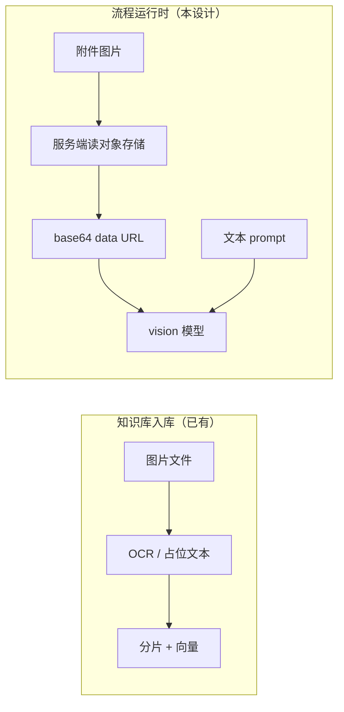

# 流程编排 — LLM 节点多模态技术设计

**日期：** 2026-05-26  
**状态：** 已实现（设计归档）  
**As-Is 规格：** [features/flow-orchestration.md](../features/flow-orchestration.md)、[features/attachments-media-generative.md](../features/attachments-media-generative.md)  
**产品说明：** [multimodal-capabilities.md](../product/multimodal-capabilities.md) · **路线图：** [multimodal-roadmap.md](./multimodal-roadmap.md)  
**关联：** [multimodal-roadmap.md](./multimodal-roadmap.md)、[multimodal-capabilities.md](../product/multimodal-capabilities.md)、[flow-orchestration-enhancement.md](./flow-orchestration-enhancement.md)、[flow-generative-media-design.md](./flow-generative-media-design.md)（生图/生视频）、[flows.md](../guides/flows.md)、[model-providers.md](../guides/model-providers.md)、[technical-design.md](./technical-design.md) §9

---

## 1. 背景与结论

> **生图 / 生视频 / TTS 等生成类能力** 见独立文档 [flow-generative-media-design.md](./flow-generative-media-design.md)。本文仅覆盖 **vision 识图（输入侧）**。

### 1.1 现状（As-Is，立项前快照）

> **2026-05-27：** §1.2 目标已落地。本节保留立项前描述，**当前行为**以 [features/flow-orchestration.md](../features/flow-orchestration.md) 与代码为准。

| 层级 | 行为 |
|------|------|
| **`LLMCall` handler** | 仅将上游 `prompt` / `input` 转为 `messages = [{"role":"user","content": "<字符串>"}]`（`flow_runtime/nodes/llm_nodes.py`） |
| **`ainvoke_chat`** | 约定 `content` 为 **字符串**；无 OpenAI 多模态 part 数组 |
| **`RunContext` / `FlowRunRequest`** | `inputs` 为任意 dict，调试 UI 只填 **文本 query** |
| **`TextInput`** | 只读字符串入口 |
| **模型目录** | 支持 `model_type = vision`，LiteLLM 允许 `llm / reasoning / vision` 对话 |
| **知识库入库** | 图片可走 OCR/占位文本 **分片入库**（RAG），与「运行时把原图送给 LLM」无关 |

**结论（立项前）：** 可选 vision 模型 ≠ 流程已支持多模态。**现已支持** `RunContext.media` / `LLMCall` 识图输入。

### 1.2 目标（To-Be）

1. **流程调试运行**与 **智能体绑定流程执行** 时，可将 **图片** 随用户问题一并送入 `LLMCall`（及下游 vision 模型）。
2. 与现有 RAG 链兼容：`TextInput` → `KnowledgeSearch` → `PromptTemplate` → `LLMCall` 仍可用；多模态为 **增量能力**。
3. 复用租户 **附件**（`sys_attachments` + 对象存储），避免画布内嵌大二进制。
4. 不破坏已发布 `graph_json`：旧图无媒体字段时行为与今日一致。

### 1.3 非目标（v1）

| 项 | 说明 |
|----|------|
| 画布 **音频/视频** 直送 LLM | v1 仅 **图片**；音视频继续走 KB 入库转文本或后续单独立项 |
| 流程 **多轮** + 每轮不同附件 | 仍单次 `run`；多轮对话走 Agent `rag_qa` checkpointer |
| 新增 **独立多模态节点类型**（必选） | v1 优先 **扩展 `LLMCall`**；若产品要强约束可 v2 增加 `VisionLLMCall` 别名 |
| 画布节点内 **手绘/裁剪** | 仅上传/选附件 |
| 替换 LiteLLM / 自建多模态网关 | 仍经 `integrations.litellm.adapter.litellm_chat_completion` |

---

## 2. 架构原则

### 2.1 仍走单一执行链

```
graph_json → compiler → registry.execute_node
  → LLMCall → build_multimodal_messages() → ainvoke_chat(..., content_parts?)
  → litellm_chat_completion
```

不得新增第二套「多模态执行器」。

### 2.2 三处一致性（与 [flow-orchestration-enhancement.md](./flow-orchestration-enhancement.md) §2.2 相同）

| 层 | 变更 |
|----|------|
| `flow_runtime/nodes/llm_nodes.py` | 组装多模态 messages |
| `integrations/langchain/chat_models.py` | `ainvoke_chat` 支持 `str \| list[ContentPart]` |
| `integrations/litellm/adapter.py` | 透传 OpenAI 形状 `content: string \| array` |
| `frontend/lib/flow-nodes.ts` + `FlowNodeInspector` + `FlowRunPanel` | 媒体配置与调试上传 |

### 2.3 与 KB「图入库」的边界



- **入库多模态**：检索阶段用文本片段，不把原图进 LLM。  
- **运行时多模态**：同一张图可作为 **用户消息的一部分** 进入 `LLMCall`（例如「请描述这张图」）。

---

## 3. 消息与数据模型

### 3.1 OpenAI / LiteLLM 多模态 user 消息（目标形状）

```json
{
  "role": "user",
  "content": [
    { "type": "text", "text": "请结合检索资料回答，并描述附图。" },
    {
      "type": "image_url",
      "image_url": { "url": "data:image/jpeg;base64,..." }
    }
  ]
}
```

实现以 LiteLLM 对各 vision 厂商的兼容为准。**v1 默认**：服务端根据 `attachment_id` 从对象存储 **读取字节**，组装为 **base64 data URL** 传给厂商（**不使用** 对象存储临时签名 URL）。若某厂商强制要求公网 HTTPS，再按厂商白名单做例外（仍由服务端拉取后中转，不把 `object_key` 暴露给前端）。

附件读图约定见 [multimodal-roadmap.md](./multimodal-roadmap.md) §2.1。

### 3.2 `RunContext` 扩展

```python
@dataclass
class RunContext:
    # ... 现有字段 ...
    media: list[MediaRef] = field(default_factory=list)

@dataclass
class MediaRef:
    """运行时媒体引用（不入 graph_json 持久化，由 run 请求注入）。"""
    attachment_id: str | None = None   # 推荐：租户附件 UUID
    mime_type: str | None = None
    url: str | None = None             # 可选：外部 URL（需 SSRF 校验）
    detail: str = "auto"               # OpenAI image detail: low | high | auto
```

| 来源 | `media` 填入方 |
|------|----------------|
| `POST /flows/{id}/run` | `FlowRunRequest.media` |
| Agent `chat` + `published_flow_id` | 从 `ChatRequest` 扩展字段映射（Phase 2） |
| 画布节点 `data.attachment_ids` | 仅 **调试/固定资产**；生产更推荐 run 级注入 |

### 3.3 `FlowRunRequest` / `ChatRequest` 扩展

```python
class FlowMediaIn(BaseModel):
    attachment_id: UUID | None = None
    url: str | None = Field(None, description="需通过 url_security 校验")
    detail: str = "auto"

class FlowRunRequest(BaseModel):
    inputs: dict = Field(default_factory=dict)
    kb_ids: list[UUID] = Field(default_factory=list)
    media: list[FlowMediaIn] = Field(default_factory=list)
```

**校验：**

- `attachment_id` 须属于当前租户、`purpose in (general, flow, chat)`（常量见 `tenant/attachments`）。
- 单张图片建议 ≤ 10MB（与附件上传策略一致）；单次 run 最多 **N=4** 张（可配置）。
- `mime_type` 白名单：`image/jpeg`、`image/png`、`image/webp`、`image/gif`（v1）。

### 3.4 `LLMCall` 节点 `data` 扩展（可选，持久化在 graph_json）

| 字段 | 类型 | 默认 | 说明 |
|------|------|------|------|
| `model_config_id` | uuid? | — | 已有；保存时建议校验 `model_type` 含 `vision` 当 `require_vision=true` |
| `require_vision` | bool | false | true 时未配置 vision 模型则编译/运行报错 |
| `include_run_media` | bool | true | 是否合并 `RunContext.media` |
| `attachment_ids` | uuid[] | [] | 画布级固定附图（如模板示例图） |
| `image_detail` | enum | `auto` | `low` / `high` / `auto` |
| `temperature` / `max_tokens` | — | — | 已有 |

**Handle 不变：** 仍 `prompt` / `input` 入、`output` 出；媒体不走边传递，避免 React Flow 边承载二进制元数据。

---

## 4. 运行时行为

### 4.1 `LLMCall` 执行顺序（伪代码）

```text
1. text ← str(inputs.prompt or inputs.input)
2. parts ← []
3. if text: parts.append({type: text, text})
4. for ref in node.data.attachment_ids + ctx.media (when include_run_media):
     resolve → image_url (base64 data URL，服务端读存储)
     parts.append({type: image_url, image_url: {url}})
5. if parts empty: 400
6. if require_vision and model.model_type not in (vision, ...): 400
7. messages ← [{role: user, content: parts}]  # 或 string 若仅一段 text
8. ainvoke_chat(model, messages, ...)
```

### 4.2 附件解析服务（新建，建议路径）

`tenant/attachments/services/media_resolve.py`（或 `flow_runtime/media.py`）：

| 方法 | 职责 |
|------|------|
| `read_attachment_image_bytes(db, tenant_id, attachment_id) -> bytes` | 查 `sys_attachments`，校验 mime 与租户，从对象存储 **读字节** |
| `resolve_media_refs(db, ctx, refs) -> list[dict]` | 批量解析为 LiteLLM content parts（含 `image_url` data URL） |

**安全：**

- 禁止将 `object_key` 暴露给前端；模型侧仅用服务端组装的 data URL 或厂商要求的受控 HTTPS。  
- **v1 不提供** 附件「签名下载 URL」；前端预览依赖上传后本地预览或后续 **鉴权内容 API**（见 roadmap §2.1）。  
- 外部 `url` 走 `app.common.url_security`（若已有）或禁止 v1。  
- 合规：`check_input` 可对 **拼接后的文本** 扫描；图片侧 v1 仅记录审计字段，不做像素级审核（后续可接云审）。

### 4.3 `ainvoke_chat` / LiteLLM 改造要点

```python
# 类型示意
ContentPart = dict[str, Any]  # {type, text?} | {type, image_url?}
Message = {"role": str, "content": str | list[ContentPart]}

async def ainvoke_chat(model, messages: list[Message], ...) -> str:
    # resolve_model_for_invoke 不变
    return await litellm_chat_completion(model, messages, ...)
```

`litellm_chat_completion`：

- 若 `model_type != vision` 且任一 message `content` 为 list 且含 `image_url` → `BadRequestError`（提示换 vision 模型）。  
- 若仅 text → 行为与今日一致（字符串 content）。

`_messages_to_openai`（LangChain 路径）v1 可继续 **只支持字符串**；画布不走 `PlatformChatModel` 多模态即可。

### 4.4 与 `system_prompt` / `PromptTemplate` 的关系

| 项 | 策略 |
|----|------|
| `RunContext.system_prompt` | 作为单独 `{"role":"system","content": str}` 置于 messages 首部（今日 LLMCall 未用，可一并补上） |
| `PromptTemplate` 输出 | 仍为 **纯文本**，进入 multimodal 的 **第一个 text part** |
| 检索上下文 | 保持在 prompt 字符串内，不拆成独立 image part |

---

## 5. 前端

### 5.1 调试面板 `FlowRunPanel`

| 能力 | 说明 |
|------|------|
| 图片上传 | 调 `POST /attachments`（`purpose=flow`），得 `attachment_id` |
| 预览缩略图 | 上传后本地 Object URL 或鉴权内容 API；展示已选列表，可删除 |
| 运行 | `POST /flows/{id}/run` body 增加 `media: [{ attachment_id }]` |

### 5.2 节点检查器 `LLMCall`

| 控件 | 说明 |
|------|------|
| 模型下拉 | 可选过滤 `model_type === vision` 或标记「支持视觉」 |
| `require_vision` | 开关 |
| `include_run_media` | 开关（默认开） |
| 固定附图 | 多选附件（可选，Phase 1.5） |

### 5.3 契约文件

- `frontend/lib/flow-node-schemas.ts`：`LLMCall` 的 `data` 字段 TS 类型。  
- `frontend/lib/types.ts`：`FlowRunRequest.media`。  
- Handle 表 **不变**（媒体不占用边）。

---

## 6. API 变更摘要

| 方法 | 变更 |
|------|------|
| `POST /flows/{id}/run` | Request 增加 `media[]`；Response 不变 |
| `POST /agents/{id}/chat`（Phase 2） | `ChatRequest` 增加 `media[]`，映射到 `RunContext` |
| `GET /attachments/{id}/content`（可选，Phase 1+） | 鉴权下返回文件流，供调试预览/下载；**非** 对象存储签名 URL |

**兼容性：** `media` 缺省为 `[]`，旧客户端不受影响。

---

## 7. 分阶段交付

### Phase 1 — 最小可用（推荐先做）

| 项 | 交付物 |
|----|--------|
| 后端 | `MediaRef` / `FlowRunRequest.media`；附件解析；`ainvoke_chat` + LiteLLM 多模态 content |
| 后端 | `llm_call` 合并 text + images；vision 模型校验 |
| 前端 | `FlowRunPanel` 上传 + run 带 `media` |
| 测试 | 单测：message 组装；集成：mock LiteLLM 收 content array |
| 文档 | 更新 [flows.md](../guides/flows.md) §LLMCall |

### Phase 2 — 智能体对齐

| 项 | 说明 |
|----|------|
| `ChatRequest.media` | 对话绑 `published_flow_id` 时传入 `RunContext.media` |
| 对话 UI | 与 Agent 聊天附件 UX 统一（若已有附件组件则复用） |

完整智能体多模态（各 chat 路由、生成工具、前端）见 **[agent-multimodal-design.md](./agent-multimodal-design.md)**。

### Phase 3 — 画布持久化附图

| 项 | 说明 |
|----|------|
| `LLMCall.data.attachment_ids` | 检查器多选附件 |
| 编译期 | `require_vision` 时 WARN 非 vision 模型 |

### 后续（不在 v1）

- 音频 part（`input_audio`）/ 视频帧  
- 节点级 `MediaInput` 将媒体经边传给 `LLMCall`  
- 流式输出（SSE）与多模态并存  

---

## 8. 风险与对策

| 风险 | 对策 |
|------|------|
| 厂商 vision 格式差异 | 以 LiteLLM 为准做集成测试；文档列出已测 model_code |
| 大图 base64 内存与延迟 | 限制张数/大小；可选 `image_detail=low`；超大图先缩放再编码 |
| 大图 token 费用 | `image_detail=low` 默认；限制张数与分辨率 |
| 非 vision 模型误配 | `require_vision` + 运行前校验 `model_type` |
| SSRF（外部 url） | v1 禁用或严格 allowlist |

---

## 9. 测试计划

| 类型 | 用例 |
|------|------|
| 单元 | `build_llm_messages(text, media_refs)` → 仅 text / text+image |
| 单元 | 非 vision 模型 + image part → 400 |
| API | `run` 带 `media.attachment_id`，mock 存储与 LiteLLM |
| 回归 | 无 `media` 的 RAG 模板 run 结果与现网一致 |
| 前端 | 上传 → run → steps 中 `llm_*` 节点成功 |

---

## 10. 代码入口（实施时）

| 模块 | 路径 |
|------|------|
| LLM 节点 | `backend/app/flow_runtime/nodes/llm_nodes.py` |
| 运行时 DTO | `backend/app/flow_runtime/types.py` |
| 对话封装 | `backend/app/integrations/langchain/chat_models.py` |
| LiteLLM | `backend/app/integrations/litellm/adapter.py` |
| 流程 run | `backend/app/tenant/flows/services/flow.py` |
| 附件 | `backend/app/tenant/attachments/services/attachment.py` |
| 请求 schema | `backend/app/tenant/flows/schemas/flow.py` |
| 前端调试 | `frontend/components/flow/FlowRunPanel.tsx` |
| 前端检查器 | `frontend/components/flow/FlowNodeInspector.tsx` |

---

## 11. 变更记录

| 日期 | 说明 |
|------|------|
| 2026-05-26 | 初版：现状、目标、RunContext/API、LLMCall 扩展、分阶段与测试计划 |
