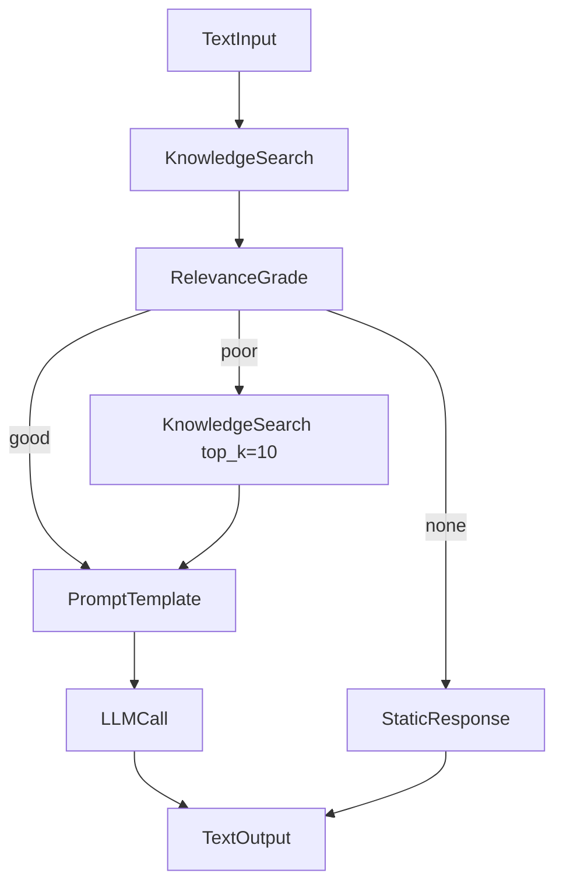

# 流程编排增强 — 技术设计

**日期：** 2026-05-26  
**状态：** Phase 1–4 已实现（设计归档）  
**As-Is 规格：** [features/flow-orchestration.md](../features/flow-orchestration.md)  
**后续立项（暂不实施）：** [flow-subflow-design.md](./flow-subflow-design.md)（SubFlow）  
**关联归档：** [flow-llm-multimodal-design.md](./flow-llm-multimodal-design.md)（识图）、[flow-generative-media-design.md](./flow-generative-media-design.md)（生图/生视频）  
**关联：** [flows.md](../guides/flows.md)、[technical-design.md](./technical-design.md) §9、[frontend/design.md](../frontend/design.md) §9.1 链路 §6

---

## 1. 背景与目标

### 1.1 现状（立项前快照，仅供参考）

> **现网以 [features/flow-orchestration.md](../features/flow-orchestration.md) 为准。** 下文描述 Phase 1–4 立项时的缺口，多数已关闭。

画布流程（`graph_json`）已由 **LangGraph** 编译执行（`integrations.langgraph.compiler`），节点 handler 在 `flow_runtime.nodes.registry`。当前调色板节点：

`TextInput` · `KnowledgeSearch` · `ConditionBranch` · `ParallelJoin` · `PromptTemplate` · `LLMCall` · `PlatformTool` · `TextOutput`

（`ChatInput` / `ChatOutput` 为 I/O 别名，仅兼容历史图。）

**已具备：** DAG 校验、并行层分析、条件边、智能体 `published_flow_id` 注入 `kb_ids` / `model_config_id` / `agent_id`、工作台 `compile` / `run`、合规与 Hook。

**主要缺口：**

| 领域 | 问题 |
|------|------|
| 前端工作台 | 无节点属性面板；Handle 全节点暴露导致易连错；调试仅展示最终 `output`，无 `steps` |
| 调试 API | `POST /flows/{id}/run` 未暴露 `kb_ids`，无 KB 时 `KnowledgeSearch` 常为空 |
| RAG 能力 | 画布为「检索 → 模板 → 单次 LLM」，**无** Agent `rag_qa` 图的评分 / 重试 / 兜底 |
| 工具编排 | `PlatformTool` 后端已通，前端无法配置 `tool_slug` / `params` |
| 产品 | 无版本对比/回滚 UI；编辑页未加载流程名 |

### 1.2 目标

1. **可用**：租户可在画布上完成 RAG + 分支 + 工具链配置，无需手改 `graph_json`。
2. **可调试**：选 KB、看逐步 `steps`、编译错误可定位到节点。
3. **可对齐 Agent RAG**：可选增强模板与节点，缩小与 `run_rag_workflow()` 的行为差距（非强制替换）。
4. **可演进**：新节点与 API 扩展不破坏现有已发布流程。

### 1.3 非目标（本方案 v1 不做）

- 画布 **有环** / 通用 Loop（保持 DAG；重试用显式分支 + 第二检索节点）
- 画布 **多轮 Checkpoint**（仍单次 `ainvoke`；多轮对话继续走 Agent `rag_qa` + Redis checkpointer）
- **子智能体** 节点（**子流程**已单独立项，见 [flow-subflow-design.md](./flow-subflow-design.md)，暂不实施）
- 流程执行 **SSE 流式**（可列为 v2，与 `AgentService.chat` 流式对齐）
- 打破 `flow_versions` 的版本模型（仍每次保存递增版本）
- 画布 **LLM 识图输入**（[flow-llm-multimodal-design.md](./flow-llm-multimodal-design.md)）与 **生成类节点**（[flow-generative-media-design.md](./flow-generative-media-design.md)）

---

## 2. 架构原则

### 2.1 单一执行链

```
React Flow (graph_json)
  → PUT /flows/{id}/graph → flow_versions
  → validate_graph_for_compile / build_canvas_graph
  → flow_runtime.nodes.registry.execute_node
  → RunContext（tenant、inputs、kb_ids、model、agent…）
```

新增能力 **不得** 引入第二套画布执行器。

### 2.2 三处一致性

任何新节点类型须同时更新：

| 层 | 路径 |
|----|------|
| Handler | `backend/app/flow_runtime/nodes/registry.py` |
| 编译 | `integrations.langgraph.compiler`（`SUPPORTED_CANVAS_NODE_TYPES` 取自 registry） |
| 前端 | `ui/workbench/lib/flow-nodes.ts`（`NODE_PALETTE`、`DEFAULT_DATA`、Handle 约定） |

Handle 名须与 `compiler._gather_node_inputs` 及 `flow_runtime/templates/README.md` 一致。

### 2.3 与 Agent RAG 的关系

| 能力 | Agent `rag_qa` | 画布流程 |
|------|----------------|----------|
| 检索 | `retrieve` 节点 | `KnowledgeSearch` |
| 评分 | `grade_documents` | **新增 `RelevanceGrade`**（复用 `grading.py`） |
| 重试 | 条件边 + top_k 翻倍 | **模板**：第二 `KnowledgeSearch`（更大 `top_k`）+ `ConditionBranch` |
| 兜底 | `fallback` 节点 | **新增 `StaticResponse`** |
| Checkpointer | 有 | 无（设计不变） |

绑定了 `published_flow_id` 的智能体 **只跑画布**；未绑流程时仍走 `rag_qa`。增强画布是为了让「绑流程」体验接近默认 RAG，而非合并两套图。

---

## 3. 分阶段交付

### Phase 0 — 文档与契约（本文档）

- 锁定节点 `data` schema、API 扩展、前端组件边界。
- 更新 `flows.md` / `technical-design.md` 索引。

### Phase 1 — 工作台可用性（P0，无新节点类型）

| 项 | 说明 |
|----|------|
| 节点属性面板 | 选中节点右侧 Sheet，按 `type` 渲染表单，写回 `node.data` |
| Handle 按类型 | `FlowNodeCard` 仅渲染该类型需要的 target/source |
| 调试 KB | `FlowRunRequest.kb_ids` + 编辑页 KB 多选 |
| Steps 面板 | 展示 `FlowRunResponse.steps`（折叠 JSON + 节点类型标签） |
| 编辑页 | 加载 `flow.name`；工具栏「插入 RAG 模板」（合并或替换，需确认对话框） |

### Phase 2 — PlatformTool 与编译体验（P0/P1）✅

| 项 | 说明 |
|----|------|
| 工具选择器 | `listToolCatalog` + `PlatformToolInspector` |
| 动态参数表 | 按工具 `parameters` schema 编辑 `data.params` |
| 连线校验（软） | `onConnect` + `isValidConnection`（Phase 1） |
| 编译错误定位 | `error_details[]` 含 `code` / `message` / `node_id`；点击定位节点 |

### Phase 3 — RAG 增强节点（P1）

| 节点 | 用途 |
|------|------|
| `RelevanceGrade` | 输出 `relevance`: `good` \| `poor` \| `none`，接三路条件边 |
| `StaticResponse` | 固定文本/模板兜底，接 `TextOutput` |

附带模板：`rag_flow_with_grade.json`（检索 → 评分 → good→LLM / poor→重检索 / none→StaticResponse）。

### Phase 4 — 体验与可选能力（P2）✅

- `GET /flows/{id}/versions`、`GET /flows/{id}/versions/{v}` + `FlowVersionHistoryDialog`
- 恢复历史 = `saveFlowGraph`（remark `恢复自 vN`），不删旧版本
- `LLMCall.data.max_tokens`（默认 2048）
- `KnowledgeSearch.data.retrieval_mode`：`default` | `vector` | `hybrid`

---

## 4. 前端设计

### 4.1 页面结构（`flows/[id]/edit`）

```
┌─────────────────────────────────────────────────────────────┐
│ 顶栏：名称 · 保存 · 发布 · 编译检查 · 调试输入 · 运行        │
├──────────┬──────────────────────────────┬───────────────────┤
│ 节点面板  │ React Flow 画布               │ 属性 Sheet（选中） │
│ (现有)   │ + 按类型 Handle                │ FlowNodeInspector │
├──────────┴──────────────────────────────┴───────────────────┤
│ 底栏（可折叠）：编译信息 · Steps · 运行输出                    │
└─────────────────────────────────────────────────────────────┘
```

弹窗选型遵循 [design.md](../frontend/design.md) §5.7：属性区用 **右侧 Sheet**（`size="sheet"`），不用 fullscreen。

### 4.2 组件

| 组件 | 职责 |
|------|------|
| `FlowNodeInspector` | 根据 `selectedNode.type` 切换表单；`onChange` → `updateNodeData(id, partial)` |
| `FlowRunPanel` | KB 多选、`query`、运行、`steps` + `output` |
| `flow-node-schemas.ts` | 各类型字段定义、Handle 允许表（与后端对齐） |

链路登记：`ui/workbench/lib/chains.ts` §6 增补 `FlowNodeInspector`、`flow-node-schemas.ts`。

### 4.3 各节点属性字段（`node.data`）

#### TextInput

| 字段 | 类型 | 默认 | 说明 |
|------|------|------|------|
| `input_key` | string | `query` | 对应 `RunContext.inputs` 的键 |
| `input_value` | string? | — | 调试用固定值（覆盖 inputs） |
| `label` | string | 用户输入 | 展示名 |

#### KnowledgeSearch

| 字段 | 类型 | 默认 | 说明 |
|------|------|------|------|
| `kb_id` | uuid? | — | 单库；空则用 `RunContext.kb_ids` |
| `top_k` | int | 5 | |
| `label` | string | 知识库检索 | |

Handles：**in** `query` · **out** `output`（值为 `hits[]`）

#### PromptTemplate

| 字段 | 类型 | 默认 | 说明 |
|------|------|------|------|
| `template` | string | 见 `DEFAULT_DATA` | 支持 `{{检索结果}}` `{{用户提问}}` `{{query}}` `{{context}}` |
| `label` | string | 提示词 | |

Handles：**in** `query`, `hits` · **out** `output`（prompt 字符串；target 下游 `prompt`）

#### LLMCall

| 字段 | 类型 | 默认 | 说明 |
|------|------|------|------|
| `model_config_id` | uuid? | — | 优先于 `RunContext.model_config_id` |
| `temperature` | float | 0.7 | |
| `label` | string | 大模型 | |

Handles：**in** `prompt`（或 `input`）· **out** `output`

#### ConditionBranch

| 字段 | 类型 | 默认 | 说明 |
|------|------|------|------|
| `mode` | enum | `has_hits` | `has_hits` \| `score_above` \| `text_contains` \| `not_empty` |
| `threshold` | float | 0.35 | `score_above` 时用 |
| `keyword` | string | — | `text_contains` 时用 |
| `label` | string | 条件分支 | |

Handles：**in** `hits` / `input` · **out** `true` / `false`（sourceHandle）

#### ParallelJoin

| 字段 | 类型 | 默认 | 说明 |
|------|------|------|------|
| `merge_strategy` | enum | `dict` | `dict` \| `concat_text` \| `first` |
| `label` | string | 并行汇合 | |

Handles：**in** 多条边 · **out** `output`

#### PlatformTool

| 字段 | 类型 | 默认 | 说明 |
|------|------|------|------|
| `tool_slug` | string | — | 必填 |
| `params` | object | `{}` | 静态参数 |
| `param_from_input` | object? | — | `{ paramName: inputHandleKey }` |
| `merge_input` | bool | true | 将上游 inputs 合并进 params |
| `confirmed` | bool | true | 危险工具；对话侧将来可拦截 |
| `label` | string | 平台工具 | |

Handles：**in** `input`（及可选 `query`/`hits`）· **out** `output`（`{ output, tool_slug }`）

#### TextOutput

| 字段 | 类型 | 默认 | 说明 |
|------|------|------|------|
| `label` | string | 输出 | |

Handles：**in** `input`

#### RelevanceGrade（Phase 3，新增）

| 字段 | 类型 | 默认 | 说明 |
|------|------|------|------|
| `relevance_threshold` | float | 0.35 | 与 Agent `config` 一致 |
| `use_llm_grade` | bool | false | 调用 `grading.llm_grade_relevance` |
| `label` | string | 相关性评分 | |

**输入：** `hits`（list）  
**输出：**

```json
{
  "relevance": "good | poor | none",
  "top_score": 0.42,
  "reason": "optional"
}
```

**条件边：** `sourceHandle` 建议 `good` / `poor` / `none`（compiler 扩展，见 §5.3）。

#### StaticResponse（Phase 3，新增）

| 字段 | 类型 | 默认 | 说明 |
|------|------|------|------|
| `text` | string | — | 支持 `{{query}}` 占位 |
| `label` | string | 固定回复 | |

**输出：** 字符串，下游接 `TextOutput` 或 `PromptTemplate`（不推荐后者）。

### 4.4 Handle 允许表（连线校验）

```ts
// flow-node-schemas.ts 概念示例
export const NODE_HANDLES: Record<NodeType, {
  targets: string[];
  sources: string[];
}> = {
  TextInput: { targets: [], sources: ["output"] },
  KnowledgeSearch: { targets: ["query"], sources: ["output"] },
  PromptTemplate: { targets: ["query", "hits"], sources: ["output"] },
  LLMCall: { targets: ["prompt", "input"], sources: ["output"] },
  ConditionBranch: { targets: ["hits", "input"], sources: ["true", "false"] },
  ParallelJoin: { targets: ["input"], sources: ["output"] },
  PlatformTool: { targets: ["input", "query", "hits"], sources: ["output"] },
  TextOutput: { targets: ["input"], sources: [] },
};
```

`compiler._gather_node_inputs` 中 `output` → 下游 `input`/`prompt`/`query`/`hits` 的映射保持不变；前端 `targetHandle` 仍用语义化名。

---

## 5. 后端设计

### 5.1 API 扩展

#### `FlowRunRequest`（`tenant/flows/schemas/flow.py`）

```python
class FlowRunRequest(BaseModel):
    inputs: dict = Field(default_factory=dict)
    kb_ids: list[UUID] = Field(default_factory=list, description="调试运行注入 KnowledgeSearch")
    use_langgraph: bool = Field(True, deprecated=True)
```

`FlowService.run` 将 `body.kb_ids` 传入 `RunContext.kb_ids`（字符串化 id）。

#### 可选：`GET /flows/{id}/node-schemas`

返回各类型 `data` 字段元数据 + Handle 表，供前端生成表单（Phase 1 也可先硬编码在前端，减少往返）。

### 5.2 编译报告增强

`FlowCompileReport.errors` 条目结构化为：

```json
{
  "code": "unknown_node_type | cycle | missing_branch_edge | ...",
  "message": "人类可读",
  "node_id": "optional"
}
```

保持 `errors: list[str]` 兼容：旧客户端仍读字符串；新客户端解析对象。

### 5.3 条件边扩展（RelevanceGrade）

今日 `ConditionBranch` 仅 `true`/`false`。Phase 3 在 `graph_analysis` / `compiler` 中：

- 允许 `CONDITION_NODE_TYPE` 包含 `RelevanceGrade`
- `add_conditional_edges` 的路由函数读取 `outputs[node_id].relevance`
- 出边 `sourceHandle`：`good` | `poor` | `none`

`RelevanceGrade` handler 伪代码：

```python
from app.integrations.langgraph.grading import grade_documents  # 或薄封装

async def relevance_grade(node_data, inputs, ctx):
    hits = inputs.get("hits") or []
    threshold = float(node_data.get("relevance_threshold", 0.35))
    use_llm = bool(node_data.get("use_llm_grade", False))
    # 需要 model 时从 ctx.model_config_id 解析 ModelConfig
    relevance, detail = await grade_documents(hits, threshold, use_llm, model, query)
    return {"relevance": relevance, **detail}
```

### 5.4 新节点 handler 位置

| 节点 | 文件 |
|------|------|
| `RelevanceGrade` | `flow_runtime/nodes/rag_nodes.py` 或 `grade_nodes.py` |
| `StaticResponse` | `flow_runtime/nodes/io_nodes.py` |

注册于 `registry.NODE_REGISTRY`。

### 5.5 PlatformTool（已实现，文档化）

逻辑见 `flow_runtime/nodes/tool_nodes.py`：

- `invoke_source="flow"`
- `knowledge_search` 自动 `kb_id` ← `ctx.kb_ids[0]`
- `skill_run_script` 可将 `hits` 传入 `params`

Phase 2 仅补前端与 catalog 联动，**不改** invoke 语义。

---

## 6. 模板与种子

### 6.1 现有 `rag_flow.json`

保持不变，作为「最简线性 RAG」。

### 6.2 新增 `rag_flow_with_grade.json`（Phase 3）



加载入口：

- `tenant.marketplace.util.load_rag_graph_template(variant="with_grade")`
- 前端 `RAG_TEMPLATE_WITH_GRADE` 常量
- 编辑页「从模板插入」

---

## 7. 测试策略

| 阶段 | 测试 |
|------|------|
| Phase 1 | 前端组件单测（表单 → data）；现有 `test_langgraph_compiler` 回归 |
| Phase 2 | `test_platform_tool_node` 扩展；catalog mock |
| Phase 3 | `test_relevance_grade_node.py`；`test_compile_three_way_branch.py` |
| E2E（可选） | 保存图 → compile → run with kb_ids → steps 含 `flow_node` |

---

## 8. 迁移与兼容

- 已发布 `graph_json` **无需**迁移；新字段均有默认值。
- `ChatInput`/`ChatOutput` 继续仅 registry 别名，调色板不展示。
- `compile` 的 `errors` 字符串格式在 Phase 2 前保持；结构化 errors 为附加能力。

---

## 9. 实现检查清单

### Phase 1

- [x] `FlowRunRequest.kb_ids` + `FlowService.run`
- [x] `FlowNodeInspector` + `flow-node-schemas.ts`
- [x] `FlowNodeCard` Handle 按类型
- [x] `FlowRunPanel`（steps + output）
- [x] 编辑页加载 flow 元数据、KB 选择
- [x] `chains.ts` §6 更新
- [x] 连线软校验、插入 RAG 模板

### Phase 2

- [ ] 工具 catalog 选择器 + params 表单
- [ ] `onConnect` 软校验
- [ ] 编译 `errors` 含 `node_id`

### Phase 3

- [ ] `RelevanceGrade` / `StaticResponse` handler + registry
- [ ] compiler 三路条件边
- [ ] `rag_flow_with_grade.json` + 前端模板
- [ ] 文档更新 `flows.md` 节点表

### Phase 4

- [ ] 版本历史只读 UI
- [ ] LLM / KB 高级字段（按产品优先级）

---

## 10. 参考文件

| 用途 | 路径 |
|------|------|
| 编译器 | `backend/app/integrations/langgraph/compiler.py` |
| 评分 | `backend/app/integrations/langgraph/grading.py` |
| Agent RAG 图 | `backend/app/integrations/langgraph/graphs/rag_qa.py` |
| 节点注册 | `backend/app/flow_runtime/nodes/registry.py` |
| 画布 UI | `ui/workbench/components/flow/FlowCanvas.tsx` |
| 节点卡片 | `ui/workbench/components/flow/FlowNodeCard.tsx` |
| 类型/模板 | `ui/workbench/lib/flow-nodes.ts` |
| 用户指南 | `docs/guides/flows.md` |
