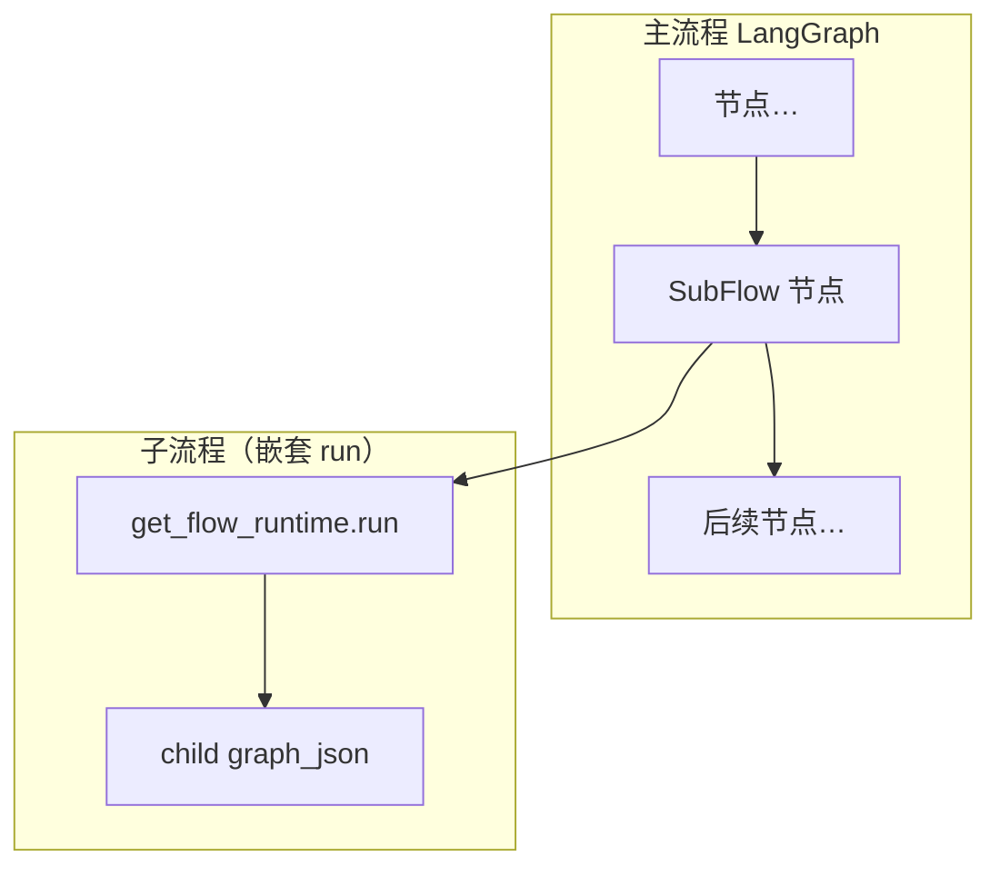

# 画布子流程调用（SubFlow）— 立项规格

**日期：** 2026-05-26  
**状态：** 目标规格 · **未实施**（无对应 `features/` 文档）  
**As-Is 规格：** 无 — 子流程节点尚未落地；现网流程见 [features/flow-orchestration.md](../features/flow-orchestration.md)  
**优先级：** P2（待 Phase 1–4 稳定运行后排期）  
**关联：** [flows.md](../guides/flows.md)、[technical-design.md](./technical-design.md) §9、[flow-orchestration-enhancement.md](./flow-orchestration-enhancement.md)

---

## 1. 立项摘要

在流程画布中新增 **`SubFlow` 节点**：执行时调用同租户下**另一已发布流程**的 `graph_json`，将子流程输出作为本节点输出，供主流程后续节点消费。

| 项 | 结论 |
|----|------|
| 是否实施 | **否**（本文档仅锁定方案，供后续迭代） |
| 执行引擎 | 仍仅 `get_flow_runtime().run()` + LangGraph，不新增第二执行器 |
| 与 Agent | 对话入口仍为 Agent `published_flow_id`；子流程仅在主图节点内嵌套 |
| 预估规模 | 后端 3–5d + 前端 2–3d + 测试/文档 1–2d（含循环检测与嵌套 steps） |

---

## 2. 背景与动机

### 2.1 现状（Phase 1–4 完成后）

- 单流程画布已具备：属性面板、调试 KB/steps、RAG+评分模板、版本历史、`PlatformTool` 等（见 flow-orchestration-enhancement）。
- **复用方式**：内置模板、复制画布、平台工具；同一逻辑在多张流程中重复时出现维护成本。

### 2.2 要解决的问题

1. **可复用编排块**：如「检索 → 评分 → 生成」作为标准子流程，多条主流程引用同一 `flow_id`。
2. **主画布瘦身**：主流程只保留业务分支，细节下沉子流程。
3. **独立版本**：子流程单独发布；主流程可选择跟随子流程「当前已发布版」或锁定某一 `version`。

### 2.3 非目标（本子项目不做）

- 子流程 **异步** / 队列化执行（v1 仅同步 `await` 子 run）
- 子流程 **SSE 流式** 透传到主流程对话
- **跨租户** 调用子流程
- 子图 **内联编译** 进主 `StateGraph`（采用「单节点闭包内嵌套 run」）
- **子智能体** / DeepAgents 节点（另立项）
- 打破现有 `flow_versions` 模型

---

## 3. 产品规则（立项冻结）

实施前不得偏离以下默认约定；若变更须更新本文档并评审。

### 3.1 版本策略

| `version_policy` | 行为 |
|------------------|------|
| `published`（默认） | 子流程 `status=published` 且 `current_version` 对应之 `graph_json` |
| `pinned` | 固定 `pinned_version`；子流程升版不影响主流程，直至主流程改配置 |

编译/保存主流程时：校验子流程存在、策略合法；`pinned` 时校验该 version 行存在。

### 3.2 嵌套与循环

| 规则 | 值 |
|------|-----|
| 最大嵌套深度 | **3**（主 → 子 → 孙，不含更深层） |
| 循环引用 | **禁止**（保存/发布主流程或子流程时静态检测 `flow_id` 依赖图） |
| 自调用 | **禁止**（`sub_flow_id == 当前 flow_id`） |

### 3.3 上下文继承

子 `RunContext` 默认：

| 字段 | 策略 |
|------|------|
| `tenant_id` | 与主流程相同 |
| `permissions` / `is_superuser` | 继承 |
| `user_id` | 继承（调试 run 为当前用户） |
| `kb_ids` | 默认继承；可被 `input_mapping` 覆盖 |
| `model_config_id` | 默认继承；子流程内 LLM 节点可再覆盖 |
| `agent_id` / `agent_config` | 继承（技能包工具在子流程内可用） |
| `inputs` | 由 `input_mapping` 从主图上游生成 |

### 3.4 合规与 Hook

- 子 run：`module=flow_run`，payload 增加 `parent_flow_id`、`parent_node_id`、`child_flow_id`。
- **各跑一遍** 合规与 `HookScope.FLOW`（与子流程独立调试一致）；主流程 `AFTER_CALL` 仍在整图结束后。

### 3.5 失败行为

| 场景 | 行为 |
|------|------|
| 子流程未发布 | 编译失败，`error_details.code=subflow_not_published` |
| 子 run 抛错 | 主节点失败，主流程 `ON_ERROR` Hook；不向主图自动 fallback |
| 子 output 为空 | 本节点输出 `null`/空串，由下游节点处理 |

---

## 4. 技术设计

### 4.1 架构示意



- 编译器：主图仍为 DAG；`SubFlow` 对应 **一个** LangGraph node（闭包内调用 runtime）。
- **不**将子图节点展开进主 `StateGraph`（避免 id 冲突与条件边组合爆炸）。

### 4.2 新节点 `SubFlow`

**注册：** `flow_runtime.nodes.registry` → `subflow_nodes.sub_flow`

**`node.data` schema：**

| 字段 | 类型 | 必填 | 说明 |
|------|------|------|------|
| `sub_flow_id` | UUID | 是 | 被调用流程 |
| `version_policy` | enum | 否 | `published` \| `pinned`，默认 `published` |
| `pinned_version` | int | 条件 | `pinned` 时必填 |
| `input_mapping` | object | 否 | `{ "query": "input" \| "query" \| 常量 }` 映射到 `RunContext.inputs` |
| `output_key` | string | 否 | 从子结果取字段，默认整段 `output` |
| `label` | string | 否 | 展示名 |

**Handler 伪代码：**

```python
async def sub_flow(node_data, inputs, ctx):
    graph_json = await resolve_subflow_graph(db, node_data, ctx.tenant_id)
    child_ctx = build_child_context(ctx, inputs, node_data)
    output, child_steps = await get_flow_runtime().run(graph_json, child_ctx)
    return {
        "output": pick_output(output, node_data.get("output_key")),
        "child_flow_id": str(node_data["sub_flow_id"]),
        "child_steps": child_steps,
    }
```

**主流程 `steps` 合并：**

```json
{
  "type": "flow_node",
  "node_type": "SubFlow",
  "child_flow_id": "...",
  "child_steps": [ "... 子 steps 摘要或全量 ..." ]
}
```

（全量 vs 摘要：实施时二选一，建议 v1 仅摘要 + 可展开 API。）

### 4.3 编译校验扩展

在 `validate_graph_for_compile` 增加：

| code | 条件 |
|------|------|
| `missing_sub_flow_id` | 未配置 `sub_flow_id` |
| `subflow_not_found` | 流程不存在或非本租户 |
| `subflow_not_published` | `version_policy=published` 但未发布 |
| `subflow_pinned_missing` | `pinned` 但版本不存在 |
| `subflow_cycle` | 依赖图存在环 |
| `subflow_max_depth` | 静态分析超 3 层（需加载子图元数据，**实施项**） |

> **注：** 深度与循环检测需「子流程元数据服务」在编译时只读解析 `SubFlow` 节点，不执行 run。v1 可先实现直接环（A→B→A），深度检测作为 Phase B。

### 4.4 Handle 约定

| | handles |
|--|---------|
| **in** | `input`（默认聚合上游）；可选 `query` |
| **out** | `output` |

与 `compiler._gather_node_inputs` 一致。

### 4.5 API（实施时新增/扩展）

| 方法 | 路径 | 说明 |
|------|------|------|
| GET | `/flows/{id}/subflow-deps` | 返回依赖/被依赖流程 id（循环检测 UI） |
| — | 复用现有 `compile` | `error_details` 含 `subflow_*` code |

列表选子流程：复用 `GET /flows`（仅 `status=published` 筛选）。

### 4.6 前端（实施时）

| 组件 | 说明 |
|------|------|
| 调色板 `SubFlow` | 颜色建议 `#6366f1` |
| `FlowNodeInspector` | 流程下拉、版本策略、pinned version、input_mapping 简易表单 |
| `FlowNodeCard` | 展示 `sub_flow_id` 短名 |
| 调试 steps | 子 steps 折叠面板 |
| `flow-node-schemas.ts` | Handle 表 + 连线校验 |

---

## 5. 与现有能力边界

| 能力 | 关系 |
|------|------|
| Agent `published_flow_id` | orthogonal；Agent 仍只绑主流程 |
| `PlatformTool` | 原子工具；SubFlow 是整图 |
| 版本历史 | 主/子各自 `flow_versions`；恢复主流程不改变子流程定义 |
| `RelevanceGrade` / 模板 | 可被封进子流程 |
| 市场 `load_rag_graph_template` | 仍用于创建子流程种子，非运行时引用 |

---

## 6. 分阶段实施建议（立项排期，未开工）

| 阶段 | 内容 | 依赖 |
|------|------|------|
| **A** | `SubFlow` handler + registry；同步 run；steps 嵌套摘要 | Phase 1–4 稳定 |
| **B** | 编译校验：published/pinned、直接环检测 | A |
| **C** | 前端节点 + 属性 + 调试 steps 展开 | A |
| **D** | 最大深度 3、发布时依赖图扫描 API | B |
| **E** | 文档、种子「标准 RAG 子流程」、市场说明 | C |

**建议首发范围：** A + B + C（不含 D 亦可上线内部试用）。

---

## 7. 风险与缓解

| 风险 | 缓解 |
|------|------|
| 子流程改图导致主流程行为漂移 | 默认 `pinned` 选项 + 发布说明；运营流程用 `published` |
| 调试 steps 过长 | 子 steps 默认摘要，详情按需拉取 |
| 编译时加载子图慢 | 缓存 `flow_id → {sub_flow_ids}` 元数据表（可选 v2） |
| 超时叠加 | 子 run 共享主请求超时预算或单独 `subflow_timeout_sec` 配置（实施时定） |

---

## 8. 验收标准（实施完成后）

- [ ] 主流程含 `SubFlow` 可编译、可调试 run、可绑 Agent 发布对话
- [ ] `published` / `pinned` 策略行为符合 §3.1
- [ ] A→B→A 循环在保存/编译时报错且带 `node_id`
- [ ] 嵌套 3 层内可运行；第 4 层编译失败
- [ ] 合规/Hook 子 run 事件可区分 `parent_flow_id`
- [ ] 文档更新 `flows.md`、§9 技术设计节点表

---

## 9. 参考实现位置

| 用途 | 路径 |
|------|------|
| 流程执行入口 | `flow_runtime/runtime_factory.py` |
| 节点注册 | `flow_runtime/nodes/registry.py` |
| 编译器 | `integrations/langgraph/compiler.py` |
| 主流程服务 | `tenant/flows/services/flow.py` |
| 画布 UI | `frontend/components/flow/` |
| 编排增强（已完成） | [flow-orchestration-enhancement.md](./flow-orchestration-enhancement.md) |

---

## 10. 文档变更记录

| 日期 | 变更 |
|------|------|
| 2026-05-26 | 立项规格初稿；状态：已立项，暂不实施 |
