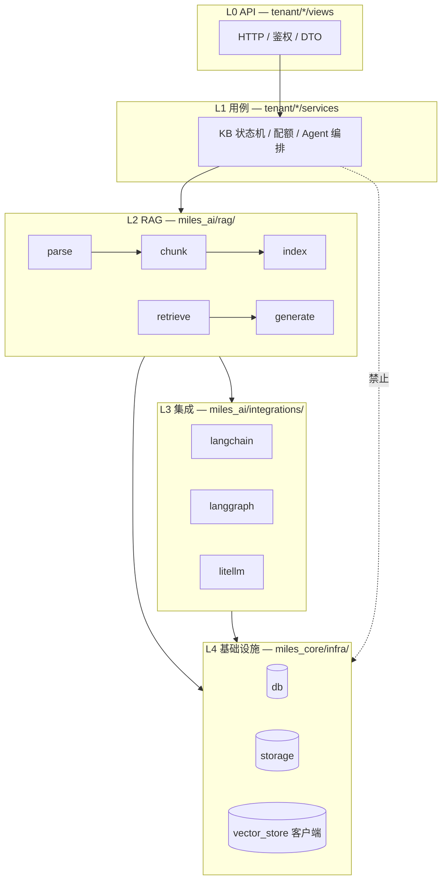
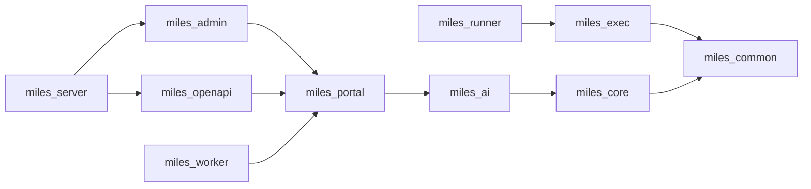

# 后端分层与代码规范

> 状态：**规范已定稿**（现行）  
> 关联：[technical-design.md](./technical-design.md)、[guides/knowledge-base.md](../guides/knowledge-base.md)、[guides/ai-stack.md](../guides/ai-stack.md)

本文定义 MilesAI 后端 **包职责、依赖方向、命名约定**。RAG 入库：**LangChain Document** + **pypdf / Docling（可选）** + **图/音 multimodal（可选）**；**不包含** RAG-Anything / MinerU / 知识图谱旁路。

---

## 1. 目标

1. **RAG 能力**集中在 `miles_ai.rag`（Parse → Chunk → Index → Retrieve → Generate）。
2. **`infra/`** 只对接外部系统原语（DB、S3、向量库客户端）。
3. **`integrations/`**（L3）只封装 LangChain / LangGraph / LiteLLM / DeepAgents。
4. **`tenant/`** 承载 AI 平台与组织设置 API，为 L0/L1，挂载 `/api/v1`。
5. 依赖单向：**L0 → L1 → L2 → L3 → L4**，禁止反向。

---

## 2. 分层模型



### 2.1 各层职责

| 层 | 路径 | 做什么 | 不做什么 |
|----|------|--------|----------|
| **L0** | `miles_portal/tenant/*/views`、`schemas` | 路由、校验、响应 | 解析 PDF、拼向量 Filter |
| **L1** | `miles_portal/tenant/*/services` | 事务、软删、配额、调 `rag`、业务状态机 | 直接 `PyPDFLoader` |
| **L2** | `miles_ai/rag/` | 文档解析、分片、向量索引门面、检索策略、RAG prompt/answer | FastAPI、HTTP |
| **L3** | `miles_ai/integrations/` | LC Loader/Splitter 封装、LangGraph 图、LiteLLM | `tenant_id` 业务规则 |
| **L4** | `miles_core/infra/` | 连接池、S3 put/get、向量库 upsert/search/delete | `hybrid_alpha`、RRF、KB 状态机 |

### 2.2 依赖规则（强制）

```
L0 → L1 → L2 → L3 → L4
```

| 禁止 | 说明 |
|------|------|
| `infra` → `tenant` / `rag` | 基础设施不得了解业务 |
| `integrations` → `tenant` | 集成层通过 L2 传入参数，不 import 用例 |
| `rag` → `tenant` | RAG 层可 import `models`、可用 `AsyncSession` 做 PG 关键词检索，但 **不** import `tenant.kb.services.kb` |

**允许**：`rag` → `models`、`core`、`infra`、`integrations`（仅 L3 技术封装）。

### 2.3 运营后台（`admin/`）访问租户域

`admin/`（L0/L1，`/api/admin/v1`）为平台运营面：审核租户内容、管理租户与配额时须读取租户域数据。允许 `admin → tenant` **单向**访问，但只能走下列合规形态：

| 形态 | 合规目标 | 现网 |
|------|----------|------|
| 读共享 ORM | 跨面共读的 ORM 上移 `miles_core.models.<域>`，admin 经共享模型读取 | `mkt_*` → `miles_core.models.marketplace` |
| 复用纯函数 | 下沉 `common/` | `slugify` → `miles_common.slug`、`validate_api_key` → `miles_common.api_key` |
| 复用 Repository | 允许复用管理**同域数据**的租户 Repository（运营即该数据管理面） | `tenant.system.repositories.tenant.TenantRepository` |

**禁止**：

- admin import 租户域 **service 业务用例**（事务 / 状态机 / 编排入口）
- `tenant/` 反向依赖 `admin/`

> 新增 admin 读取统一先评估上移共享层（`miles_core.models.<域>` / `miles_common`），勿加深层 import。当前 admin 对 tenant 的引用仅剩 `TenantRepository`（上表合规形态）；共享 DTO 位于中立域（`miles_common.schemas.tag` / `miles_core.models.marketplace.dto`）。

### 2.4 包边界（uv workspace）

自 2026-09-11 的 uv workspace 重构起，后端由单包 `app/` 拆为 `backend/packages/` 下的 **10 个包**；源码位于 `backend/packages/<pkg>/src/<module>/`，旧单包目录 `backend/app`、`backend/cli.py`、`backend/scripts/` 均已不存在。

| 包 | 职责 | 层位 |
|----|------|------|
| `miles_common` | 跨模块公共能力：响应 / 异常 / 通用 schema、`idgen`、`redis_keys`、`cron`、`slug` | 最底层 |
| `miles_exec` | 沙箱与 MCP 协议内核（`mcp.spec/constants/rpc`、`sandbox.session/script_exec`） | 叶子 |
| `miles_core` | L4 基础设施 + 核心 ORM + 配置 / 安全 / 租户上下文 + `web/`（通用 Web 管道）+ `risk/` + `jobs/` | L4 |
| `miles_ai` | L2 RAG + L3 集成（LangChain / LangGraph / LiteLLM / DeepAgents）+ `flow_runtime` | L2/L3 |
| `miles_portal` | L0/L1 租户域（`tenant/`）+ `deletion/` + `marketplace/` + 域 API 注册 | L0/L1 |
| `miles_admin` | L0/L1 运营域（`admin/`）+ 域 API 注册 | L0/L1 |
| `miles_openapi` | 对外开放面 `/api/v1/open/*` 的视图与鉴权依赖 | L0 |
| `miles_server` | 装配根：`create_app`、`main`、`cli`、`scripts/`（**零域端点**） | 装配 |
| `miles_worker` | Celery app 与任务 | 装配 |
| `miles_runner` | MCP / 脚本沙箱独立 HTTP 服务（自带 settings） | 装配 |

**依赖 DAG（严格单向）**：



**硬判据（CI 契约，违反即失败）**：

| # | 判据 |
|---|------|
| 1 | `miles_ai` 不得 import `miles_portal` |
| 2 | `miles_openapi` 不得 import `miles_admin` |
| 3 | `miles_portal` 不得 import `miles_admin` |
| 4 | `miles_runner` 只依赖 `miles_exec` / `miles_common`（不得 import `miles_core` / `miles_ai` / `miles_portal` / `miles_admin` / `miles_openapi`） |
| 5 | `miles_core` 不得 import `miles_ai` |

**强制机制**：上述 DAG 与硬判据由 `backend/.importlinter` 固化为 6 条契约（1 条 `layers` + 5 条 `forbidden`），在 CI 与本地经 `make layers-check`（即 `import-linter`）执行；`make check` 已包含该步。

**物理布局（`packages/<dist>/src/<module>/`）**：`packages/` 与 `src/` 两层**仅为物理组织，不进 `sys.path`**——映射由各包 wheel 的 `packages = ["src/miles_*"]` 决定，因此代码里的模块路径始终是 `miles_core.…` 这类形式，**与物理层数无关**；分层契约的 `root_packages` 同样只写模块名。`src/` 采用 PyPA 推荐的 src layout，用于阻止 cwd 影子导入、确保测试跑的是**已安装**的包（而非裸源码）。

故文件路径偏长（最深如 `packages/miles-portal/src/miles_portal/tenant/marketplace/services/marketplace/upgrade.py`）属纯外观代价，**不要为缩短路径而合并层级**：`parents[N]` 已在 `miles_server/apps/migrate.py`、`miles_portal/tenant/skills/storage.py`、`miles_core/config.py` 中按此深度硬编码，改深度会静默改错这些路径推导。定位某模块的实际文件用：

```bash
python -c "import miles_core; print(miles_core.__file__)"
```

### 2.5 API 层归属

「API 入口」拆成三件事，各有明确归属：

| 层次 | 内容 | 归属 |
|------|------|------|
| ① 域自持 API 层 | 路由、views、域 DTO（schemas）、域依赖与中间件 | `miles_portal.registration.register_portal(app)`（`/api/v1`）、`miles_admin.registration.register_admin(app)`（`/api/admin/v1`）、`miles_openapi.registration.register_open(app)`（`/api/v1/open/*`） |
| ② 通用 Web 管道 | 统一异常信封（`exception_handlers`）、trace / access_log / 风控中间件（`register_http_middlewares`） | `miles_core.web` |
| ③ 装配根 | ASGI `app` 对象、CORS、lifespan、路由 include 顺序、uvicorn 目标、CLI | `miles_server.apps.application.create_app`（仅组合 + CORS + lifespan，**不放 views**） |

**对外路径契约不变**：`/api/v1`（租户）、`/api/admin/v1`（运营）、`/api/v1/open/*`（开放面）；拆分包与调整 API 层归属**不改变**任何 URL。

---

## 3. 目标目录结构

```text
backend/packages/
├── miles-common/src/miles_common/       # 跨模块公共能力（响应/异常/schema、idgen、redis_keys）
├── miles-exec/src/miles_exec/           # 沙箱 + MCP 协议内核
├── miles-core/src/miles_core/           # L4
│   ├── infra/                           # db / redis / storage / vector_store
│   ├── models/                          # 核心 ORM（按域分子包）
│   ├── web/                             # 通用 Web 管道（异常处理、中间件）
│   ├── risk/  jobs/  utils/
│
├── miles-ai/src/miles_ai/               # L2/L3
│   ├── rag/                             # parse / chunk / index / retrieve / generate / load / pipeline
│   ├── integrations/                    # langchain / langgraph / litellm / deepagents
│   └── flow_runtime/                    # 流程节点 → 调 rag / integrations
│
├── miles-portal/src/miles_portal/       # L0/L1：tenant/ + deletion/ + marketplace/ + register_portal
├── miles-admin/src/miles_admin/         # L0/L1：admin/ + register_admin
├── miles-openapi/src/miles_openapi/     # /api/v1/open/* + register_open
├── miles-server/src/miles_server/       # 装配根：apps/application.py、main.py、cli.py、scripts/
├── miles-worker/src/miles_worker/       # Celery app + tasks/
└── miles-runner/src/miles_runner/       # 沙箱 HTTP 服务（自带 settings）
```

> 目录树只列关键子路径；完整职责与依赖见 §2.4。

### 3.1 `miles_ai.rag` 子模块

| 子包 | 职责 | 要点 |
|------|------|------|
| `rag.parse` | `load_documents_from_bytes`（`loaders.py`） | `backends/pypdf`、`backends/docling`；`image_parser` / `audio_parser` |
| `rag.chunk` | `chunk_documents`、`split_text` | Docling→MarkdownHeader+Recursive；pypdf 按页；`TextChunk.page_no` |
| `rag.index` | `upsert_chunk_vector`、`search_vectors` | 门面；业务代码直引 `miles_ai.rag.index.gateway` |
| `rag.retrieve` | `search_kb_chunks`、`multi_kb`、RRF | vector / hybrid；PG 关键词回退 |
| `rag.generate` | `format_hits_context`、`generate_rag_answer` | Agent / 流程 RAG 上下文 |
| `rag.pipeline` | `run_ingest_pipeline` | L1 `tenant.kb.ingest` 调用 |
| `rag.load` | `load_knowledge_bases_for_tenant` | 解耦 `tenant.kb` 加载逻辑 |

### 3.2 `infra/vector_store/` 瘦身目标

**保留**：

- `base.py`：`VectorStore` Protocol、`ChunkVectorRecord`（存储 DTO，带 tenant/kb/chunk 主键）
- `weaviate.py` / `milvus.py` / `pgvector.py`：后端适配
- `langchain_base.py`、`precomputed.py`：LC 向量库桥接；Document 映射在 `integrations.langchain.vector.documents`
- `get_vector_store()` 工厂

**已迁出到 `rag/`**：

- `upsert_chunk_vector` / `search_vectors` → `rag.index.gateway`（勿从 `infra.vector_store` 导入）
- `hybrid.rrf_fuse` → `rag.retrieve.hybrid`

**不放入 infra**：

- 混合检索策略（alpha、RRF 与 PG 关键词融合）
- Prompt 拼装、Agent RAG 图

---

## 4. RAG 流水线（与代码对应）

### 4.1 离线入库

```
OSS bytes
  → rag.parse.load_documents_from_bytes（pypdf | docling | text | image | audio）
  → rag.chunk.chunk_documents(kb.chunk_size, kb.chunk_overlap)
  → integrations: embed_texts_for_kb（KB 绑定向量模型）
  → rag.index.upsert_chunk_vector（含 page_no）
  → PG: kb_document_chunks + kb_vector_refs
```

入口：`tenant.kb.services.ingest.run_ingest`（L1 状态机 + Celery）。

### 4.2 在线检索 / 生成

```
query
  → embed_query_for_kb（integrations）
  → rag.retrieve.search_kb_chunks
  →（可选）rag.generate.build_rag_user_prompt
  → integrations: ainvoke_chat / LangGraph rag_qa
```

入口：`KbService.search`（L1）、`AgentService.chat`、`flow_runtime.rag_nodes`。

### 4.3 Parse / Chunk（当前能力）

| 能力 | 落点 | 依赖 |
|------|------|------|
| TXT/MD | `loaders` + `text_parser` | 内置 |
| PDF | `backends/pypdf`（默认） | `langchain-community` PyPDFLoader |
| PDF/Office 版式 | `backends/docling` | docling（随 miles-ai）+ `PARSE_PDF_BACKEND=docling` |
| 图片 / 音频 | `image_parser` / `audio_parser` | 入库已接入；OCR/ASR 另需系统 `tesseract-ocr` / `ffmpeg` |
| 分片 + 页码 | `chunk_documents`、`page_no` | Docling Markdown 标题切分 + pypdf 按页 |

**上传白名单**（L1）：见 [knowledge-base.md](../guides/knowledge-base.md) §6.4。Office 扩展名需同步放开上传白名单后才可入库。

**后续插件**（独立立项）：PaddleOCR、MinerU 等仅增 `rag/parse/backends/*`，不改 `pipeline/ingest` 主链。

---

## 5. 命名与模块规范

### 5.1 命名

| 类型 | 约定 | 示例 |
|------|------|------|
| 基础设施客户端 | `*Store`、`*Client` | `WeaviateVectorStore` |
| 领域服务 | `*Service` | `KbIngestService`（L1） |
| 管道步骤 | 动词短语 | `load_documents_from_bytes`、`chunk_documents` |
| 模块级常量 | `UPPER_SNAKE` | `RETRIEVAL_HYBRID` |
| 禁止 | 无逻辑 re-export 包 | 业务代码应 `import miles_ai.rag.*`，勿在 `tenant`/`integrations` 再套一层转发 |

### 5.2 Import 示例

```python
# L1 入库
from miles_ai.rag.pipeline import run_ingest_pipeline, IngestInput

# L2 RAG
from miles_ai.rag.parse.loaders import load_documents_from_bytes
from miles_ai.rag.chunk import chunk_documents
from miles_ai.rag.index.gateway import upsert_chunk_vector, search_vectors
from miles_ai.rag.retrieve import search_kb_chunks, resolve_retrieval_mode
from miles_ai.rag.generate import format_hits_context, generate_rag_answer

# L1/L3 检索（kb 域向量化 embed_query_for_kb；检索封装仍在 vectorstores 壳）
from miles_portal.tenant.kb.services.embeddings import embed_query_for_kb
from miles_ai.integrations.langchain.vectorstores import search_kb

# L4（仅向量库客户端，不含 upsert/search 门面）
from miles_core.infra.vector_store import get_vector_store
```

### 5.3 类型

- 跨层优先 `@dataclass` / `TypedDict`（如 `ChunkHit`），减少裸 `dict[str, Any]` 层层传递。
- 检索 hit 字段约定：`chunk_id`、`document_id`、`score`、`content_preview`、`score_vector`、`score_keyword`。

### 5.4 单文件体量与子包拆分（强制）

**规范**：`backend/packages/*/src/` 下单个 `.py` 源文件 **不得超过 500 行**（`wc -l`；测试、`alembic/versions/` 除外）。达到或超过 500 行时，**必须**在合入前拆分，禁止在同文件继续叠加业务逻辑。

**推荐拆分方式（L1 `tenant/*/services`）**：按**聚合**建子包 `services/{aggregate}/`，与领域目录同名或语义一致（如 `agent`、`compliance`、`marketplace`）。详见 [backend/README.md](../../backend/README.md) § 单文件体量、§ services/ 子包。

| 项 | 约定 |
|----|------|
| 门面 | `{aggregate}/service.py` 用 Mixin 组合；`{aggregate}/__init__.py` 唯一对外 export |
| 子模块命名 | 职责名即可（`crud.py`、`chat.py`），避免 `agent_crud.py` 重复前缀 |
| 共享代码 | 多聚合共用的模块留在 `services/` 根（如 `context.py`、`pipeline.py`） |
| import | 对外路径保持稳定，例如 `from miles_portal.tenant.agents.services.agent import AgentService` |
| 拆分后体量 | 每个子文件宜 **300–400 行**；仍 ≥500 则继续按职责切文件 |
| 其它路径 | `integrations/`、`flow_runtime/`、`rag/` 大文件同理：按子包或子模块拆，不引入 `tenant` 依赖 |

**参考实现**：`tenant/agents/services/agent/`、`tenant/compliance/services/compliance/`、`tenant/marketplace/services/marketplace/`、`tenant/tools/invoke/` + `tenant/tools/builtins/`。

### 5.5 文档注释（类 / 方法 / 函数）

**强制**：`backend/packages/*/src/` 业务代码中，每个 **模块**、**类（含 Mixin）**、**方法**、**模块级函数** 须有 **中文说明**（docstring，三引号字符串紧接在定义下一行）；纯数据载体类（Pydantic DTO / `str, Enum`）允许用类上方**一行** `#` 注释替代——Pydantic 仅将 docstring 用于 OpenAPI `description`，故该约定不影响契约。

| 类型 | 内容要点 |
|------|----------|
| 模块 | 职责范围；子包注明对外 import 路径 |
| 类 | 聚合边界、与其它 Mixin 的关系；DTO / Enum 可简化为一句话 |
| 公开方法 | 行为、入参语义、是否抛 ``BadRequestError`` / 写库 / 调外部 |
| ``_`` 前缀 | 私有实现细节；有业务逻辑则完整说明，避免仅转发公开方法的 shim |

禁止用 docstring 重复类型注解已表达的信息；禁止无信息量的「获取数据」类空话——应写明业务对象（如「分页列出词库」）。细则见 [backend/README.md](../../backend/README.md) § 文档注释。

---

## 6. 包命名（当前）

| 包 | 职责 |
|----|------|
| `miles_ai.rag` | L2：Parse / Chunk / Index / Retrieve / Generate / pipeline |
| `miles_ai.integrations` | L3：LangChain、LangGraph、LiteLLM、DeepAgents |

---

## 7. 测试布局

```text
backend/tests/
  conftest.py              # 全局 fixture
  paths.py                 # BACKEND_ROOT（子目录内引用资源路径）
  api/                     # HTTP / meta / smoke
  integration/             # 跨模块编排
  rag/                     # 解析、分片、检索、向量化
  flow/                    # LangGraph 编译与流程
  tenant/
    agents/ kb/ tools/ skills/ hooks/ generative/
  mcp/ admin/ infra/ marketplace/ media/
```

单测 `rag` 模块时 **不启动** FastAPI；向量库测试 mock `get_vector_store`。详见 [tests/README.md](../../backend/tests/README.md)。

