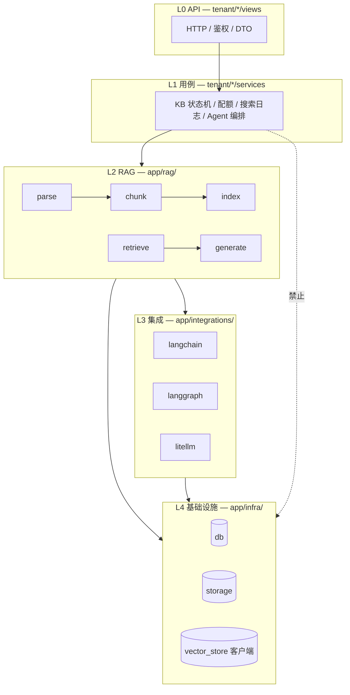

# 后端分层与代码规范

> 版本：v1.0 | 日期：2026-05-22  
> 状态：**规范已定稿**；目录迁移见 [rag-module-migration.md](./rag-module-migration.md)  
> 关联：[technical-design.md](./technical-design.md)、[guides/knowledge-base.md](../guides/knowledge-base.md)、[guides/ai-stack.md](../guides/ai-stack.md)

本文定义 MilesAI 后端 **包职责、依赖方向、命名约定**。RAG 入库：**LangChain Document** + **pypdf / Docling（可选）** + **图/音 multimodal（可选）**；**不包含** RAG-Anything / MinerU / 知识图谱旁路。

---

## 1. 问题与目标

### 1.1 现状问题

| 现象 | 影响 |
|------|------|
| 历史：多层转发（`app/ai`、`app/ai_stack`） | 已删除，收敛为 `rag` + `integrations` |
| 历史：`infra/vector_store` 含 RRF、KB 入库门面 | 已迁至 `rag/index`、`rag/retrieve` |
| 历史：`vectorstores` 依赖 `tenant.kb.retrieval` | 已迁至 `app.rag.retrieve` |

### 1.2 目标

1. **RAG 能力**集中在 `app/rag/`（Parse → Chunk → Index → Retrieve → Generate）。
2. **`infra/`** 只对接外部系统原语（DB、S3、向量库客户端）。
3. **`integrations/`**（L3）只封装 LangChain / LangGraph / LiteLLM / DeepAgents。
4. **`tenant/`** 只做 API、权限、配额、状态机、编排调用 `rag.*`。
5. 依赖单向：**L0 → L1 → L2 → L3 → L4**，禁止反向。

---

## 2. 分层模型



### 2.1 各层职责

| 层 | 路径 | 做什么 | 不做什么 |
|----|------|--------|----------|
| **L0** | `tenant/*/views`、`schemas` | 路由、校验、响应 | 解析 PDF、拼向量 Filter |
| **L1** | `tenant/*/services` | 事务、软删、配额、`task_records`、调 `rag` | 直接 `PyPDFLoader` |
| **L2** | `app/rag/` | 文档解析、分片、向量索引门面、检索策略、RAG prompt/answer | FastAPI、HTTP |
| **L3** | `app/integrations/` | LC Loader/Splitter 封装、LangGraph 图、LiteLLM | `tenant_id` 业务规则 |
| **L4** | `app/infra/` | 连接池、S3 put/get、向量库 upsert/search/delete | `hybrid_alpha`、RRF、KB 状态机 |

### 2.2 依赖规则（强制）

```
L0 → L1 → L2 → L3 → L4
```

| 禁止 | 说明 |
|------|------|
| `infra` → `tenant` / `rag` | 基础设施不得了解业务 |
| `integrations` → `tenant` | 集成层通过 L2 传入参数，不 import 用例 |
| `rag` → `tenant` | RAG 层可 import `models`、可用 `AsyncSession` 做 PG 关键词检索，但 **不** import `tenant.kb.services.kb` |
| 新增 `app/ai/*` 仅 re-export | 已废弃，见迁移文档 |

**允许**：`rag` → `models`、`core`、`infra`、`integrations`（仅 L3 技术封装）。

---

## 3. 目标目录结构

```text
backend/app/
├── tenant/                      # L0/L1 多租户产品
│   └── kb/
│       ├── views/
│       ├── services/            # 薄用例：调 rag + 写日志/配额
│       └── repositories/
│
├── rag/                         # L2 RAG 能力（核心）
│   ├── parse/                   # loaders + backends（pypdf / docling / 图 / 音）
│   ├── chunk/                   # chunk_documents、TextChunk、page_no
│   ├── index/                   # upsert_chunk_vector、search_vectors 门面
│   ├── retrieve/                # search_kb_chunks、hybrid、RRF、multi_kb
│   ├── generate/                # context、retrieve_hits、rag_answer
│   ├── load/                    # 按租户加载 KB（供 Agent/流程）
│   └── pipeline/                # run_ingest_pipeline（Parse → Chunk → Index）
│
├── integrations/                # L3
│   ├── langchain/
│   ├── langgraph/
│   ├── litellm/
│   └── deepagents/
│
├── infra/                       # L4
│   ├── db/
│   ├── storage/
│   └── vector_store/            # Protocol + weaviate|milvus|pgvector 适配器
│
├── flow_runtime/                # 流程节点 → 调 rag / integrations
├── deletion/                    # 删除编排 → infra.vector + PG
└── models/                      # ORM 实体
```

### 3.1 `app/rag/` 子模块

| 子包 | 职责 | 要点 |
|------|------|------|
| `rag.parse` | `load_documents_from_bytes`（`loaders.py`） | `backends/pypdf`、`backends/docling`；`image_parser` / `audio_parser` |
| `rag.chunk` | `chunk_documents`、`split_text` | Docling→MarkdownHeader+Recursive；pypdf 按页；`TextChunk.page_no` |
| `rag.index` | `upsert_chunk_vector`、`search_vectors` | 门面；业务代码直引 `app.rag.index.gateway` |
| `rag.retrieve` | `search_kb_chunks`、`multi_kb`、RRF | vector / hybrid；PG 关键词回退 |
| `rag.generate` | `format_hits_context`、`rag_answer` | Agent / 流程 RAG 上下文 |
| `rag.pipeline` | `run_ingest_pipeline` | L1 `tenant.kb.ingest` 调用 |
| `rag.load` | `load_knowledge_bases_for_tenant` | 解耦 `tenant.kb` 加载逻辑 |

### 3.2 `infra/vector_store/` 瘦身目标

**保留**：

- `base.py`：`VectorStore` Protocol、`ChunkVectorRecord`（存储 DTO，带 tenant/kb/chunk 主键）
- `weaviate.py` / `milvus.py` / `pgvector.py`：后端适配
- `langchain_base.py`、`precomputed.py`：LC 向量库桥接；Document 映射在 `integrations.langchain.vector.documents`
- `get_vector_store()` 工厂

**迁出到 `rag/`**（已完成或进行中，见迁移文档）：

- `upsert_chunk_vector` / `search_vectors` → `rag.index.gateway`（勿从 `infra.vector_store` 导入）
- `hybrid.rrf_fuse` → `rag.retrieve.hybrid`

**不放入 infra**：

- 混合检索策略（alpha、RRF 与 PG 关键词融合）
- Prompt 拼装、Agent RAG 图

---

## 4. RAG 流水线（与代码对应）

### 4.1 离线入库

```
OSS bytes
  → rag.parse.load_documents_from_bytes（pypdf | docling | text | image | audio）
  → rag.chunk.chunk_documents(kb.chunk_size, kb.chunk_overlap)
  → integrations: embed_texts_for_kb（KB 绑定向量模型）
  → rag.index.upsert_chunk_vector（含 page_no）
  → PG: kb_document_chunks + kb_vector_refs
```

入口：`tenant.kb.services.ingest.run_ingest`（L1 状态机 + Celery）。

### 4.2 在线检索 / 生成

```
query
  → embed_query_for_kb（integrations）
  → rag.retrieve.search_kb_chunks
  →（可选）rag.generate.build_rag_user_prompt
  → integrations: ainvoke_chat / LangGraph rag_qa
```

入口：`KbService.search`（L1）、`AgentService.chat`、`flow_runtime.rag_nodes`。

### 4.3 Parse / Chunk（当前能力）

| 能力 | 落点 | 依赖 |
|------|------|------|
| TXT/MD | `loaders` + `text_parser` | 内置 |
| PDF | `backends/pypdf`（默认） | `langchain-community` PyPDFLoader |
| PDF/Office 版式 | `backends/docling` | `[parse-docling]` + `PARSE_PDF_BACKEND=docling` |
| 图片 / 音频 | `image_parser` / `audio_parser` | 入库已接入；OCR/ASR 需 `[multimodal]` |
| 分片 + 页码 | `chunk_documents`、`page_no` | Docling Markdown 标题切分 + pypdf 按页 |

**上传白名单**（L1）：见 [knowledge-base.md](../guides/knowledge-base.md) §6.4。Office 扩展名需同步放开上传白名单后才可入库。

**后续插件**（独立立项）：PaddleOCR、MinerU 等仅增 `rag/parse/backends/*`，不改 `pipeline/ingest` 主链。

---

## 5. 命名与模块规范

### 5.1 命名

| 类型 | 约定 | 示例 |
|------|------|------|
| 基础设施客户端 | `*Store`、`*Client` | `WeaviateVectorStore` |
| 领域服务 | `*Service` | `KbIngestService`（L1） |
| 管道步骤 | 动词短语 | `load_documents_from_bytes`、`chunk_documents` |
| 模块级常量 | `UPPER_SNAKE` | `RETRIEVAL_HYBRID` |
| 禁止 | 无逻辑 re-export 包 | 业务代码应 `import app.rag.*`，勿在 `tenant`/`integrations` 再套一层转发 |

### 5.2 Import 示例

```python
# L1 入库
from app.rag.pipeline import run_ingest_pipeline, IngestInput

# L2 RAG
from app.rag.parse.loaders import load_documents_from_bytes
from app.rag.chunk import chunk_documents
from app.rag.index.gateway import upsert_chunk_vector, search_vectors
from app.rag.retrieve import search_kb_chunks, resolve_retrieval_mode
from app.rag.generate import format_hits_context, rag_answer

# L3 集成（检索封装仍在此，内部调 rag.retrieve.multi_kb）
from app.integrations.langchain.embeddings import embed_query_for_kb
from app.integrations.langchain.vectorstores import search_kb

# L4（仅向量库客户端，不含 upsert/search 门面）
from app.infra.vector_store import get_vector_store
```

### 5.3 类型

- 跨层优先 `@dataclass` / `TypedDict`（如 `ChunkHit`），减少裸 `dict[str, Any]` 层层传递。
- 检索 hit 字段约定：`chunk_id`、`document_id`、`score`、`content_preview`、`score_vector`、`score_keyword`。

### 5.4 单文件体量与子包拆分（强制）

**规范**：`app/` 下单个 `.py` 源文件 **不得超过 500 行**（`wc -l`；测试、`alembic/versions/` 除外）。达到或超过 500 行时，**必须**在合入前拆分，禁止在同文件继续叠加业务逻辑。

**推荐拆分方式（L1 `tenant/*/services`）**：按**聚合**建子包 `services/{aggregate}/`，与领域目录同名或语义一致（如 `agent`、`compliance`、`marketplace`）。详见 [backend/README.md](../../backend/README.md) § 单文件体量、§ services/ 子包。

| 项 | 约定 |
|----|------|
| 门面 | `{aggregate}/service.py` 用 Mixin 组合；`{aggregate}/__init__.py` 唯一对外 export |
| 子模块命名 | 职责名即可（`crud.py`、`chat.py`），避免 `agent_crud.py` 重复前缀 |
| 共享代码 | 多聚合共用的模块留在 `services/` 根（如 `context.py`、`pipeline.py`） |
| import | 对外路径保持稳定，例如 `from app.tenant.agents.services.agent import AgentService` |
| 拆分后体量 | 每个子文件宜 **300–400 行**；仍 ≥500 则继续按职责切文件 |
| 其它路径 | `integrations/`、`flow_runtime/`、`rag/` 大文件同理：按子包或子模块拆，不引入 `tenant` 依赖 |

**参考实现**：`tenant/agents/services/agent/`、`tenant/compliance/services/compliance/`、`tenant/marketplace/services/marketplace/`、`tenant/tools/invoke/` + `tenant/tools/builtins/`。

### 5.5 文档注释（类 / 方法 / 函数）

**强制**：`app/` 业务代码中，每个 **模块**、**类（含 Mixin）**、**方法**、**模块级函数** 须有 **中文 docstring**（三引号字符串，紧接在定义下一行）。

| 类型 | 内容要点 |
|------|----------|
| 模块 | 职责范围；子包注明对外 import 路径 |
| 类 | 聚合边界、与其它 Mixin 的关系 |
| 公开方法 | 行为、入参语义、是否抛 ``BadRequestError`` / 写库 / 调外部 |
| ``_`` 前缀 | 纯别名写「兼容别名 → ``公开方法``」；有业务逻辑则完整说明 |

禁止用 docstring 重复类型注解已表达的信息；禁止无信息量的「获取数据」类空话——应写明业务对象（如「分页列出词库」）。细则见 [backend/README.md](../../backend/README.md) § 文档注释。

---

## 6. 包命名（当前）

| 包 | 职责 |
|----|------|
| `app/rag` | L2：Parse / Chunk / Index / Retrieve / Generate / pipeline |
| `app/integrations` | L3：LangChain、LangGraph、LiteLLM、DeepAgents |
| `app/ai`、`app/ai_stack` | **已删除** |

---

## 7. 测试布局

```text
tests/
  rag/
    test_hybrid.py          # RRF
    test_retrieval_modes.py
  infra/vector_store/       # 工厂、Record 映射
  tenant/kb/                # API / 集成（可选）
```

单测 `rag` 模块时 **不启动** FastAPI；向量库测试 mock `get_vector_store`。

---

## 8. 修订记录

| 日期 | 说明 |
|------|------|
| 2026-05-22 | 初版：分层定义、rag 目录、infra 瘦身、无 MinerU/图谱 |
| 2026-05-22 | 入库链：`pipeline/ingest`、Docling/pypdf、multimodal 接入、`chunk_documents` + `page_no` |
| 2026-05-26 | §5.4：单文件 ≥500 行强制按子包拆分；§5.5：类/方法/函数 docstring 强制 |
