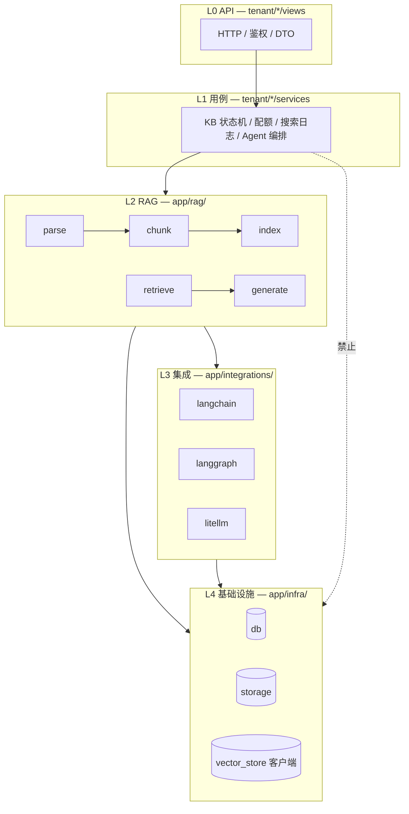

# 后端分层与代码规范

> 版本：v1.0 | 日期：2026-05-22  
> 状态：**规范已定稿**；目录迁移见 [rag-module-migration.md](./rag-module-migration.md)  
> 关联：[technical-design.md](./technical-design.md)、[guides/knowledge-base.md](../guides/knowledge-base.md)、[guides/ai-stack.md](../guides/ai-stack.md)

本文定义 MilesAI 后端 **包职责、依赖方向、命名约定**。Parse 路线为 **LangChain Loader + pypdf**（TXT/MD/PDF），图片/音频可选 multimodal；**不包含** RAG-Anything / MinerU / 知识图谱旁路。

---

## 1. 问题与目标

### 1.1 现状问题

| 现象 | 影响 |
|------|------|
| 历史：多层转发（`app/ai`、`app/ai_stack`） | 已删除，收敛为 `rag` + `integrations` |
| 历史：`infra/vector_store` 含 RRF、KB 入库门面 | 已迁至 `rag/index`、`rag/retrieve` |
| 历史：`vectorstores` 依赖 `tenant.kb.retrieval` | 已迁至 `app.rag.retrieve` |

### 1.2 目标

1. **RAG 能力**集中在 `app/rag/`（Parse → Chunk → Index → Retrieve → Generate）。
2. **`infra/`** 只对接外部系统原语（DB、S3、向量库客户端）。
3. **`integrations/`**（L3）只封装 LangChain / LangGraph / LiteLLM / DeepAgents。
4. **`tenant/`** 只做 API、权限、配额、状态机、编排调用 `rag.*`。
5. 依赖单向：**L0 → L1 → L2 → L3 → L4**，禁止反向。

---

## 2. 分层模型



### 2.1 各层职责

| 层 | 路径 | 做什么 | 不做什么 |
|----|------|--------|----------|
| **L0** | `tenant/*/views`、`schemas` | 路由、校验、响应 | 解析 PDF、拼向量 Filter |
| **L1** | `tenant/*/services` | 事务、软删、配额、`task_records`、调 `rag` | 直接 `PyPDFLoader` |
| **L2** | `app/rag/` | 文档解析、分片、向量索引门面、检索策略、RAG prompt/answer | FastAPI、HTTP |
| **L3** | `app/integrations/` | LC Loader/Splitter 封装、LangGraph 图、LiteLLM | `tenant_id` 业务规则 |
| **L4** | `app/infra/` | 连接池、S3 put/get、向量库 upsert/search/delete | `hybrid_alpha`、RRF、KB 状态机 |

### 2.2 依赖规则（强制）

```
L0 → L1 → L2 → L3 → L4
```

| 禁止 | 说明 |
|------|------|
| `infra` → `tenant` / `rag` | 基础设施不得了解业务 |
| `integrations` → `tenant` | 集成层通过 L2 传入参数，不 import 用例 |
| `rag` → `tenant` | RAG 层可 import `models`、可用 `AsyncSession` 做 PG 关键词检索，但 **不** import `tenant.kb.services.kb` |
| 新增 `app/ai/*` 仅 re-export | 已废弃，见迁移文档 |

**允许**：`rag` → `models`、`core`、`infra`、`integrations`（仅 L3 技术封装）。

---

## 3. 目标目录结构

```text
backend/app/
├── tenant/                      # L0/L1 多租户产品
│   └── kb/
│       ├── views/
│       ├── services/            # 薄用例：调 rag + 写日志/配额
│       └── repositories/
│
├── rag/                         # L2 RAG 能力（核心）
│   ├── parse/                   # 文件 → 纯文本（+ 后续结构化块）
│   ├── chunk/                   # 文本 → chunk 列表
│   ├── index/                   # chunk + 向量 → PG + 向量库
│   ├── retrieve/                # 检索模式、RRF、关键词、search_kb_chunks
│   ├── generate/                # context 拼装、retrieve_hits、rag_answer
│   └── pipeline/                #（后续）ingest 管道对象化
│
├── integrations/                # L3
│   ├── langchain/
│   ├── langgraph/
│   ├── litellm/
│   └── deepagents/
│
├── infra/                       # L4
│   ├── db/
│   ├── storage/
│   └── vector_store/            # Protocol + weaviate|milvus|pgvector 适配器
│
├── flow_runtime/                # 流程节点 → 调 rag / integrations
├── deletion/                    # 删除编排 → infra.vector + PG
└── models/                      # ORM 实体
```

### 3.1 `app/rag/` 子模块

| 子包 | 职责 | 当前实现来源 |
|------|------|----------------|
| `rag.parse` | `parse_file`、MIME 路由、PDF/TXT/图/音 | 原 `app/ai/parsers`、`app/ai/media` |
| `rag.chunk` | `split_text`（RecursiveCharacterTextSplitter） | 原 `integrations.langchain.chunking` |
| `rag.index` | `upsert_chunk_vector`、`search_vectors` 门面 | 原 `infra.vector_store.__init__` 部分 |
| `rag.retrieve` | `resolve_retrieval_mode`、`search_kb_chunks`、RRF | 原 `tenant.kb.retrieval`、`infra.hybrid` |
| `rag.generate` | `format_hits_context`、`build_rag_user_prompt`、`rag_answer` | 原 `integrations.langchain.rag` 部分 |

### 3.2 `infra/vector_store/` 瘦身目标

**保留**：

- `base.py`：`VectorStore` Protocol、`ChunkVectorRecord`（存储 DTO，带 tenant/kb/chunk 主键）
- `weaviate.py` / `milvus.py` / `pgvector.py`：后端适配
- `langchain_base.py`、`documents.py`、`precomputed.py`：LC 与向量库桥接（属 L3/L4 交界，后续可迁至 `integrations.langchain.vector`）
- `get_vector_store()` 工厂

**迁出到 `rag/`**（已完成或进行中，见迁移文档）：

- `upsert_chunk_vector` / `search_vectors` → `rag.index.gateway`
- `hybrid.rrf_fuse` → `rag.retrieve.hybrid`

**不放入 infra**：

- 混合检索策略（alpha、RRF 与 PG 关键词融合）
- Prompt 拼装、Agent RAG 图

---

## 4. RAG 流水线（与代码对应）

### 4.1 离线入库

```
OSS bytes
  → rag.parse.parse_file
  → rag.chunk.split_text(kb.chunk_size, kb.chunk_overlap)
  → integrations: embed_texts_for_kb（KB 绑定向量模型）
  → rag.index.upsert_chunk_vector
  → PG: kb_document_chunks + kb_vector_refs
```

入口：`tenant.kb.services.ingest.run_ingest`（L1 状态机 + Celery）。

### 4.2 在线检索 / 生成

```
query
  → embed_query_for_kb（integrations）
  → rag.retrieve.search_kb_chunks
  →（可选）rag.generate.build_rag_user_prompt
  → integrations: ainvoke_chat / LangGraph rag_qa
```

入口：`KbService.search`（L1）、`AgentService.chat`、`flow_runtime.rag_nodes`。

### 4.3 Parse / Chunk 扩展（无 MinerU）

| 阶段 | 内容 | 落点 |
|------|------|------|
| 现状 | TXT/MD/PDF（pypdf）、图 OCR、音 Whisper | `rag.parse` |
| P1 | Markdown 标题分片、`page_no` 写入 chunk/向量 | `rag.chunk` + `ingest`（已实现） |
| 可选 | Office、更强 PDF 版式 | `rag.parse.backends.*` 插件注册，**不**放回 `infra` |

---

## 5. 命名与模块规范

### 5.1 命名

| 类型 | 约定 | 示例 |
|------|------|------|
| 基础设施客户端 | `*Store`、`*Client` | `WeaviateVectorStore` |
| 领域服务 | `*Service` | `KbIngestService`（L1） |
| 管道步骤 | 动词短语 | `parse_file`、`split_text` |
| 模块级常量 | `UPPER_SNAKE` | `RETRIEVAL_HYBRID` |
| 禁止 | 无逻辑 re-export 包 | ~~`app/ai/chunking.py` 仅转发~~ |

### 5.2 Import 示例

```python
# L1 用例
from app.rag.parse import parse_file
from app.rag.chunk import split_text
from app.rag.index.gateway import upsert_chunk_vector
from app.rag.retrieve import search_kb_chunks, resolve_retrieval_mode
from app.rag.generate import format_hits_context, rag_answer

# L3 集成
from app.integrations.langchain.embeddings import embed_query_for_kb

# L4
from app.infra.vector_store import get_vector_store
```

### 5.3 类型

- 跨层优先 `@dataclass` / `TypedDict`（如 `ChunkHit`），减少裸 `dict[str, Any]` 层层传递。
- 检索 hit 字段约定：`chunk_id`、`document_id`、`score`、`content_preview`、`score_vector`、`score_keyword`。

---

## 6. 包命名（当前）

| 包 | 职责 |
|----|------|
| `app/rag` | L2：Parse / Chunk / Index / Retrieve / Generate / pipeline |
| `app/integrations` | L3：LangChain、LangGraph、LiteLLM、DeepAgents |
| `app/ai`、`app/ai_stack` | **已删除** |

---

## 7. 测试布局

```text
tests/
  rag/
    test_hybrid.py          # RRF
    test_retrieval_modes.py
  infra/vector_store/       # 工厂、Record 映射
  tenant/kb/                # API / 集成（可选）
```

单测 `rag` 模块时 **不启动** FastAPI；向量库测试 mock `get_vector_store`。

---

## 8. 修订记录

| 日期 | 说明 |
|------|------|
| 2026-05-22 | 初版：分层定义、rag 目录、infra 瘦身、无 MinerU/图谱 |
