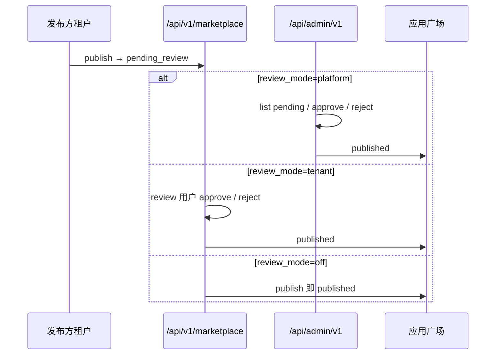

# 应用市场上架审核 — 双部署模式方案

**日期：** 2026-05-27  
**状态：** R0–R3 已实现  
**关联：** [marketplace.md](../features/marketplace.md) · [admin-ops-design.md](./admin-ops-design.md) · [technical-design.md §12](./technical-design.md#12-应用市场)

---

## 1. 背景

MilesAi 同时支持 **SaaS** 与 **私有化** 交付，应用市场上架审核不能只用一种模型：

| 部署 | 典型诉求 |
|------|----------|
| **SaaS** | 多客户互不信任；上架内容需 **平台运营 gate**；责任与审计归平台 |
| **私有化** | 客户自治；指定内部角色审核即可；**不依赖** 厂商运营登录 `ui/admin` |

**结论：** 用部署级配置 **`marketplace.review_mode`** 切换行为，一套代码两种交付，避免维护两套产品。

---

## 2. 现状（As-Is）与问题

| 项 | 现状 |
|----|------|
| 提交审核 | 租户 `POST /marketplace/apps/{id}/publish`（`marketplace:write`） |
| 审核 API | 租户 `/api/v1/marketplace/apps/pending|approve|reject`（`marketplace:review`） |
| 审核 UI | 工作台 `/workbench/marketplace` →「上架审核」Tab |
| 待审范围 | **全平台** `pending_review`，无租户隔离 |
| `reviewed_by` | `sys_users.id`（租户用户） |
| 运营后台 | **无** 市场审核能力 |

**SaaS 下的风险：** 租户 A 的管理员若被赋 `marketplace:review`，可审核租户 B 的上架申请——与「平台 gate」预期不符。

**私有化下的合理用法：** 客户把 `marketplace:review` 只给「内部运营/架构组」角色，工作台审核即可，无需 `ui/admin`。

---

## 3. 目标：`review_mode` 三态

配置存储（优先级从高到低）：

1. 环境变量 `MARKETPLACE_REVIEW_MODE`
2. `sys_configs` 键 `marketplace.review_mode`（L2，运营可改，私有化客户可在租户配置扩展前只用 env）
3. 默认 **`platform`**（SaaS 安全默认）

| 模式 | 值 | 谁审核 | 审核入口 | SaaS | 私有化 |
|------|-----|--------|----------|------|--------|
| **平台审核** | `platform` | `adm_admins` | `ui/admin` | ✅ 默认 | 可选 |
| **租户审核** | `tenant` | 具 `marketplace:review` 的租户用户 | 工作台「上架审核」 | 不推荐 | ✅ 默认 |
| **免审核** | `off` | — | 提交后直接 `published` | 仅内测 | 内网 PoC |

### 3.1 行为矩阵

| 动作 | `platform` | `tenant` | `off` |
|------|------------|----------|-------|
| 提交后状态 | `pending_review` | `pending_review` | `published` |
| 租户侧 approve/reject | **403** | ✅（见 §3.2 范围） | N/A |
| Admin approve/reject | ✅ | **403** | N/A |
| 工作台「上架审核」Tab | 隐藏或只读「待平台审核」 | 有 review 权限可见 | 隐藏 |
| Admin「应用审核」菜单 | ✅ | 隐藏 | 隐藏 |

### 3.2 `tenant` 模式下的审核范围（加固）

私有化若仍用租户 API，须二选一（推荐 **A**）：

| 策略 | 说明 |
|------|------|
| **A. 指定审核租户** | `MARKETPLACE_REVIEW_TENANT_ID`：仅该租户内 `marketplace:review` 用户可审 **全平台** 待审队列（单企业多部门场景） |
| **B. 发布方自审** | 仅 `publisher_tenant_id == ctx.tenant_id` 的待审应用可被自己租户审核员处理（适合强隔离、无全局广场） |

SaaS 必须使用 **`platform`**，不得使用 B（否则等于自审自上架）。

---

## 4. 目标架构



### 4.1 新增 Admin API（`platform` 模式）

```
GET  /api/admin/v1/marketplace/apps/pending
GET  /api/admin/v1/marketplace/apps/{id}      # 含 manifest 详情
POST /api/admin/v1/marketplace/apps/{id}/approve
POST /api/admin/v1/marketplace/apps/{id}/reject   # body: { note }
```

- 权限：`get_platform_admin`；写操作写 `adm_audit_logs`（`marketplace.approve` / `marketplace.reject`）。
- 实现：复用 `MarketplaceReviewMixin` 逻辑抽到 `app/marketplace/review_core.py`，Admin / Tenant Service 共用，避免双份业务规则。

### 4.2 租户 API 变更

`approve` / `reject` / `list_pending` 入口增加：

```python
if get_review_mode() == "platform":
    raise ForbiddenError("应用上架由平台运营审核")
```

`publish` 在 `off` 模式下直接 `status=published` 并写 `submitted_at`。

### 4.3 审核人字段（兼容迁移）

`mkt_apps` 扩展（可选列，Phase 1 可仅用 detail JSON）：

| 字段 | 说明 |
|------|------|
| `reviewed_by` | 保留；tenant 模式 = user_id |
| `reviewed_by_admin_id` | platform 模式 = `adm_admins.id` |
| `reviewer_type` | `tenant` \| `admin` \| null |

列表/详情 Out 增加 `reviewer_display`（用户名或 admin 名）。

### 4.4 前端

| 端 | `platform` | `tenant` |
|----|------------|----------|
| `ui/admin` | 新页 `/marketplace-review`：待审列表、manifest 摘要、通过/驳回 | 无菜单 |
| `ui/workbench` | 发布方见状态「待平台审核」；无审核 Tab | 现有「上架审核」Tab |
| `GET /marketplace/meta` | 返回 `review_mode` 供前端隐藏 Tab | 同左 |

---

## 5. 默认与部署建议

| 交付包 | 推荐 env | 说明 |
|--------|----------|------|
| SaaS 现网 | `MARKETPLACE_REVIEW_MODE=platform` | 启用 admin 审核页后再切换 |
| 私有化标准版 | `MARKETPLACE_REVIEW_MODE=tenant` + `MARKETPLACE_REVIEW_TENANT_ID=<客户运营租户 UUID>` | 或 B 策略自审 |
| 开发 / Demo | `off` 或 `tenant` | 加快迭代 |

Compose 示例：

```yaml
# docker-compose SaaS
MARKETPLACE_REVIEW_MODE: platform

# docker-compose 私有化
MARKETPLACE_REVIEW_MODE: tenant
MARKETPLACE_REVIEW_TENANT_ID: ${PLATFORM_TENANT_ID}
```

---

## 6. 分阶段实施

| 阶段 | 内容 | 依赖 |
|------|------|------|
| **R0** | `review_mode` 配置读取 + `/marketplace/meta` 暴露；租户 approve 在 `platform` 下 403 | 无 |
| **R1** | Admin API + `ui/admin/app/marketplace-review`；`reviewed_by_admin_id`；adm 审计 | R0 |
| **R2** | `tenant` 模式审核范围加固（策略 A/B）；种子与文档 | R0 |
| **R3** | `off` 模式；发布方「待平台审核」只读 UI | R1 |

与 [admin-ops-design.md](./admin-ops-design.md) **Phase 5** 对齐：R1 并入运营后台迭代。

---

## 7. 权限与种子调整

| 模式 | `marketplace:review` |
|------|----------------------|
| `platform` | 可从默认 `tenant_admin` **移除**（仅保留 super_admin 调试可选） |
| `tenant` | 保留；仅赋给审核租户内角色 |
| `off` | 可保留无影响 |

`seed` 不强行改已有库；提供 `python cli.py seed marketplace-perms` 或文档说明升级步骤。

---

## 8. 测试要点

1. `platform`：租户 review API 403；admin approve 后广场可见；`reviewed_by_admin_id` 正确。
2. `tenant` + 策略 A：非审核租户 review 用户 403；审核租户可审全队列。
3. `tenant` + 策略 B：不能审其他租户应用。
4. `off`：publish 后无 pending，直接 published。
5. 模式切换不影响已 `published` 历史数据。

---

## 9. 文档同步

- [technical-design.md §12](./technical-design.md#12-应用市场) — 「运营通过/驳回」改为「按 review_mode」
- [features/marketplace.md](../features/marketplace.md) — §3.3 审核按模式分支
- [features/admin-ops.md](../features/admin-ops.md) — 增加应用审核页（platform 模式）

---

## 10. 决策摘要

**SaaS + 私有化并存时，不要二选一，而要：**

- **默认 SaaS 安全：** `review_mode=platform` → 只有 `ui/admin` 能审；
- **私有化自治：** `review_mode=tenant` → 工作台审核 + 审核范围配置；
- **同一套表与 API 面**，用配置切换，审核逻辑单点复用。

这样既避免 SaaS「租户互审」漏洞，也不强迫私有化客户依赖厂商运营后台。
