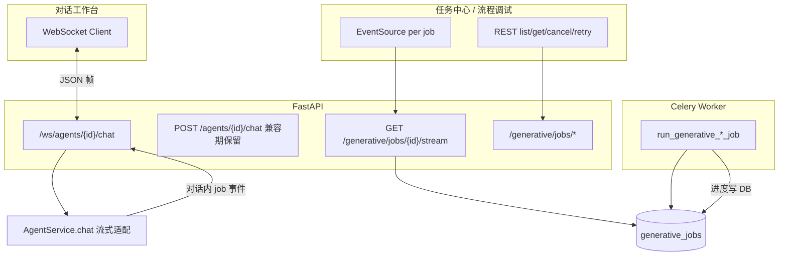

# 实时通道技术设计 — 对话 WebSocket + 资源 SSE

**日期：** 2026-05-26  
**状态：** 部分已实施（工作台 WS v1 ✅；直连/RAG 真 token 流式 ✅；tool 路径仍切块；HTTP 整包流式仍待做）  
**As-Is 规格：** [features/agent-chat-websocket.md](../features/agent-chat-websocket.md)  
**关联：** [multimodal-capabilities.md](../product/multimodal-capabilities.md)、[platform-agents.md](../guides/platform-agents.md)、[technical-design.md](./technical-design.md)

---

## 1. 背景与结论

MilesAI 已具备两类「实时」需求：

| 需求 | 现状（As-Is） | 痛点 |
|------|----------------|------|
| **智能体对话** | WS 直连/RAG 真 token 流式；HTTP `POST …/chat` 仍一次性返回 | HTTP 无 token 流式；tool 路径 WS 仍切块；工具确认、异步生成物靠 WS 或 HTTP + SSE 拼装 |
| **生成任务进度** | `GET /generative/jobs/{id}/stream`（SSE）+ `POST cancel/retry` | 模型清晰；对话内每个 job 可能再开 SSE，与轮询兜底并存 |
| **任务中心 / 流程调试** | 列表 HTTP 分页 + 手动刷新；详情 SSE | 合理；不宜绑到某一条「对话连接」 |

**结论（To-Be）：分场景选型，而非全站统一 WebSocket。**

```text
对话工作台     → WebSocket（会话级双向总线）
生成任务等资源 → SSE（单向推送）+ REST（变更状态）
```

这样既能在对话侧获得 **一条连接、多种事件**，又保留任务进度与 HTTP API 的 **简单可调试性**。

---

## 2. 为什么分场景（WebSocket vs SSE）

### 2.1 协议差异（摘要）

| 维度 | SSE | WebSocket |
|------|-----|-----------|
| 方向 | 服务端 → 客户端（单向） | 双向 |
| 传输 | 普通 HTTP，`text/event-stream` | 协议升级 `ws` / `wss` |
| 浏览器 API | `EventSource`（内置重连） | `WebSocket`（需自管心跳/重连） |
| 典型用途 | 进度、日志、通知 | 聊天、协作、游戏、统一实时总线 |
| 运维 | 与 REST 同路径，curl 可测 | 需网关支持 Upgrade；多实例要粘性或 Redis 广播 |

### 2.2 为何对话更适合 WebSocket

对话是 **长会话 + 高频双向**：

- 用户：发文本、附图、确认工具、（可选）取消生成。
- 服务端：流式 token、`steps`、待确认工具、`generative_job` 进度、最终 `artifacts`。

若全部用 HTTP + 多条 SSE，前端需维护多套连接与状态机，重连与去重成本高。

**一条对话 WebSocket**（按 `agent_id` + `conversation_id` 作用域）可统一事件类型（见 §4）。

### 2.3 为何生成任务等仍用 SSE

`generative_jobs` 生命周期是 **资源型** 而非会话型：

- 推送：进度百分比、终态（单向）。
- 变更：取消、重试（低频，已有 `POST`）。

与 SSE 语义一致；任务中心打开某 job 详情时订阅即可，**无需**占用对话 WS。

全站单一 WebSocket 会过早引入：租户房间、多 Tab 广播、Celery 任务订阅表等，实施成本高于收益。

---

## 3. 架构总览



### 3.1 通道职责表

| 场景 | 通道 | 端点（规划） | 说明 |
|------|------|--------------|------|
| 对话发消息、流式回答、工具确认 | **WebSocket** | `wss://…/api/v1/ws/agents/{agent_id}/chat?conversation_id=` | 主通道；见 §4 |
| 对话触发的 `generative_job` 进度 | **WebSocket**（优先） | 同上，`type=generative_job.*` | 对话页不另开 job SSE |
| 任务中心 / 仅 API 创建的 job | **SSE** | 现有 `GET …/jobs/{id}/stream` | 不变 |
| 流程调试面板异步生成物 | **SSE 或 WS 二选一** | 调试页可继续 SSE；不与对话 WS 混用 |
| 任务列表 | **HTTP** | `GET …/jobs` 分页 | 不用 WS 推全量列表 |
| 取消 / 重试 | **HTTP** | 现有 `POST …/cancel`、`POST …/retry` | 可保留；WS 内 `cancel` 为可选便捷 |

### 3.2 避免双通道重复推送（硬规则）

对同一 `job_id`：

| 客户端上下文 | 订阅方式 |
|--------------|----------|
| 用户正在 **对话页** 且该 job 由本轮对话产生 | **仅** 对话 WebSocket 收 `generative_job.*` |
| 用户仅在 **任务中心详情** 打开该 job | **仅** 该 job 的 SSE |
| 两者同时打开（少见） | 以 **用户焦点 UI** 为准订阅一端；或 SSE 始终用于任务中心，对话 WS 仅推「摘要」事件（实现时二选一，文档默认：对话 WS + 任务中心 SSE 不重叠同一客户端逻辑） |

实施时前端 `useGenerativeJobPoll` 在对话页改为监听 WS；任务中心详情继续 `subscribeGenerativeJobStream`。

---

## 4. 对话 WebSocket 协议（草案）

### 4.1 连接

```http
GET /api/v1/ws/agents/{agent_id}/chat?conversation_id={uuid}
Authorization: Bearer <token>
```

- 握手失败：401/403 关闭。
- `conversation_id` 与现有 `ChatRequest.conversation_id` 一致（LangGraph checkpoint `thread_id` 后缀）。
- 单连接单会话；切换会话时关闭旧连接、建新连接。

### 4.2 消息信封

所有帧为 **JSON 文本**（v1 不用二进制）。

```json
{
  "type": "<event_type>",
  "id": "<uuid>",          
  "ts": "2026-05-26T12:00:00Z",
  "payload": { }
}
```

- `id`：服务端事件序号或 UUID，供客户端去重与断线续传（v2）。
- 客户端上行帧可省略 `id`/`ts`。

### 4.3 客户端 → 服务端（上行）

| type | payload | 说明 |
|------|---------|------|
| `chat.send` | `{ "query", "media"?, "inputs"? }` | 等同 `ChatRequest` 核心字段 |
| `tool.confirm` | `{ "slug", "params", "confirmed": true }` | 等同 `tool_confirmed` 流程 |
| `generative_job.cancel` | `{ "job_id" }` | 可选；与 `POST …/cancel` 等价 |
| `ping` | `{}` | 心跳 |

### 4.4 服务端 → 客户端（下行）

| type | payload | 说明 |
|------|---------|------|
| `chat.delta` | `{ "text": "片段" }` | LLM 流式 token |
| `chat.step` | `{ "type", "slug?", … }` | 对齐现有 `steps[]` 单项 |
| `tool.confirm_required` | `{ "slug", "params", "display_name"? }` | 待确认工具 |
| `generative_job.queued` | `{ "id", "kind", "status": "pending" }` | 异步任务已创建 |
| `generative_job.progress` | `GenerativeJobOut` 子集 | 进度/状态变更 |
| `generative_job.done` | `{ "id", "status", "result"?,"error_message"? }` | 终态 |
| `chat.done` | `{ "answer?", "artifacts"?, "trace_id"? }` | 本轮结束 |
| `chat.error` | `{ "message", "code"? }` | 可恢复/不可恢复错误 |
| `pong` | `{}` | 心跳响应 |

**与现有 REST 响应对齐：** `chat.done` 的 `artifacts`、`steps` 与 `ChatResponse` 字段一致，便于渐进迁移。

### 4.5 与当前实现的映射

| 现有 | WebSocket 后 |
|------|----------------|
| `api.chatAgent()` → `ChatResponse` | `chat.send` → `chat.delta*` + `chat.step*` + `chat.done` |
| `useGenerativeJobPoll` + SSE | 对话页改听 `generative_job.*`；移除 per-job SSE |
| `pending_tool` + 确认后再 POST | `tool.confirm_required` + `tool.confirm` |
| 本地 `chat-sessions` 存历史 | 仍本地优先；断线后可 `chat.sync`（v2）或保留 REST 拉取 |

---

## 5. SSE 保留范围（不变或增强）

### 5.1 生成任务

保持现有实现（参考 `tenant/generative/views/jobs.py`）：

- `GET /generative/jobs/{id}/stream` — `text/event-stream`，推送 `GenerativeJobOut` JSON。
- `POST /generative/jobs/{id}/cancel`、`POST …/retry`。
- Worker 写 `generative_jobs` 表；SSE 轮询 DB（现有 `stream_job_events`）。

**可选增强（非 WS 替代）：**

- SSE 事件带 `event:` 类型（`progress` / `terminal`）。
- `Last-Event-ID` 续传（需服务端缓存最近 N 条）。

### 5.2 任务中心

- 列表：`GET /generative/jobs` 分页 + 筛选（现有）。
- 详情弹窗：打开时 `EventSource` 订阅该 `job_id`。
- 列表页定时刷新可保留或改为「仅在有进行中 job 时」缩短间隔。

### 5.3 流程调试

- `FlowRunPanel` 对 `generative_job_id` 可继续 **SSE**（用户不在对话页）。
- 流程 **LLM 流式** 若单独立项，可与对话 WS 共用事件形状，但连接仍按页面隔离（见 [flows.md](../guides/flows.md)）。

### 5.4 明确不用 SSE/WebSocket 的场景

- 知识库入库进度：继续 Celery + **任务中心后台任务** Tab（`task_records`）。
- 附件上传：HTTP multipart。
- MCP HTTP/SSE：指 MCP **协议传输**，与本设计「应用内 SSE」无关（见 [mcp.md](../guides/mcp.md)）。

---

## 6. 实施阶段（建议）

| 阶段 | 内容 | 对话 | 任务/其它 |
|------|------|------|-----------|
| **R0** | 本文档评审 | — | — |
| **R1** | 对话 WS 基础设施：握手鉴权、心跳、连接管理 | `ping`/`pong` | ✅ `GET …/agents/{id}/chat/ws` |
| **R2** | LLM 流式：`chat.send` → `chat.delta` + `chat.done` | ✅ 直连/RAG 真 token（LiteLLM stream）；tool/flow/A2A 仍 `emit_answer_deltas` 切块 | REST `POST /chat` 保留兼容（整包） |
| **R3** | 工具确认：`tool.confirm_required` / `tool.confirm` | 替代确认轮 POST | — |
| **R4** | 对话内 `generative_job.*` 走 WS | ✅ 轮询推送 job 事件 | 任务中心仍 SSE |
| **R5** | 断线续传、`last_event_id`、服务端会话快照（可选） | v2 | — |

**不做（v1）：**

- 全租户任务广播 WS。
- 用 WS 替代任务中心列表拉取。
- 视频逐帧预览（独立能力）。

---

## 7. 后端模块划分（规划）

```text
app/tenant/agents/ws/           # 新建：对话 WebSocket 路由与 ConnectionManager
  chat.py                       # 端点、鉴权、生命周期
  protocol.py                   # type 常量、信封 pydantic
  bridge.py                     # 调用 AgentService 流式回调 → 推帧

app/tenant/generative/          # 保持
  views/jobs.py                 # SSE + REST（任务中心）

app/integrations/generative/jobs/
  notify.py                     # 可选：job 更新时 publish（DB→WS 桥接）
```

**进度通知路径（对话内 job）：**

```text
Celery Worker 更新 generative_jobs
    → （可选）Redis pub/sub channel: generative_job:{tenant}:{job_id}
    → API 进程 ConnectionManager 订阅
    → 查找绑定 conversation_id 的 WS
    → 推送 generative_job.progress
```

若 v1 不做 Redis，可 **API 轮询 DB**（仅对该 WS 已登记的 job_id），与现有 SSE 实现类似，延迟可接受（~1s）。

---

## 8. 前端模块划分（规划）

```text
lib/agent-chat-ws.ts            # WebSocket 连接、重连、信封解析
hooks/use-agent-chat-ws.ts      # 绑定 agentId + conversationId
app/workbench/agents/chat/      # 改用 hook；逐步移除 useGenerativeJobPoll（对话内）

lib/generative-job-stream.ts    # 保留：任务中心 / 流程调试
hooks/use-generative-job-poll.ts # 仅非对话场景使用
```

---

## 9. 鉴权、安全与运维

| 项 | 要求 |
|----|------|
| 鉴权 | 与 REST 相同 JWT；校验 `agent_id` 租户归属 |
| 速率 | 连接数 / 租户 / 用户限流；单连接消息频率上限 |
| 代理 | 生产 `wss`；Nginx `proxy_read_timeout`、Upgrade 头 |
| 多副本 | 粘性会话 **或** Redis 转发 WS 帧（R4+ 再定） |
| 可观测 | 连接数指标、帧类型计数、异常关闭码 |

---

## 10. 兼容与迁移

| 项目 | 策略 |
|------|------|
| `POST /agents/{id}/chat` | **保留** 至 R2 稳定；Feature flag 切换 WS |
| 现有 SSE job stream | **不删除**；任务中心、流程调试依赖 |
| 移动端/第三方 API | 继续 REST；WS 仅工作台对话 |

环境变量（建议）：

```bash
AGENT_CHAT_WEBSOCKET_ENABLED=false   # 默认关，灰度开启
```

---

## 11. 非目标

- 用 WebSocket 推送 **全平台通知**。
- 替代 **MCP 传输层 SSE**。
- 对话 **服务端持久化完整消息历史**（v1 仍以本地 `chat-sessions` + 可选 v2 同步）。
- 流程画布 **协同编辑** 实时通道（另立项）。

---

## 12. 相关文档

| 文档 | 关系 |
|------|------|
| [multimodal-capabilities.md](../product/multimodal-capabilities.md) | 多模态总览；流式列为与本文 R2 对齐 |
| [platform-agents.md](../guides/platform-agents.md) | 对话执行路径 |
| [flows.md](../guides/flows.md) | 流程调试与模板 |

