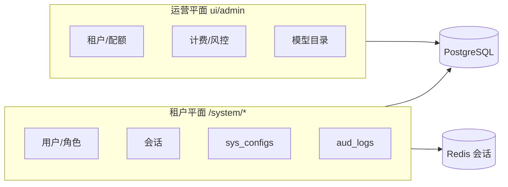
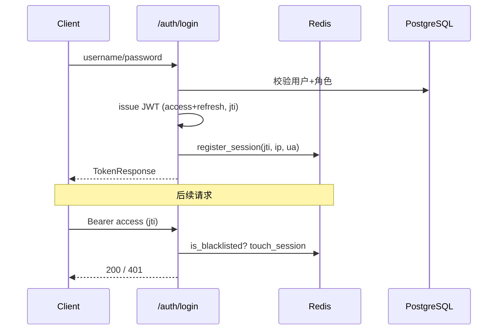

# 系统管理 — 技术方案

**状态：** 核心已实现；远期项见 §7  
**As-Is 规格：** [features/system-management.md](../features/system-management.md)（已实现基线）  
**关联：** [technical-design.md §5](./technical-design.md#5-多租户与权限)、[admin-ops.md](../features/admin-ops.md)、[prd.md §模块1](../product/prd.md#模块1系统管理)

---

## 1. 定位与边界

系统管理拆成**两个平面**，职责不重叠：

| 平面 | 入口 | API | 操作者 | 职责 |
|------|------|-----|--------|------|
| **租户系统管理** | `ui/workbench` `/system/*` | `/api/v1` | 租户管理员 | 本租户用户、RBAC、业务配置、审计、会话 |
| **平台运营** | `ui/admin` | `/api/admin/v1` | 平台管理员 | 租户生命周期、计费、风控、模型目录、全局分类 |



### 1.1 设计原则

- 租户数据一律带 `tenant_id`；Service 层 `tenant_filters` + `assert_tenant_access`（见 `backend/packages/miles-core/src/miles_core/tenant.py`）。
- 基础设施（PG / Redis / MinIO / 向量库 / Celery）为**部署级** `.env`，不进租户 UI 写库（见 [technical-design §6.5](./technical-design.md#65-存储与向量化配置策略)）。
- 租户可配的是**业务参数**（分片大小、平台名等）；**配额仅可查看用量与上限**，不可在租户后台修改（改配额仅在运营 `ui/admin`）。

---

## 2. 现状（As-Is）

### 2.1 已实现能力

| 子模块 | 后端 | 前端 | 状态 |
|--------|------|------|------|
| 认证 | `tenant/auth` JWT + refresh | `/login` | ✅ |
| 用户 CRUD | `system/views/users.py` | `/system/users` | ✅ |
| 角色权限 | `system/views/roles.py` | `/system/roles` | ✅ |
| 租户 CRUD | `system/views/tenants.py` | 超管 API（无独立租户页） | ✅ API |
| 业务配置 | `sys_configs` + `CONFIG_DEFINITIONS` | `/system/config` | ✅ |
| 审计 | `audit_log` | `/system/audit` | ✅ |
| 多设备会话 | Redis `session_store` | `/system/sessions` + 用户页强制登出 | ✅ |
| 运营后台 | `admin/*` | `ui/admin/*` | ✅ |

### 2.2 核心数据模型

| 表 / 存储 | 说明 |
|-----------|------|
| `sys_tenants` | 配额 `max_*`、用量 `*_used_*`、`plan_id`、`status` |
| `sys_users` | `tenant_id`、`is_superuser`、软删除 |
| `sys_roles` | `tenant_id` 可空（全局角色 vs 租户角色） |
| `sys_permissions` | 权限码，如 `system:user:read` |
| `role_permissions` / `user_roles` | M:N 关联 |
| `sys_configs` | 平台业务键值 JSONB |
| `aud_logs` | 租户操作审计 |

**会话（Redis，无 PG 表）**

```
auth:sessions:{user_id}           → Set<jti>
auth:session:{user_id}:{jti}      → { ip, user_agent, created_at, last_seen_at }
auth:blacklist:{jti}              → 登出/撤销
```

实现：`backend/packages/miles-core/src/miles_core/auth/session_store.py`。

### 2.3 PRD 差距

来源：[prd.md §模块1](../product/prd.md#模块1系统管理)、[backlog.md](../product/backlog.md)。

| 项 | 优先级 | 说明 |
|----|--------|------|
| 批量用户操作 | ✅ | `POST /users/batch` 启用/禁用/赋角色 |
| 管理员重置密码 | ✅ | `POST /users/{id}/reset-password` |
| 登录日志 | ✅ | 登录写审计 `auth.login`（无独立 `login_logs` 表） |
| 配额 hard limit | ✅ | KB / Agent / 存储创建路径已拦截（`tenant/*/services/quota.py`） |
| 菜单权限细粒度 | P2 | 前端靠 `permissions` 隐式过滤，无 `menu:*` 码 |
| 多角色继承 | P2 | 用户多角色并集，无 `parent_role_id` |
| 基础设施配置 UI | ✅ P2 | `GET /system/infra/status` 只读 + 监控面板 |
| Redis 缓存管理 | ✅ P2 | `GET /system/infra/redis-info` 只读；按前缀清理按需 |
| 审计 / 日志导出 | ❌ | 产品确认不立项；保留 `GET /audit/logs` 查询 |

---

## 3. 目标架构

### 3.1 后端分层

```
views (HTTP + require_permissions)
  ↓
services (TenantContext、业务规则、审计写入)
  ↓
repositories (分页、ORM)
  ↓
models / infra (PG、Redis)
```

域包（保持现状并扩展）：

```
backend/packages/miles-portal/src/miles_portal/tenant/
├── auth/           # 登录、会话、令牌
├── system/         # 用户、角色、租户、配置
└── audit_log/      # 审计查询 + 写入 helper
```

### 3.2 权限模型

**Permission code 约定**：`<domain>:<resource>:<action>`

```
system:user:read | system:user:write
system:tenant:read | system:tenant:write   # 超管 / 平台场景
system:config:read | system:config:write
audit:read
```

**权限**：角色 API 使用 `system:role:read/write`。

**前端门禁（三层）**

1. **路由级**：`useRequireAuth` + 403 处理
2. **导航级**：`SYSTEM_NAV` 按 permission 过滤（待增强）
3. **按钮级**：写操作检查 `system:*:write`

### 3.3 认证与会话



| 能力 | 方案 |
|------|------|
| 登录日志 | `aud_logs` 标准化 `action=auth.login`，或新增 `sys_login_logs` |
| 管理员重置密码 | `POST /users/{id}/reset-password` |
| 管理员查看他人会话 | 已有 `GET /users/{id}/sessions` |
| 会话 TTL 可配 | `sys_configs` 键 `auth.session_ttl_hours` → `session_store` |

---

## 4. 子模块详细设计

### 4.1 用户管理

**API（现状 + 扩展）**

```
GET    /users                          # 分页列表
POST   /users                          # 创建
PATCH  /users/{id}                     # 更新 email/phone/roles/is_active
DELETE /users/{id}                     # 软删 + username 后缀
GET    /users/{id}/sessions            # 管理员查看会话 ✅
DELETE /users/{id}/sessions            # 管理员强制全端登出 ✅
POST   /users/batch                    # 批量禁用/赋角色（P1）
POST   /users/{id}/reset-password      # 管理员重置（P1）
```

**业务规则**

- 非超管：`resolve_tenant_id` 限制只能操作本租户用户。
- 不能禁用 / 删除当前登录用户。
- 禁用 / 删除时调用 `admin_revoke_user_sessions`。
- 写操作写审计：`user.create` / `user.update` / `user.deactivate`。

**前端**（`ui/workbench/app/system/users/page.tsx`）

- 已有：分页列表、创建/编辑弹窗、删除、强制登出。
- P1：批量勾选、重置密码、查看会话 Drawer。

### 4.2 角色与权限（RBAC）

**API**

```
GET  /roles/permissions     # 按 module 分组树
GET  /roles/assignable      # 当前用户可分配角色
CRUD /roles                 # tenant_id scoped
```

**种子权限扩展**

```python
("system:role:read", "查看角色", "system"),
("system:role:write", "管理角色", "system"),
("system:session:read", "查看会话", "system"),
("system:session:write", "管理会话", "system"),
```

**远期可选**：`sys_roles.parent_role_id` 角色继承。

**前端**（`/system/roles`）

- 权限树 Checkbox（按 module 折叠）。
- `is_system=true` 内置角色不可删。
- 防止移除自己唯一超管角色（防锁死）。

### 4.3 租户与配额

**产品约定（冻结）**：租户工作台 **只读查看** 本租户配额与用量；**不提供** 修改 `max_*` 的 UI 或 API。配额上调、套餐变更一律在 **运营后台** `ui/admin/tenants` 完成。

**职责划分**

| 操作 | 租户 `/system` | 运营 `ui/admin` |
|------|----------------|-----------------|
| 创建 / 删除租户 | ❌ | ✅ 主入口 |
| **查看**配额与用量 | ✅ 只读 | ✅ 全平台 |
| **修改**配额上限 | ❌ | ✅ `/tenants/[id]`、套餐绑定 |
| 创建时 enforcement | ✅ 超限拒绝（后端拦截） | — |

**租户侧只读 API（P1 新增）**

```
GET /system/quota          # 本租户汇总：KB/存储/Agent/Flow/Token/生成日次数
```

- 权限：`system:config:read` 或专用 `system:quota:read`（二选一，种子择一）。
- 响应字段：`used_*` + `max_*` + 可选 `percent`；**不含** PATCH/PUT。
- 知识库细分仍可用已有 `GET /kb/quota`；`/system/quota` 为租户管理员一站式总览。

**禁止路径（租户 API）**

- 不在租户 `/system` 暴露 `PATCH /tenants/{id}` 的 `max_*` 字段；若保留超管租户 API，Service 层应拒绝非运营上下文写入配额字段。

**配额 enforcement（P1，后端）**

统一 `QuotaService`（创建/上传/调用时校验，与 UI 只读无关）：

```python
class QuotaService:
    async def assert_can_create_kb(tenant_id: UUID) -> None: ...
    async def assert_storage_mb(tenant_id: UUID, delta_mb: int) -> None: ...
    async def assert_tokens_monthly(tenant_id: UUID, delta: int) -> None: ...
    async def assert_can_create_agent(tenant_id: UUID) -> None: ...
    async def assert_can_create_flow(tenant_id: UUID) -> None: ...
```

**挂载点**：KB 创建、附件上传、Agent / Flow 创建。  
**用量更新**：入库完成、`agt_model_usage_logs` 写入时累加 `storage_used_mb` / `tokens_used_month`。

**前端**（`/system/quota`，P1）

- 进度条 / 数字卡片：已用 / 上限，无编辑控件。
- 文案引导：「如需提升配额，请联系平台管理员」。
- 不在 `/system/config` 混入配额编辑项。

### 4.4 系统配置

**三层配置**

| 层级 | 存储 | 示例 | UI |
|------|------|------|-----|
| L1 部署 | `.env` / K8s Secret | `POSTGRES_HOST`, `MILVUS_URI` | 只读脱敏（已有 runtime preview） |
| L2 平台业务 | `sys_configs` | `rag.default_chunk_size` | 可编辑 ✅ |
| L3 租户 | 未来 `tenant_configs` | 租户级覆盖 | 远期 |

**`CONFIG_DEFINITIONS` 扩展方向**

| 键 | 类别 |
|----|------|
| `auth.access_token_ttl_minutes` | 认证 |
| `auth.max_sessions_per_user` | 认证 |
| `security.password_min_length` | 安全 |
| `audit.retention_days` | 审计 |

**基础设施 UI（P2，只读 + 探测）**

```
GET  /system/infra/status              # 聚合 health_checks
POST /system/infra/test-connection     # 仅超管；测试 PG/Redis/MinIO/Vector，不写配置
```

### 4.5 审计与日志

**`aud_logs` 字段**

| 字段 | 用途 |
|------|------|
| `action` | 如 `kb.document.upload`、`user.create` |
| `resource_type` / `resource_id` | 资源定位 |
| `detail` JSONB | 变更 diff、请求摘要 |

**action 命名规范**

```
{domain}.{resource}.{verb}

auth.login | auth.logout
user.create | user.update | user.deactivate
role.create | config.update
```

**写入点**：Service 层成功提交后 `AuditService.record()`，避免散落在 views。

**导出：** 不立项；审计仅分页在线查询（见 [system-management.md](../features/system-management.md)）。

### 4.6 会话管理

**已有 API**

```
GET    /auth/sessions
DELETE /auth/sessions/{jti}
POST   /auth/sessions/revoke-others
GET    /users/{id}/sessions
DELETE /users/{id}/sessions
```

**前端**（`/system/sessions`）

- 表格：设备 / UA、IP、登录时间、最后活跃、是否当前会话。
- 操作：撤销单条 / 撤销其他设备。

**P1 增强**：UA 解析为「Chrome / macOS」展示。

---

## 5. 前端信息架构

```
/system
├── users          # 用户管理
├── roles          # 角色权限
├── sessions       # 我的会话
├── quota          # 资源配额（只读，P1）
├── config         # 业务配置 + 组件健康
└── audit          # 审计日志
```

壳层：`SystemShell` + `SystemSidebar`（`ui/workbench/lib/nav-config.ts` → `SYSTEM_NAV`）。

**导航 permission 绑定（目标）**

```typescript
const SYSTEM_NAV = [
  { href: "/system/users", permission: "system:user:read" },
  { href: "/system/roles", permission: "system:role:read" },
  { href: "/system/sessions", permission: "system:session:read" },
  { href: "/system/quota", permission: "system:quota:read" }, // 或 system:config:read
  { href: "/system/config", permission: "system:config:read" },
  { href: "/system/audit", permission: "audit:read" },
];
```

组件复用：`ResourceDialog`、`PageHeader`、`usePagedList`、审计筛选与 `/system/audit` 一致。

---

## 6. 安全设计

| 项 | 方案 |
|----|------|
| 密码 | bcrypt；重置生成随机密或管理员指定（P1） |
| JWT | access 短 TTL + refresh；jti 黑名单 |
| 越权 | 所有写路径 `assert_tenant_access` |
| 审计 | 系统管理写操作 100% 记 `aud_logs` |
| 敏感配置 | UI 仅脱敏 preview；Secret 不进 PG |
| 登录限流 | `POST /auth/login` Redis 滑动窗口（P1，可复用运营风控思路） |

---

## 7. 待实现

| 项 | 说明 |
|----|------|
| Redis 缓存前缀清理（超管） | 现仅只读 `GET /system/infra/redis-info`；有运维场景再立项 |
| 角色继承 / `menu:*` 权限码 | 现为多角色权限并集，前端靠 `permissions` 过滤 |
| 租户级 `tenant_configs` | 现仅平台级 `sys_configs` |
| Celery / 向量库专日志页 | 现经基础设施面板观测 |
| 审计 / 日志导出 | 产品确认不立项；保留 `GET /audit/logs` 在线查询 |

---

## 8. 测试策略

| 场景 | 验证 |
|------|------|
| RBAC | 无 `system:user:write` → `POST /users` 403 |
| 租户隔离 | 租户 A 管理员访问租户 B `user_id` → 403/404 |
| 会话 | 撤销 jti 后原 token 401 |
| 审计 | 创建用户后 `aud_logs` 可查 |
| 配额 | 超 `max_knowledge_bases` 创建 KB → 400 |
| 超管 | `system:tenant:*` 仅超管或专属角色 |

---

## 9. 关键决策摘要

1. **不在租户 UI 改基础设施连接** — 与 [technical-design §6.5](./technical-design.md#65-存储与向量化配置策略) 一致；P2 只做探测与只读。
2. **租户管理主入口在运营后台** — 租户 `/system` 聚焦本租户用户与配置；**配额仅查看，修改仅在 `ui/admin`**。
3. **会话放 Redis 不放 PG** — 现实现合理；登录日志可 PG 持久化。
4. **权限码细化为 role/session** — 便于导航与按钮级控制。
5. **配额从「字段存在」到「创建拦截」** — 创建路径强制校验。

---

## 10. 参考文件

| 类型 | 路径 |
|------|------|
| 租户认证 | `backend/packages/miles-portal/src/miles_portal/tenant/auth/` |
| 系统域 | `backend/packages/miles-portal/src/miles_portal/tenant/system/` |
| 审计 | `backend/packages/miles-portal/src/miles_portal/tenant/audit_log/` |
| 租户上下文 | `backend/packages/miles-core/src/miles_core/tenant.py`、`backend/packages/miles-core/src/miles_core/deps.py` |
| 权限种子 | `backend/packages/miles-server/src/miles_server/scripts/seed/tenant.py` |
| 前端导航 | `ui/workbench/lib/nav-config.ts` |
| 前端页面 | `ui/workbench/app/system/` |
