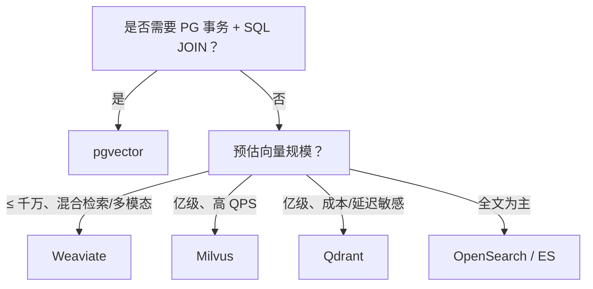

# 向量数据库选型报告

> 对比维度：定位、架构能力、规模、事务、检索、运维与成本。  
> 与本项目关系：默认 **Weaviate**（`VECTOR_STORE_BACKEND=weaviate`），可选 **Milvus**（`milvus`）；**pgvector** 仍预留。详见 [technical-design.md §6.3](./technical-design.md#63-向量存储)。

---

## 1. 总览对比表

| 对比维度 | pgvector | Weaviate | Milvus | Qdrant | OpenSearch | Elasticsearch (ES) |
|----------|-----------|----------|--------|--------|------------|----------------------|
| **定位** | PostgreSQL 向量扩展（关系 + 向量） | AI 原生：向量 + 轻图 + 内置 Embedding | 分布式专用向量库 | Rust 编写高性能向量引擎 | 全文检索引擎 + 向量插件 | 全文检索为主、向量为扩展 |
| **开发语言** | C（PG 扩展） | Go + Python | Go + C++ | Rust | Java | Java |
| **分布式** | ❌ 无原生分片（PG 主从） | ✅ 分布式（可选） | ✅ 原生分布式（分片 / 副本） | ✅ 分布式、分片、水平扩展 | ✅ 分布式集群 | ✅ 分布式集群 |
| **规模上限** | ≤500 万最佳 | 千万级平稳 | 亿～十亿级 | 亿级稳定、内存效率高 | 千万级为主 | 千万级，亿级需深度调优 |
| **事务 ACID** | ✅ 完全支持 | ❌ 弱事务 | ❌ 不支持 | ❌ 不支持 | ❌ 不支持 | ❌ 不支持 |
| **检索强项** | 纯向量 + 与业务表 JOIN | 混合检索（向量 + 关键词）、多模态、语义图 | 高吞吐、低延迟纯向量、GPU 加速 | 极致性能 + 复杂过滤、实时索引 | 全文 + 向量融合、日志 / 指标场景 | 全文检索最强、DSL 生态成熟 |
| **索引支持** | HNSW、IVFFlat | HNSW、IVF、PQ/BQ 压缩 | HNSW、IVF、DiskANN、CAGRA (GPU) | HNSW（优化版）、IVF、多种量化 | HNSW、ANN | HNSW、ANN |
| **多模态** | 较弱 | 优秀（图文音统一检索） | 良好 | 中等（文本为主、图像可用） | 一般 | 良好 |
| **并发 / 延迟** | 中等（受 PG 连接池限制） | 中高 | 顶尖（万级 QPS） | 顶尖（Rust + SIMD，低延迟） | 中高 | 高 |
| **开发接口** | 标准 SQL | GraphQL + REST | gRPC + REST + 多语言 SDK | REST + gRPC、多语言 SDK | REST API | REST API |
| **运维复杂度** | ⭐ 极低（复用 PG） | ⭐⭐ 中等 | ⭐⭐⭐ 偏高（组件多） | ⭐⭐ 中等（单进程简单、集群成熟） | ⭐⭐⭐ 中高 | ⭐⭐⭐ 中高 |
| **中文生态** | 完善 | 一般 | 完善（国内主导） | 一般（文档英文为主） | 完善 | 非常完善 |
| **核心优势** | 零新运维、强事务、SQL 融合 | 混合检索强、内置 Embedding、语义关联 | 超大容量、GPU 加速、企业级分布式 | Rust 高性能、内存省、实时索引、过滤强 | 检索均衡、日志 / 业务通用 | 全文检索王者、插件生态丰富 |
| **核心短板** | 规模上限低、无分布式 | 大规模向量速度不及 Milvus/Qdrant | 无事务、部署重、资源开销大 | 生态较新、多模态不如 Weaviate | 向量性能弱于专用库 | 向量大规模性价比偏低 |
| **典型场景** | 中小型 RAG、需事务 / JOIN、低运维 | 多模态问答、知识图谱、精准混合召回 | 海量知识库、推荐、广告、高吞吐检索 | 高性能 RAG、推荐、实时检索、成本敏感 | 日志 + 向量分析、站内综合搜索 | 文档检索、日志分析、常规 RAG |
| **自托管成本** | 免费（PG 已有） | 免费（BSD） | 免费（Apache 2） | 免费（Apache 2） | 免费（Apache 2） | 免费（SSPL） |
| **云托管起订价** | AWS RDS：约 $30/月起 | Weaviate Cloud：约 $45/月起 | Zilliz Cloud：约 $65/月起 | Qdrant Cloud：约 $9/月起 | OpenSearch 托管：约 $50/月起 | Elastic Cloud：约 $95/月起 |
| **千万级向量月成本（估算）** | ¥3k–5k（PG 优化） | ¥6k–8k | ¥8k–12k（含 GPU） | ¥4k–6k（性价比最高） | ¥7k–10k | ¥9k–15k |

> **说明**：规模与成本为行业经验区间，实际取决于维度、副本数、QPS、硬件与云厂商报价，部署前需压测验证。

---

## 2. 与本项目的选型结论

| 阶段 | 建议 | 理由 |
|------|------|------|
| **当前（默认）** | Weaviate | AI 原生、混合检索；`WeaviateVectorStore` |
| **海量 / 高 QPS** | Milvus | `MilvusVectorStore` 已实现；`VECTOR_STORE_BACKEND=milvus`；随 `docker-compose.infra.yml` 启动 |
| **低运维 / 强事务** | pgvector | 与 PostgreSQL 同库，适合中小规模 RAG、需向量与业务表 JOIN；规模受 PG 上限约束 |
| **成本敏感 / 极致延迟** | Qdrant | Rust 引擎、过滤与实时索引表现好；多模态能力弱于 Weaviate |
| **已有 ES/OpenSearch 栈** | 复用集群向量能力 | 适合「全文为主 + 向量辅助」；纯向量大规模性价比一般 |

**明确不做（除非单独立项）**：同一部署实例内按租户混用多种向量引擎（见 technical-design §6.5.4）。

---

## 3. 选型决策树（简图）

---

## 4. 修订记录

| 日期 | 说明 |
|------|------|
| 2026-05-22 | 初版：六方对比表 + 与本项目默认栈的对照 |
