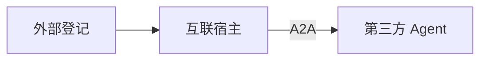

# A2A 外部互联

> 类型：智能体 | 状态：已实现（登记/引用/宿主 ✅；对外暴露 Card + `message/send` + `message/stream` 真流式 + `contextId` 多轮 + `tasks/*` + 产物下载 ✅）  
> **功能规格：** [features/a2a-interconnect.md](../features/a2a-interconnect.md)  
> 协议：[A2A Protocol v0.3.0](https://a2a-protocol.org/v0.3.0/specification/) | 关联：[platform-agents.md](./platform-agents.md)

**A2A** = 跨厂商 Agent Card + 标准消息调用。**不等于** `agt_sub_agent_bindings` 内部协同。

## 外部登记 vs 互联宿主

| | 外部登记 `agt_a2a_peers` | 互联宿主 `agent_type=a2a` |
|--|--------------------------|---------------------------|
| 作用 | 登记 URL、同步 Card、维护目录 | 绑定 Peer，统一对话入口 |
| 类比 | 通讯录 | 总机转接 |
| 前置 | 须 **已连通** 方可被引用或绑定 | 依赖已登记 Peer |



**智能体 Tab**（`custom`）可在本地 RAG/内部协同后 **引用** 外部 Peer；**互联宿主** 以调用外部为主。

| 场景 | 建议 |
|------|------|
| 单智能体偶尔问外部 | custom + `agt_agent_a2a_peer_refs` |
| 多外部协同中枢 | `agent_type=a2a` 宿主 |

## 平台内引用外部（custom）

- 表：`agt_agent_a2a_peer_refs`（`peer_id`、`trigger_keywords`、`role_hint`）
- 与 `agt_sub_agent_bindings` **分表**
- 策略（`config.a2a_invoke_policy`，默认 `rules_then_plan`）：
  1. 先本智能体 RAG/内部协同
  2. 规则命中 `trigger_keywords` → 强制调该 Peer
  3. 否则规划层选 Peer（`plan_only` / `rules_only`）
  4. `invoke_a2a_peer` 后由主模型汇总
- `max_a2a_calls_per_turn` 默认 2；Peer 须登记且 `active`

## 数据模型

```text
agt_a2a_peers          # 登记与 Card 缓存
agt_a2a_peer_bindings  # 宿主 → peer
agt_agent_a2a_peer_refs # custom → peer
```

`a2a` 宿主：禁止主路径使用 `sub_agents` / `kb_ids` / `published_flow_id`。

## 运行时

宿主对话：`run_a2a_host_chat` → A2A Client → 外部 Agent；`steps` 含 `type=a2a_peer`。

custom 有 peer_refs：在 RAG/协同/流程结果上 `augment_response_with_a2a`。

模块：`backend/packages/miles-portal/src/miles_portal/tenant/a2a/`（`card_client.py` 拉 Card、`client.py` 调用、`invoke.py` 编排、`server.py` + `services/server.py` 对外暴露）。

## UI

- **A2A 互联 Tab → 外部登记**：登记、探测、同步 Card；`auth_config` 支持 `headers`（任意头）、`api_key`（→ `X-API-Key`）、`bearer_token`（→ `Authorization: Bearer`），同步 Card 与调用 `message/send` 时自动携带
- **A2A 互联 Tab → 互联宿主**：创建/编辑 `agent_type=a2a`
- **智能体 Tab**：可选引用外部 A2A（表单第 4 步）

## API

```
GET/POST   /api/v1/a2a/peers
POST       /api/v1/a2a/peers/probe
POST       /api/v1/a2a/peers/{id}/sync-card
GET        /api/v1/agents?agent_type=a2a
POST       /api/v1/agents/{id}/chat    # 宿主或 custom 增强

# 对外暴露（本平台作 Server）
GET  /api/v1/open/a2a/agents/{agent_id}/.well-known/agent-card.json   # 公开
POST /api/v1/open/a2a/agents/{agent_id}                               # JSON-RPC，X-API-Key
GET  /api/v1/open/a2a/agents/{agent_id}/tasks/{task_id}/artifacts/{attachment_id}   # 任务产物，X-API-Key
GET  /.well-known/agent-card.json                                     # 全平台唯一发布时 307
```

## 对外暴露（本平台作 Server）

指定 `custom` 智能体对外发布后，外部 A2A 客户端可拉取 Card 并调用。

- 开关：智能体 `config.a2a_publish = true`（必须同时 `agent_type=custom` 且 `status=enabled`）。该开关管的是 **Card 可见性**：未发布时 Card GET 回 404（与「不存在」不可区分）；**根别名不按某个智能体判可见性**，而是只看候选集合 —— `resolve_default_published_agent_id` 的过滤条件里就有 `config.a2a_publish`，只有 `a2a_publish=true` 的智能体才入候选，恰一个才 307、否则 404（见下）。调用端点也不按它回 404 —— `message/send` / `message/stream` / `tasks/resubscribe` 在各自的前置校验里回 **HTTP 200 + `-32602`**，而 `tasks/get` / `tasks/cancel` 根本不经发布门槛（只校验任务归属）
- Card：`GET /api/v1/open/a2a/agents/{agent_id}/.well-known/agent-card.json`（**公开**，A2A 发现元数据）
- 调用：`POST /api/v1/open/a2a/agents/{agent_id}`（JSON-RPC 2.0，**须带该智能体的 `X-API-Key`**）；支持的方法见下
- 根别名：`GET /.well-known/agent-card.json` → 307 到按智能体路径；**仅当全平台唯一发布**时启用，命中 0 或 >1 返回 404（多租户根路径无法区分租户，不猜）

JSON-RPC 方法：

| 方法 | 行为 |
|------|------|
| `message/send` | 同步对话。无异步任务时回 `Message`；产生生成任务（生图/生视频）时回 `Task`（`id` 即平台 job id） |
| `message/stream` | 流式对话（响应 `Content-Type: text/event-stream`）。首帧 `Task(working)`，中间帧 `status-update` 携增量文本，末帧 `status-update` 带 `final=true` 与完整回答 |
| `tasks/get` | `params.id` 查生成任务状态，映射为 A2A `TaskState`；成功时附 `Task.artifacts`（产物下载地址） |
| `tasks/cancel` | 取消未结束的生成任务；已结束回 `-32002`（Task not cancelable），不属于该智能体回 `-32001`（Task not found） |
| `tasks/resubscribe` | 续播未结束生成任务的进度（SSE）。首帧 `Task`、其后只在状态/进度变化时发 `status-update`，空闲发保活注释帧，终态前补 `artifact-update`。`params.id` 必须是真的生成任务 id |

`tasks/pushNotificationConfig/*` 未实现，回 `-32601`（不静默成功）。

任务归属：`tasks/get` / `tasks/cancel` / `tasks/resubscribe` / 产物下载都校验「该任务由本智能体发起」（job 的 `source_ref_type=agent` + `source_ref_id=agent_id`），不属于则回 `-32001` / 404 而非 403 —— 不向对端确认任务是否存在。「不属于」含两种情形，对端**无从区分**：同租户另一个智能体的任务（`-32001`），以及**其他租户**的任务（同样 `-32001`，不因越租户而改成 403）。若只按租户校验，同租户另一个智能体的 key 就能查/取消本智能体任务并猜到其产物地址。产物下载是普通 HTTP 端点（非 JSON-RPC），同一语义以 **404 状态码**表达；这四种调用无论成败都会在审计流水留痕（请求体无法解析、被限流这两类前置失败除外）。

**产物下载：** `Task.artifacts[].parts[].file.uri` 指向 `GET /api/v1/open/a2a/agents/{agent_id}/tasks/{task_id}/artifacts/{attachment_id}`，**需带同一 `X-API-Key`**（平台刻意不暴露对象存储签名 URL）。授权精确到「该智能体 · 该任务 · 该产物」，非该任务产物一律 404，否则本租户任意附件都能被取走。非该任务产物、**跨租户的附件**、附件尚未就绪、以及存储读取故障都回 404/400/500 并**各留一条流水**。

真正「**同码同文案**、对端不可区分」的是**跨租户附件**与**本任务产物里已缺失的附件**：两者都回 404、信封 `message` 同为「附件不存在」（前者由 `services/server.py` 的跨租户分支归一，后者来自 `attachments/services/attachment.py` 的「附件行缺失或已删」）。而「**非该任务产物**」是另一种 404 —— 它的 `message` 是「附件不是该任务的产物」。它并不因此构成租户 oracle：判据只是「该 id 在不在本任务的产物列表里」，随手编一个 id 得到的是**同一个** 404 与同一句文案，对端同样读不出该编号是否存在。

生成任务状态 → A2A `TaskState`：`pending→submitted`、`running→working`、`success→completed`、`failed→failed`、`cancelled→canceled`；未知状态回保留值 `unknown`（而非 `completed` —— 谎称就绪会让对端停止轮询）。

Card 的 `url` 即调用端点（同时以 0.3 形状在 `additionalInterfaces[{url, transport}]` 里列出，满足规范 §5.6.4 的完整性要求）；`url` 由请求的 scheme://host 推导，多环境无需新增配置项。绑定技能包会映射为 Card `skills`（无绑定时智能体自身为一个 skill）。

反向（把外部对端登记为 Peer）时，客户端认两种接口数组形状：0.3 的 `additionalInterfaces[{url, transport}]` 与 v1.0 的 `supportedInterfaces[{url, protocolBinding, protocolVersion}]`，并都以其中的 `url` 为端点。

Card 声明的 `protocolVersion` 为 **0.3**：本平台产出的方法名（`message/*`、`tasks/*`）与线格式（`kind` 判别字段、小写 `TaskState`）都是 v0.3 形状。声明 1.0 会让对端按 PascalCase 方法名调用并撞 `-32601`。Card 的 `capabilities.streaming=true`。

Card 同时声明 `securitySchemes`（`apiKey` · `in: header` · `name: X-API-Key`）与 `security`，标准 A2A 客户端据此发现调用所需凭证，无需先撞一次 401。**Card 本身仍公开**（A2A 发现约定），声明的是调用端点的鉴权要求；头名取自 `miles_common.constants.AGENT_API_KEY_HEADER`，与实际鉴权（`require_agent_api_key`）同源，避免声明与实现漂移。

**多轮上下文：** 请求 `message.contextId` → `ChatRequest.conversation_id`（作 LangGraph `thread_id` 后缀），响应 `Message.contextId` 原样回显，对端据此把后续消息接回同一会话。未带时服务端生成一个并回显（否则对端拿不到可复用的上下文标识）；超长（> `ChatRequest.conversation_id` 上限）回 `-32602` 而非撞下游校验变 500。

**流式语义（`message/stream`）：** 每帧是完整 JSON-RPC 成功信封，`result` 依次是 `Task` → `status-update`（`final=false`，`status.message.parts[].text` 为本片增量）→ `status-update`（`final=true`，`status.message` 带完整回答，便于对端从丢帧中补全）。`final=true` 只表示本流结束，**不等于**任务终态。

流式任务的 `taskId` 是合成的、不落库：`final=true` 已给出终态，之后无需再 `tasks/get`（拿该 id 去查会回 `-32001`）。本轮若产生异步生成任务，末帧以 `working` + `final=true` 收尾，并在 `status.message.metadata.a2aJobTaskId` 给出**真实 job id** —— 对端据此转向 `tasks/get` 轮询状态与产物。

**订阅语义（`tasks/resubscribe`）：** 用于对端断连后接回未结束的生成任务。`params.id` 只接受
真的生成任务 id（`message/stream` 的合成 `taskId` 不落库，拿它来订阅回 `-32001`）。

帧序列：首帧 `Task`（即当前快照）→ 状态或进度变化时的 `status-update`（`final=false`，
进度文字在 `status.message.parts[].text`、百分比在 `status.message.metadata.percent`）→
任务转入终态时先逐条 `artifact-update`、再一帧 `final=true` 收流。订阅时任务**已**终态则产物
直接挂在首帧上，不发 `artifact-update`。

- **空闲即保活**：没有新状态时下发的也是 `status-update` 之外的 SSE 注释帧 `: ping`，约每 2 秒一次。
- **不回填断连期间的事件**：只发订阅之后的新事件；首帧快照足以让对端对齐当前进度（规范把「是否回填」留给实现自定）。
- **安全上限 30 分钟**：逾期仍未终态则以任务当前**真实状态** + `final=true` 收流（规范要求流在 interrupted/terminal 结束，此处是有意偏离）—— 对端可据此再订阅一次。
- **`contextId` 可能缺失**：规范把 `TaskStatusUpdateEvent.contextId` 标为必填，本平台沿用 `Task.contextId` 的既有口径（解析不到就省略，不塞空串冒充标识），故对端必须容忍无该字段的帧。
- **审计**：`detail.endedBy` 为 `terminal` / `safety-cap` / `disconnect` / `failed`；`detail.taskState` 为收流时的 A2A 状态（任务被取消时是 `canceled`，此时 `outcome` 仍是 `ok` —— `canceled` 这一 outcome 专指对端断连）。

**对端消费方式（重要）：** 中间帧的 `status.message` 是**增量**（每帧 `messageId` 都不同，不做聚合去重），用于逐字渲染；末帧 `status.message` 是**完整回答**，用于纠偏 —— 别把末帧全文再当一条新消息追加，否则回答会渲染两遍。`rejected` / `failed` 终态帧只带原因、不带已产出部分：此时应**保留**先前增量已渲染的部分回答，把错误原因另起一行展示（不要用原因替换掉它）。

逐 token 与否取决于路由：`direct_llm` / `rag` 逐片下发，`tool_agent` / `flow` / 子智能体 / `a2a_augmented` 等尚未接 `on_delta` 的路由只在末帧一次性给完整回答（对端渲染方式一致，差别只在是否逐字到达）。

**保活：** 等待增量超过 15 秒时会插入一个 SSE 注释帧 `: ping`（不带 `data:`，标准客户端解析器一律忽略）。一次性路由在末帧前可能几分钟不产出任何字节，没有心跳的话对端与中间代理会按 idle 超时掐断连接。

前置校验失败（未发布 / `parts` 无文本 / 缺 `params` / `contextId` 超长）**不进入 SSE**，仍以普通 JSON + JSON-RPC 错误信封返回 —— 流一旦开始，错误只能塞进帧里，对端解析更麻烦。

合规拦截以 `rejected` 收尾（拒绝处理该任务），其余执行异常以 `failed` 收尾。与工作台 WS 一致：token 先出网、出站合规事后扫，命中拦截时已出网内容不可追回。

反向登记：把本平台发布的智能体登记为外部 Peer 时，在 `auth_config.api_key` 填入该智能体的 X-API-Key，客户端会在 Card 同步与 `message/send` 时自动携带。

前端入口：智能体表单「工具与能力」→ 勾选「对外发布为 A2A Server」；详情对话框展示已发布状态与 Card 地址。

### 错误与信封

调用端点的**协议级错误**（解析 / 方法 / 参数）回 **HTTP 200 + JSON-RPC 信封**（`{"jsonrpc":"2.0","id":…,"error":{"code":…,"message":…}}`），
对端据此把错误对回自己的 `id`。但**并非所有响应都是这个形状**，对端必须两种都吃下：IP 维度限流
（平台中间件，先于本端点执行）回**平台信封** 429（`{code,message,data,trace_id}`，无 `id`、无 `Retry-After`）；
鉴权失败（`require_agent_api_key`：缺 / 无效 Key → 401，Key 与目标智能体不匹配 → 403）同样是平台信封，
响应里根本没有 `id` 可对。按 Key 维度的限流虽也是 429，正文仍是 JSON-RPC 信封（见下文「限流」）。

| `error.code` | 含义 | 触发 |
|---|---|---|
| `-32700` | 解析错误 | 请求体不是合法 JSON |
| `-32600` | 非法请求 | 请求体是合法 JSON 但不是对象，或缺 `method` |
| `-32601` | 方法未找到 | 未实现的方法（如 `tasks/pushNotificationConfig/*`） |
| `-32602` | 参数错误 | `message/send` 域的业务异常（含合规拦截、配额/权限拒绝）；状态码 400 或非 `tasks/*` 域的 401/403/404；非法 `params.id`、超长 `contextId`、未发布智能体 |
| `-32603` | 内部错误 | 状态码既非 400/401/403/404 的业务异常（含 409 冲突与 5xx）；`message/send` 的未预期故障（见下） |
| `-32000` | 限流 | 超限；HTTP 429 + `Retry-After` |
| `-32001` | 任务不存在 | 不属于该智能体的任务（含**其他租户**的任务）、`tasks/*` 域的 401/403/404 |
| `-32002` | 任务不可取消 | 任务已结束 |

`message/stream` / `tasks/resubscribe` 一旦开流，**流内**业务失败就不产 `error.code` ——
信号是终态帧的 `status.state`（合规拦截 `rejected`、其余执行异常 `failed`）。上表的错误码
只覆盖它们**开流前**的前置校验失败。

**权限与冲突会被压平**：业务异常的状态码不进入 `error.code` —— 只有 `tasks/*` 域的
401/403/404 被单独压成 `-32001`（不确认任务是否存在，含跨租户）；其余一律 `-32602`
（状态码 400，或非 `tasks/*` 域的 401/403/404）或 `-32603`（409 与 5xx），对端读不出真实原因。
这是为了不给出探测资源存在性的 oracle。原因记在租户审计的 `errorType` / `errorStatus`。

**未预期故障不是「一律 500」**，按方法分三种口径：

- **`tasks/get` / `tasks/cancel`（RPC 路径）与产物下载**：非 `AppError` 故障（DB / Redis 等）回
  **HTTP 500 平台信封** `{code,message,data,trace_id}`，不保证 JSON-RPC 形状 —— 对端须能按 HTTP
  状态码兜底处理这一类。
- **`message/send`**：因历史原因，其 `except Exception` 仍把 **`run_published_agent_chat` 抛出的**
  非 `AppError` 吞成 **HTTP 200 + `-32603`**。这是本批未改的**旧口径**，属已知的不一致，不是
  「设计如此」。该 `try` 只包住这一次调用：前置（如 `load_published_agent` 的 `db.get` 抛 SQLAlchemy
  异常）与信封组装阶段的非 `AppError` 不在其中，会逸出到 `handle_a2a_rpc` 后仍重抛 → 500 平台信封。
- **`message/stream` 与 `tasks/resubscribe`**：流开始后的故障不开错误信封，以 **`failed` 终态帧**
  收流（`message/stream` 的合规拦截为 `rejected`）；流内没有 `error.code` 可读。`tasks/resubscribe`
  流内的非预期异常由 `services/subscription.py` 吞下，回一帧 `failed` 终态 + 一条 `failed` 审计，
  同样**不是 500**。

> 注意别把 `AppError` 当未预期故障：上表里由业务异常映射出的码（`-32602` / `-32603` /
> `-32001` / `-32002`）都来自 `AppError`。例如对象存储读取失败被包成
> `AppError(status_code=500)`，走 RPC 路径时按状态码译为 `-32603`，而不是 500 平台信封。

## 限流

调用端点按 **API Key** 限流（维度 = 单个对端集成；轮换 Key 即换桶）。阈值来自运营后台
「安全合规 → 风控中心 → 限流配置」里 `scope = api_key` 的规则，路径模式按端点路径匹配（如
`/api/v1/open/a2a/*`）。

超限返回 **HTTP 429**：

```
Retry-After: 12
```

```json
{"jsonrpc": "2.0", "id": "9", "error": {"code": -32000, "message": "请求过于频繁，请稍后再试", "data": {"kind": "rate_limit", "retryAfterSeconds": 12}}}
```

- `-32000` 落在 A2A 规范留给实现自定义的服务端错误区间（`-32000..-32099`）。
- 产物下载端点同为 429 + `Retry-After`，但正文是平台信封 `{code,message,data,trace_id}`（它是普通
  HTTP 下载、不是 JSON-RPC；`trace_id` 用于把对端回报的 429 对回服务端日志）。
- `message/stream` 的超限在**开流之前**判出，故回普通 JSON 而非 SSE 帧 —— 对端按状态码
  处理即可，不必解析半条流。
- 命中会记一条平台风控事件（`a2a_rate_limit`，含 `apiKeyId`）。

上面这些是**按 Key 维度**（`scope = api_key`）的规则。平台中间件的 **IP 维度**规则（含存量
默认的 `/api/v1/*` 全局限流，`scope = ip`）**仍独立生效**，且先于本端点执行：对端撞上它时
拿到的是平台信封 429（`{code,message,data,trace_id}`，**无** `Retry-After`、无 JSON-RPC 错误码），
形状与上面的 JSON-RPC 429 不同 —— 客户端的重试与解析要能同时吃下两种。

## 审计

每次调用在租户审计流水（`aud_logs`）留一条，可在工作台「系统设置 → 审计日志」按动作筛选。
窄窗例外：若对端在 `message/stream` **首帧发出前**就断连（生成器体从未进入），该次调用
**零流水** —— 既有边界，非本批引入。

| 动作 | 触发 |
|---|---|
| `a2a.message.send` | `message/send` |
| `a2a.message.stream` | `message/stream`：终态、对端断连、或前置校验失败（`failed`，不开流）各记一次 |
| `a2a.tasks.get` | `tasks/get` |
| `a2a.tasks.cancel` | `tasks/cancel` |
| `a2a.tasks.resubscribe` | `tasks/resubscribe`：终态收流、30 分钟上限、对端断连、前置校验失败各记一次 |
| `a2a.artifact.download` | 产物下载 |

记录内容为「谁（`apiKeyId`）在何时以何结果（`outcome`：`ok` / `rejected` / `failed` /
`canceled`）调用了哪个智能体的哪个方法」，**不含消息正文**。被限流拒绝的请求只记风控事件、
不记审计流水。

当某次调用的业务异常由 RPC 层兜底译码时，`detail` 会额外带 `errorType`（异常类名）与
`errorStatus`（HTTP 状态码）。产物下载的失败留痕（`_audit_artifact_failure`）同理，但**只在
拿得到原始异常时才写**这两键（跨租户 `ForbiddenError`、其它 `AppError`）；`NotFoundError`
「不是该任务的产物」与存储故障两档不写，只有 `errorCode`
—— 对外错误码被压平后，这是租户可见面上唯一能读出真实原因的出口。同样**只记类型与状态码，
不记 message**。

同一个合规拦截在两个方法上的 `outcome` 并不一致：`message/send` 侧记为 `failed`、
`message/stream` 侧记为 `rejected`。差异来自两个方法各自的判据 —— send 按最终信封**有无
`error`** 判定，stream 按**终态帧状态**判定 —— 与错误码无关。本次真正变的只是 send 侧的
错误码：合规拦截不再被宽 `except` 误标为 `-32603`（内部错误），现为 `-32602`（参数错误）；
stream 侧本就无可谈的错误码，它走的是 `rejected` 终态帧。

## 待做

- `tasks/pushNotificationConfig/*`（现回方法未找到）
- 多模态入站：`parts` 的 `file` / `data` 类型（现仅取 `text`）
- A2A v1.0 迁移：PascalCase 方法名、去 `kind` 换成员名包装、`TASK_STATE_*` 取值
