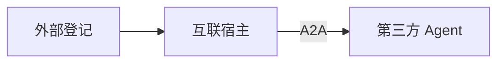

# A2A 外部互联

> 类型：智能体 | 状态：已实现（登记/引用/宿主 ✅；对外暴露 Card + `message/send` + `message/stream` 真流式 + `contextId` 多轮 + `tasks/*` + 产物下载 ✅）  
> **功能规格：** [features/a2a-interconnect.md](../features/a2a-interconnect.md)  
> 协议：[A2A Protocol v0.3.0](https://a2a-protocol.org/v0.3.0/specification/) | 关联：[platform-agents.md](./platform-agents.md)

**A2A** = 跨厂商 Agent Card + 标准消息调用。**不等于** `agt_sub_agent_bindings` 内部协同。

## 外部登记 vs 互联宿主

| | 外部登记 `agt_a2a_peers` | 互联宿主 `agent_type=a2a` |
|--|--------------------------|---------------------------|
| 作用 | 登记 URL、同步 Card、维护目录 | 绑定 Peer，统一对话入口 |
| 类比 | 通讯录 | 总机转接 |
| 前置 | 须 **已连通** 方可被引用或绑定 | 依赖已登记 Peer |



**智能体 Tab**（`custom`）可在本地 RAG/内部协同后 **引用** 外部 Peer；**互联宿主** 以调用外部为主。

| 场景 | 建议 |
|------|------|
| 单智能体偶尔问外部 | custom + `agt_agent_a2a_peer_refs` |
| 多外部协同中枢 | `agent_type=a2a` 宿主 |

## 平台内引用外部（custom）

- 表：`agt_agent_a2a_peer_refs`（`peer_id`、`trigger_keywords`、`role_hint`）
- 与 `agt_sub_agent_bindings` **分表**
- 策略（`config.a2a_invoke_policy`，默认 `rules_then_plan`）：
  1. 先本智能体 RAG/内部协同
  2. 规则命中 `trigger_keywords` → 强制调该 Peer
  3. 否则规划层选 Peer（`plan_only` / `rules_only`）
  4. `invoke_a2a_peer` 后由主模型汇总
- `max_a2a_calls_per_turn` 默认 2；Peer 须登记且 `active`

## 数据模型

```text
agt_a2a_peers          # 登记与 Card 缓存
agt_a2a_peer_bindings  # 宿主 → peer
agt_agent_a2a_peer_refs # custom → peer
```

`a2a` 宿主：禁止主路径使用 `sub_agents` / `kb_ids` / `published_flow_id`。

## 运行时

宿主对话：`run_a2a_host_chat` → A2A Client → 外部 Agent；`steps` 含 `type=a2a_peer`。

custom 有 peer_refs：在 RAG/协同/流程结果上 `augment_response_with_a2a`。

模块：`backend/packages/miles-portal/src/miles_portal/tenant/a2a/`（`card_client.py` 拉 Card、`client.py` 调用、`invoke.py` 编排、`server.py` + `services/server.py` 对外暴露）。

## UI

- **A2A 互联 Tab → 外部登记**：登记、探测、同步 Card；`auth_config` 支持 `headers`（任意头）、`api_key`（→ `X-API-Key`）、`bearer_token`（→ `Authorization: Bearer`），同步 Card 与调用 `message/send` 时自动携带
- **A2A 互联 Tab → 互联宿主**：创建/编辑 `agent_type=a2a`
- **智能体 Tab**：可选引用外部 A2A（表单第 4 步）

## API

```
GET/POST   /api/v1/a2a/peers
POST       /api/v1/a2a/peers/probe
POST       /api/v1/a2a/peers/{id}/sync-card
GET        /api/v1/agents?agent_type=a2a
POST       /api/v1/agents/{id}/chat    # 宿主或 custom 增强

# 对外暴露（本平台作 Server）
GET  /api/v1/open/a2a/agents/{agent_id}/.well-known/agent-card.json   # 公开
POST /api/v1/open/a2a/agents/{agent_id}                               # JSON-RPC，X-API-Key
GET  /api/v1/open/a2a/agents/{agent_id}/tasks/{task_id}/artifacts/{attachment_id}   # 任务产物，X-API-Key
GET  /.well-known/agent-card.json                                     # 全平台唯一发布时 307
```

## 对外暴露（本平台作 Server）

指定 `custom` 智能体对外发布后，外部 A2A 客户端可拉取 Card 并调用。

- 开关：智能体 `config.a2a_publish = true`（必须同时 `agent_type=custom` 且 `status=enabled`；否则一律 404）
- Card：`GET /api/v1/open/a2a/agents/{agent_id}/.well-known/agent-card.json`（**公开**，A2A 发现元数据）
- 调用：`POST /api/v1/open/a2a/agents/{agent_id}`（JSON-RPC 2.0，**须带该智能体的 `X-API-Key`**）；支持的方法见下
- 根别名：`GET /.well-known/agent-card.json` → 307 到按智能体路径；**仅当全平台唯一发布**时启用，命中 0 或 >1 返回 404（多租户根路径无法区分租户，不猜）

JSON-RPC 方法：

| 方法 | 行为 |
|------|------|
| `message/send` | 同步对话。无异步任务时回 `Message`；产生生成任务（生图/生视频）时回 `Task`（`id` 即平台 job id） |
| `message/stream` | 流式对话（响应 `Content-Type: text/event-stream`）。首帧 `Task(working)`，中间帧 `status-update` 携增量文本，末帧 `status-update` 带 `final=true` 与完整回答 |
| `tasks/get` | `params.id` 查生成任务状态，映射为 A2A `TaskState`；成功时附 `Task.artifacts`（产物下载地址） |
| `tasks/cancel` | 取消未结束的生成任务；已结束回 `-32002`（Task not cancelable），不属于该智能体回 `-32001`（Task not found） |

`tasks/resubscribe`、`tasks/pushNotificationConfig/*` 未实现，一律回 `-32601`（不静默成功）。

任务归属：`tasks/get` / `tasks/cancel` / 产物下载都校验「该任务由本智能体发起」（job 的 `source_ref_type=agent` + `source_ref_id=agent_id`），不属于则回 404 / `-32001` 而非 403 —— 不向对端确认任务是否存在。若只按租户校验，同租户另一个智能体的 key 就能查/取消本智能体任务并猜到其产物地址。

**产物下载：** `Task.artifacts[].parts[].file.uri` 指向 `GET /api/v1/open/a2a/agents/{agent_id}/tasks/{task_id}/artifacts/{attachment_id}`，**需带同一 `X-API-Key`**（平台刻意不暴露对象存储签名 URL）。授权精确到「该智能体 · 该任务 · 该产物」，非该任务产物一律 404，否则本租户任意附件都能被取走。

生成任务状态 → A2A `TaskState`：`pending→submitted`、`running→working`、`success→completed`、`failed→failed`、`cancelled→canceled`；未知状态回保留值 `unknown`（而非 `completed` —— 谎称就绪会让对端停止轮询）。

Card 的 `supportedInterfaces[].url` 即调用端点；`url` 由请求的 scheme://host 推导，多环境无需新增配置项。绑定技能包会映射为 Card `skills`（无绑定时智能体自身为一个 skill）。

Card 声明的 `protocolVersion` 为 **0.3**：本平台产出的方法名（`message/*`、`tasks/*`）与线格式（`kind` 判别字段、小写 `TaskState`）都是 v0.3 形状。声明 1.0 会让对端按 PascalCase 方法名调用并撞 `-32601`。Card 的 `capabilities.streaming=true`。

Card 同时声明 `securitySchemes`（`apiKey` · `in: header` · `name: X-API-Key`）与 `security`，标准 A2A 客户端据此发现调用所需凭证，无需先撞一次 401。**Card 本身仍公开**（A2A 发现约定），声明的是调用端点的鉴权要求；头名取自 `miles_common.constants.AGENT_API_KEY_HEADER`，与实际鉴权（`require_agent_api_key`）同源，避免声明与实现漂移。

**多轮上下文：** 请求 `message.contextId` → `ChatRequest.conversation_id`（作 LangGraph `thread_id` 后缀），响应 `Message.contextId` 原样回显，对端据此把后续消息接回同一会话。未带时服务端生成一个并回显（否则对端拿不到可复用的上下文标识）；超长（> `ChatRequest.conversation_id` 上限）回 `-32602` 而非撞下游校验变 500。

**流式语义（`message/stream`）：** 每帧是完整 JSON-RPC 成功信封，`result` 依次是 `Task` → `status-update`（`final=false`，`status.message.parts[].text` 为本片增量）→ `status-update`（`final=true`，`status.message` 带完整回答，便于对端从丢帧中补全）。`final=true` 只表示本流结束，**不等于**任务终态。

流式任务的 `taskId` 是合成的、不落库：`final=true` 已给出终态，之后无需再 `tasks/get`（拿该 id 去查会回 `-32001`）。本轮若产生异步生成任务，末帧以 `working` + `final=true` 收尾，并在 `status.message.metadata.a2aJobTaskId` 给出**真实 job id** —— 对端据此转向 `tasks/get` 轮询状态与产物。

**对端消费方式（重要）：** 中间帧的 `status.message` 是**增量**（每帧 `messageId` 都不同，不做聚合去重），用于逐字渲染；末帧 `status.message` 是**完整回答**，用于纠偏 —— 别把末帧全文再当一条新消息追加，否则回答会渲染两遍。`rejected` / `failed` 终态帧只带原因、不带已产出部分：此时应**保留**先前增量已渲染的部分回答，把错误原因另起一行展示（不要用原因替换掉它）。

逐 token 与否取决于路由：`direct_llm` / `rag` 逐片下发，`tool_agent` / `flow` / 子智能体 / `a2a_augmented` 等尚未接 `on_delta` 的路由只在末帧一次性给完整回答（对端渲染方式一致，差别只在是否逐字到达）。

前置校验失败（未发布 / `parts` 无文本 / 缺 `params` / `contextId` 超长）**不进入 SSE**，仍以普通 JSON + JSON-RPC 错误信封返回 —— 流一旦开始，错误只能塞进帧里，对端解析更麻烦。

合规拦截以 `rejected` 收尾（拒绝处理该任务），其余执行异常以 `failed` 收尾。与工作台 WS 一致：token 先出网、出站合规事后扫，命中拦截时已出网内容不可追回。

反向登记：把本平台发布的智能体登记为外部 Peer 时，在 `auth_config.api_key` 填入该智能体的 X-API-Key，客户端会在 Card 同步与 `message/send` 时自动携带。

前端入口：智能体表单「工具与能力」→ 勾选「对外发布为 A2A Server」；详情对话框展示已发布状态与 Card 地址。

## 待做

- `tasks/resubscribe` 与 `tasks/pushNotificationConfig/*`（现回方法未找到）
- 多模态入站：`parts` 的 `file` / `data` 类型（现仅取 `text`）
- A2A 专用审计维度（现复用通用访问日志与限流中间件）
- Card 界面字段名 0.3 化：`supportedInterfaces` → `additionalInterfaces`、`protocolBinding` → `transport`
- A2A v1.0 迁移：PascalCase 方法名、去 `kind` 换成员名包装、`TASK_STATE_*` 取值
