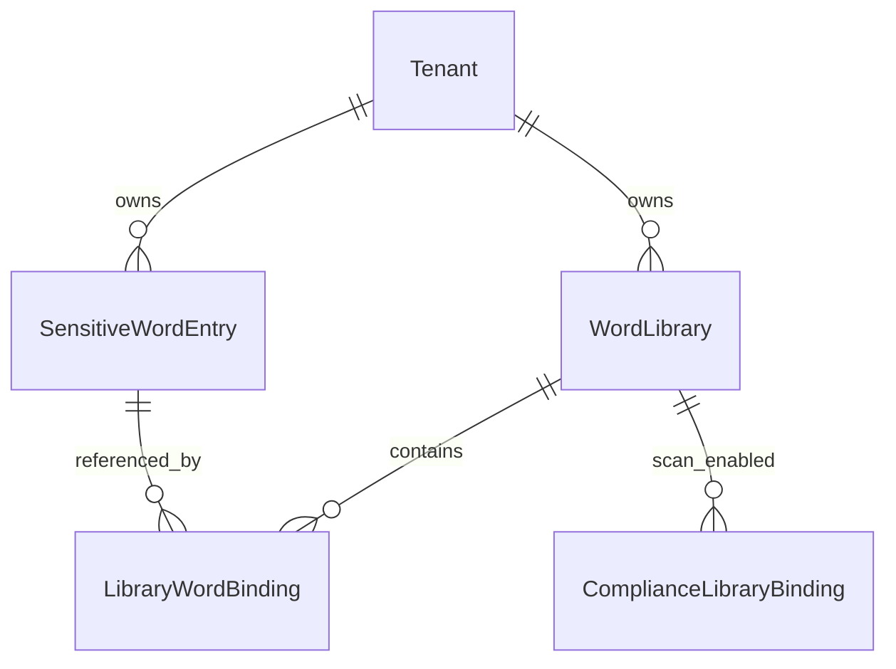

# 合规敏感词库（多库 + 扫描绑定）

> 类型：实现说明 | 状态：已实现 | 迁移：`003_compliance_word_libraries`  
> 关联：[technical-design.md](../architecture/technical-design.md) §11.1

## 1. 产品规则

| 规则 | 说明 |
|------|------|
| 一词多库 | 同一词面在租户内唯一（`cmp_sensitive_word_entries`），通过 `cmp_library_word_bindings` 关联多个词库；处置方式 **按库配置**。 |
| 未绑定不扫描 | 仅 `cmp_compliance_library_bindings`（`scope=tenant`）中勾选的、且 **词库启用** 的库参与检测；无绑定时 `CompliancePipeline` 不加载，对话/试跑均不命中。 |
| 默认词库迁移 | 自旧表 `cmp_sensitive_words` 迁入时每租户创建「默认词库」，并 **自动写入 tenant 扫描绑定**，升级后行为与原先「全租户扫描」一致。 |

合并规则：加载扫描词表时，同一词面若在不同库有不同 `action`，**BLOCK 优先于 WARN**（`word_resolve.merge_scan_words`）。

## 2. 数据模型

```text
cmp_word_libraries              词库
cmp_sensitive_word_entries    词条（tenant_id + word 唯一）
cmp_library_word_bindings     库 ↔ 词条（action, is_active）
cmp_compliance_library_bindings  租户扫描绑定（scope=tenant）
cmp_intercept_logs            拦截审计（不变）
```

### ER（逻辑）



## 3. 运行时扫描

入口：`ComplianceService.check_input` / `check_output` / `scan_text`。

```text
load_tenant_scan_words(tenant_id)
  → compliance_library_bindings (scope=tenant, not deleted)
  → word_libraries (is_active)
  → library_word_bindings + entries (binding/entry active)
  → merge_scan_words → CompliancePipeline.scan
```

无绑定或绑定库均无启用词条时，pipeline 为 `None`，直接放行。

## 4. HTTP API（`/api/v1/compliance`）

### 4.1 枚举元数据

`GET /compliance/meta`（无需资源 id，路由注册在 `/libraries/{id}` 之前）返回表单/列表用的枚举字典，与 `GET /hooks/meta` 同模式：

| 字段 | 说明 |
|------|------|
| `sensitive_actions` | 词条处置：`warn` / `block`（`value` + `label`） |

前端进入合规页时拉取一次，筛选项与词条标签均用 `optionLabel(meta.sensitive_actions, value)`，避免前后端枚举漂移。

### 4.2 业务接口

| 方法 | 路径 | 说明 |
|------|------|------|
| GET | `/meta` | 枚举元数据（见 §4.1） |
| GET | `/bindings` | 租户扫描绑定 + 全部词库列表 |
| PUT | `/bindings` | body: `{ "library_ids": [] }` |
| GET/POST | `/libraries` | 词库分页 / 创建 |
| GET/PATCH/DELETE | `/libraries/{id}` | 词库详情 / 更新 / 删除（软删库内 binding） |
| GET | `/libraries/{id}/words` | 库内词条（binding 视图） |
| POST | `/libraries/{id}/words` | 添加词条（get_or_create entry） |
| POST | `/libraries/{id}/words/batch` | 批量添加 |
| PATCH | `/libraries/{id}/words/{binding_id}` | 更新 action / is_active |
| DELETE | `/libraries/{id}/words/{binding_id}` | 移除库内关联 |
| GET | `/entries/{id}` | 词条详情（含所属库列表） |
| PUT | `/entries/{id}/libraries` | 设置词条所属库集合 |
| POST | `/scan` | 试跑；`scanning_enabled=false` 表示未绑定 |
| GET | `/logs` | 拦截日志 |

**已移除**（迁移 003 后）：`/compliance/words` 扁平 CRUD。

权限：`compliance:read` / `compliance:write`。

## 5. 前端

- 路径：`/workbench/compliance`
- 进入页：`api.getComplianceMeta()` → `ComplianceMeta.sensitive_actions` 驱动筛选与 `sensitiveActionLabel`
- Tab「敏感词库」：顶部 **参与扫描的词库** 多选 → 词库卡片列表 → `?library={id}` 进入库内词条管理
- 组件：`ComplianceScanBindingsPanel`、`WordLibraryDialog`、`ComplianceLibraryDetail`、`LibraryWordDialog`

## 6. 迁移与种子

- **Alembic**：`alembic/versions/003_compliance_word_libraries.py`
  - 建新表；从 `cmp_sensitive_words` 迁数据；删旧表
- **种子**：`scripts/seed/compliance.py` — 多词库示例（默认 / 广告法 / 客服外呼 / 观察名单）+ 一词多库演示 + tenant 绑定  
  - 命令：`cd backend && python cli.py seed compliance`

新环境：`alembic upgrade head` 后执行 `cli.py seed`（或等价种子流程）。

## 7. 后续扩展（未实现）

- `scope=agent`：按智能体绑定词库子集
- 词库版本 / 发布流
- AC 自动机或外置词库服务（大词量性能）
