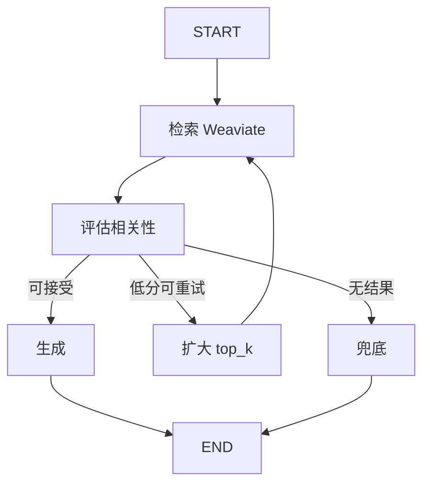

# 流程编排（flow_runtime + LangGraph）

> 类型：流程编排 | 状态：已实现 | 关联：[technical-design.md](../architecture/technical-design.md) §9  
> **编排增强（已实现）：** [flow-orchestration-enhancement.md](../architecture/flow-orchestration-enhancement.md)  
> **子流程 SubFlow（已立项 · 暂不实施）：** [flow-subflow-design.md](../architecture/flow-subflow-design.md)

画布 `graph_json` **仅由 LangGraph 编译执行**；`flow_runtime` 提供节点 handler，编译与执行在 `integrations.langgraph`。

## 命名与数据流

| 名称 | 路径 |
|------|------|
| flow_runtime | `backend/app/flow_runtime/` |
| LangGraph 编译/执行 | `backend/app/integrations/langgraph/` |
| 前端画布 | `@xyflow/react` |

```
React Flow → PUT /flows/{id}/graph → flow_versions
调试/智能体 → get_flow_runtime().run() → LangGraph → nodes/registry
```

## 节点与扩展

支持类型：`TextInput`、`ChatInput`、`KnowledgeSearch`、`RelevanceGrade`、`ConditionBranch`、`StaticResponse`、`ParallelJoin`、`PromptTemplate`、`LLMCall`、`PlatformTool`、`TextOutput`、`ChatOutput`。

`PlatformTool` 节点 `data.tool_slug` 调用平台工具（含 `skill_read_reference`、`skill_run_script`、`knowledge_search` 等）。智能体发布流程执行时注入 `agent_id` / `agent_config` / `kb_ids`；调试运行时使用当前租户用户权限。

扩展：在 `nodes/registry.py` 注册，并在 `frontend/lib/flow-nodes.ts` 增加调色板。

`POST /flows/{id}/compile` 预览编译结果；不可编译返回 `400` + `errors`。要求 **DAG**（无环）。

### 内置 RAG 画布模板

线性模板（无 `ConditionBranch`）：`TextInput → KnowledgeSearch → PromptTemplate → LLMCall → TextOutput`。

| 位置 | 说明 |
|------|------|
| 后端 JSON | [`flow_runtime/templates/rag_flow.json`](../backend/app/flow_runtime/templates/rag_flow.json) |
| 结构说明 | [`templates/README.md`](../backend/app/flow_runtime/templates/README.md) |
| 前端初始化 | `frontend/lib/flow-nodes.ts` → `RAG_TEMPLATE` |
| 市场种子 | `tenant.marketplace.util.load_rag_graph_template()` |

编译执行见 `integrations.langgraph.compiler`（`build_canvas_graph` / `run_compiled_canvas`），**不同于**下文 Agent LangGraph RAG 图。

### ConditionBranch（`data.mode`）

| mode | 说明 |
|------|------|
| `has_hits` | 检索 hits 非空 |
| `score_above` | 最高分 ≥ threshold（默认 0.35） |
| `text_contains` | 文本含 keyword |
| `not_empty` | 上游文本非空 |

出边 `sourceHandle`：`true` / `false`。

### ParallelJoin（`data.merge_strategy`）

`dict`（默认）| `concat_text` | `first`。多入边亦可扇入汇合。

### PlatformTool（`data.tool_slug`）

调用 `invoke_tool_with_context`（`invoke_source=flow`）。常用 slug：`knowledge_search`、`skill_read_reference`、`skill_run_script`、`http_request` 等。节点 `data` 字段与前端属性面板规划见 [flow-orchestration-enhancement.md](../architecture/flow-orchestration-enhancement.md) §4.3。

### RelevanceGrade（`data.relevance_threshold`）

复用 `integrations.langgraph.grading.evaluate_relevance`，输出 `relevance`: `good` | `poor` | `none`。  
出边 `sourceHandle` 须为 **good** / **poor** / **none**（编译校验三支齐全）。

| 字段 | 默认 | 说明 |
|------|------|------|
| `relevance_threshold` | 0.35 | 分数阈值 |
| `use_llm_grade` | false | LLM 复核（需 `model_config_id` 或运行上下文模型） |

### StaticResponse（`data.text`）

固定兜底文案，支持 `{{用户提问}}` / `{{query}}`。

### 内置模板 `rag_flow_with_grade.json`

`TextInput → KnowledgeSearch → RelevanceGrade` → good/poor → `PromptTemplate → LLMCall`；none → `StaticResponse` → `TextOutput`。  
加载：`load_rag_graph_template(variant="with_grade")`；前端 `RAG_TEMPLATE_WITH_GRADE`。

### 版本历史

- `GET /flows/{id}/versions` — 版本摘要列表（无 `graph_json`）
- `GET /flows/{id}/versions/{version}` — 指定版本完整画布
- 编辑页「版本历史」：只读预览 +「恢复此版本」（另存为新版本号）

### 子流程调用 SubFlow（未实现）

已立项，规格见 [flow-subflow-design.md](../architecture/flow-subflow-design.md)。当前请使用模板、版本恢复或复制画布实现复用。

## 枚举元数据

`GET /flows/meta`（注册在 `/flows/{id}` 之前）返回列表/筛选用的 `statuses`（`draft` / `published` 等 `value` + `label`），与 `GET /hooks/meta` 同模式。前端 `flows/page.tsx` 进入时 `api.getFlowMeta()`，状态标签用 `optionLabel(meta.statuses, status)`。

## 标签

与智能体/提示词等共用租户标签库（`TagEntityType.FLOW`）：

- 创建/更新：`POST|PATCH /flows` 传 `tag_ids`
- 列表筛选：`GET /flows?tag_ids=...`（任一匹配）
- 删除流程时自动清理绑定

前端列表页支持标签筛选、`TagChips` 展示，新建/基本信息弹窗内 `TagPicker`。

## 与智能体

| 场景 | 路径 |
|------|------|
| `published_flow_id` | LangGraph 画布 |
| 仅知识库 | LangGraph RAG 或 `legacy` 线性 RAG（见 [ai-stack.md](./ai-stack.md)） |
| 子智能体绑定 | DeepAgents（见 [platform-agents.md](./platform-agents.md)） |

## LangGraph RAG 对话

未绑流程、已绑知识库时，默认 `run_rag_workflow()`：



| `Agent.config` | 默认 | 说明 |
|----------------|------|------|
| `use_langgraph_rag` | true | 关闭则线性 `rag_answer` |
| `runtime_mode` | — | `legacy` 强制线性 RAG |
| `relevance_threshold` | 0.35 | 低分重试/兜底阈值 |
| `rag_max_retries` | 1 | 重试时 top_k 翻倍（上限 20） |
| `use_llm_grade` | false | LLM 复核相关性 |

模块：`integrations/langgraph/graphs/rag_qa.py`、`runner.py`。合规/钩子仍在 `AgentService.chat` 外层。

### Checkpoint

`conversation_id` → `thread_id = {tenant_id}:{agent_id}:{conversation_id}`。需 **Redis Stack 或 Redis 8+**，`LANGGRAPH_REDIS_DB=0`；否则回退 `MemorySaver`（重启不保留状态）。依赖：`langgraph-checkpoint-redis`（见 `backend/.env.example`）。

## 历史

- 已移除内置 DAG 执行器（`BuiltinFlowRuntime`）及第三方流程产品适配层
- 已移除 `flow_flows.external_flow_id`（原外部流程 ID 预留列）
