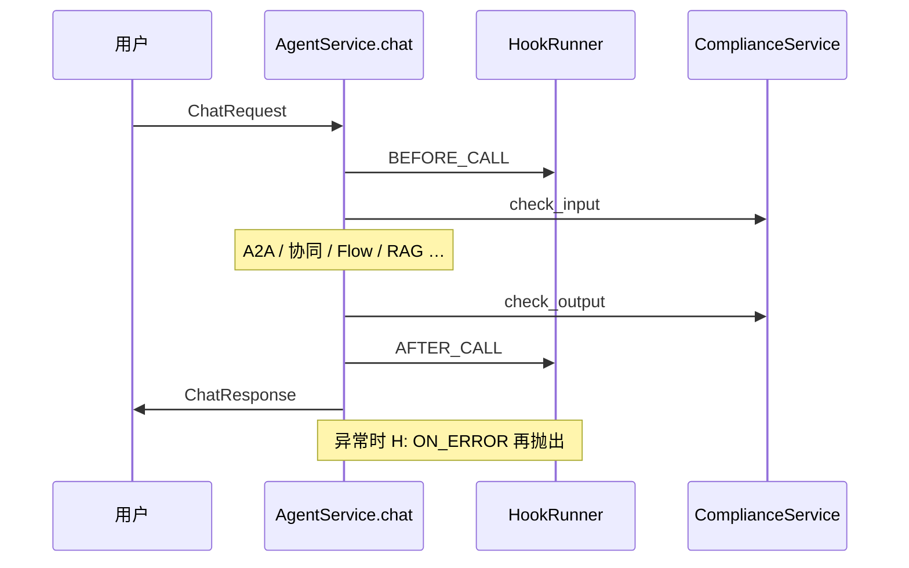

# 智能体钩子（Hook）

> 类型：设计 + 实现对照 | 状态：**P0/P1 已实现**（Event v1、执行日志、tool 钩子；见 §4）  
> 关联：[technical-design.md](../architecture/technical-design.md) §11.2

## 1. 产品定位

**钩子（Hook）** 是智能体执行流程中的 **切面扩展点**：在关键节点插入自定义逻辑，实现日志、鉴权、限流、审计或业务定制，**不修改主流程代码**。

与 **合规敏感词** 的分工：

| 能力 | 负责模块 | 特点 |
|------|----------|------|
| 对话入参/出参敏感词拦截 | `ComplianceService` | 平台内置、租户可配词库；命中即拦截或告警，属 **强约束** |
| 审计上报、外部 IAM、计费、自定义 enrich | `HookRunner` | 租户自管 HTTP（未来：内置类型 / Python 插件）；默认 **旁路**，失败不阻断主链路（现状） |

```text
用户请求
  → BEFORE_CALL（钩子）
  → 合规 check_input
  → … 推理 / 工具 / 流程 …
  → 合规 check_output
  → AFTER_CALL（钩子）
  → 响应

异常 → ON_ERROR（钩子）→ 原异常继续抛出
```

---

## 2. 核心概念

| 概念 | 说明 |
|------|------|
| **HookDefinition** | 钩子定义：名称、`hook_type`（`http` / `python`）、`config`（如 URL）、`is_active` |
| **HookBinding** | 挂载规则：在哪个 **时机（trigger）**、哪个 **作用域（scope）**、哪个 **目标（target_id）** 执行；`priority` 越小越先执行 |
| **HookRunner** | 运行时门面：`tenant/agents`、`tenant/flows` 等在业务路径调用 |
| **HookExecutor** | 按 binding 加载并 dispatch（当前仅 HTTP 真执行） |

一条钩子可配置 **多条 binding**（例如同一 Webhook 同时监听 `before_call` 与 `on_error`）。

---

## 3. 数据模型

```text
hook_definitions     钩子定义（tenant_id, name, hook_type, config JSONB）
hook_bindings        挂载（hook_id, scope, target_id?, trigger, priority, is_active）
```

### 3.1 钩子类型 `hook_type`

| 值 | 说明 | 状态 |
|----|------|------|
| `http` | 向 `config.url` 发 HTTP 请求，body 为 payload（见 §5 现状 / §6 目标契约） | **已实现** |
| `python` | 租户级 Python 扩展 | **未实现**（执行器记录 `python_not_implemented` 并跳过） |

### 3.2 挂载时机 `trigger`

| 值 | 含义 | 典型用途 |
|----|------|----------|
| `before_call` | 一次对话/流程 run 开始前 | 鉴权、限流、请求 enrich |
| `after_call` | 一次对话/流程 run 成功结束后 | 审计、计费、回写 CRM |
| `before_reasoning` | 本轮 **LLM 生成前**（见 §4.2 语义） | Prompt 检查、上下文脱敏 |
| `after_reasoning` | 本轮 **LLM 生成后** | Token 统计、回答采样 |
| `before_tool` | 单次工具调用前 | 工具级鉴权、参数校验 |
| `after_tool` | 单次工具调用后 | 工具审计、结果改写（需响应契约） |
| `on_error` | 主链路未捕获异常时 | 告警、工单 |

### 3.3 作用域 `scope`

| 值 | `target_id` | 匹配规则 |
|----|-------------|----------|
| `global` | 忽略 | 租户内该 trigger 下全部命中 |
| `agent` | 智能体 UUID | 与运行时 `HookScope.AGENT` + `agent_id` 一致 |
| `flow` | 流程 UUID | 与 `HookScope.FLOW` + `flow_id` 一致 |
| `tool` | 工具 UUID | 与 `HookScope.TOOL` + `tool_id` 一致（**执行点未接**） |
| `app` | 应用 UUID | 预留（市场安装应用级） |

匹配逻辑（`HookExecutor._load_bindings`）：

1. 仅 `trigger` 相同且 hook/binding 均 `is_active`、未软删  
2. `scope=global` 始终入选  
3. 否则 `binding.scope == 运行时 scope` 且 `target_id` 为空或与运行时 `target_id` 相等  
4. 按 `priority` 升序串行执行  

---

## 4. 运行时挂载点（实现对照）

### 4.1 对照表

| trigger | Agent `chat` | Agent `chat_as_child` | Flow `run` | Tool invoke | 备注 |
|---------|:------------:|:---------------------:|:----------:|:-------------:|------|
| `before_call` | ✅ | ❌ | ✅ | — | Agent：`HookScope.AGENT` |
| `after_call` | ✅ | ❌ | ✅ | — | 各分支成功返回前 |
| `before_reasoning` | ✅* | ✅* | ❌ | — | 仅直连 LLM / RAG 路径，见下 |
| `after_reasoning` | ✅* | ✅* | ❌ | — | `after` payload 含 `text` 前 500 字 |
| `before_tool` | ✅ | ✅ | ❌ | ✅ | `tools/invoke.invoke_tool_with_context` |
| `after_tool` | ✅ | ✅ | ❌ | ✅ | 同上（成功路径） |
| `on_error` | ✅ | ❌ | ✅ | — | `chat` / `flow.run` 的 `except` 中，之后 **re-raise** |

\* 未覆盖：A2A 宿主、子智能体规划、画布 flow run（在 `before_call`/`after_call` 层包裹，图内节点无独立 reasoning 钩子）、`enable_tool_calling` 的 tool agent 路径。

### 4.2 「推理」语义（产品定义）

在本版本中，**`before_reasoning` / `after_reasoning` 指：单次用户消息处理中，某条路径上「一次主要 LLM 调用」的前后**，而非每个 token、每个子 agent 或画布内每个 LLM 节点各触发一次。

- **直连对话**（无 KB）：一次 `ainvoke_chat` 前后各 1 次。  
- **RAG 路径**（LangGraph 或线性 `rag_answer`）：整段 RAG 生成 1 次前后。  
- **子智能体 / 多轮 tool calling**：当前 **不** 按子调用拆 reasoning 钩子（后续可扩展 `reasoning_id`）。

### 4.3 调用顺序（Agent `chat` 片段）



代码入口：`backend/app/tenant/agents/services/agent.py`、`backend/app/tenant/flows/services/flow.py`（`run`）。

### 4.4 业务 payload（位于 envelope.payload 内）

HTTP 请求体为 **Event v1 信封**（§6.1）；下列字段在 `payload` 对象中：

**Agent `before_call` / `after_call`**

```json
{
  "module": "agent_chat",
  "agent_id": "<uuid>",
  "query": "<用户输入>",
  "direction": "in | out",
  "text": "<仅 after_call，回答全文>"
}
```

**Agent `on_error`**

```json
{
  "module": "agent_chat",
  "agent_id": "<uuid>",
  "query": "<用户输入>",
  "error": "<异常字符串>"
}
```

**Agent `before_reasoning` / `after_reasoning`**

```json
{
  "module": "agent_chat",
  "agent_id": "<uuid>",
  "mode": "direct | rag",
  "query_preview": "<仅 rag before，前 200 字>",
  "text": "<仅 after，前 500 字>"
}
```

**Flow `before_call` / `after_call`**

```json
{
  "module": "flow_run",
  "flow_id": "<uuid>",
  "inputs": { },
  "direction": "in | out",
  "query": "<从 inputs 解析的文本，可选>",
  "output": "<仅 after_call>"
}
```

---

## 5. HTTP 钩子（现网行为）

`config` 示例：

```json
{
  "url": "https://example.com/hooks/agent",
  "method": "POST",
  "headers": { "Authorization": "Bearer …" },
  "timeout": 5,
  "on_failure": "ignore"
}
```

| 行为 | 说明 |
|------|------|
| 请求 | `method` 默认 `POST`；body = §6.1 Event v1 信封 |
| 成功 | HTTP 2xx；解析 JSON 响应 `action`（§6.2） |
| `on_failure` | `ignore`（默认）或 `fail_request`（仅 `before_*`，HTTP/网络失败时阻断） |
| 审计 | 每次调用写入 `hook_execution_logs` |

---

## 6. Hook Event 契约 v1（已实现）

### 6.1 请求 Envelope

```json
{
  "schema_version": "1",
  "event_id": "019e….",
  "occurred_at": "2026-05-26T12:00:00Z",
  "tenant_id": "…. ",
  "trace_id": "…. ",
  "trigger": "before_call",
  "scope": "agent",
  "target_id": "…. ",
  "hook": {
    "id": "…. ",
    "name": "audit-log"
  },
  "payload": {
    "module": "agent_chat",
    "agent_id": "…. ",
    "query": "…. "
  }
}
```

| 字段 | 必填 | 说明 |
|------|------|------|
| `schema_version` | 是 | 固定 `"1"`，演进时递增 |
| `event_id` | 是 | UUID7，供幂等与审计 |
| `trace_id` | 推荐 | 与平台请求追踪一致 |
| `trigger` / `scope` / `target_id` | 是 | 与 binding 一致 |
| `payload` | 是 | 业务载荷；字段按 `module` 文档化 |

**敏感字段**：`query`、完整 `text` 是否外发由租户在 hook 配置中声明 `payload_policy`（后续）；默认文档建议最小化外发。

### 6.2 响应（可选，仅 `before_*` 建议支持）

```json
{
  "schema_version": "1",
  "action": "continue",
  "modify": {}
}
```

| `action` | 行为 |
|----------|------|
| `continue` | 默认，继续主链路 |
| `block` | 中止请求，返回可配置错误码/文案（仅 `before_call` / `before_reasoning` / `before_tool`） |
| `modify` | 仅允许白名单键合并进上下文（如 `query`、`headers`） |

### 6.3 执行策略

| 策略 | 选项 | 说明 |
|------|------|------|
| `on_failure` | `ignore`（默认） / `fail_request` | 仅 `before_*` 可 fail |
| `timeout_sec` | 数字 | 默认 5；`after_*` 可更长 |
| `concurrency` | `serial`（默认） / `parallel` | 只读类钩子可并行 |

### 6.4 后续路线图

| 阶段 | 内容 |
|------|------|
| **P2** | 内置 hook 类型（`audit`、`rate_limit`）；出站 URL 白名单 + HMAC 签名 |
| **P3** | `before_retrieval` / `after_retrieval`；流式 chunk 钩子；画布节点级 reasoning |

---

## 7. 数据与迁移

- 表：`hook_definitions`、`hook_bindings`、`hook_execution_logs`
- 迁移：`alembic/versions/004_hook_execution_logs.py`

## 8. HTTP API（`/api/v1/hooks`）

| 方法 | 路径 | 说明 |
|------|------|------|
| GET | `/hooks/meta` | 枚举字典：`triggers` / `scopes` / `on_failure_options`（`value`+`label`+`hint`，trigger 含 `implemented`） |
| GET | `/hooks/executions?hook_id=` | 执行日志分页 |
| GET | `/hooks` | 钩子定义分页 |
| POST | `/hooks` | 创建定义 + **默认一条 binding**（body 含 `trigger`/`scope`/`target_id`/`priority`） |
| PATCH | `/hooks/{hook_id}` | 更新名称、`config`、`is_active` |
| DELETE | `/hooks/{hook_id}` | 软删定义及关联 binding |
| GET | `/hooks/{hook_id}/bindings` | 列出绑定 |
| POST | `/hooks/{hook_id}/bindings` | 新增绑定 |
| DELETE | `/hooks/bindings/{binding_id}` | 删除绑定 |

权限：`hook:read` / `hook:write`。

---

## 9. 前端

- 路径：`/workbench/hooks`
- 能力：HTTP 钩子 CRUD、`on_failure`、绑定规则、最近执行记录
- 枚举展示：进入页面前请求 `GET /hooks/meta`，下拉与列表标签均用后端字典（与 `/models/meta` 同模式）；文案维护在 `app/tenant/hooks/meta.py`

### 9.1 `schema_version`：Hook Event 与 `GET */meta`（勿混用）

平台里有两套独立的 `schema_version`，**数值同为 `"1"` 时不代表可合并演进**：

| 用途 | 常量 / 字段 | 代码位置 | 出现在 | 演进规则 |
|------|-------------|----------|--------|----------|
| **Hook HTTP 信封** | `SCHEMA_VERSION` | `tenant/hooks/events.py` | §6.1 请求、`§6.2` 响应 JSON | 变更 envelope 字段、action/modify 语义时递增；`parse_hook_response` 仅接受当前版本 |
| **枚举字典 API** | `META_SCHEMA_VERSION` | `common/schemas/enum_meta.py` | 各 `GET /{module}/meta` 响应体 | 增删改 `EnumOption` 列表字段时递增；前端可据此失效 meta 缓存 |

```text
Hook 出站 POST body          GET /hooks/meta 响应
  schema_version: "1"    ≠     schema_version: "1"
  (Event v1 契约)              (UI 下拉文案契约)
```

**与合规 `payload.module` 的关系**：Event `payload.module` 为业务场景字符串（如 `agent_chat`、`flow_run`），真源在 `tenant/compliance/constants.py`，与上述两种 `schema_version` 均无对应关系。合规扫描模块展示见 `GET /compliance/meta` → `scan_modules`。

**后端约定**（详见 [backend/README.md](../../backend/README.md) 模块约定、[layering.md](../architecture/layering.md) §5.4 单文件与子包）：

- 持久化枚举真源：`models.Enum` 或域内 `constants.py`
- 展示文案：`tenant/*/meta.py` 的 `*_meta_dict()`，统一带 `"schema_version": META_SCHEMA_VERSION`
- 单测：`tests/test_domain_meta.py` 参数化校验各域 meta 均含 `schema_version`

### 9.2 `ModelConfig.extra` 键名

embedding / rerank 的 `invoke_mode` 与 `extra` 字段对照见 **[model-config-extra.md](./model-config-extra.md)**（`EXTRA_INVOKE_MODE` 等在 `common/constants/model_extra.py` 与 `integrations/*/constants.py`）。

**全站 `/meta` 约定**（`app/common/schemas/enum_meta.EnumOption`）：

| 模块 | 路径 | 维护位置 |
|------|------|----------|
| 模型 | `GET /models/meta` | `model_catalog` |
| 钩子 | `GET /hooks/meta` | `tenant/hooks/meta.py` |
| 合规 | `GET /compliance/meta` | `tenant/compliance/meta.py` |
| 流程 | `GET /flows/meta` | `tenant/flows/meta.py` |
| 知识库 | `GET /kb/meta` | `tenant/kb/meta.py` |
| 工具 | `GET /tools/meta` | `tenant/tools/meta.py` |
| 智能体 | `GET /agents/meta` | `tenant/agents/meta.py` |
| 提示词 | `GET /prompt-templates/meta` | `tenant/prompts/meta.py` |
| 应用市场 | `GET /marketplace/meta` | `tenant/marketplace/meta.py` |
| MCP | `GET /mcp/meta` | `tenant/mcp/meta.py` |
| 附件 | `GET /attachments/meta` | `tenant/attachments/meta.py` |
| 技能包 | `GET /skill-packages/meta` | `tenant/skills/meta.py` |
| A2A | `GET /a2a/peers/meta` | `tenant/a2a/meta.py` |
| 监控 | `GET /monitor/meta` | `tenant/monitor/meta.py` |
| 任务 | `GET /tasks/meta` | `tenant/tasks/meta.py` |
| 分类 | `GET /categories/meta` | `tenant/categories/meta.py` |
| 标签 | `GET /tags/meta` | `tenant/tags/meta.py` |
| 审计 | `GET /audit/meta` | `tenant/audit_log/meta.py` |

前端统一类型 `EnumOption`（`lib/enum-meta.ts`）与 `optionLabel()`；纯 UI Tab（如合规「拦截日志」、智能体列表「全部/智能体/A2A」、市场「广场/安装/上架」、监控「概览/趋势/健康/告警」主视图、各资源页「全部」分类 Tab）可保留在前端。

**代码注释约定**（与 `tenant/hooks/meta.py` 对齐）：

| 层级 | 位置 | 内容 |
|------|------|------|
| 文案源 | `backend/app/tenant/<module>/meta.py` | 模块 docstring：API 路径、返回字段、前端消费文件、`docs/guides/hooks.md` §9 |
| 构建 | `*_meta_dict()` | 「供 *MetaOut.model_validate 与单测使用」 |
| 服务 | `Service.get_meta()` | 「无 DB，文案来自 meta.py」 |
| 路由 | `views` 的 `@router.get("/meta")` | 须在 `/{id}` 等路径参数路由**之前**注册 |
| 契约 | `schemas/meta.py` | 模块路径 + `*MetaOut` 类说明 |
| 前端类型 | `lib/types.ts` 各 `*Meta` | `/** GET /…/meta */` |
| 前端展示 | `lib/*-labels.ts` | 优先 meta、本地 fallback、`optionLabel` |
| 前端请求 | `hooks/use-*-meta.ts` | 拉取 meta；`enabled=false` 时不请求 |

---

## 10. 推荐场景与反模式

| 推荐 | 反模式 |
|------|--------|
| `after_call` 异步审计、推送 SIEM | 在钩子里做敏感词拦截（应用合规模块） |
| `global` + `before_call` 统一 API Key 校验 | 钩子内长时间同步 LLM 二次调用拖垮延迟 |
| `agent` scope 绑定单智能体定制 enrich | 依赖钩子返回值静默改答案（需等 §6.2） |
| `on_error` 告警 | 在 `on_error` 中再抛未捕获异常 |

---

## 11. 代码入口

| 模块 | 路径 |
|------|------|
| ORM | `app/tenant/hooks/models.py` |
| CRUD | `app/tenant/hooks/services/hook.py` |
| 执行 | `app/tenant/hooks/services/executor.py` |
| 门面 | `app/tenant/hooks/services/runner.py` |
| API | `app/tenant/hooks/views/hooks.py` |
| Agent 挂载 | `app/tenant/agents/services/agent.py` |
| Flow 挂载 | `app/tenant/flows/services/flow.py` |

---

## 12. 变更记录

| 日期 | 说明 |
|------|------|
| 2026-05-26 | 初版：产品边界、挂载对照表、Event v1 目标契约 |
| 2026-05-26 | P0/P1：Event v1 执行、block/modify、`hook_execution_logs`、tool 钩子、Flow on_error |
| 2026-05-26 | §9.1：`schema_version` 双轨说明；§9.2 链至 model-config-extra |
