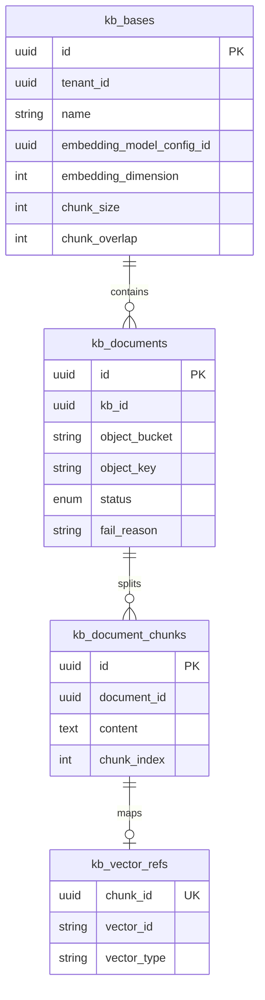
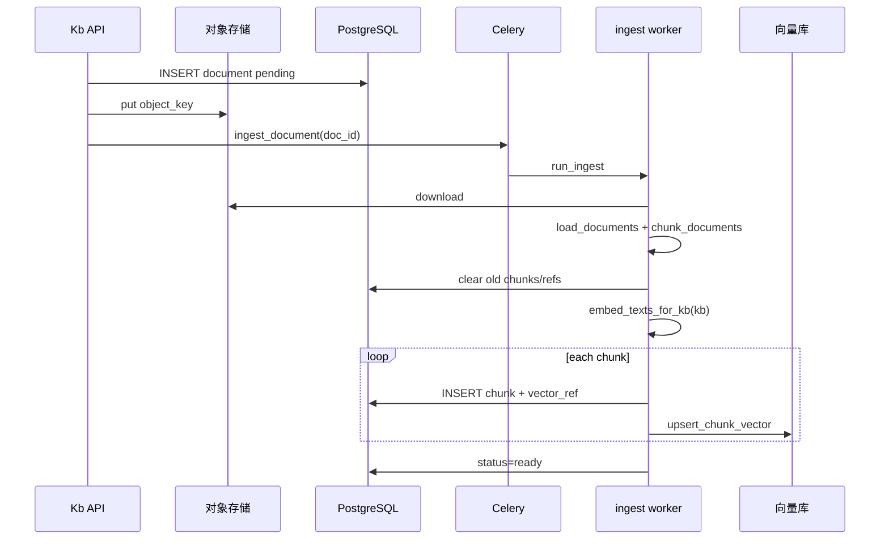

# 知识库（RAG）技术方案

> **功能规格：** [features/kb-ingest-retrieval.md](../features/kb-ingest-retrieval.md)  
> 与主架构 [technical-design.md §6](../architecture/technical-design.md#6-数据存储) 互补：本文聚焦 **知识库领域模型、入库流水线、检索与删除编排**。  
> 配置分层（对象存储 / 向量库 / 向量化规格）见 [§6.5 存储与向量化配置策略](../architecture/technical-design.md#65-存储与向量化配置策略)。

---

## 1. 目标与范围

| 目标 | 说明 |
|------|------|
| 多租户隔离 | `tenant_id` 贯穿 PG、对象 key、向量 Filter |
| 可替换基础设施 | 对象存储 `miles_core.infra.storage`；向量库 `miles_core.infra.vector_store` |
| KB 级向量模型 | 创建时绑定 `embedding_model_config_id`（`model_type=embedding`），**创建后不可改** |
| 异步入库 | 上传 → Celery `ingest_document` → 解析 → 分片 → 向量化 → 向量库 |
| 可观测 | 文档状态机 + `fail_reason` + 任务表 `task_records` |

**本期不做（可单独立项）**：以图搜图、租户级 OSS BYOK、文档级权限。

**已支持**：KB 级 `retrieval_mode`（`vector` / `hybrid`）、检索日志、配额与通用附件 API。

**二期-A 已交付**：创建 KB / 上传文档时校验 `max_knowledge_bases`、`max_storage_mb`、`ingest.max_file_mb`；检索写入 `kb_search_logs`；通用附件见 `/api/v1/attachments`。

---

## 2. 领域模型



### 2.1 文档状态机

```
pending → parsing → embedding → ready
              ↓           ↓
        parse_failed   embed_failed
```

| 状态 | 含义 |
|------|------|
| `pending` | 已上传对象存储，等待 Worker |
| `parsing` | 下载文件、解析文本（PDF/OCR/ASR 等） |
| `embedding` | 分片 + 向量化 + 写入向量库 |
| `ready` | 可检索 |
| `parse_failed` / `embed_failed` | 失败原因写入 `fail_reason` |

**重试**：`POST /kb/{id}/documents/{doc_id}/retry` — 仅 `parse_failed` / `embed_failed` / `ready`（覆盖重建索引）。

---

## 3. 端到端数据流

### 3.1 创建知识库

```
POST /api/v1/kb
  body: name, description?, embedding_model_config_id?, chunk_size?, chunk_overlap?
        ↓
resolve_embedding_model_by_id  → 固化 embedding_dimension（来自 ModelConfig.extra）
        ↓
INSERT kb_bases
```

- 未传 `embedding_model_config_id` 时使用内置默认 `bge-base-zh-v1.5`（`model_code`）。
- 可选模型目录：`GET /api/v1/models?model_type=embedding`（与智能体共用模型供应商页）。

### 3.2 上传与入库



**对象 key 规范**（`build_object_key`）：

```
{tenant_id}/{kb_id}/{document_id}/{filename}
```

**向量化**：必须使用 **`embed_texts_for_kb(kb, texts)`** / **`embed_query_for_kb(kb, query)`**，保证与 `kb.embedding_dimension` 一致。

### 3.3 检索

```
POST /api/v1/kb/{kb_id}/search  { query, top_k, mode? }
        ↓
resolve_retrieval_mode(kb, mode)  → vector | hybrid
        ↓
embed_query_for_kb(kb, query) → search_kb_chunks（Weaviate hybrid 或 向量+PG关键词 RRF）
        ↓
按 chunk_id 回表 kb_document_chunks + kb_documents → SearchHit[]
```

智能体 / 流程 RAG：`search_kb` / `search_multi_kb`（`miles_ai.integrations.langchain.vectorstores`），多库时 **每个 KB 独立生成查询向量** 后合并按 score 排序。

### 3.4 删除编排

| 操作 | 步骤 |
|------|------|
| 删文档 | 清向量库（按 `document_id`）→ 删 `vector_refs` / `chunks` → 删对象存储文件 → 软删 `kb_documents` |
| 删知识库 | 对每个文档执行删文档 → `before_delete_kb`（解绑 `agt_kb_bindings`、应用安装引用）→ 软删 `kb_bases` |

实现：`clear_document_derived_data_async` + `delete_object`（`KnowledgeBaseService.delete_document`）。

---

## 4. 代码分层

| 层 | 路径 | 职责 |
|----|------|------|
| API | `backend/packages/miles-portal/src/miles_portal/tenant/kb/views/kb.py` | 路由、权限 `kb:*` |
| 业务 | `backend/packages/miles-portal/src/miles_portal/tenant/kb/services/kb/` | CRUD、上传、检索、删除编排 |
| 入库 | `tenant/kb/services/ingest.py` | Celery 状态机，调 `rag.pipeline.run_ingest_pipeline` |
| 管道 | `rag/pipeline/ingest.py` | Parse → Chunk → Embed → Index |
| 解析 | `rag/parse/loaders.py`、`backends/*` | 统一 `load_documents_from_bytes` |
| 分片 | `rag/chunk/splitter.py` | `chunk_documents` → `TextChunk`（含 `page_no`） |
| 索引 | `rag/index/gateway.py` | `upsert_chunk_vector`、`search_vectors` |
| 检索 | `rag/retrieve/retriever.py`、`hybrid.py`、`multi_kb.py` | `search_kb_chunks`、RRF |
| 生成 | `rag/generate/` | 上下文与 `generate_rag_answer` |
| 加载 | `rag/load/knowledge_bases.py` | 租户 KB 列表（Agent/流程用） |
| 集成 | `integrations/langchain/embeddings.py`、`vectorstores.py` | 按 KB 维度 embed；`search_kb` 封装 |
| 删除 | `miles_portal.deletion.document` / `cascade.before_delete_kb` | 衍生数据与引用 |
| 任务 | `miles_worker.tasks.ingest` | Celery 入口 |

---

## 5. API 一览

| 方法 | 路径 | 权限 | 说明 |
|------|------|------|------|
| GET | `/kb` | `kb:read` | 分页列表 |
| POST | `/kb` | `kb:write` | 创建（含 `embedding_model_config_id`） |
| GET | `/kb/{id}` | `kb:read` | 详情 |
| PATCH | `/kb/{id}` | `kb:write` | 更新（**不可**改 embedding 字段） |
| DELETE | `/kb/{id}` | `kb:write` | 删除库及文档 |
| GET | `/kb/{id}/documents` | `kb:read` | 文档分页 |
| POST | `/kb/{id}/documents` | `kb:document:upload` | 上传（multipart） |
| POST | `/kb/{id}/documents/{doc_id}/retry` | `kb:write` | 重新入库 |
| DELETE | `/kb/{id}/documents/{doc_id}` | `kb:write` | 删除文档 |
| POST | `/kb/{id}/search` | `kb:read` | 检索测试；body 含 `mode`（default/vector/hybrid） |
| GET | `/kb/quota` | `kb:read` | 租户 KB 数量与存储配额 |
| GET | `/kb/{id}/search-logs` | `kb:read` | 检索日志分页 |

### 5.1 租户通用附件

| 方法 | 路径 | 权限 | 说明 |
|------|------|------|------|
| GET | `/attachments` | `attachment:read` | 分页列表（可选 `purpose` / `resource_type` / `resource_id`） |
| POST | `/attachments` | `attachment:upload` | multipart：`file` + 可选 `purpose`、`resource_type`、`resource_id` |
| GET | `/attachments/{id}` | `attachment:read` | 元数据 |
| DELETE | `/attachments/{id}` | `attachment:write` | 删对象存储并软删 |

对象 key：`{tenant_id}/attachments/{attachment_id}/{filename}`。占用租户 `max_storage_mb` 配额。

OpenAPI：`/docs`（运行实例）。

---

## 6. 配置与规格

### 6.1 向量化模型（模型目录）

内置种子（`scripts/seed/model_catalog.py`，`model_type=embedding`）：

| model_code | 维度 | invoke_mode | 说明 |
|------------|------|-------------|------|
| `bge-base-zh-v1.5` | 768 | `local` | `BAAI/bge-base-zh-v1.5`，无需 API Key |
| `qwen-text-embedding-v4` | 1024 | litellm | 通义，需 BYOK |

租户可在 **模型供应商** 创建自定义 embedding（`extra.embedding_dimension` 必填）。切换 KB 绑定的模型需 **新建知识库** 并重新入库。`invoke_mode` 与 `extra` 键名对照见 [model-config-extra.md](./model-config-extra.md)。

### 6.2 环境变量（L1）

见 [technical-design.md §15](../architecture/technical-design.md#15-配置与环境变量)：`OBJECT_STORAGE_*`、`VECTOR_STORE_BACKEND`、`EMBEDDING_*`（仅作新建 KB 默认 profile 参考）。

### 6.3 分片参数

- 创建 KB 时可设 `chunk_size`（100–4000）、`chunk_overlap`（0–500）。
- 入库使用 **当前 KB** 上的值；修改后仅影响 **之后** 上传/重试的文档。

### 6.4 文档解析（Parse）

入库 **Parse** 在 `miles_ai.rag.parse`（`load_documents_from_bytes` → `chunk_documents`），与检索/向量库解耦。

**当前支持上传并入库的格式：**

| 类型 | 扩展名 | 说明 |
|------|--------|------|
| 文本 | `.txt`、`.md`、`.markdown` | 直接解析 |
| PDF | `.pdf` | 默认 `pypdf`；可选 `docling` |
| 图片 | `.jpg`、`.jpeg`、`.png`、`.webp` | Pillow 必填；OCR 需 Worker 安装 `[multimodal]` |
| 音频 | `.mp3`、`.wav`、`.m4a`、`.ogg`、`.webm` | 无 Whisper 时写入占位文本，仍可入库 |
| 视频 | `.mp4`、`.mov`、`.m4v`、`.webm`、`.mkv` | ffmpeg 抽音轨（Whisper）+ 关键帧 OCR；无 ffmpeg 时占位文本 |
| Office | `.docx`、`.pptx`、`.xlsx`、`.html`、`.htm` | **可上传**；解析需 `PARSE_PDF_BACKEND=docling` 且安装 `[parse-docling]` |

白名单实现：`backend/packages/miles-ai/src/miles_ai/rag/parse/upload_policy.py`（KB 与通用附件共用）。

白名单与解析能力对齐：图/音/视频扩展名与 MIME 由 `backend/packages/miles-ai/src/miles_ai/rag/parse/media.py` 单一来源导出、`upload_policy.py` 复用；`OFFICE_EXTENSIONS ⊆ DOCLING_EXTENSIONS`、media 判定 ⊆ 白名单、白名单扩展名/MIME 往返可接受、前端 `accept` 全覆盖等不变式由 `tests/rag/test_upload_policy_alignment.py` 守卫。Docling 可读但白名单刻意不收的 TIFF/BMP 属「允许上传 ≠ 一定能解析」边界。

| 配置 | 说明 |
|------|------|
| `PARSE_PDF_BACKEND` | `pypdf`（默认，CI/轻量部署）或 `docling`（版式/Markdown，需额外依赖） |
| `PARSE_DOCLING_FALLBACK_PYPDF` | `docling` 失败或未安装时，PDF 是否回退 `pypdf`（默认 `true`） |

**安装 Docling（Worker 与 API 若走 docling 需一致）：**

```bash
cd backend && uv sync --all-packages   # 解析 / 多模态依赖已在 miles-ai 声明
```

`docling` 模式下除 PDF 外还可解析 `DOCLING_EXTENSIONS` 中的版式/图片扩展名；**API 上传白名单**已包含 Office（docx/pptx/xlsx）与多模态常用格式（见 `upload_policy.py`）。

**图片 OCR**：默认无引擎；安装 `[multimodal]` 后使用 **pytesseract**（`chi_sim+eng`）。**PaddleOCR** 为 PRD 愿景，**按需立项**（扫描件/票据场景），见 [backlog.md §按需](../product/backlog.md#按需--有场景再立项)；实现位 `rag/parse/backends/*`，不改 ingest 主链。

**分片（P1）**：Docling 导出 Markdown 后由 `MarkdownHeaderTextSplitter`（`#` / `##` / `###`）按标题切分，超长块再 `RecursiveCharacterTextSplitter`；分页通过 Docling `page_break_placeholder` 或按页导出写入 `DocumentChunk.page_no` 与向量 metadata。`pypdf` 多页 PDF 按页保留 `page_no`。

---

## 7. 前端（工作台）

| 路由 | 功能 |
|------|------|
| `/workbench/kb` | 列表、新建（选向量化模型，来自模型目录） |
| `/workbench/kb/[id]` | 上传、文档状态轮询、重试、删除、检索测试 |

类型与 API：`ui/workbench/lib/types.ts`、`ui/workbench/lib/api.ts`。

---

## 8. 运维与排错

| 现象 | 排查 |
|------|------|
| 长期 `pending` | Celery Worker 是否消费 `embed` 队列；`ingest_document` 任务状态 |
| `parse_failed` | 文件类型是否在白名单；`PARSE_PDF_BACKEND=docling` 时是否安装 `[parse-docling]` |
| 图片/音频无内容 | 是否安装 `[multimodal]`（pytesseract / whisper）；无依赖时仅有占位说明，检索质量有限 |
| `embed_failed` | 向量维度与 KB 是否一致；LiteLLM Key；Weaviate/Milvus 连通 |
| 检索无结果 | 文档是否 `ready`；`top_k`；查询与入库是否同一 KB |
| 删文档后仍能搜到 | 向量库 `delete_by_document` 是否成功（Milvus 多 collection 按维度） |

**Worker 启动**（示例）：

```bash
celery -A miles_worker.app worker -l info -Q default,parse,ocr,asr,embed
```

---

## 9. 测试建议

| 项 | 命令 / 说明 |
|----|-------------|
| 向量化模型 | `pytest tests/test_embedding_models.py` |
| 删除编排 | `pytest tests/test_kb_document_delete.py`（若已添加） |
| 手工 | 上传 TXT → 等 `ready` → `/search` 命中 → 删除文档后检索为空 |

---

## 10. 演进路线

| 阶段 | 内容 |
|------|------|
| ✅ 当前 | CRUD、上传入库、KB 级 embedding、检索、删除编排、前端详情页 |
| 二期-A ✅ | KB 配额校验、`GET /kb/quota`、`kb_search_logs`、`GET /kb/{id}/search-logs`、租户附件 `sys_attachments` + `/api/v1/attachments` |
| 二期-B ✅ | 混合检索（`retrieval_mode` / `hybrid_alpha`、Weaviate hybrid / Milvus+PG RRF）、检索 `mode` 覆盖 |
| 二期-C ✅ | 向量库统一 LangChain 实现（weaviate / milvus / pgvector） |
| 三期 | 多模态向量（图文）、文档预览、批量导入 |

