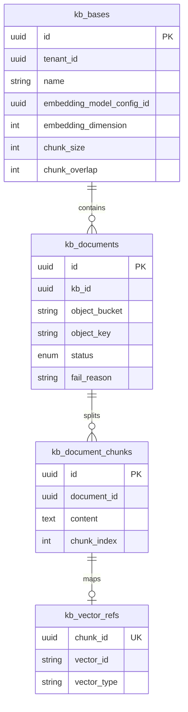
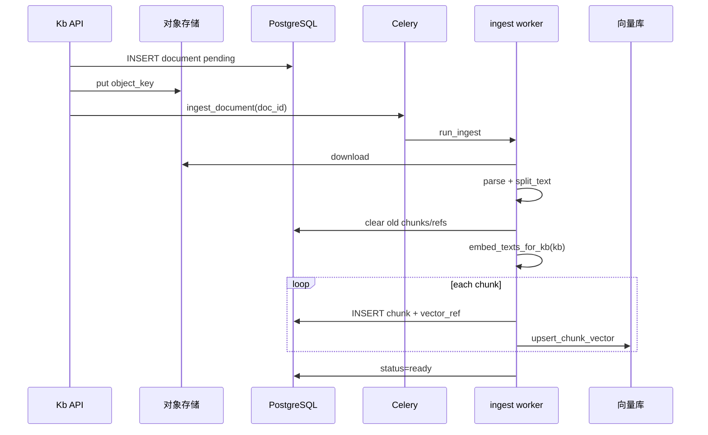

# 知识库（RAG）技术方案

> 与主架构 [technical-design.md §6](../architecture/technical-design.md#6-数据与存储) 互补：本文聚焦 **知识库领域模型、入库流水线、检索与删除编排**。  
> 配置分层（对象存储 / 向量库 / 向量化规格）见 [§6.5 存储与向量化配置策略](../architecture/technical-design.md#65-存储与向量化配置策略)。

---

## 1. 目标与范围

| 目标 | 说明 |
|------|------|
| 多租户隔离 | `tenant_id` 贯穿 PG、对象 key、向量 Filter |
| 可替换基础设施 | 对象存储 `app.infra.storage`；向量库 `app.infra.vector_store` |
| KB 级向量模型 | 创建时绑定 `embedding_model_config_id`（`model_type=embedding`），**创建后不可改** |
| 异步入库 | 上传 → Celery `ingest_document` → 解析 → 分片 → 向量化 → 向量库 |
| 可观测 | 文档状态机 + `fail_reason` + 任务表 `task_records` |

**本期不做（可单独立项）**：混合检索（关键词 + 向量）、以图搜图、租户级 OSS BYOK、文档级权限。

---

## 2. 领域模型



### 2.1 文档状态机

```
pending → parsing → embedding → ready
              ↓           ↓
        parse_failed   embed_failed
```

| 状态 | 含义 |
|------|------|
| `pending` | 已上传对象存储，等待 Worker |
| `parsing` | 下载文件、解析文本（PDF/OCR/ASR 等） |
| `embedding` | 分片 + 向量化 + 写入向量库 |
| `ready` | 可检索 |
| `parse_failed` / `embed_failed` | 失败原因写入 `fail_reason` |

**重试**：`POST /kb/{id}/documents/{doc_id}/retry` — 仅 `parse_failed` / `embed_failed` / `ready`（覆盖重建索引）。

---

## 3. 端到端数据流

### 3.1 创建知识库

```
POST /api/v1/kb
  body: name, description?, embedding_model_config_id?, chunk_size?, chunk_overlap?
        ↓
resolve_embedding_model_by_id  → 固化 embedding_dimension（来自 ModelConfig.extra）
        ↓
INSERT kb_bases
```

- 未传 `embedding_model_config_id` 时使用内置默认 `bge-base-zh-v1.5`（`model_code`）。
- 可选模型目录：`GET /api/v1/models?model_type=embedding`（与智能体共用模型供应商页）。

### 3.2 上传与入库



**对象 key 规范**（`build_object_key`）：

```
{tenant_id}/{kb_id}/{document_id}/{filename}
```

**向量化**：必须使用 **`embed_texts_for_kb(kb, texts)`** / **`embed_query_for_kb(kb, query)`**，保证与 `kb.embedding_dimension` 一致。

### 3.3 检索

```
POST /api/v1/kb/{kb_id}/search  { query, top_k }
        ↓
embed_query_for_kb(kb, query)
        ↓
vector_store.search(vector, tenant_id, kb_id, limit)
        ↓
按 chunk_id 回表 kb_document_chunks + kb_documents → SearchHit[]
```

智能体 / 流程 RAG：`search_kb` / `search_multi_kb`（`app.ai_stack.langchain.vectorstores`），多库时 **每个 KB 独立生成查询向量** 后合并按 score 排序。

### 3.4 删除编排

| 操作 | 步骤 |
|------|------|
| 删文档 | 清向量库（按 `document_id`）→ 删 `vector_refs` / `chunks` → 删对象存储文件 → 软删 `kb_documents` |
| 删知识库 | 对每个文档执行删文档 → `before_delete_kb`（解绑 `agt_kb_bindings`、应用安装引用）→ 软删 `kb_bases` |

实现：`clear_document_derived_data_async` + `delete_object`（`KnowledgeBaseService.delete_document`）。

---

## 4. 代码分层

| 层 | 路径 | 职责 |
|----|------|------|
| API | `app/tenant/kb/views/kb.py` | 路由、权限 `kb:*` |
| 业务 | `app/tenant/kb/services/kb.py` | CRUD、上传、检索、删除编排 |
| 入库 | `app/tenant/kb/services/ingest.py` | Worker 同步流水线 |
| 加载 | `app/tenant/kb/services/kb_load.py` | 按租户加载 KB（RAG 用） |
| 仓储 | `app/tenant/kb/repositories/kb.py` | 分页 CRUD |
| AI | `app.ai.parsers` / `app.ai.chunking` | 解析、分片 |
| 向量 | `app.ai_stack.embeddings.runtime` + `langchain/embeddings` | 按 KB 绑定的 ModelConfig 调用 |
| 检索 | `app.ai_stack.langchain.vectorstores` | `search_kb` |
| 删除 | `app.deletion.document` / `cascade.before_delete_kb` | 衍生数据与引用 |
| 任务 | `app.workers.tasks.ingest` | Celery 入口 |

---

## 5. API 一览

| 方法 | 路径 | 权限 | 说明 |
|------|------|------|------|
| GET | `/kb` | `kb:read` | 分页列表 |
| POST | `/kb` | `kb:write` | 创建（含 `embedding_model_config_id`） |
| GET | `/kb/{id}` | `kb:read` | 详情 |
| PATCH | `/kb/{id}` | `kb:write` | 更新（**不可**改 embedding 字段） |
| DELETE | `/kb/{id}` | `kb:write` | 删除库及文档 |
| GET | `/kb/{id}/documents` | `kb:read` | 文档分页 |
| POST | `/kb/{id}/documents` | `kb:document:upload` | 上传（multipart） |
| POST | `/kb/{id}/documents/{doc_id}/retry` | `kb:write` | 重新入库 |
| DELETE | `/kb/{id}/documents/{doc_id}` | `kb:write` | 删除文档 |
| POST | `/kb/{id}/search` | `kb:read` | 检索测试 |

OpenAPI：`/docs`（运行实例）。

---

## 6. 配置与规格

### 6.1 向量化模型（模型目录）

内置种子（`scripts/seed/model_catalog.py`，`model_type=embedding`）：

| model_code | 维度 | invoke_mode | 说明 |
|------------|------|-------------|------|
| `bge-base-zh-v1.5` | 768 | `local` | `BAAI/bge-base-zh-v1.5`，无需 API Key |
| `qwen-text-embedding-v3` | 1024 | litellm | 通义，需 BYOK |

租户可在 **模型供应商** 创建自定义 embedding（`extra.embedding_dimension` 必填）。切换 KB 绑定的模型需 **新建知识库** 并重新入库。

### 6.2 环境变量（L1）

见 [technical-design.md §15](../architecture/technical-design.md#15-环境变量)：`OBJECT_STORAGE_*`、`VECTOR_STORE_BACKEND`、`EMBEDDING_*`（仅作新建 KB 默认 profile 参考）。

### 6.3 分片参数

- 创建 KB 时可设 `chunk_size`（100–4000）、`chunk_overlap`（0–500）。
- 入库使用 **当前 KB** 上的值；修改后仅影响 **之后** 上传/重试的文档。

---

## 7. 前端（工作台）

| 路由 | 功能 |
|------|------|
| `/workbench/kb` | 列表、新建（选向量化模型，来自模型目录） |
| `/workbench/kb/[id]` | 上传、文档状态轮询、重试、删除、检索测试 |

类型与 API：`frontend/lib/types.ts`、`frontend/lib/api.ts`。

---

## 8. 运维与排错

| 现象 | 排查 |
|------|------|
| 长期 `pending` | Celery Worker 是否消费 `embed` 队列；`ingest_document` 任务状态 |
| `parse_failed` | 文件类型、PDF/多模态依赖是否安装（`[multimodal]`） |
| `embed_failed` | 向量维度与 KB 是否一致；LiteLLM Key；Weaviate/Milvus 连通 |
| 检索无结果 | 文档是否 `ready`；`top_k`；查询与入库是否同一 KB |
| 删文档后仍能搜到 | 向量库 `delete_by_document` 是否成功（Milvus 多 collection 按维度） |

**Worker 启动**（示例）：

```bash
celery -A app.workers.app worker -l info -Q default,parse,ocr,asr,embed
```

---

## 9. 测试建议

| 项 | 命令 / 说明 |
|----|-------------|
| 向量化模型 | `pytest tests/test_embedding_models.py` |
| 删除编排 | `pytest tests/test_kb_document_delete.py`（若已添加） |
| 手工 | 上传 TXT → 等 `ready` → `/search` 命中 → 删除文档后检索为空 |

---

## 10. 演进路线

| 阶段 | 内容 |
|------|------|
| ✅ 当前 | CRUD、上传入库、KB 级 embedding、检索、删除编排、前端详情页 |
| 二期 | 混合检索、检索日志表、KB 配额（租户 `sys_configs`） |
| 三期 | 多模态向量（图文）、文档预览、批量导入 |

---

## 11. 修订记录

| 日期 | 说明 |
|------|------|
| 2026-05-22 | 初版：领域模型、流水线、API、删除编排、与 infra 分层对齐 |
