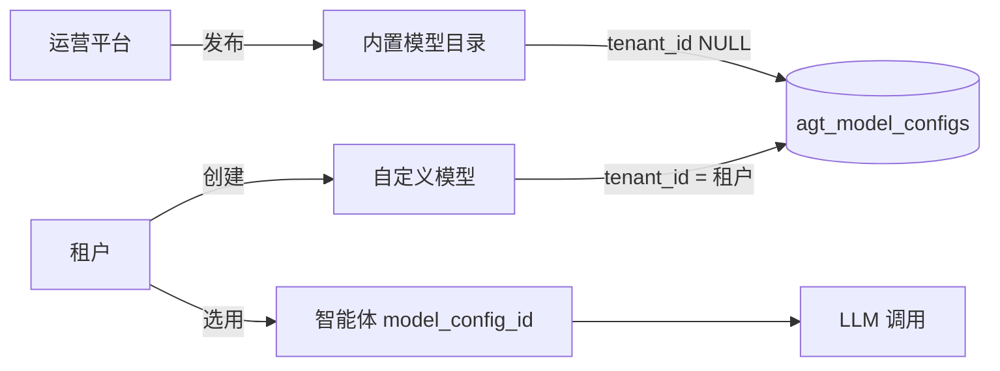

# 模型供应商（内置模型 + 自定义模型）

> 类型：产品设计 + 技术方案 | 状态：**M1–M3 已实现**（深度求索 / 豆包 / 通义千问种子已内置）  
> 关联：[technical-design.md](../architecture/technical-design.md)、[prd.md](../product/prd.md)

---

## 1. 目标

| 角色 | 能力 |
|------|------|
| **运营平台** | 发布、上下架 **内置模型**（统一目录、能力说明、默认接入参数） |
| **租户平台** | 浏览目录（按服务商 / 类型 / 来源筛选）；**直接使用内置模型**；**创建并管理自定义模型** |
| **运行时** | 智能体、流程 LLM 节点、A2A 规划等继续通过 `model_config_id` 调用，不改动调用链形态 |

参考 UI：模型分类筛选 + 模型卡片网格 +「+ 自定义模型」。

---

## 2. 现状（As-Is）

### 2.1 数据表 `agt_model_configs`

```text
id, tenant_id (nullable), name, provider, model_name,
api_base, api_key_encrypted, is_active, extra (JSONB), deleted_at
```

| 约定（已实现） | 含义 |
|----------------|------|
| `tenant_id IS NULL` | 视为 **系统内置**，租户列表可见，**不可改删** |
| `tenant_id = 当前租户` | **租户自定义**，可 CRUD |
| 列表查询 | `(tenant_id = ctx.tenant_id) OR (tenant_id IS NULL)` |

### 2.2 API（租户 `/api/v1/models`）

| 方法 | 行为 |
|------|------|
| `GET /models` | 扁平列表，无分类筛选 |
| `POST /models` | 创建租户模型（始终写 `tenant_id`） |
| `PATCH/DELETE /models/{id}` | 内置（`tenant_id` 空）返回 400 |

### 2.3 缺口

| 缺口 | 说明 |
|------|------|
| 运营端 | **无** 内置模型发布/审核 API 与后台页面 |
| 目录元数据 | 无 `model_type`、简介、标签、`model_code`、是否「最新」等 |
| 内置鉴权 | 内置记录若未配平台 Key，租户无法「填自己的 Key」覆盖 |
| 租户 UI | 仍为简单列表卡片，无截图中的 **分类 + 来源** |
| 种子数据 | 执行 `python scripts/init_db.py` 或 `scripts/seed_model_catalog.py` 预置内置模型目录 |

### 2.4 运行时（不变）

`ModelConfig` → `ai_stack.langchain.chat_models.ainvoke_chat` / `core.llm_client`：OpenAI 兼容 `POST {api_base}/chat/completions`，`Authorization` 来自 `api_key_encrypted`（可为空）。

---

## 3. 产品模型

### 3.1 两类来源



| 来源 | `source` 字段（派生） | 谁维护 | 租户操作 |
|------|----------------------|--------|----------|
| **内置模型** | `builtin` | 运营平台 | 查看、筛选、绑定到智能体；可选配置 **租户级 Key 覆盖** |
| **自定义模型** | `custom` | 租户 | 完整 CRUD（名称、端点、Key、模型名） |

派生规则：`tenant_id IS NULL` → `builtin`，否则 `custom`（无需单独存枚举，也可显式存 `source` 便于查询）。

### 3.2 分类维度（对齐 UI）

**服务商 `vendor`**（筛选 + 卡片 Logo）：

`deepseek` | `openai` | `doubao` | `gemini` | `claude` | `moonshot` | `qwen` | `zhipu` | `minimax` | `kling` | `wenxin` | `spark` | `baichuan` | `other`

**类型 `model_type`**（能力标签）：

| 值 | 说明 |
|----|------|
| `llm` | 大语言模型 |
| `reasoning` | 推理模型 |
| `vision` | 图像理解 |
| `asr` | 语音识别 |
| `tts` | 语音合成 |
| `image_gen` | 图像生成 |
| `video_gen` | 视频生成 |
| `other` | 其它 |

一期 **对话/RAG/流程 LLM 节点** 仅校验 `model_type IN (llm, reasoning, vision)`；其余类型先入库展示，调用链后续扩展。

**来源 `source`**：`builtin` | `custom`（筛选「内置 / 自定义」）。

### 3.3 内置模型的鉴权策略

| 策略 | 说明 | 推荐 |
|------|------|------|
| **平台托管 Key** | 内置记录上配置 `api_key_encrypted`（租户不可见） | 私有化交付、统一采购 |
| **租户自带 Key（BYOK）** | 内置模型 + `agt_model_tenant_credentials` 覆盖 Key/Base | 多租户 SaaS、合规 |
| **混合** | 平台 Key 优先；无则读租户覆盖 | **默认推荐** |

租户「直接使用内置」= 在智能体下拉可选该 `id`；若调用时无可用 Key，接口返回明确错误并引导「配置 API Key」。

---

## 4. 数据模型设计

### 4.1 扩展 `agt_model_configs`（内置与自定义共用）

在现有表上增加字段（迁移 `013_model_catalog_fields.py`）：

| 字段 | 类型 | 内置 | 自定义 | 说明 |
|------|------|------|--------|------|
| `model_code` | varchar(128) | 必填 | 可选 | 技术标识，如 `deepseek-v4-flash`；内置全局唯一 |
| `vendor` | varchar(32) | 必填 | 必填 | 服务商 slug |
| `model_type` | enum | 必填 | 必填 | §3.2 |
| `description` | text | 推荐 | 可选 | 卡片简介 |
| `context_window` | varchar(32) | 可选 | 可选 | 展示用，如 `1M` |
| `capabilities` | jsonb | 默认 `[]` | 可选 | 扩展标签 |
| `publish_status` | enum | 必填 | — | `draft` / `published` / `deprecated`；自定义恒为 `published` |
| `is_featured` | bool | 可选 | false | 运营推荐 |
| `badge` | varchar(16) | 可选 | — | 如 `latest` |
| `sort_order` | int | 默认 0 | 0 | 列表排序 |
| `icon_key` | varchar(64) | 可选 | — | 前端静态资源 key |

保留：`name`（展示名）、`provider`（兼容旧逻辑，可与 `vendor` 同步或废弃逐步迁移）、`model_name`（请求体 model 参数）、`api_base`、`api_key_encrypted`、`is_active`、`extra`。

**约束**：

- 内置：`tenant_id IS NULL`，`publish_status = published` 才对租户可见。
- 自定义：`tenant_id NOT NULL`，`publish_status` 忽略或固定 `published`。
- 软删除：继续 `deleted_at`。

### 4.2 新增 `agt_model_tenant_credentials`（BYOK）

| 字段 | 说明 |
|------|------|
| `tenant_id` | 租户 |
| `model_config_id` | 指向内置 `agt_model_configs.id` |
| `api_key_encrypted` | 租户 Key |
| `api_base` | 可选覆盖 |
| `is_active` | 是否启用覆盖 |
| UNIQUE(`tenant_id`, `model_config_id`) |

解析顺序（调用时）：

```text
effective_api_key = platform_key on model_config
                 ?? tenant_credentials.api_key_encrypted
effective_api_base  = tenant_credentials.api_base ?? model_config.api_base
```

### 4.3 与智能体的关系

不变：`agt_agents.model_config_id` → `ModelConfig`。下拉选项 = 租户可见的内置（已发布）+ 本租户自定义。

---

## 5. API 设计

### 5.1 运营平台 `/api/admin/v1/model-catalog`

权限：平台管理员 JWT（现有 `admin` 体系）。

| 方法 | 路径 | 说明 |
|------|------|------|
| `GET` | `/model-catalog` | 分页；筛选 vendor、model_type、publish_status |
| `POST` | `/model-catalog` | 创建内置（`tenant_id=null`） |
| `GET` | `/model-catalog/{id}` | 详情（含 Key 掩码） |
| `PATCH` | `/model-catalog/{id}` | 编辑元数据、端点、平台 Key |
| `POST` | `/model-catalog/{id}/publish` | `draft` → `published` |
| `POST` | `/model-catalog/{id}/deprecate` | → `deprecated`（租户列表隐藏，已绑定智能体提示迁移） |
| `DELETE` | `/model-catalog/{id}` | 软删除（仅 draft 或无人引用） |

**不** 暴露完整 `api_key` 给前端；运营保存时写入，读取返回 `has_api_key: true`。

### 5.2 租户平台 `/api/v1/models`（演进）

| 方法 | 路径 | 说明 |
|------|------|------|
| `GET` | `/models` | **改造**：Query `vendor`, `model_type`, `source`, `q`；分页；返回 `ModelCatalogCardOut` |
| `GET` | `/models/{id}` | 详情；内置不返回平台 Key；返回 `tenant_has_credentials` |
| `POST` | `/models` | 仅创建 **custom**（`tenant_id=ctx`） |
| `PATCH` | `/models/{id}` | 仅 custom |
| `DELETE` | `/models/{id}` | 仅 custom |
| `PUT` | `/models/builtin/{id}/credentials` | 租户 BYOK 写入/更新覆盖 |
| `DELETE` | `/models/builtin/{id}/credentials` | 删除覆盖，回退平台 Key |

列表项示例：

```json
{
  "id": "uuid",
  "source": "builtin",
  "name": "DeepSeek-V4-Flash",
  "model_code": "deepseek-v4-flash",
  "vendor": "deepseek",
  "model_type": "llm",
  "description": "旗舰级大语言模型…",
  "badge": "latest",
  "is_active": true,
  "credential_status": "platform" | "tenant" | "missing"
}
```

`credential_status`：供卡片展示「需配置 Key」。

### 5.3 运行时解析服务

新增 `ModelResolveService.get_effective_config(model_id, tenant_id) -> ModelConfig`：

- 合并租户覆盖 Key/Base；
- 校验 `is_active` 与 `publish_status`；
- 供 `AgentService`、`flow llm_nodes`、`a2a/invoke` 统一调用，避免各处重复逻辑。

---

## 6. 前端设计

### 6.1 租户「模型供应商」页（`/workbench/models`）

| 区域 | 行为 |
|------|------|
| **模型分类** | 服务商 chips、类型 chips、来源（全部 / 内置 / 自定义） |
| **模型列表** | 卡片网格：名称、`model_code`、简介、类型标签、来源角标（内置/自定义）、`latest` 角标 |
| **操作** | 「+ 自定义模型」打开表单；内置卡片：查看详情 +「配置 Key」（BYOK）；自定义：编辑/删除 |
| **内置卡片** | 无删除/编辑元数据；可「启用/停用」仅当支持租户级 `is_active` 覆盖（可选二期） |

### 6.2 运营后台（新建）

路径建议：`/catalog/models` 或 `/models`（`admin_frontend`）。

- 表格/卡片管理内置目录；
- 发布/下架；
- 配置平台默认 `api_base` + Key；
- 种子/批量导入 JSON（运维友好）。

### 6.3 智能体表单

模型下拉：分组「内置模型」「我的模型」；无 Key 的内置项显示警告图标；点击跳转配置 Key。

---

## 7. 安全与合规

| 项 | 方案 |
|----|------|
| Key 存储 | 继续明文或升级为应用层加密（`SECRET_KEY` 派生）；文档与实现保持一致 |
| 租户隔离 | 自定义模型强制 `tenant_id`；覆盖表 UNIQUE 租户+模型 |
| 权限 | 租户 `model:read` / `model:write`；运营独立管理员角色 |
| 审计 | 运营 publish/deprecate、租户 Key 配置写入 `aud_logs` / `adm_audit_logs` |
| 列表脱敏 | 任何 API 不返回完整 Key |

---

## 8. 迁移与兼容

### 8.1 数据迁移

1. `013` 增加新列 + enum；
2. 现有 `tenant_id IS NULL` 行：补 `vendor=provider`、`model_type=llm`、`publish_status=published`、`source` 派生；
3. 现有租户行：`source=custom`。

### 8.2 API 兼容

- `GET /models` 短期可保留数组形态，增加 `?legacy=1`；默认改为分页 + 筛选（前端同步改）。
- `ModelConfigOut` 增加字段，旧客户端忽略新字段。

### 8.3 种子

`scripts/seed/model_catalog.py`（通过 `init_db.py` 或 `seed_model_catalog.py` 执行）：预置主流内置条目（**无 Key**，`credential_status=missing`），由部署方在运营后台补 Key。

---

## 9. 实施分期

| 阶段 | 交付 | 验收 |
|------|------|------|
| **M1 数据与运营** | 迁移 013、运营 CRUD + publish、种子若干内置 | 运营可发布 DeepSeek/GPT 等卡片 |
| **M2 租户目录 UI** | `GET /models` 筛选 + 卡片页 + 自定义 CRUD | 与参考图一致的分类与来源展示 |
| **M3 BYOK** | `agt_model_tenant_credentials` + 配置 Key UI + `ModelResolveService` | 租户选内置模型并配 Key 后智能体对话成功 |
| **M4 强化** | 下架校验（智能体引用检查）、批量导入、图标资源 | 下架内置已引用时提示 |

---

## 10. 模块落点（实现时）

| 层 | 路径 |
|----|------|
| ORM | `app/models/model.py` 扩展；`app/models/model_tenant_credential.py` 新增 |
| 租户服务 | `app_tenant/models/services/model.py`、`model_resolve.py` |
| 运营服务 | `admin/app_ops/services/model_catalog.py`（新建） |
| 视图 | `app_tenant/models/views/models.py`；`admin/app_ops/views/model_catalog.py` |
| 前端租户 | `frontend/app/workbench/models/page.tsx` + `components/model/*` |
| 前端运营 | `admin_frontend/app/catalog/models/` |
| 调用链改造点 | `chat_models._http_chat_completion` 入口改为 `get_effective_config` |

---

## 11. 与现有文档关系

| 文档 | 更新点 |
|------|--------|
| [technical-design.md](../architecture/technical-design.md) §6 / §7 | 补充表 `agt_model_tenant_credentials`、运营 API（实施后） |
| [README.md](../README.md) | 文档列表增加本页 |

---

*评审通过后可按 M1→M4 拆任务实现；实现完成后将本文「状态」改为已实现并回填 As-Is。*
