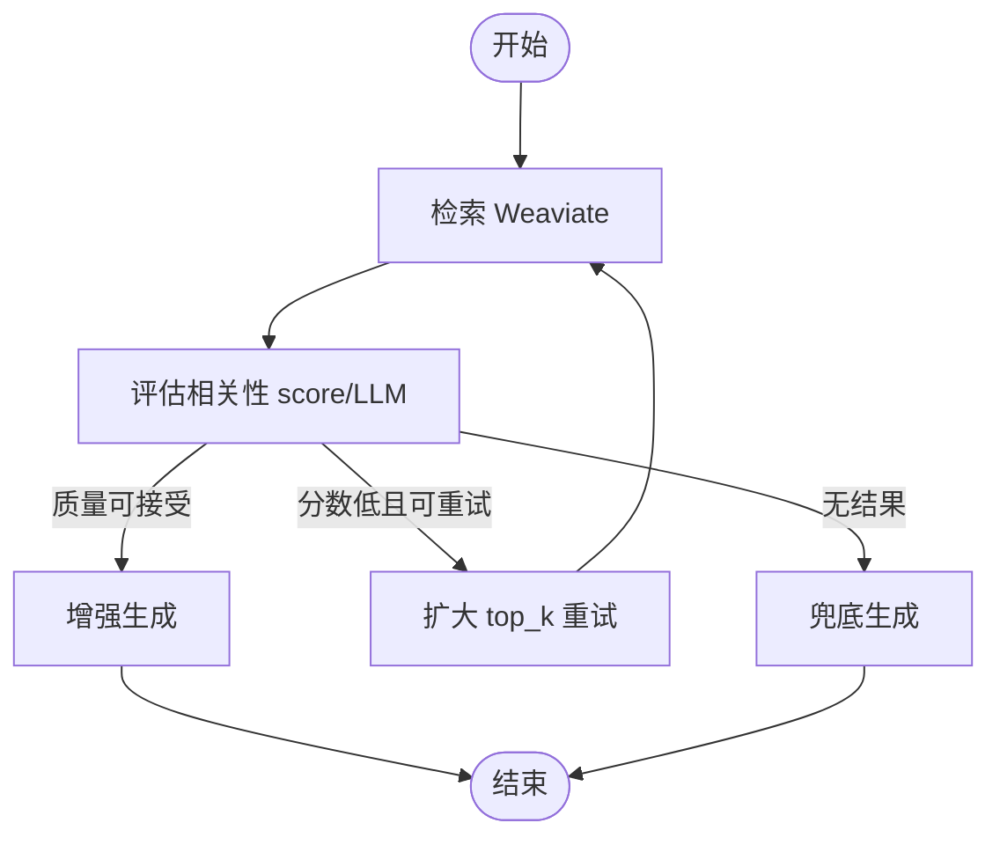

# LangGraph RAG 工作流

> 状态：已落地（默认启用，可关闭）

## 流程图



## 配置（`Agent.config`）

| 字段 | 默认 | 说明 |
|------|------|------|
| `use_langgraph_rag` | `true`（未显式 false） | 是否走 LangGraph |
| `runtime_mode` | — | `legacy` 强制线性 RAG；`autonomous` 走子智能体规划 |
| `relevance_threshold` | `0.35` | 检索最高分阈值，低于则重试或兜底 |
| `rag_max_retries` | `1` | 低分时的最大重试次数（每次 `top_k` 翻倍，上限 20） |
| `use_llm_grade` | `false` | 在向量分数评估后，用大模型复核相关性（`grade_method: llm`） |

关闭 Graph、恢复线性 RAG：

```json
{ "use_langgraph_rag": false }
```

或：

```json
{ "runtime_mode": "legacy" }
```

## 模块

- `app/ai_stack/langgraph/graphs/rag_qa.py` — 图定义
- `app/ai_stack/langgraph/runner.py` — `run_rag_workflow()`
- 对话响应 `ChatResponse.steps` 含 `retrieve` / `grade` / `retry` / `generate` / `fallback` 轨迹

## 与合规

敏感词、钩子仍在 `AgentService.chat` 外层执行（入参/出参），Graph 内专注检索与生成逻辑。

## Checkpoint（多轮会话）

- 应用启动时 `init_langgraph_checkpointer()`：Redis 可用则用 `AsyncRedisSaver`（**须 db=0**，`LANGGRAPH_REDIS_DB`，RediSearch 限制），否则 `MemorySaver`
- 对话请求可传 `conversation_id`（前端「新会话」会生成新 UUID）；`thread_id = {tenant_id}:{agent_id}:{conversation_id}`
- `ChatResponse.steps[0]` 含 `checkpointer: redis | memory` 与 `thread_id`

依赖（已写入 `backend/pyproject.toml` 主依赖）：

```bash
pip install -e ".[dev]"   # 含 langgraph-checkpoint-redis
```

环境变量（见 `backend/.env.example`）：

```
LANGGRAPH_REDIS_DB=0
LANGGRAPH_REDIS_CHECKPOINT=true
```

常见问题：

| 日志 | 处理 |
|------|------|
| `No module named 'langgraph.checkpoint.redis'` | `pip install langgraph-checkpoint-redis`，或 `pip install -e ".[dev]"` 后重启 |
| `Cannot create index on db != 0` | 将 `LANGGRAPH_REDIS_DB` 设为 `0`（Redis Stack 限制） |
| `unknown command 'FT._LIST'` 等 | 使用 Redis Stack，或接受 MemorySaver 回退 |
| `get_async_redis_connection will become async` | redisvl 已知 DeprecationWarning，已过滤，不影响功能 |

### 使用提示（Redis 要求）

要启用 **Redis checkpoint**（多轮对话在进程重启后仍可恢复图状态），Redis 须为以下之一：

- **Redis Stack**（含 RediSearch、RedisJSON 等模块），或
- **Redis 8+**（默认捆绑上述能力）

若仅部署**普通 Redis**（无 RediSearch/RedisJSON），`langgraph-checkpoint-redis` 初始化会失败，平台会**自动回退 `MemorySaver`**：

- RAG 对话与步骤轨迹**仍可正常使用**
- 图状态**仅存于进程内存**，**应用重启后不保留** checkpoint
- 启动日志会出现类似：`LangGraph checkpointer: Redis 初始化失败 … 使用 MemorySaver`
- 对话 `steps[0].checkpointer` 为 `memory` 而非 `redis`

本地/Docker 建议：使用 [Redis Stack](https://redis.io/docs/latest/operate/oss_and_stack/install/install-stack/) 镜像，并将 **`LANGGRAPH_REDIS_DB=0`**（与 Celery 分库可用 `CELERY_BROKER_URL` 的 `/1`、`/2` 隔离）。

## 前端配置

智能体编辑表单（绑定知识库且未绑子智能体时）可配置：

- 启用 LangGraph RAG
- 相关性阈值 / 低分重试次数

## 画布流程

智能体绑定已发布流程时，可选用 LangGraph 编译画布执行，见 [flow-langgraph-compiler.md](./flow-langgraph-compiler.md)。

## 后续

- 画布条件分支、并行汇合
- 画布运行接入 Redis checkpoint
