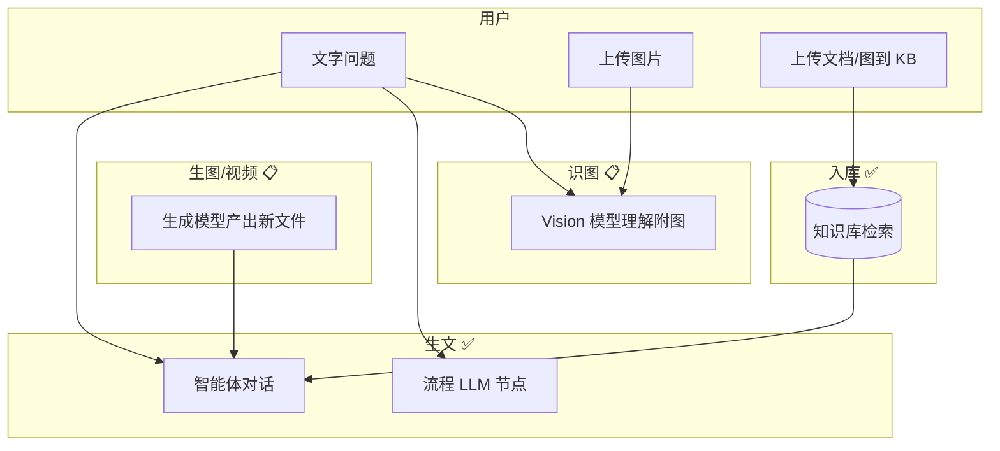

# 多模态产品能力说明

> 类型：产品能力 | 状态：**部分已实现 / 部分设计稿**  
> 技术方案：[multimodal-roadmap.md](../architecture/multimodal-roadmap.md)  
> 立项对照：[prd.md](./prd.md)（PRD 愿景较全，以本文「实现状态」为准）

本文从 **产品视角** 说明平台多模态能力：用户能做什么、在哪里做、与知识库入库的区别。不涉及签名下载等实现细节。

---

## 1. 能力总览

平台「多模态」拆为 **四类能力**，请勿混为一谈：

| 能力类 | 用户价值 | 典型入口 | 实现状态 |
|--------|----------|----------|----------|
| **生文** | 问答、总结、RAG、工具调用 | 智能体对话、流程 LLM 节点 | ✅ 已支持 |
| **识图** | 上传图片 + 文字，让模型「看懂」并回答 | 智能体对话、流程调试/运行 | 🔶 直连/工具/RAG/流程已支持（检索仍文本） |
| **生图 / 生视频** | 根据描述生成图片或视频文件 | 智能体工具、流程生成节点 | ✅ 万相 + 豆包 Seedance；默认选取 **qwen → doubao** |
| **资料入库** | 把图/音/文档放进知识库，检索时当「资料」引用 | 知识库上传 | ✅ 已支持（图/音多为 OCR/转写文本，非原图进模型） |

---

## 2. 生文（已支持）

### 2.1 是什么

用大语言模型根据 **文本** 生成回答，可结合：

- 知识库检索（RAG）
- 已发布流程画布
- 平台工具 / 技能包（可选）
- 子智能体协同（DeepAgents）

### 2.2 在哪里用

| 场景 | 入口 |
|------|------|
| 日常对话 | 工作台 → 智能体 → 对话 |
| 自动化流程 | 流程画布 → `LLMCall` 节点 |
| 绑定流程的智能体 | 智能体配置「已发布流程」后，对话走画布 |

### 2.3 模型要求

模型类型为 **大语言 / 推理**（`llm`、`reasoning`），在「模型供应商」中选择并绑定到智能体或节点。

### 2.4 当前限制

- 对话与流程 **仅文本输入**（不能附图问「这张图是什么」）。
- 回答为 **文本**（不在对话里直接生成图片/视频文件，除非未来通过生成类能力）。

---

## 3. 识图（设计稿）

### 3.1 是什么

用户在提问时 **附带一张或多张图片**，系统选用 **视觉理解（vision）** 模型，将图片与文字一并送入模型，得到文字回答。

**不是**：把图上传到知识库再等检索（那是 §5）。

### 3.2 计划支持的场景

| 场景 | 用户操作 |
|------|----------|
| 智能体对话 | 输入框上传图片 + 输入问题 → 发送 |
| 流程（绑定了 vision 能力） | 调试面板上传附图 + query；智能体绑发布流程时对话附图传入画布 |
| 智能体 + 知识库 | 先用文字检索资料，生成答案时再结合用户附图（检索仍基于文字，已实现） |

### 3.3 模型与配置

- 需在「模型供应商」中选择 **图像理解（vision）** 类模型（如通义 VL、豆包视觉等）。
- 若智能体绑定的是纯文本模型，附图时将提示更换模型。

### 3.4 附件与预览（产品约定）

- 图片先作为 **附件** 上传（与对话、流程用途区分），不占知识库文档列表。
- **暂不采用「签名下载链接」** 对外暴露文件；预览与模型读图由服务端在授权后从对象存储读取内容（对前端可后续提供 **鉴权下的内容下载接口**，非临时签名 URL）。
- 单轮对话附图数量、大小将设上限（如最多 4 张、单张 ≤10MB）。

### 3.5 未包含（识图 v1）

- 对话中上传 **视频** 让模型直接观看。
- 多轮对话中自动记住上一轮图片（v1 以 **当轮附图** 为主）。

---

## 4. 生图与生生视频（设计稿）

### 4.1 是什么

根据 **文字描述**（可选参考图）调用 **图像生成 / 视频生成** 类模型，产出 **新文件**（图片或视频），可在对话或流程结果中查看、下载。

| 能力 | 输入 | 输出 |
|------|------|------|
| **生图** | 文本 prompt，可选参考图 | 图片文件（附件） |
| **生视频** | 文本 prompt，可选首帧图 / 数字人素材 | 视频文件（附件），可能需等待数分钟 |

### 4.2 计划支持的场景

| 场景 | 用户操作 |
|------|----------|
| 智能体对话 | 对智能体说「帮我生成一张…的图」→ 模型调用生成工具 → 回复中带图片预览 |
| 流程画布 | 拖拽「生图」「生视频」节点，上游可接 LLM 写 prompt |
| 模型供应商 | 配置 `image_gen` / `video_gen` 类模型及 API Key |

### 4.3 与「识图」区别

| | 识图 | 生图/生视频 |
|---|------|-------------|
| 方向 | 用户给图，模型 **理解** | 模型 **创造** 新图/视频 |
| 模型类型 | vision | image_gen / video_gen |
| 等待 | 通常秒级 | 视频可能分钟级，需进度或任务查询 |

### 4.4 安全与确认（产品）

- 生视频、高分辨率生图可能 **费用高、耗时长**：计划默认需用户 **确认** 后执行（类似敏感工具确认）。
- 生成 prompt 走 **合规扫描**（与对话文本相同）。
- 租户级 **生成次数/日** 可通过 `generative.daily_limit_per_tenant` 配置（0 为不限）。

### 4.5 未包含（生成 v1）

- 在普通 LLM 节点里「一句话顺带出图」（必须走生成工具或专用节点）。
- 生成结果 **自动写入知识库**（不做默认；可选「升格入库」与 **媒体资产表** 见 [media-assets-design.md](../architecture/media-assets-design.md)）。
- 流式逐帧预览生成过程。

---

## 5. 多模态知识库（已支持，属另一类能力）

### 5.1 是什么

将 **文档、图片、音频** 等上传到 **知识库**，系统解析为文本分片并建立向量索引；智能体或流程在回答时 **检索相关片段**，注入 prompt。

### 5.2 用户感知

- 「根据公司内部 PDF/图片资料回答」→ 用知识库 + RAG。
- 图片在库内多数经 **OCR/占位转写** 成文字再检索，**不是**把原图在对话时送给 vision 模型。

### 5.3 支持格式（摘要）

详见 [knowledge-base.md](../guides/knowledge-base.md)：TXT/PDF/常见图片/音频等；部分能力需 Worker 安装可选依赖 `[multimodal]`。

### 5.4 与 PRD 差距（产品预期管理）

| PRD/市场表述 | 当前产品 |
|--------------|----------|
| 以图搜图 | 未作为独立产品能力 |
| 文本搜图 | 未作为独立产品能力 |
| 视频文件入库解析 | 上传白名单未含视频 |

---

## 6. 按角色使用建议

| 角色 | 建议 |
|------|------|
| **业务用户** | 日常问答、客服：生文 + 知识库；需要「看用户发的图」：等识图上线后配 vision 模型 |
| **流程搭建者** | RAG 链用现有节点；要「生成海报/短视频」：等生图/生视频节点或智能体工具 |
| **管理员** | 在模型供应商维护 vision / image_gen / video_gen 模型与 Key；合规词库仍管文本 |

---

## 7. 发布节奏（产品计划，与技术 Phase 对齐）

| 阶段 | 用户可见能力 |
|------|----------------|
| **已上线** | 生文、知识库多模态入库（文本检索为主） |
| **Phase 1** | 智能体对话附图识图；流程调试附图 + vision |
| **Phase 2** | 智能体 RAG 对话带图；发布流程带图运行 |
| **Phase 3** | 对话/流程 **生图**；智能体生成工具 |
| **Phase 4** | **生视频**（万相/豆包、智能体工具 + 流程节点、默认确认）、媒体资产、生成日配额、历史回填 CLI |

技术拆解见 [multimodal-roadmap.md](../architecture/multimodal-roadmap.md)。

---

## 8. 相关文档

| 文档 | 读者 |
|------|------|
| [multimodal-roadmap.md](../architecture/multimodal-roadmap.md) | 研发：总览与实施顺序 |
| [agent-multimodal-design.md](../architecture/agent-multimodal-design.md) | 研发：智能体对话 |
| [flow-llm-multimodal-design.md](../architecture/flow-llm-multimodal-design.md) | 研发：流程识图 |
| [flow-generative-media-design.md](../architecture/flow-generative-media-design.md) | 研发：生图/生视频 |
| [model-providers.md](../guides/model-providers.md) | 模型类型说明 |
| [platform-agents.md](../guides/platform-agents.md) | 智能体执行路径 |

---

## 9. 变更记录

| 日期 | 说明 |
|------|------|
| 2026-05-26 | 初版：四类能力、状态、场景、与 PRD 差异；附件不做签名下载 |
