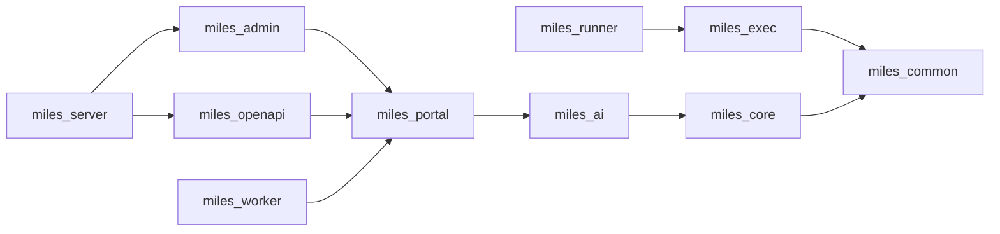

# 后端拆分为 pyproject 多包工作区（uv workspace）设计

> 状态：**待评审**
> 关联：[layering.md](../../architecture/layering.md)、[engine-di-convergence.md](../../architecture/engine-di-convergence.md)
> 目标形态：`backend/` 由单一 `milesai` 包拆为 10 个独立 distribution，用根 `pyproject.toml` 的 `[tool.uv.workspace]` 统一管理。
> 入口策略：**方案 1**（域自持 API 层 + 薄装配根）；§10 写明通往方案 2（双应用）的演进路径。
> 后续项：§11 列明拆出 `miles_integration`（第 11 包）的归属与判据，本次不实施。

---

## 1. 背景与动机

当前后端是**单包 + 声明式分层**：一个 `milesai` 包，`app/` 下按职责分目录（`tenant/`、`rag/`、`integrations/`…），分层靠 `layering.md` 文档约定与一个源码扫描守卫（`tests/test_l3_neutral_imports.py`）维持。

随体量增长，这层"纸面边界"已经压不住：

- `app/tenant/` 381 文件 / 28330 行，占后端近 80%，与其余目录完全不对等；
- 多个顶层目录之间存在**真实双向依赖**（见 §3），文档禁止但代码仍在；
- 三个部署入口（API / Worker / MC Runner）共用一份代码，**沙箱镜像被迫安装整个 AI 栈**；
- 边界只能靠"约定 + 事后扫源码"，没有构建期强制。

多包 + uv workspace 的价值：把"文档里的分层"变成**依赖图里的分层**，装上这个包就自动带上它的依赖，跨包反向 import 直接失败。

### 目标

1. 10 个独立包，各自 `pyproject.toml`，依赖显式、方向单向。
2. 包间依赖成环为零；环的消解方式记录在案（§3）。
3. 每个域的 API 层归各自域；装配根不含任何域端点（§2.2）。
4. `miles_runner` 依赖收敛到最小集合，沙箱镜像不再安装 langchain / weaviate / milvus / torch。
5. 边界由 `import-linter` 在 CI 强制。
6. **行为不变**：OpenAPI 快照零漂移、全量测试通过。

### 非目标

- 不改 `ui/`（前端结构另有约定）。
- 不做对外 API 的 URL 重排与版本化（`/api/v1/open/*` 本次**保持路径不变**，仅调整代码归属；独立立项再做）。
- 不精简/不版本化 `miles_openapi` 的对外 DTO（后续独立立项）。
- 本次**不拆为两个进程**（方案 2 见 §10，不在本次实施范围）。
- 不拆数据库、不动 `alembic/` 的迁移历史、不改表名。

---

## 2. 目标包图

```text
backend/
├── pyproject.toml                       # uv workspace 根（无业务代码，收敛 ruff/pytest 配置）
├── uv.lock                              # 工作区唯一锁文件
├── alembic/                             # 保持独立，env.py 引用 miles_core
├── openapi/openapi.snapshot.json        # 保持原位（全应用 spec 快照）
└── packages/
    ├── miles-common/  → src/miles_common/
    ├── miles-exec/    → src/miles_exec/
    ├── miles-core/    → src/miles_core/
    ├── miles-ai/      → src/miles_ai/
    ├── miles-portal/  → src/miles_portal/
    ├── miles-admin/   → src/miles_admin/
    ├── miles-openapi/ → src/miles_openapi/
    ├── miles-server/  → src/miles_server/     # 装配根（原拟名 miles_api）
    ├── miles-worker/  → src/miles_worker/
    └── miles-runner/  → src/miles_runner/
```

> 命名说明：原拟 `miles_api` 易被误读为"端点在里"。它实际只做装配，故定为 **`miles_server`**（零端点）。域端点全部在 `miles_portal` / `miles_admin` / `miles_openapi` 内。

各包职责与依赖：

| 包 | 承接现目录 | 声明依赖 |
|----|-----------|----------|
| `miles_common` | `common/` 纯函数部分 + `utils/` 纯函数部分 | pydantic, croniter |
| `miles_exec` | 沙箱 + MCP 协议内核（§3.2 抽取） | miles_common, pydantic |
| `miles_core` | `core/` + `infra/` + `models/` + `utils/` 的 ORM/infra 部分 + `pagination`/`url_security` + `web/`（§3.5）+ `risk/`（§3.5）+ `jobs/` | miles_common, sqlalchemy, asyncpg, alembic, pydantic-settings, celery, minio, weaviate-client, pymilvus, pgvector, fastapi |
| `miles_ai` | `rag/` + `integrations/` + `flow_runtime/` | miles_core, miles_common, langchain*, langgraph, litellm |
| `miles_portal` | `tenant/` + `deletion/` + `marketplace/` + **域 API 层**（`api_router`、`register_portal(app)`） | miles_ai, miles_core, miles_common, miles_exec, fastapi |
| `miles_admin` | `admin/` + **域 API 层**（`admin_router`、`register_admin(app)`） | miles_portal, miles_core, miles_common, fastapi |
| `miles_openapi` | 对外 API 面（现有 `/api/v1/open/*` 的视图与鉴权依赖） | miles_portal, miles_ai, miles_core, miles_common |
| `miles_server` | `apps/` 装配 + `main.py` + `cli.py` + `scripts/` + console script；**零域端点** | miles_openapi, miles_portal, miles_admin, miles_ai, miles_core, miles_common, uvicorn |
| `miles_worker` | `workers/` | miles_portal, miles_ai, miles_core, miles_common |
| `miles_runner` | `runner/`（HTTP 服务 + limits + 自带 settings） | miles_exec, miles_common, fastapi, pydantic, pydantic-settings |

依赖方向（严格单向）：



> 强制性判据（进 CI 契约）：
> `miles_ai` 不得 import `miles_portal`；`miles_openapi` 不得 import `miles_admin`；**`miles_portal` 不得 import `miles_admin`**；`miles_runner` 不得 import `miles_core` / `miles_portal`；`miles_core` 不得 import `miles_ai`；`miles_server` 不含任何路由处理器（views）。

> **已知折衷（本次处理）**：`miles_ai` 同时装入了文档中分属两层的 `rag`（L2）与 `integrations`（L3），目的是把 `rag ↔ integrations` 环吞进包内、避免改引擎装配。这是本次的**临时合并**，后续按 §11 拆出 `miles_integration`。

### 2.1 各包内部结构要点

- `miles_portal`：保留现有 `tenant/*/views`、`tenant/router.py`；新增对外注册函数 `register_portal(app: FastAPI)`（挂载 `api_router`、域内依赖与域内中间件）。`deletion/`、`marketplace/` 平铺其下。
- `miles_admin`：保留 `admin/app_sys`、`admin/app_ops`、`admin/router.py`；新增 `register_admin(app)`。
- `miles_openapi`：承接现有 `tenant/agents/views/open_chat.py` 及开放面装配模块，新增 `register_open(app)`（挂载 `/api/v1/open/*`，**路径不变**）。`tenant/agents/deps_api_auth.py` **不迁入**，留在 `miles_portal`（见 §4 与 §12）。
- `miles_server`：`apps/application.py`（`create_app` 依次 `register_open` / `register_portal` / `register_admin`）、`apps/migrate.py`、`apps/routers.py`、`main.py`、`cli.py`、`scripts/`。**不放 views / schemas / repositories。**

### 2.2 API 层归属（关键约定）

"API 入口"拆成三件事，各自有明确归属：

| 层次 | 内容 | 归属 |
|------|------|------|
| ① 域 API 层 | 路由、views、域 DTO（schemas）、域依赖查询参数 | **各自域**：`miles_portal` / `miles_admin` / `miles_openapi` |
| ② 通用 Web 管道 | 异常处理器与统一信封、trace / 访问日志 / 风控中间件、CORS、lifespan 钩子 | **`miles_core.web`**（跨域共用，§3.5） |
| ③ 装配根 | ASGI `app` 对象、路由 include 顺序、uvicorn 目标、cli | **`miles_server`** |

②放 `miles_core.web` 而非 `miles_server`，是**为 §10 方案 2 预留**：一旦拆双应用，两个 app 都能直接复用同一套管道，不必再挪一次。这也顺带消除了 §3.5 的 `portal → admin` 隐患。

---

## 3. 环的消解

现状共 **6 处双向依赖**：2 处同包即消、4 处需动代码。

### 3.1 包内环（零代码改动）

- **`rag ↔ integrations`**：`rag → integrations`（rerank / chat / vectorstores / usage）与 `integrations → rag`（`rag_qa` / grading / `kb_retrieval` / `visual_embeddings`）同时装入 `miles_ai`，成为包内引用，无害。
- **`core ↔ infra`**：`core/deps.py → infra.db`，`infra → core.config / core.field_crypto`。同时装入 `miles_core`，成为包内引用。

### 3.2 环 C：`portal ↔ runner`（抽 `miles_exec`）

现状：
- `runner/script_exec.py → tenant.tools.script_validate`
- `runner/session.py → tenant.mcp.runner.spec`
- `runner/mcp_stdio.py → tenant.mcp.{constants,rpc}`
- `runner/main.py → tenant.mcp.{client,rpc,runner.spec}`、`tenant.tools.script_validate`
- `tenant/tools/builtins/code_exec.py → runner.script_exec`

消解：新建叶子包 **`miles_exec`**，承接双方共用的内核：

```text
miles_exec/
├── mcp/
│   ├── constants.py   # MCP_PROTOCOL_VERSION
│   ├── rpc.py         # parse_jsonrpc_result / normalize_tool_call_result
│   ├── spec.py        # RunSpec / validate_run_spec
│   └── tools.py       # normalize_tools（原 tenant.mcp.client._normalize_tools）
└── sandbox/
    ├── validate.py    # validate_script_source
    ├── session.py     # SessionResult / _kill / _preexec / run_mcp_session
    └── script_exec.py # run_python_script
```

`miles_exec` 只依赖 `miles_common`（用 `BadRequestError`）与 pydantic，**不依赖 core**。此后 runner 侧与 portal 侧各自 import `miles_exec`，环消失。

### 3.3 环 D：`portal ↔ worker`（`celery_app` 下沉）

现状：`tenant/generative/services/job.py`、`tenant/tasks/services/task.py` 直接 `from app.workers.app import celery_app`，并惰性 import 任务函数；`workers/tasks/*` 反向 import `tenant` 业务服务。

消解：
1. 最小 `celery_app`（仅 broker / backend / serializer / 通用时间限制，**不含** `include` / `task_routes` / `task_annotations` / `beat_schedule`）下沉到 **`miles_core.jobs.celery_app`**（core 本就管 infra）。
2. `miles_portal` 通过 `celery_app.send_task(TASK_NAMES.ingest_document, ...)` 按**任务名**投递，不再 import 任务模块。
3. `miles_worker` 在启动模块里补齐 `include` / `task_routes` / `task_annotations` / `beat_schedule`，并注册任务实现。

结果：portal 对 worker 依赖为 0；`celery -A miles_worker.app` 行为不变。

### 3.4 环 E：`common ↔ core`（common 瘦身为纯叶子）

现状：
- `common → core`：`pagination.py → core.soft_delete`、`url_security.py → core.config`、`handlers.py → core.config`/`core.logging`
- `core → common`：`repository.py` / `security.py` / `tenant.py` / `deps.py → common.exceptions`、`common.schema`、`common.pagination`

消解（按"归属"而非"能否 import"搬迁）：
- `common/pagination.py` → **`miles_core.pagination`**（SQLAlchemy 层）
- `common/url_security.py` → **`miles_core.url_security`**（依赖 settings）
- `common/handlers.py` → **`miles_core.web.handlers`**（见 §3.5）
- `utils/` 拆分：`idgen.py`、`redis_keys.py` → `miles_common`（纯函数）；`orm.py`、`health_checks.py` → `miles_core.utils`（SQLAlchemy / infra）

此后 `miles_common` 仅剩 `exceptions`、`schema`、`response`、`trace`、`slug`、`api_key`、`cron`、`constants/`、`schemas/`、`idgen`、`redis_keys`，**依赖收敛为 pydantic + croniter**，成为真正的叶子包；`miles_core → miles_common` 保持单向。

### 3.5 环 F：`portal → admin`（风控 + 通用 Web 管道下沉）

现状（此前未记录，是本次新发现）：

```startLine:11:12:backend/app/middlewares/platform_risk.py
from app.admin.app_ops.services.risk_enforce import platform_risk_enforcer
from app.admin.models import RiskSeverity
```

`PlatformRiskMiddleware` 全局挂载，且**对 `/api/v1`（portal）做限流**（`if path.startswith("/api/v1"):`）。IP 黑名单则对所有路径生效。即 **portal 的请求管道依赖 admin 的风控服务与 ORM**。

在方案 1 下单进程共用中间件，尚不构成 import 环；但 §10 方案 2（双应用）会让 portal 的 app 必须 import admin → 直接违反 `portal ✗→ admin` 判据。故顺手完成下沉：

- **风控 ORM**：`admin/models/risk.py`（`RiskEvent`、`IpBlacklist`、`RateLimitRule`、`RiskSeverity`）→ **`miles_core.models.risk`**。**表名保持不变**（`adm_risk_events` / `adm_ip_blacklist` / `adm_rate_limit_rules`），迁移历史零改动。
- **风控服务**：`admin/app_ops/services/risk_enforce.py`（`PlatformRiskEnforcer` + `platform_risk_enforcer` 单例）→ **`miles_core.risk.enforce`**。
- **通用 Web 管道**：`middlewares/{trace,access_log,platform_risk}.py` + `common/handlers.py` → **`miles_core.web`**（`register_http_middlewares`、`exception_handlers`）。
- `miles_admin` 侧保留 re-export 薄壳（`from miles_core.models.risk import *` 之类，带 `# noqa: F401`），保证 admin 域内既有 import 路径与符号不炸。

> `miles_core` 因此新增 `fastapi` / `starlette` 依赖——与现状一致（`core/deps.py` 已 import fastapi），不引入新的重量级依赖。

---

## 4. 迁移映射表

`app.<x>` → 新包（codemod 依据）：

| 现路径 | 新路径 |
|--------|--------|
| `app.common.*`（除下表三项） | `miles_common.*` |
| `app.common.pagination` | `miles_core.pagination` |
| `app.common.url_security` | `miles_core.url_security` |
| `app.common.handlers` | `miles_core.web.handlers` |
| `app.utils.idgen` / `app.utils.redis_keys` | `miles_common.idgen` / `miles_common.redis_keys` |
| `app.utils.orm` / `app.utils.health_checks` | `miles_core.utils.orm` / `miles_core.utils.health_checks` |
| `app.core.*` | `miles_core.*` |
| `app.infra.*` | `miles_core.infra.*` |
| `app.models.*` | `miles_core.models.*` |
| `app.rag.*` | `miles_ai.rag.*` |
| `app.integrations.*` | `miles_integrations.*` |
| `app.flow_runtime.*` | `miles_ai.flow_runtime.*` |
| `app.tenant.*` | `miles_portal.tenant.*` |
| `app.deletion.*` | `miles_portal.deletion.*` |
| `app.marketplace.*` | `miles_portal.marketplace.*` |
| `app.admin.models.risk` | `miles_core.models.risk`（`miles_admin.models` 保留 re-export） |
| `app.admin.app_ops.services.risk_enforce` | `miles_core.risk.enforce`（admin 侧保留 re-export） |
| `app.admin.*`（其余） | `miles_admin.*` |
| `app.middlewares.*` | `miles_core.web.middlewares.*` |
| `app.apps.*` | `miles_server.apps.*` |
| `app.main` | `miles_server.main` |
| `app.workers.*` | `miles_worker.*` |
| `app.workers.app.celery_app` | `miles_core.jobs.celery_app` |
| `app.runner.limits` / `app.runner.main` | `miles_runner.limits` / `miles_runner.main` |
| `app.tenant.agents.views.open_chat` | `miles_openapi.views.open_chat` |
| `app.openapi.*` | `miles_openapi.*` |
| ~~`app.tenant.agents.deps_api_auth`~~ | ~~`miles_openapi.deps_api_auth`~~ → **`miles_portal.tenant.agents.deps_api_auth`**（2026-09-11 修订，见 §11） |
| `app.tenant.mcp.runner.spec` | `miles_exec.mcp.spec` |
| `app.tenant.mcp.constants` | `miles_exec.mcp.constants` |
| `app.tenant.mcp.rpc` | `miles_exec.mcp.rpc` |
| `app.tenant.mcp.client._normalize_tools` | `miles_exec.mcp.tools.normalize_tools` |
| `app.tenant.tools.script_validate` | `miles_exec.sandbox.validate` |
| `app.runner.session` / `app.runner.script_exec` | `miles_exec.sandbox.session` / `miles_exec.sandbox.script_exec` |

**保持不变的对外契约**：`/api/v1`（portal）、`/api/admin/v1`（admin）、`/api/v1/open/*`（开放面，路径不动）。`openapi.snapshot.json` 内容必须逐字节不变。数据库表名不变。

对外 API 的代码归属调整：

- 移入 `miles_openapi`：`tenant/agents/views/open_chat.py` 及开放面装配模块（`register_open(app)` 挂载 `/api/v1/open/*`）；
- **`tenant/agents/deps_api_auth.py` 留在 `miles_portal`**（2026-09-11 修订，见 §11）：它同时被 `open_chat.py`（openapi）与 `agents.py`（portal 工作台）使用，是共享鉴权依赖；openapi 位于 portal 之上，反向引用合法。若把它放进 openapi，会造成 `portal → openapi` 上向依赖；
- 留在 `miles_portal`：API Key 的**管理面**（创建/列表/吊销，工作台 `/agents/{id}/api-keys`）；`AgentApiKey` ORM 归 `miles_core.models.agent`；
- `miles_openapi` 经 `miles_portal` 的既有服务完成鉴权与调用，**不改 URL、不改响应结构**。

---

## 5. 工作区机制

### 5.1 根 `pyproject.toml`

```toml
[tool.uv.workspace]
members = ["packages/*"]

[tool.ruff]
line-length = 160
target-version = "py311"

[tool.pytest.ini_options]
asyncio_mode = "auto"
testpaths = ["tests"]
```

每个成员包显式声明依赖与本地源：

```toml
# packages/miles-portal/pyproject.toml
[project]
name = "miles-portal"
requires-python = ">=3.11"
dependencies = ["miles-ai", "miles-core", "miles-common", "miles-exec", "fastapi"]

[tool.uv.sources]
miles-ai = { workspace = true }
miles-core = { workspace = true }
miles-common = { workspace = true }
miles-exec = { workspace = true }
```

**原则：只声明真正 import 的包。** 多声明一个包就等于把它的依赖也拖进来，等于白拆。这条正是 runner 瘦身的保证。

### 5.2 需要同步改造的点

- **CI（`.github/workflows/lint.yml`）**：`pip install -e ".[dev]"` → `uv sync --all-packages --group dev`（pip 不认 uv workspace）。
- **Dockerfile ×3**：由 `uv pip install -e /app/backend` 改为按入口包安装，例如 runner 只装 `miles-runner`；extras 随所在地声明并显式选中——`parse-docling` / `multimodal` 落 `miles-ai`，`otel` 落 `miles-server`，`dev` 落工作区根。
- **`docker-compose*.yml`**：`celery -A app.workers.app` → `celery -A miles_worker.app`；uvicorn 目标 `app.main:app` → `miles_server.main:app`。
- **`cli.py` → `miles_server/cli.py`**：console script 由 `packages/miles-server/pyproject.toml` 声明 `[project.scripts] milesai = "miles_server.cli:main"`；`scripts/`（seed / db_ops / export_openapi）迁入 `miles_server.scripts`（它们需要装配全栈）。
- **`alembic/env.py`**：`app.core.config` / `app.infra.db` / `app.models.registry` → `miles_core.*`。
- **`tests/`**：本期保持 `backend/tests/` 单一测试套件（避免重复 conftest / fixture），dev 依赖放根 `[dependency-groups]`；包内不再放测试。
- **docs**：`layering.md` / `engine-di-convergence.md` 等引用 `app.*` 的路径同步更新，并在 `layering.md` 增补"包边界"与 §2.2"API 层归属"。

### 5.3 边界守卫

引入 `import-linter`，以 `layers` 契约固化 §2 的 DAG，并对 §2 的四条硬判据加 `forbidden` 契约，作为 CI 独立门禁。原 `tests/test_l3_neutral_imports.py` 的语义（`miles_ai` 不得 import `miles_portal`）并入契约，扫描脚本可移除或退化为契约的补充。

---

## 6. 迁移策略

分四阶段，**每阶段结束都必须全绿**（`ruff check` / `ruff format --check` / `pytest` / `export_openapi.py --check`）。

- **阶段 0 基线**：独立 worktree / 分支；确认基线全绿；记录 runner 镜像体积与测试基数。
- **阶段 1 破环减重（仍在单包 `app/` 内，行为不变，不改包名）**：
  1. §3.4 `common` 瘦身与 `utils` 拆分；`app/core/web/`、`app/core/risk/` 建立（§3.5）；
  2. 抽出 `app/exec/`（§3.2 内核归位）；
  3. 下沉 `app/core/jobs/celery_app.py` 并按任务名改造 portal 投递（§3.3）。
- **阶段 2 建工作区 + 逐包搬迁**：创建 `packages/*` 骨架与各 `pyproject.toml`；按依赖序 `git mv`（`common → exec → core → ai → portal → admin → openapi → worker → runner → server`），每包一个 commit（`git mv` 保留 rename 历史）；用 §4 映射表做 codemod 全量替换；补 `register_portal` / `register_admin` / `register_open`（§2.1）。
- **阶段 3 装配与入口**：`cli.py`/`scripts/` 迁移、`[project.scripts]` 重定向、runner 自带 `RunnerSettings`（只读 `MCP_RUNNER_*`，不再依赖 `core.config`）、Dockerfile ×3 改按包安装、CI 切 uv、接入 `import-linter`、更新 docs。
- **阶段 4 验证**：全量 `pytest`；`export_openapi.py --check` 必须**零 diff**；三个镜像本地构建 + 冒烟（API `/health`、worker 消费一次 ingest、runner `/runner/v1/health` 与一次 script exec）；`/api/v1/open/*` 用真实 API Key 回归；风控回归（黑名单 IP 403、`/api/v1` 命中限流 429）。

**回滚**：全过程在单一分支，未合并前整体 revert 即可；阶段 1 与阶段 2 拆成独立 commit，必要时可只回滚其中一段。

---

## 7. 验收标准

1. 10 个包各有独立 `pyproject.toml`，根 `uv sync --all-packages` 可一次装齐。
2. `uv sync --package miles-runner` 的依赖闭包**不含** langchain / langgraph / litellm / weaviate / pymilvus / torch / sqlalchemy / celery。
3. `import-linter` 契约全绿；四条硬判据（含 `miles_portal ✗→ miles_admin`）全部通过。
4. `miles_server` 内无任何路由处理器 / views / schemas。
5. 全量 `pytest` 通过；`ruff check` / `ruff format --check` 通过。
6. `scripts/export_openapi.py --check` **零漂移**（对外契约未变）。
7. 三个 Docker 镜像可构建并冒烟通过；runner 镜像体积较迁移前显著下降（记录前后数值）。
8. 风控行为不变：黑名单 IP 返回 403、`/api/v1` 限流返回 429，且响应信封与 trace_id 一致。
9. 全仓库残留检查：`grep -rn "app\.\(tenant\|admin\|core\|infra\|models\|rag\|integrations\|flow_runtime\|common\|utils\|apps\|middlewares\|workers\|runner\|deletion\|marketplace\)"` 仅命中历史文档说明。

---

## 8. 风险与缓解

| 风险 | 缓解 |
|------|------|
| uv workspace 与 CI/Docker 的 pip 语义不一致，构建静默失效 | 阶段 3 显式切换 CI 到 uv，并在 CI 增加"安装后 import 冒烟"步骤 |
| 包间循环 import 比目录级更隐蔽 | `import-linter` 契约 + 阶段 2 逐包搬迁时即时编译校验 |
| `miles_exec` 抽取改动协议实现（含 `_normalize_tools` 私有改名），行为漂移 | 阶段 1 先在同包内抽取并跑全量测试，阶段 2 只做改名；runner 与 MCP 相关测试必须全绿 |
| 风控 ORM / 服务下沉后表名或行为漂移 | 表名零改动（`adm_*` 不变）；admin 侧保留 re-export；阶段 4 专项风控回归（验收 8） |
| 大量 `app.*` 引用遗漏（147 个测试文件 + docs + compose + Dockerfile） | codemod 后以 `grep` 全仓校验（验收 9）+ OpenAPI 快照比对 |
| 沙箱镜像行为变更（settings 拆分）导致 runner 与 API 对 token 的读取不一致 | `RunnerSettings` 与 `core.config` 读同一批 `MCP_RUNNER_*` 环境变量；镜像冒烟显式验证 |
| 外部调用方依赖 `/api/v1/open/*`，URL 改动即破坏契约 | 本次**不改 URL**；路径重排单独立项，先加告警期与新旧双挂 |

---

## 9. 暂缓 / 后续独立立项

- **拆分 `miles_integration`**（本次保持合并，见 §11 ——**优先级最高的后续项**）。
- 对外 API 的**路径与版本策略**（`/api/open/v1` 与 `/api/v1/open/*` 的取舍、弃用期、双挂）。
- `miles_openapi` 的**对外 DTO 精简与稳定化**（与管理 DTO 解耦、限流、对外错误码规范、对外独立文档）。
- 各包**独立版本号与发布节奏**（当前统一 0.1.0，随工作区走）。
- 是否将 `tests/` 下沉到各包（本期保持单套件）。

---

## 10. 演进路径：方案 1 → 方案 2（双应用）

本次实施方案 1 后，切到方案 2 只剩机械步骤，因为前置条件已就绪（域自持 API 层、`miles_core.web` 通用管道、风控已在中立包）：

1. `miles_portal` 增 `miles_portal/main.py`（`create_portal_app()` + 域中间件 + lifespan）；`miles_admin` 增 `miles_admin/main.py`。
2. 各 app 直接复用 `miles_core.web.register_http_middlewares` / `exception_handlers` / `miles_core.risk.middleware`。
3. 部署面拆端口（如 portal `8000` / admin `8001`）、各自健康检查；`docker-compose` 增一个 api 服务。
4. 删除 `miles_server`（装配根不再需要），CI / Dockerfile / compose 改为两个 uvicorn 目标。
5. 若仍需单一入口（如外部只暴露一个域名），保留 `miles_server` 做反向代理前的组合，或改为网关路由。

触发条件（满足其一再考虑）：admin 与 portal 需要**独立扩缩容 / 独立发布节奏 / 独立故障隔离**，或安全上需要把运营面与租户面**网络隔离**。

---

## 11. 后续立项：拆分 `miles_integration`（本次不做）

本次 `miles_ai` 把 `rag`（L2）与 `integrations`（L3）合并，是为吞掉 `rag ↔ integrations` 环的**临时折衷**。拆出 `miles_integration` 是紧随其后的第一步后续工作。

### 11.1 为什么不能只做一次 `git mv`

`integrations/`（94 文件）当前混装三类职责，其中 **20 条反向边**指向 `rag` / `flow_runtime`：

| 桶 | 内容 | 反向边 | 归属 |
|----|------|--------|------|
| ① 纯第三方适配（≈72 文件） | `generative/`(31)、`embeddings/`(11)、`rerank/`(10)、`deepagents/`(5)、`litellm/`(3)、`chat/`(2)、`http_constants.py`，以及 `langchain/`、`langgraph/` 中的纯适配文件 | 无 | **`miles_integration`** |
| ② Flow 引擎（16 文件） | `langgraph/compiler/{state,build,report,validate,run}.py`、`flow_runner.py`、`graph_analysis.py` | 12 条 → `flow_runtime` | **`miles_ai`** |
| ③ RAG 编排 | `langchain/vectorstores.py`、`langchain/kb_retrieval.py`、`langgraph/graphs/rag_qa.py`、`langgraph/grading.py` | 8 条 → `rag` | **`miles_ai`** |

另有两处需一并处理：`langchain/visual_embeddings.py → rag.parse.media.is_image_file`（纯函数，应下沉 `miles_common`）；`langchain/__init__.py` 的惰性 shim 需按新归属清理。

> 佐证归属：`flow_runtime/runtime_factory.py` 已 import `integrations.langgraph.flow_runner`，`flow_runtime/nodes/grade_nodes.py` 已 import `integrations.langgraph.grading`——②③ 与 L2 本应同包。剔除 ②③ 后，`miles_ai → miles_integration` 的剩余引用（`generative.constants`、`chat.multimodal`、`langchain.chat_models` 等）才是真正的 L3 适配依赖。

### 11.2 目标形态（11 包）

新增 `miles_integration`（`src/miles_integration/`，承接 ① 桶），依赖 `miles_core`、`miles_common`，**不得 import `miles_ai`**。依赖图在 §2 基础上插入一条：`miles_ai → miles_integration`。

### 11.3 判据与验收

1. `miles_integration` 对 `miles_ai` 引用为 **0**（import-linter `forbidden` 契约）；反向 `miles_ai → miles_integration` 保留。
2. ②③ 文件完成归位；`flow_runtime` 与 `rag` 的引擎装配（`runtime_factory`、模块级 `flow_runner` 引用）全部转为包内引用。
3. OpenAPI 快照零漂移、全量 `pytest` 通过；Flow 调试运行与 Agent RAG 对话专项回归。
4. 与 §2 一致的 `miles_ai` 判据（不得 import `miles_portal`）继续成立。

---

## 12. 修订记录

### 2026-09-11：Phase 1 退出闸门发现的遗留环与三处修订

Phase 1 五个任务完成后，用 `app.*`→包的映射构建包级 import 图复核，发现五条目标环均已断开，但另有 3 处 Phase 2 物理搬迁无法修复的上向依赖（`app/models/registry.py` 贡献的 4 条随 registry 迁 `miles_server` 自然消解，不计）。据此增设 Task 1.6–1.8：

1. **`core → ai`**：`app/infra/vector_store/{weaviate,langchain_base,pgvector,milvus}.py` 从 `app.integrations.langchain.vector.documents` 取转换工具，而后者反向依赖 `app.infra.vector_store.base.ChunkVectorRecord`。经核实 `documents.py` 只依赖 `langchain_core` / `app.core.config` / `app.infra.vector_store.base`，**不依赖 `app.integrations`**，属放错层的 infra 工具 → 迁入 `app/infra/vector_store/documents.py`（Task 1.6）。
2. **`exec → core/portal`**：`app/exec/mcp/spec.py` 的 `build_run_spec` 依赖 `McpService` 与 `TenantContext`，属业务侧组装，却留在 exec。→ 迁回 `app/tenant/mcp/runner/spec_build.py`，`exec` 因此成为**无豁免**真叶子（Task 1.7）；原计划 Task 3.4 为 exec 预留的 `ignore_imports` 豁免已删除。
3. **`portal → openapi`**：`app/tenant/router.py` include 了 `open_chat` 视图，且 `agents.py` 从 `deps_api_auth` 取共享鉴权依赖。→ 开放面路由改由装配层（`app/openapi/registration.py`，Phase 2 归 `miles_server` 调用的 `register_open`）挂载；`deps_api_auth.py` 归属修正为 `miles_portal`（§4 映射表与本节为准）。

### 2026-09-11：Phase 1 收口复核（Task 1.6–1.8 落地）

Task 1.6（commit `6cf45b8`）、1.7（`6d21094`）、1.8（`1717fb6`）落地后重跑退出闸门（`.superpowers/sdd/phase1-exit-gate.py`，AST 解析 `app/**/*.py`，按 §4 映射 + `app.models.registry → miles_server.registry`）：**强连通分量无环（OK: 无环）**。

包级邻接（仅包间边）：

```text
miles_common -> (leaf)
miles_exec   -> miles_common
miles_core   -> miles_common
miles_runner -> miles_core, miles_exec
miles_ai     -> miles_common, miles_core
miles_portal -> miles_ai, miles_common, miles_core, miles_exec
miles_openapi-> miles_common, miles_core, miles_portal
miles_admin  -> miles_common, miles_core, miles_portal
miles_worker -> miles_ai, miles_common, miles_core, miles_portal
miles_server -> miles_admin, miles_ai, miles_core, miles_openapi, miles_portal
```

唯一偏离 §2 硬判据的边是 `miles_runner → miles_core`（`app/runner/main.py:12` 取 `get_settings`），**非环**且已排期由 **Task 3.2**（`miles_runner` 自带 `RunnerSettings`）消除，不属 Phase 1 范围。Phase 1 退出闸门通过；Phase 2 起按计划执行。

### 2026-09-11：合并到 main 后发现的线级协议破坏（任务名）

**症状**：手动启动 worker 时，处理 broker 中的存量消息报
`KeyError: 'app.workers.tasks.generative.run_generative_image_job'`。

**根因**：任务名曾取自模块路径。Task 2.2–2.4 的 codemod（commit `16037c5`）把
`app.workers.tasks.*` **一致地**改成 `miles_worker.tasks.*`。投递方（`TASK_NAMES`）
与注册方（装饰器 `name=`）随之同步，两侧仍自洽，**故全量 pytest 绿灯**——因为
`tests/infra/test_celery_config.py` 里的断言字面量也在同一次 codemod 射程内被改掉，
没有任何测试能拦住这次协议破坏。但 broker 中的在途消息仍带旧名，新 worker 未注册
即 `KeyError`。

**计划自身的矛盾**（执行者无从判断，是流程缺陷而非执行失误）：
- 第 552 / 650 行（Task 1.5）：任务名**必须保留** `app.workers.tasks.*`，理由写明是「在途消息的线级协议」
- 第 1478 / 1479 行（Task 2.4）：**改为** `miles_worker.tasks.*`
- 前者被后者覆盖 → 原本想护住的不变量丢失

**定论与修复**：
1. 任务名是**线级协议，不得由模块 / 包路径派生**。命名空间统一为与目录无关的
   **`milesai.tasks.*`**，常量 `TASK_NAMESPACE` 写入 `miles_core.jobs.tasks`。
2. `TASK_NAMES` 成为**唯一真相源**：装饰器一律 `name=TASK_NAMES["…"]`，不再硬编码字符串
   （原先同一字符串在装饰器 / `TASK_NAMES` / `task_routes` 三处重复，靠 codemod「碰巧改全」）。
3. 新增 `tests/infra/test_celery_task_names.py`：冻结字面量（改名必须显式改测试）、禁止协议名含包路径片段、
   断言「每个投递名都已注册」与「注册侧无未登记任务名」、`task_routes` 与 `beat_schedule` 一致性。
   已做红绿验证：装饰器漂移与回退成模块路径两种情况均被拦住。
4. `backend/tools/rename_to_workspace.py` 头部补事故记录，标明该一次性 codemod 勿再重跑。

**不受影响 / 部署注意**：
- 数据库不受影响——`tenant_tasks.task_name` 存的是**逻辑短名**（如 `ingest_document`），非协议名，无需数据迁移。
- 本次改名（`miles_worker.tasks.*` → `milesai.tasks.*`）同属破坏性协议变更。因尚未部署且
  broker 已空，成本为零；**但若任何环境已有旧代码投递方在运行，部署前必须排空相关队列
  （`default` 与 `parse`）或为旧名注册别名**，否则同样 `KeyError`。
- 已知遗留：`task_routes` 中的 `ocr.*` / `embed.*` 两条模式当前无对应任务（历史遗留的
  前瞻配置），本次仅随命名空间一并改写，未改变行为。
