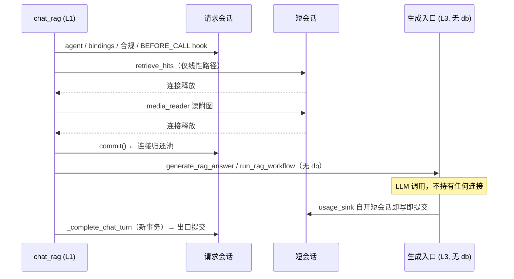

# 生成阶段不持有数据库连接（Agent RAG 对话链路）设计

> 状态：**待评审**
> 范围：`chat_rag.py` 的两条「检索→生成」路径（线性 `rag_answer` 与 LangGraph `run_rag_workflow`）
> 非目标：tool agent 循环、子智能体规划、a2a 路径（见 §7）
> 关联：[layering.md](../../architecture/layering.md)、`Settings.db_pool_*`
> **已被取代（2026-09-15）**：本文 §10.5 要求的 `short_db_session()` 机制已由
> [loop 感知的 DB 引擎与会话工厂](2026-09-15-loop-aware-db-engine-design.md) §5 取代（会话工厂自身
> 按事件循环取值，「选对工厂」不再是调用点的责任）；本文作为历史设计保留。

---

## 1. 背景与问题

`get_db` 是**请求级会话**（`packages/miles-core/.../infra/db/async_session.py`）：

```python
async with AsyncSessionLocal() as session:
    try:
        yield session
        await session.commit()
    except Exception:
        await session.rollback()
        raise
```

事务从 `chat()` 内 `get_agent_or_raise()` 的**第一条 SELECT** 开始，直到请求出口才提交。而 `chat()` → `rag_chat()` 的 LLM 调用夹在**中间**：

```text
BEGIN(隐式) → agent/bindings/hook 读写 → 检索 → 解析附图 → LLM(数十秒) → 调用记录/会话轮次 → COMMIT
                                                        ↑ 全程持有 1 个连接
```

后果有两层：

1. **连接占用**：引擎池为 `pool_size=5 + max_overflow=10 = 15`、`pool_timeout=30s`（已显式化为 `Settings.db_pool_*`）。并发对话数接近 15 时，后续请求（含列表页等共用同一池的请求）要等满 30s 才对 `TimeoutError` 报错，且池参数调大只是把问题后移。
2. **长事务**：单个事务跨越数十秒的外部调用，会拖住 PostgreSQL 的 vacuum 水位。

> 说明：以上为**代码路径推断**，本轮未做线上度量。§5 的验收以「生成期间请求会话零语句」这类可测断言为准，不以耗时数字为准。

---

## 2. 现状：两处占用 + 一处不一致

### 2.1 两条路径的差异

| | 线性 RAG（`rag_answer`） | LangGraph RAG（`run_rag_workflow`） |
|---|---|---|
| 是否接收 `db` | 是（`db: AsyncSession` 必填） | **否** |
| 检索用哪个会话 | **调用方（请求）会话** | 节点内 `async with AsyncSessionLocal()`（**已自开短会话**） |
| `media_reader` | `build_session_media_reader(self.db, ...)` | 同左（写入 configurable，供 generate/fallback 节点用） |
| `usage_sink` | `ChatUsageSink(db=self.db)` | 同左（写入 configurable） |

线性路径的检索在 L3 函数**内部**用请求会话，所以「L1 在调用前提交一次」会被它立刻重新打开并延续到 LLM 结束。LangGraph 路径不接收 `db`，检索节点已开短会话，因此 L1 只要在调用前提交即可。

### 2.2 用量写入的会话归属不一致

同一文件里两个 sink 的会话策略相反：

| sink | 会话 | 提交时机 |
|---|---|---|
| `FlowUsageSink`（画布节点） | **自开短会话** | `record` 内即写即提交 |
| `ChatUsageSink`（对话链路） | **调用方会话** | 随本轮到出口提交 |

`ChatUsageSink` 因此会在**每次 LLM 调用之后**重新抓住请求会话（`usage_sink.record()` 由 L3 在 LLM 返回后调用），使「生成期间不占连接」无法达成。

### 2.3 影响面

`ChatUsageSink` 的**直接构造点共 3 处**（`db` 参数只在直接构造时传入，故删除 `db` 只影响这 3 处）：

```text
miles_portal/tenant/agents/services/agent/chat_rag.py:416            ← 经 AgentService.chat_usage_sink 供 3 处调用
miles_portal/tenant/compliance/services/compliance/media_audit.py:77
miles_portal/tenant/a2a/invoke.py:151
```

另有：

- **协议声明 1 处**：`miles_ai/integrations/deepagents/io.py:57` 的 `chat_usage_sink`（L3 契约，不构造 sink）
- **经方法的调用点 8 处**：`chat_rag.py:192/264/345`、`a2a/invoke.py:319/381/403`、`deepagents/orchestrator.py:90/173`——这些**不传 `db`**，故不受签名变更影响，但**会受会话策略变更影响**（用量行变为即写即提交）

**改动此 sink 的会话策略会影响全部对话类用量写入**（含不在本次范围内的 tool agent 与 a2a），这是本设计最大的影响面，§4.4 单列。

---

## 3. 目标与不变量

### 目标

一次 agent chat 请求在**生成阶段**（LLM / 厂商 API 调用期间）**不持有数据库连接**。

### 必须保持不变（特征化测试锁定）

1. **生成结果逐字不变**：`answer` / `hits` / `steps` 与改造前一致。
2. **检索语义不变**：`retrieve_query` 用于检索、`prompt_query` 用于生成 prompt，两者的区分原样保留（现状实参映射见 §4.2③）。
3. **用量计量口径不变**：token 数、`ModelUsageLog` 行数、`AgentChatCall` 的 `prompt_tokens/completion_tokens` 汇总一致。
4. **出口收尾不变**：调用记录 + 会话轮次 + 失败审计仍在出口统一提交/回滚。

### 新增不变量（结构性）

**生成阶段的代码路径没有 `db` 句柄可用**——因为生成函数的签名里没有 `db`。这样"生成期间不碰 DB"不是注释约定，而是想碰也碰不到。

> 注意 `media_reader` 不违反此不变量：它是**数据访问端口**（L3 中性的 `MediaReader` 协议），内部自开会话；把它从"请求会话"换成"短会话"实现后，它不携带任何外部事务。

---

## 4. 设计

### 4.1 阶段边界

| 阶段 | 允许用 DB？ | 用哪个会话 |
|---|---|---|
| 前置：agent 加载、bindings、合规、BEFORE_CALL hook、模型解析 | 是（含写入 `HookExecutionLog`） | 请求会话 |
| 前置：检索、附图解析 | 是 | **短会话**，用完即释放 |
| **生成：LLM / 厂商 API** | **否** | —— |
| 收尾：调用记录、会话轮次、出站合规、AFTER_CALL hook | 是 | 请求会话（新事务，出口提交） |

### 4.2 改动清单

#### ① `models/services/usage.py`：`ChatUsageSink` 自开短会话

照搬 `FlowUsageSink.record` 的写法：`async with AsyncSessionLocal() as db: ... await db.commit()`。

- 构造参数 `db` 随之无用 → **删除**，同步更新 §2.3 的 3 处直接构造点。
- token 累计走 `_chat_usage_acc` **ContextVar**（`record_model_usage` 内同步更新），与 session 无关，**不受影响**。
- `record_model_usage` 保持共用（`UsageRecordContext` 承载 db），不新增重复逻辑。

#### ② `agents/services/agent/chat_rag.py`：L1 编排与收尾

- 两条路径上的 `build_session_media_reader(self.db, self.ctx)` 共 3 处，全部换成 `build_flow_media_reader(tenant_id=..., user_id=...)`（`media_reader.py` 中**已存在**该短会话实现）：
  - `chat_rag.py:155`（`resolve_chat_media_parts`，两条路径共用）
  - `chat_rag.py:363`（`run_rag_workflow` 的 `media_reader=`）
  - `chat_rag.py:376`（`rag_answer` 的 `media_reader=`）
  - 另 `chat_rag.py:281`（`_run_tool_agent`）**本轮不改**（属 tool agent 路径，见 §7）
- 线性路径：L1 先用短会话完成检索，再把 `hits` 交给生成（见 ③）。
- 生成前 `await self.db.commit()`，把连接归还池。
  - LangGraph 路径：`run_rag_workflow` 前提交即可（它不接收 db）。
  - 线性路径：检索已在 L1 用短会话完成，提交后生成阶段不再有语句。

#### ③ `miles-ai/rag/generate/answer.py`：生成入口去掉 db

现 `rag_answer` 承担两件事：检索 + 生成。拆开：

- **检索移到 L1**：L1 调用 `retrieve_hits(search_q, tenant_id=..., kb_ids=..., db=<短会话>, top_k=..., bindings=...)`，与 `rag_qa.retrieve` 节点同构。
- **抽取 `generate_rag_answer`**：只做「prompt 构造 + 附图解析 + `ainvoke_chat`」，签名**不含** `db` / `kb_ids` / `tenant_id` / `retrieve_query` / `bindings`，改为接收 L1 已取回的 `hits`；返回 `answer`（`hits` 已在 L1，供 `ChatResponse.sources`）。
- **删除 `rag_answer`**：拆分后它在生产上无调用方。§2.3 已确认两条 L3 入口的生产调用方只有 `chat_rag.py`，而它改用 `retrieve_hits` + `generate_rag_answer`；保留 `rag_answer` 只会成为"仅测试引用"的死代码，与本轮此前清理死代码的取向不一致。相关测试改为「`retrieve_hits` + `generate_rag_answer`」的组合，语义等价。

> 收口说明：方案 A 的表述是「`rag_answer` 新增可选 `hits`（命中则跳过检索），`db` 变为可选」。若照此保留 `rag_answer`，它的签名里仍有 `db`，结构性不变量（生成函数没有 `db` 参数）就落不到签名上；且它已无生产调用方。故此处收敛为「抽取无 `db` 的生成入口 + 删除组合入口」——这是对方案 A **字面表述**的收口，实质目标（L1 编排检索、生成阶段无 db 句柄）不变。

**实参映射必须原样保留**（现状，逐字核对过）：

| 路径 | 检索用 | prompt 用 |
|---|---|---|
| 线性 | `retrieve_query` | `prompt_query`（现 `rag_answer(query=prompt_query, retrieve_query=retrieve_query)`） |
| 图 | `retrieve_query`（现 `query=retrieve_query`） | `prompt_query` |

#### ④ `miles-ai/.../langgraph/graphs/rag_qa.py`：消除重复

`generate` / `fallback` 节点的「prompt 构造 + 附图解析 + `ainvoke_chat`」与 ③ 的生成逻辑**逐字重复**（含无命中时的兜底话术），改为复用 ③ 的生成入口。

`retrieve` 节点**不改**（已自开短会话）。

> 该 `retrieve` 节点是本设计的**既成先例**：L3 的读操作自开短会话、不借用调用方事务，正是本次要推广到全生成路径的形态。

### 4.3 数据流（改造后）



### 4.4 语义变化与错误处理

**唯一的语义变化**：前置读事务与 BEFORE_CALL 的 `HookExecutionLog` 会在生成前落库；若生成之后失败，它们不再随本轮回滚。

这是"提前收尾连接"的必然代价。方向与上一轮已落地的「失败审计自己提交」一致：日志类数据不应因后续失败而消失。

**`ChatUsageSink` 的全局语义变化**（影响 §2.3 的 3 处直接构造点 + 8 处经方法调用点）：用量行由「随本轮事务」变为「即写即提交」。

- 理由：token 已被真实消耗；现状下若生成之后失败，用量行会被回滚，属于**少计**。
- 与 `FlowUsageSink` 对齐，消除同文件内的策略分叉。
- `AgentChatCall` 的 token 汇总依赖 ContextVar 累计（与 session 无关），**不受影响**；但见 §8 的待验证疑点。

**错误处理**：生成前的 `commit()` 失败**不吞异常**，直接上抛。与失败审计里"commit 失败只记日志、不掩盖原始异常"的策略不同——那里是异常路径的尽力而为，这里是正常路径的必经收尾，且后续 `_complete_chat_turn` 需要同一会话可用。

---

## 5. 验收标准

1. 生成入口（③）的签名**不含** `db`，并有结构测试断言（防止未来被加回来）。
2. 线性路径：L1 在进入生成前已 `commit` 请求会话，且检索走短会话 —— 有行为测试（沿用 `tests/tenant/agents/test_chat_entry_routing.py` 里 `_TxnDb` 的计数模式）。
3. LangGraph 路径：L1 在 `run_rag_workflow` 前 `commit`，生成期间无请求会话语句。
4. `ChatUsageSink` 不再接收/使用调用方会话；§2.3 的 3 处直接构造点同步更新；有测试断言 `record` 后调用方会话未被触碰。
5. 两条路径的 `media_reader` 均为短会话实现。
6. `answer` / `hits` / `steps` 与改造前逐字一致（特征化测试：`tests/rag/test_rag_answer_stream.py`、`tests/rag/test_rag_multimodal.py` 及 RAG 图测试）。
7. 门禁全绿：`ruff check` / `ruff format --check` / `import-linter` / 全量 `pytest`。
8. 变异测试有效：去掉生成前的 `commit`、把 `db` 加回生成入口 —— 护栏必须失败。

---

## 6. 风险与缓解

| 风险 | 缓解 |
|------|------|
| `ChatUsageSink` 改动波及全部对话类用量写入（含 tool agent / a2a / deepagents） | §2.3 列出全部直接构造点（3）与经方法调用点（8）逐一更新；对 `ModelUsageLog` 写入与 `AgentChatCall` 汇总加特征化测试 |
| 提前 commit 后前置 hook 日志不再随本轮回滚 | 显式记录为设计取舍（§4.4）；`HookExecutionLog` 属日志类数据，与「失败审计自己提交」方向一致 |
| 删除 `rag_answer` 的组合入口后测试无法表达原意图 | 先用特征化测试锁定 `answer/hits/steps`；测试改为「`retrieve_hits` + 生成入口」的组合，语义等价 |
| `retrieve_query` / `prompt_query` 的实参在搬迁中被对调 | §4.2③ 表格逐字记录现状映射；由特征化测试覆盖「检索用 A、prompt 用 B」的区分 |
| 生成前 `commit()` 失败被吞 | 明确不吞、直接上抛（§4.4） |

---

## 7. 非目标

- tool agent 循环（`loop.py`）的**按迭代**收尾：该路径每次 LLM 调用后都有用量写入、且工具执行器 `build_agent_tool_executor(self.db, ...)` 使用请求会话（生图类工具会**写** job 行），按迭代提交会把"整轮原子"变为"每迭代原子"，属独立取舍。
- 子智能体规划（deepagents orchestrator）、a2a 路径。
- 事务隔离级别、连接池容量（池参数已另行显式化）。
- `rag_chat` 中「未配置大模型」的纯检索分支（无 LLM 调用，不存在长事务）。
- 生成结果、用量计量口径、调用记录写入时机（除上一轮已修的失败审计）。
- `direct_chat`（无 KB 直连）**不列为**非目标：它与两条 RAG 路径同形——事务由解析模型时的凭据读取开启，随后被单次 LLM 调用全程持有，故本轮经显式裁决一并处理（生成前 `commit`）。

---

## 8. 待验证疑点与顺带观察

### 8.1 ContextVar 是否跨 task 丢失（改造前先确认，不预设结论）

`ChatUsageSink` 走 `_chat_usage_acc` ContextVar 累计 token，供 `AgentChatCall` 汇总。若 LangGraph 在**独立 task** 中执行节点，节点内对 ContextVar 的写入不会回到调用方上下文 → `AgentChatCall.prompt_tokens` 可能恒为 0（而 `ModelUsageLog` 行正常）。

这是**改造前就可能存在**的问题，非本次引入。实施时先用一个测试确认：

- 若确认丢失 → 报告并决定是否在本轮一并修（在范围内，因为正好动这块）。
- 若正常 → 在测试中固化该行为。

### 8.2 顺带观察：附图字节被读两遍（不在本次范围）

`chat_rag.py:341` 的 `chat_query, _ = await self.resolve_chat_media_parts(agent, body)` 会**完整读取并丢弃**附图字节，只为判断"是否存在有效附图"以决定 `prompt_query` 的兜底文案；随后生成阶段（`generate_rag_answer` / 图节点）会**再读一次**同一批附图。

改造②把这个调用换成短会话后，读取次数不变（仍是两遍），只是会话来源变了。是否顺带消除这次重复读取（例如改为只做"引用是否有效"的轻量校验）属独立优化，本设计不承诺。

---

## 9. 修订记录

### 2026-09-14：实施落地

1. **§4.2③ 收口**：原表述「`rag_answer` 新增可选 `hits`、`db` 变为可选」无法把「生成函数没有 db」落到签名上，改为「抽出无 db 的 `generate_rag_answer` + 删除组合入口 `rag_answer`」。
2. **§8.1 结论**：探针确认 `_chat_usage_acc` 的写入**会**丢在 LangGraph 的独立 task 里（`AgentChatCall` 恒记 0 token）；已改为让 ContextVar 持有可变的 `ChatUsageAccumulator`、累加走**原地修改**，使子上下文的写入对调用方可见。回归测试：`tests/tenant/agents/test_rag_usage_accumulation.py`（该测试即结论载体）。
3. **范围外补充**：`direct_chat`（无 KB 直连）同属「LLM 单次调用期间持有连接」，已一并处理，见 §7 非目标清单的边界说明。
4. **附图读取处数**：实际改动 3 处（`resolve_chat_media_parts` 与两条生成分支），`_run_tool_agent` 未改。
5. **§10 新增（Worker 短会话）**：本分支在对话链路上新增的 3 个短会话**调用点**原用全局
   `AsyncSessionLocal`，而该路径在 Celery 内可达，跨 loop 复用连接必失败；已改走 worker-aware
   短会话，并把 helper 更名 `short_db_session`（现服务生成任务 / chat 用量 / 媒体读取 / 检索
   四处）。其余既有同险站点经裁决不在本分支修复，清单与复现见 §10（**2026-09-15 已修，见下条**）。

### 2026-09-15：Worker 同险站点补齐（§10 收口）

1. **§10.4 站点已修**：把 Celery 任务内可达、仍在用全局短会话的站点统一改用
   `short_db_session()`（Task 1 改 **10 文件 12 处**），并删掉各文件因此不再使用的
   `AsyncSessionLocal` import。注意 `progress.py` **不在这 12 处里**：它在基点（`4ba6ce5f`）
   就已经是 `short_db_session`（上一分支更名时迁过去的），本分支对该文件的生产代码**零改动**。
2. **清单漏项**：`miles_ai.integrations.generative.jobs.progress`（生成任务进度 / 取消）不
   在初版 10 文件清单内，属「按 Task 1 触碰过的文件抄清单」造成的漏项。它本就是安全的
   （见上条），本次补的不是它的代码，而是把它补进**必须受护栏保护的不变量清单**。为防同类
   漏项重演，结构不变量测试改为与**源码交叉核对**（见 §10.5），同类漏项此后会立刻失败而非静默。
3. **护栏补齐（§10.5）**：逐站点补「全局会话换成调用即炸替身」用例，并新增结构不变量
   `tests/infra/test_no_global_session_in_worker_paths.py`（13 模块清单 + 基于 **AST** 的交叉
   核对，且「谁可以碰全局会话」必须恰好等于显式 allowlist）；另补组合不变量
   `tests/infra/test_worker_session_composition.py`（真实站点在 worker 块内/外各用哪个工厂）。
4. **Worker engine 走 `build_engine`**：`get_worker_session()` 原为手搓 `create_async_engine`，
   静默忽略 `db_pool_size` / `db_max_overflow` / `db_pool_timeout`，已改为复用 `build_engine`
   并补接线测试（见 §10.5）。
5. **端到端复跑（§10.2）**：真库探针按 Celery 形态连续 6 次 `asyncio.run`，块内依次调用
   LangGraph `retrieve` 节点、`FlowUsageSink.record`、`progress.*`；worker 臂 **6/6 ok**，
   对照臂（会话工厂换回全局）第 2/4/6 轮 FAIL 于
   `got Future ... attached to a different loop`。

---

## 10. Worker 内曾走全局会话的既有站点（已修复）

> 本节记录分支终审（不变量 I1）发现、曾**另立专项**的既有隐患。机制与复现证据（§10.1 /
> §10.2）保留在此：它们解释了「为什么 Worker 内必须用 `short_db_session`」，对后续新增
> Worker 调用点仍是判据。
>
> **状态（2026-09-15）**：§10.4 列出的站点已**全部**改用 `short_db_session()`，并补齐逐站点
> 护栏与结构不变量（§10.5）；修复后的对照探针见 §10.2 末段。

### 10.1 机制

Celery 任务入口用 `asyncio.run(...)`（如 `miles-worker/.../tasks/agent_schedule.py:84`
→ `AgentService.chat`），每次调用新建事件循环；而**全局** `engine` 的连接池持有上一个 loop
创建的 asyncpg 连接，复用它即抛：

```text
RuntimeError: ... got Future attached to a different loop
```

`get_worker_session()`（`miles-core/.../infra/db/async_session.py`）在任务生命周期内把
`_worker_sessionmaker` 绑定到当前 loop 的 engine；`short_db_session()` 优先用它，
**无绑定时才**回退全局。因此「在 Worker 内打开的全局短会话」都是潜在故障点。

### 10.2 复现证据（真库、同进程）

连续 6 次 `asyncio.run`，每轮各跑一次全局会话与 `get_worker_session()`：

```text
run#1 global -> ok          run#1 worker -> ok
run#2 global -> FAIL        run#2 worker -> ok
run#3 global -> ok          run#3 worker -> ok
run#4 global -> FAIL        run#4 worker -> ok
run#5 global -> ok          run#5 worker -> ok
run#6 global -> FAIL        run#6 worker -> ok
```

全局在第 2/4/6 次失败（约一半），worker 会话 6/6 正常。`ChatUsageSink.record` 无
try/except，异常直接冒泡，故定时智能体任务约一半会在生成中途失败 —— 即本分支修掉的那个。

**修复后复跑（2026-09-15，真库、同进程）**：同一形态连续 6 次 `asyncio.run`，块内依次调用
LangGraph `retrieve` 节点、`FlowUsageSink.record`、`progress.update_generative_job_progress` /
`is_generative_job_cancelled`：

```text
worker 臂（站点走 short_db_session）      -> 6/6 ok
对照臂（同一批站点的会话工厂换回全局）    -> 第 2/4/6 轮 FAIL
```

对照臂的失败仍是 `RuntimeError: ... got Future ... attached to a different loop`，与上面同一
形态；这说明上述「≈一半」不是探针自带抖动，而是全局会话在跨 loop 复用下的确定性行为。

### 10.3 先期已修（3 个调用点）

> 「3 处」指**调用点**，不是器件：`FlowMediaReader` 类本身在 `main` 上就有，且其中两处
> `AsyncSessionLocal` 也是既有的；本分支新增的是它在 Agent 对话路径上的调用
> （`chat_rag.py` 改用 `build_flow_media_reader`），以及另两个短会话调用点。

| 站点 | 位置（改动前） |
|------|----------------|
| `ChatUsageSink.record` | `miles-portal/.../models/services/usage.py:128` |
| 线性检索短会话 | `miles-portal/.../agents/services/agent/chat_rag.py:381` |
| `FlowMediaReader.read_image_bytes` / `read_attachment_bytes` | `miles-portal/.../attachments/services/media_reader.py:44` / `:50` |

`usage.py` 的 import 已随 §10.4 一并收敛：其 `FlowUsageSink.record` 也改走短会话后，该文件不再
引用全局工厂。

### 10.4 已修的既有同险站点

机制同上、同样在 Worker 内可达。原先按「只修本分支新增的 3 个调用点」裁决留在范围外，
**2026-09-15 已全部改用 `short_db_session()`**。本分支 Task 1 实际改动为 **10 文件 12 处**。

**计数口径**（三个数字常被混用，含义不同，不要再当作互相矛盾）：

| 数字 | 含义 |
|------|------|
| **10 文件 / 12 处** | 本分支 Task 1 实际改动（`git diff` 口径），也是 `-AsyncSessionLocal()` / `+short_db_session()` 的计数 |
| **11 文件 / 14 处** | 本节下表枚举的 Worker 同险**站点**总数。其中 `progress.py` 的 2 处在基点即已是 `short_db_session`，本分支未改其生产代码，故 `git diff` 只有 10 文件 12 处 |
| **13 模块** | 必须受 §10.5 结构护栏保护的 Worker 可达**模块**数 = Task 1 的 10 个 + 此前已是 `short_db_session` 的 `progress.py` / `chat_rag` / `media_reader` |

行号取自**改动前基线**（`main`）；下表「→ 现」是**修复前**的当前值，修复后请**以符号名定位，
不要照抄行号**。

| 站点 | 位置（`main` → 修复前） |
|------|----------------------|
| LangGraph `retrieve` 节点 | `miles-ai/.../integrations/langgraph/graphs/rag_qa.py:57` → 现 `:67` |
| `FlowUsageSink.record` | `miles-portal/.../models/services/usage.py:134` → 现 `:167` |
| flow 工具调用 | `miles-portal/.../tools/services/flow_invoker.py:40` |
| flow `RunContext` 模型解析 | `miles-portal/.../flows/services/run_context.py:25` |
| 子流程图加载 | `miles-portal/.../flows/services/subflow_loader.py:25` |
| 提示词模板加载 | `miles-portal/.../prompts/services/template_loader.py:42` |
| 敏感词加载 | `miles-portal/.../compliance/services/scan_words_loader.py:24` |
| `KnowledgeSearch` 节点 | `miles-ai/.../flow_runtime/nodes/rag_nodes.py:48` |
| 生图节点 | `miles-ai/.../flow_runtime/nodes/image_generate.py:55` / `:84` |
| 生视频节点 | `miles-ai/.../flow_runtime/nodes/video_generate.py:56` / `:86` |
| 生成任务进度 / 取消（**原清单漏记**） | `miles-ai/.../integrations/generative/jobs/progress.py:54` / `:75` |

表内未标注「→ 现」的文件，`main` 的行号与修复前一致（未受前一轮改动影响）。

**原清单漏记的一处**：`miles_ai.integrations.generative.jobs.progress` 同样落在 Worker 调用
子树内（生成任务 `job_execution` 的轮询分支读写进度 / 取消状态），但初版 10 文件清单没有它
—— 这正是「按 Task 1 触碰过的文件抄清单」的漏项。它**在基点上就已经是安全的**
（`4ba6ce5f` 即用 `short_db_session`，属上一分支更名时迁移的结果），本分支只补了护栏与清单
登记、生产代码零改动；为防同类漏项重演，结构不变量测试改为与**源码交叉核对**清单
（见 §10.5）：新增（或漏记）的站点会立刻以「清单缺项」失败，而不是静默留在网外。

**下表这 11 文件 14 处都落在 `get_worker_session()` 块内**（Celery 侧唯一入口 `agent_schedule`
的 `svc.chat` 在块内，表内站点均在其调用子树中），因此「换成 `short_db_session()`」这一步即可
生效，无需调整任务结构。将来若新增块**外**的 Worker 调用点，故障会静默复现（见下一条前提），
届时需调整结构而非换符号。这一「前提—组合」如今由已提交的
`tests/infra/test_worker_session_composition.py` 守住：块内真实站点必须拿到 worker 工厂、
块外必须回退全局。

**为何其它 `AsyncSessionLocal()` 调用点不在上表**：判断依据是「能否在 Celery 任务内执行」，
而非「是否用了全局会话」。全仓其余调用点只在单 loop 进程内运行，故无此风险：
`miles-core/risk/enforce.py`（只被 Web 中间件 `web/middlewares/platform_risk.py` 与
Admin 服务 `miles_admin/.../services/risk.py` 调用，均为独立单 loop 进程）、
`agents/ws/chat.py` 与 `agents/ws/job_watch.py`（WebSocket 端点）、
`miles-server` 的 CLI 脚本（`backfill_media_assets.py`、`db_ops.py`；每次进程调用只
`asyncio.run` 一次，故同进程内不存在第二个 loop，且 Worker 子树 `miles_worker.tasks`
从不 import `miles_server`）。
新增调用点时请沿用同一判据。

这份「谁可以碰全局会话」的名单是**显式登记**的，不是惯例：结构不变量测试用 AST 扫出全仓
`AsyncSessionLocal` 引用集合，要求它恰好等于 `EXCLUDED_INFRA_MODULES` +
`EXCLUDED_SINGLE_LOOP_MODULES`（上段列出的 5 个）。新增引用会在 CI 立刻红，必须在此处登记
并接受 loop 安全性审查——这是为防「新增模块直接用全局会话」这一最危险的回归形态（旧测试
只看得见 `short_db_session(`，对它无感）。

**处理方式**（同 10.3）：把 `async with AsyncSessionLocal() as db:` 换成
`async with short_db_session() as db:`；若该文件因此不再引用全局工厂，同步删除其 import
（上表站点已完成，`usage.py` 的 import 亦随之删除）。

> ⚠️ **前提：调用点必须落在 `get_worker_session()` 块内。**
> `short_db_session()` 靠 `_worker_sessionmaker` ContextVar 判断是否有 worker engine，
> 而该变量由 `get_worker_session()` 在 `__aenter__` 绑定、`__aexit__` **重置**。
> 若在块外调用，它会**静默回退全局** `AsyncSessionLocal` —— 即等于没修。
> `run_agent_schedule` 的结构是安全的（`svc.chat(...)` 在块内，见
> `tasks/agent_schedule.py:34` 与 `:59`），改造上表站点时已逐个确认这一点；
> 真正跑在块外的调用点应按 worker 任务结构调整，而不是简单替换符号。

### 10.5 护栏覆盖现状（已补齐）

先前为对话链路补的护栏（`tests/infra/test_short_db_session.py`、
`test_chat_usage_sink_session.py`、`test_flow_media_reader.py`、
`test_chat_rag_connection_release.py`）**只覆盖 §10.3 的三处**。2026-09-15 已为 §10.4 的每个
站点补上同形用例（用记录用替身替换 `short_db_session`，同时把 `AsyncSessionLocal` 换成
`raising=False` 的「调用即炸」替身，钉住回退），并新增结构不变量
`tests/infra/test_no_global_session_in_worker_paths.py`：

- 13 个 Worker 可达模块的命名空间里**不得有** `AsyncSessionLocal`、**必须有**
  `short_db_session`（回退或改名都会红）；
- 反向断言：回退实现 `miles_core.infra.db.async_session` 与其 barrel `miles_core.infra.db`
  两个符号都在（去掉全局引用会让 API / CLI 路径失效）；
- 清单与**源码交叉核对**：`test_list_matches_every_short_db_session_call_site` 要求清单
  等于「全仓所有 `short_db_session` 引用点 − 有意排除的基础设施模块」，故新增（或漏记）的站点
  会立刻以「清单缺项」失败，而不会像 `progress.py` 那样静默漏过一轮；
- `test_only_registered_modules_may_touch_the_global_session`：全仓 `AsyncSessionLocal` 引用
  集合必须恰好等于显式 allowlist（见 §10.4 末段），把「谁可以碰全局会话」变成必须登记的决策；
- 两处交叉核对都走 **AST**（符号引用），不是文本正则：注释 / docstring / 字符串里的同名文本
  不再计入。正则实现曾让「在 `sync.py` 里写一句含 `short_db_session()` 的注释」直接 CI 红，
  这是个真坑。

**组合前提也已落测**：`tests/infra/test_worker_session_composition.py` 驱动真实站点
（`progress.update_generative_job_progress`）在 `get_worker_session()` 块内 / 块外 / 块内
spawn 的子任务中运行，断言**用了哪个工厂**（替身 sessionmaker 带标签），而不是「没抛异常」。
没有这条测试时，「`get_worker_session()` 不再绑定 ContextVar」这一回归只会被
`test_short_db_session.py` 的 helper 用例偶然看到。

**Worker engine 的池参数**：`test_db_pool_settings.py` 断言 `get_worker_session()` 经
`build_engine` 构造 engine、且 `pool_size` / `max_overflow` / `pool_timeout` /
`pool_pre_ping` / `echo` 都来自 `Settings`（此前手搓 engine，这些参数被静默丢掉）。

> **仍未覆盖（明确 defer）**：本分支是「每处记得选对工厂」的惯例 + 护栏，不是结构性修复；
> 万一 LangGraph / anyio 内部把某个节点跑在与调用方**脱离**的上下文里，该站点会静默退化为
> 全局会话，任何护栏都看不见（唯一症状是生产日志里的跨 loop `RuntimeError`）。结构性方案
> 是在 Celery 边界做 loop-aware 的 sessionmaker 选择（仓库已为 Redis 这么做：`get_redis()`
> 按 loop id 重建），那样连既有排除项与未来新站点也一并覆盖；该改动涉及核心基础设施
> （旧 engine / 池的释放与生命周期），另立专项。
