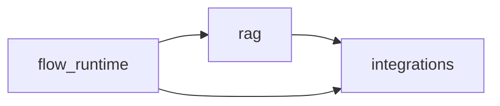

# miles_ai 内部分层归位（integrations 的 L2 代码回收）设计

> 状态：**待评审**
> 关联：[layering.md](../../architecture/layering.md) §2.4/§2.5、[2026-09-11-backend-uv-workspace-multipackage-design.md](./2026-09-11-backend-uv-workspace-multipackage-design.md) §11、[2026-09-21-tests-structure-design.md](./2026-09-21-tests-structure-design.md)
> 目标形态：`miles-ai` 包内部形成 `flow_runtime → rag → integrations` 的严格单向分层，由 `.importlinter` 固化为契约；**本次不新增第 11 个 distribution**。

---

## 1. 背景与动机

`2026-09-11` 的 uv workspace 重构把后端拆成 10 个包时，把文档中分属两层的 `rag/`（L2）与 `integrations/`（L3）**合并装进 `miles_ai`**，目的是把 `rag ↔ integrations` 的环吞进包内、避免改引擎装配。该文档 §11 明确记录这是**临时折衷**，并把"拆出 `miles_integration`（第 11 包）"列为优先级最高的后续项。

本次评估后**收窄了范围**：只做代码归位与方向冻结，不建第 11 个包。理由见 §9。

### 现状问题

`integrations/` 名义上是 L3「只封装 LangChain / LangGraph / LiteLLM / DeepAgents」的适配层，实际混装了三类职责。实测（2026-09-22，`main`）：

- `integrations/` 共 **95** 个 `.py` / **7391** 行，分 9 个子包；
- 其中 **13 个文件、21 条 import** 反向依赖 `rag` / `flow_runtime`，全部集中在 `langchain/` 与 `langgraph/` 两个子包；
- 另外 6 个子包（`generative` 30、`embeddings` 11、`rerank` 10、`deepagents` 5、`litellm` 3、`chat` 2）共 61 个文件**零反向边**，是干净的适配层。

包内真实跨子包依赖（实测 import 计数）：

| 边 | 数量 | 判定 |
|----|-----:|------|
| `rag → integrations` | 7 | ✅ 合法（L2→L3） |
| `flow_runtime → rag` | 3 | ✅ 合法 |
| `flow_runtime → integrations` | 6 | ✅ 合法 |
| `integrations → rag` | 8 | ❌ 违分层 |
| `integrations → flow_runtime` | 13 | ❌ 违分层 |

根因是**子包名与内容不符**：`langchain/`、`langgraph/` 按技术名建包，于是把"用该技术写的**编排逻辑**"也塞了进去。典型证据：

- `integrations/langchain/vectorstores.py` 自述「LangChain 向量检索适配层（L3，纯转发壳）」，但全文**不含任何 LangChain 代码**，只是 `rag.retrieve.multi_kb` 的转发；
- `integrations/langchain/kb_retrieval.py` 只是一个依赖 `rag.retrieve.multi_kb` 类型别名的 `@dataclass`；
- `integrations/langgraph/compiler/` 是**画布流程**的编译器，与 `flow_runtime.nodes.registry` 强耦合（`SUPPORTED_CANVAS_NODE_TYPES` 必须与节点注册表键名一致）；
- `integrations/langchain/__init__.py` 的惰性门面同时 re-export `rag.chunk` / `rag.generate` 与 `integrations.langchain.*`，是 L2/L3 的缝合处——而 [layering.md](../../architecture/layering.md) §5.1 本就明令「禁止无逻辑 re-export 包」。

### 为什么现在做

归位后，包内的 L2→L3 方向可以**用一条 `layers` 契约冻结**，不再依赖文档约定；否则 `integrations` 这个桶会持续吸收新的编排代码（上述 13 个文件就是逐步长出来的）。

---

## 2. 目标与非目标

### 目标

1. `integrations/` 恢复为纯适配层（只含 ① 桶），对 `rag` / `flow_runtime` 的依赖为 **0**。
2. `miles_ai` 内部方向固定为 `flow_runtime → rag → integrations`，由 `.importlinter` 的 `layers` 契约强制。
3. **消费者可见 L3 import 路径零变化**（当时仍在 `miles_ai` 包内 `integrations/`；后续第 11 包拆分见拆包 design）。
4. 不新增 distribution：无新 `pyproject.toml`、无 CI / Dockerfile / compose 改动。
5. 行为不变：全量 `pytest` 通过、OpenAPI 快照零漂移。

### 非目标

- **不建 `miles_integration` 第 11 包**（见 §9，留作后续项，本设计是其严格前置子集）。
- 不改 ① 桶 82 个文件的位置与内部结构。
- 不改 `miles_ai` 对 `miles_core` / `miles_common` 的依赖声明。
- 不动 `rag` / `flow_runtime` 的既有目录结构（只**新增** `rag/graph/`、`flow_runtime/compiler/`）。

---

## 3. 目标结构

```text
packages/miles-ai/src/miles_ai/
├── rag/                                  # L2
│   ├── graph/                            # 新增：③ Agent RAG LangGraph 引擎
│   │   ├── __init__.py                   # barrel（对外唯一 export）
│   │   ├── constants.py                  # ← integrations/langgraph/constants.py
│   │   ├── state.py                      # ← integrations/langgraph/state.py
│   │   ├── grading.py                    # ← integrations/langgraph/grading.py
│   │   ├── rag_qa.py                     # ← integrations/langgraph/graphs/rag_qa.py
│   │   ├── runner.py                     # ← integrations/langgraph/runner.py
│   │   └── compiled.py                   # 新增：← checkpointer 的 RAG 图编译单例
│   ├── retrieve/
│   │   ├── bindings.py                   # ← integrations/langchain/kb_retrieval.py
│   │   └── …                             # 不变
│   └── parse/upload_policy.py            # 收编 should_use_visual_image_embedding
│
├── flow_runtime/                         # L2
│   ├── compiler/                         # 新增：② 画布 LangGraph 编译器
│   │   ├── __init__.py  report.py  validate.py  state.py  build.py  run.py
│   │   └── (全部 ← integrations/langgraph/compiler/)
│   ├── graph_runner.py                   # ← integrations/langgraph/flow_runner.py
│   ├── graph_analysis.py                 # ← integrations/langgraph/graph_analysis.py
│   └── …                                 # 不变
│
└── integrations/                         # L3，纯适配（零反向边）
    ├── embeddings/policy.py              # 新增：← visual_embeddings.ensure_clip_model
    ├── langchain/                        # chat_models + tool_agent/ + toolkit/（门面删除）
    ├── langgraph/checkpointer.py         # 只留通用 Redis/Memory checkpointer 生命周期
    ├── generative/  embeddings/  rerank/  deepagents/  litellm/  chat/   # 不变
    └── …
```

依赖方向：



`integrations` 是 `miles_ai` 内的叶子；`rag` 不得依赖 `flow_runtime`（当前实测为 0，是真实约束——`flow_runtime` 依赖 `rag`）。

---

## 4. 迁移映射表

### 4.1 ② 画布流程引擎 → `flow_runtime`（8 文件）

| 迁前（`miles_ai` 包内相对路径） | 现行路径 |
|------------|-----------|
| `integrations/langgraph/compiler`（包） | `miles_ai.flow_runtime.compiler` |
| ↳ `.compiler.report` / `.validate` / `.state` / `.build` / `.run` / `.__init__` | 同名平移 |
| `integrations/langgraph/flow_runner` | `miles_ai.flow_runtime.graph_runner` |
| `integrations/langgraph/graph_analysis` | `miles_ai.flow_runtime.graph_analysis` |

平移后 `compiler/*` 内 `from miles_ai.flow_runtime.* import …` 变为包内引用，不再构成反向边。

### 4.2 ③ Agent RAG 图引擎 → `rag/graph/`

③ 桶本体 6 个文件，另附 3 项同批处理的删除/搬迁：

| 迁前（`miles_ai` 包内相对路径） | 现行路径 |
|------------|-----------|
| `integrations/langgraph/constants` | `miles_ai.rag.graph.constants` |
| `integrations/langgraph/state` | `miles_ai.rag.graph.state` |
| `integrations/langgraph/grading` | `miles_ai.rag.graph.grading` |
| `integrations/langgraph/graphs/rag_qa` | `miles_ai.rag.graph.rag_qa` |
| `integrations/langgraph/runner` | `miles_ai.rag.graph.runner` |
| `integrations/langgraph/graphs`（`__init__`，10 行） | 并入 `rag/graph/__init__.py` |
| `integrations/langchain/kb_retrieval` | `miles_ai.rag.retrieve.bindings` |
| `integrations/langchain/vectorstores` | **删除**（见 §4.4） |
| `integrations/langchain/__init__` | **剥离跨层 re-export**（见 §4.5；后随第 11 包迁入 `miles_integrations`） |

`rag/generate/answer.py` 原经 `vectorstores` 间接 import `rag.retrieve.multi_kb`；删除后改为**直接** import 同一模块，绕过 `rag/retrieve/__init__.py` 的惰性 `__getattr__`，与拆分前的实际解析路径逐字一致，不新增循环 import。

`rag/graph/constants.py` 的 `RELEVANCE_GOOD/POOR/NONE` 与 `GRADE_BRANCH_HANDLES` 被 `flow_runtime.graph_analysis` 与 `flow_runtime.compiler.{state,build,validate}` 引用，方向为 `flow_runtime → rag`，合法。

### 4.3 两处需要在文件内做手术的模块

**`integrations/langchain/visual_embeddings.py`（24 行，职责混装）→ 拆除**

| 现符号 | 新归属 | 理由 |
|--------|--------|------|
| `ensure_clip_model` | `miles_integrations.embeddings.policy` | 纯模型类型校验，只依赖 `integrations.embeddings.{constants,model_meta}`；与既有 `integrations/generative/policy.py` 同构 |
| `should_use_visual_image_embedding` | `miles_ai.rag.parse.upload_policy` | 入库策略，依赖 `miles_core.models.kb` ORM + `rag.parse.media.is_image_file`，属 L2 |

**`integrations/langgraph/checkpointer.py`（128 行，职责混装）→ 拆分**

| 现符号 | 新归属 | 理由 |
|--------|--------|------|
| `get_checkpointer`、`checkpoint_backend`、`shutdown_langgraph_checkpointer`、`_import_async_redis_saver`、`_checkpointer` / `_backend` / `_exit_stack` 三个全局 | 留 `miles_integrations.langgraph.checkpointer` | 通用 LangGraph 基础设施；`integrations/deepagents/runner.py` 与 `miles_server` lifespan 均在消费 |
| `_compiled_rag_graph` 单例、`get_compiled_rag_graph`，以及 `init_langgraph_checkpointer` 内**仅**负责 RAG 图编译的那条语句 | 新增 `miles_ai.rag.graph.compiled` | RAG 图编译是 ③ 的职责；改后方向为 `rag → integrations`（合法） |

`init_langgraph_checkpointer` 本身留在 `integrations`，但**只**保留 checkpointer 生命周期（Redis 探测、降级 MemorySaver、日志），不再编译 RAG 图。`rag/graph/compiled.py` 通过 `integrations.langgraph.checkpointer.get_checkpointer()` 取后端，因此 `integrations` 不再持有任何 `rag` 引用。`miles_server` lifespan 需在现有调用之后追加一次 `rag.graph.compiled` 的绑定调用（见 §6）。

### 4.4 `langchain/vectorstores.py` → 删除

- 全文 71 行、**零 LangChain 代码**，只是 `rag.retrieve.multi_kb` 的转发壳；
- 唯一消费者是 `miles_ai.rag.generate.answer`（且只用到 `search_multi_kb_async`）；同模块的 `search_kb`（同步版）**全仓零调用**；
- 因此删除该模块，`rag/generate/answer.py` 直连 `rag.retrieve.multi_kb.search_multi_kb_async`。

> 与 [layering.md](../../architecture/layering.md) §5.1「禁止无逻辑 re-export 包」一致；删除后 `tests/test_no_unreferenced_modules.py` 不会新增白名单条目。

### 4.5 `langchain/__init__.py` 惰性门面 → 删除

删除前已实测：**全仓零消费者**（无任何 `from miles_integrations.langchain import …` 形式的调用），因此不需要迁移调用方。

该门面 re-export 的 11 个名字按新归属收敛到各自真源：`ainvoke_chat` / `get_chat_model` → `integrations.langchain.chat_models`；`split_text` → `rag.chunk`；`retrieve_hits` 等 5 个 → `rag.generate`；`search_kb` / `search_multi_kb_async` → 随 §4.4 消失。

### 4.6 `integrations/langgraph/` 迁完后只剩两个文件

`__init__.py`（门面，改为只导出 checkpointer 相关内容）+ `checkpointer.py`。保留该子包（与 `integrations/litellm/` 3 文件、`integrations/chat/` 2 文件的既有粒度一致），不合并进上层。

---

## 5. 生产侧引用改写清单

已实测的**全部**需改写位置（不含测试）：

| 文件 | 改动 |
|------|------|
| `miles_ai/flow_runtime/runtime_factory.py` | `integrations.langgraph.flow_runner` → `flow_runtime.graph_runner`；同步更新模块 docstring 的两处提及 |
| `miles_ai/flow_runtime/nodes/grade_nodes.py` | `integrations.langgraph.grading.evaluate_relevance` → `rag.graph.grading`；更新 docstring |
| `miles_ai/rag/generate/answer.py` | `kb_retrieval.KbRetrievalBindings` → `rag.retrieve.bindings`；`vectorstores.search_multi_kb_async` → `rag.retrieve.multi_kb`；更新 docstring |
| `miles_ai/rag/generate/__init__.py` | docstring 里的 `integrations.langgraph.graphs.rag_qa` → `rag.graph.rag_qa` |
| `miles_ai/rag/pipeline/ingest.py` | `integrations.langchain.visual_embeddings.should_use_visual_image_embedding` → `rag.parse.upload_policy` |
| `miles_portal/tenant/flows/services/flow.py` | 2 处 `integrations.langgraph.compiler` → `flow_runtime.compiler` |
| `miles_portal/tenant/agents/services/architecture.py` | `integrations.langgraph.runner.should_use_langgraph_rag` → `rag.graph.runner` |
| `miles_portal/tenant/agents/services/agent/chat_rag.py` | 同上（`run_rag_workflow` + `should_use_langgraph_rag`） |
| `miles_portal/tenant/agents/services/agent/chat_turn.py` | 同上 |
| `miles_portal/tenant/kb/services/embeddings.py` | `kb_retrieval.KbRetrievalBindings` → `rag.retrieve.bindings`；`ensure_clip_model` → `integrations.embeddings.policy` |
| `miles_portal/tenant/kb/services/kb/core.py` | `ensure_clip_model` → `integrations.embeddings.policy` |
| `miles_server/apps/application.py` | `init_langgraph_checkpointer` / `shutdown_langgraph_checkpointer` 来源不变；追加 `rag.graph.compiled` 的绑定/解绑调用 |

`miles_ai/rag/generate/__init__.py`、`integrations/langgraph/__init__.py`、`integrations/langchain/__init__.py` 的 docstring 与 `layering.md` §2.4/§3.1/§5.2 的路径示例一并同步。

---

## 6. `miles_server` lifespan 调整

现状（`miles_server/apps/application.py`）：

```python
app.state.langgraph_checkpoint = await init_langgraph_checkpointer()
```

`init_langgraph_checkpointer()` 目前**同时**完成「初始化 checkpointer」与「编译并缓存 RAG 图」。拆分后：

1. `init_langgraph_checkpointer()` 只做 checkpointer 生命周期，返回后端名（`redis` | `memory`）；
2. 新增 `rag.graph.compiled.bind_rag_graph()`：用 `get_checkpointer()` 编译 RAG 图并缓存，返回同一后端名供 `app.state` 使用。

lifespan 中顺序调用两者；`shutdown` 侧对称。契约保持不变：**进程重启后 `_compiled_rag_graph` 的语义（含 MemorySaver 回退）与拆分前逐字一致**。

---

## 7. 边界守卫

`.importlinter` 新增 1 条模块级 `layers` 契约（现有配置已有 `miles_portal.tenant.*.views` 这类模块级写法，机制可用）：

```ini
[importlinter:contract:ai-internal-layers]
name = miles_ai 内部分层（编排在上，适配在下）
type = layers
layers =
    miles_ai.flow_runtime
    miles_ai.rag
    miles_integrations
```

选 `layers` 而非两条 `forbidden` 的理由：它额外冻结 `rag ✗→ flow_runtime`，而这条是**真实约束**（`flow_runtime` 依赖 `rag`，反向必成环），当前实测为 0，值得一并锁住。

原有 6 条硬判据与 `tests/test_l3_neutral_imports.py` 均不动。

---

## 8. 测试搬迁

按 [2026-09-21-tests-structure-design.md](./2026-09-21-tests-structure-design.md) 的镜像规则，`tests/miles_<pkg>/<a>/…/<z>/` 必须对应真实源码目录，因此源码归位后测试目录同步跟随：

| 现位置 | 去向 | 依据 |
|--------|------|------|
| `tests/miles_integrations/langgraph/test_canvas_state_contract.py` | `tests/miles_ai/flow_runtime/` | 测 `compiler.state` |
| `…/test_compile_error_details.py` | `tests/miles_ai/flow_runtime/` | 测 `compiler.validate` |
| `…/test_langgraph_build.py` | `tests/miles_ai/flow_runtime/` | 测 `compiler.build` |
| `…/test_langgraph_compiler.py` | `tests/miles_ai/flow_runtime/` | 测 `compiler` |
| `…/test_langgraph_parallel.py` | `tests/miles_ai/flow_runtime/` | 测 `compiler` + `graph_analysis` |
| `…/test_langgraph_grading.py` | `tests/miles_ai/rag/graph/` | 测 `grading` |
| `…/test_langgraph_rag.py` | `tests/miles_ai/rag/graph/` | 测 `constants`/`grading`/`rag_qa`/`runner` |
| `…/test_rag_answer_stream.py` | `tests/miles_ai/rag/graph/` | 测 `rag_qa`/`runner` |
| `…/test_rag_multimodal.py` | `tests/miles_ai/rag/graph/` | 测 `rag_qa`/`runner` |
| `…/test_rag_qa_nodes_share_generate.py` | `tests/miles_ai/rag/graph/` | 测 `rag_qa` |
| `tests/miles_integrations/embeddings/test_clip_visual_search.py` | **拆**：`should_use_visual_image_embedding` 的用例迁 `tests/miles_ai/rag/`，其余留原处 | 源文件被拆（§4.3） |
| `tests/miles_ai/flow_runtime/{test_flow_templates,test_relevance_grade_flow,test_subflow,test_flow_template_graphs,test_flow_multimodal,test_flow_runtime_constants}.py` | 原地不动，仅改 import 路径（其中 `test_flow_runtime_constants.py` 改为从 `rag.graph.constants` 取 `GRADE_BRANCH_HANDLES`） | 已在正确目录 |
| `tests/integration/{test_module_smoke,test_integration_pipeline}.py` | 原地不动，仅改 import 路径 | 跨包集成 |
| `tests/miles_portal/tenant/agents/test_rag_usage_accumulation.py` | 原地不动，仅改 import 路径 | 已镜像源码位置 |

约束（由 `tests/test_tests_layout.py` 强制）：

- `tests/miles_ai/rag/graph/` 目录须在源码 `rag/graph/` 存在之后创建，否则判据 3 失败；
- 全仓 `test_*.py` **基名唯一**（已实测当前无冲突，搬迁不得引入重名）；
- 已实测待迁文件共 10 个，搬迁后 `tests/miles_integrations/langgraph/` 目录整体消失。

---

## 9. 为什么不建第 11 个包 `miles_integration`

本设计是 `2026-09-11` 文档 §11 的**严格前置子集**：§11 要求的"②③ 归位"在本设计中完整完成，只是不再往下走"新建 distribution"这一步。

推迟的理由：

1. **依赖集高度重叠，装包收益接近于零。** ②③ 归位后 `miles_ai`（rag 用 `langchain-core`；compiler 用 `langgraph`）仍需 `langchain` + `langgraph`；`miles_integration` 侧（embeddings provider 用 `litellm`、deepagents 用 `langgraph`）也需要同一批。拆分**不产生**任何一个"更瘦"的安装闭包。真正的镜像瘦身早已由 `miles_runner` 不依赖 `miles_ai` 达成。
2. **归位后剩下的价值可由契约等价获得。** 分层纪律由 §7 的 `layers` 契约强制，无需 distribution 边界。
3. **成本不对称。** 建包需改写约 380 处引用（portal 64 / `miles_ai` 内部 166 / `miles_server` 5 / `miles_worker` 2 / `tests` 142），并新增 pyproject、CI、Dockerfile、import-linter 各一处；而本次归位的消费者可见路径变化为 **0**。

**触发条件**（满足其一再启动 §11）：出现只需适配层、不需 `rag` 的消费者；或需要 `miles_integration` 独立发布节奏；或需按包声明区分第三方 SDK 集以便安全审计。

---

## 10. 迁移策略

分三阶段，**每阶段结束必须全绿**（`ruff check` / `ruff format --check` / `pytest` / `export_openapi.py --check`）。

- **阶段 1：② 归位**（`git mv` 8 文件 → `flow_runtime/`）→ 改 `compiler/*` 内部与 `flow_runtime` 的引用 → 测试文件迁至 `tests/miles_ai/flow_runtime/` → 提交。
- **阶段 2：③ 归位**（`git mv` 5 文件 → `rag/graph/`；新建 `compiled.py` 并拆 `checkpointer.py`；`kb_retrieval` → `rag/retrieve/bindings.py`；删 `vectorstores.py` / `langchain/__init__.py`；`visual_embeddings.py` 拆两处）→ 改 §5 清单全部引用 → `miles_server` lifespan 调整 → 测试搬迁与 `test_clip_visual_search.py` 拆分 → 提交。
- **阶段 3：守卫与文档**（`.importlinter` 加 `layers` 契约；`layering.md` §2.4/§3.1/§5.2 与相关 docstring 同步）→ `make layers-check` 与全量 `pytest` → 提交。

`git mv` 保留 rename 历史；每阶段一个 commit，message 用简体中文 Conventional Commits（`refactor(ai): …`）。

**回滚**：三个阶段各自独立 commit，未合并前可单段 revert。

---

## 11. 验收标准

1. `import-linter` 新增的 `layers` 契约全绿；原有 6 条硬判据仍全绿。
2. 实测 `integrations → rag` 与 `integrations → flow_runtime` 的 import 计数为 **0**。
3. 全仓 `grep -rn "integrations\.\(langgraph\.\(compiler\|flow_runner\|graph_analysis\|grading\|graphs\|runner\|constants\|state\)\|langchain\.\(kb_retrieval\|vectorstores\|visual_embeddings\)\)"` 仅命中历史文档说明。
4. 当时 L3 子树（`generative`/`embeddings`/`rerank`/`deepagents`/`litellm`/`chat`/`langchain`）的**对外路径不变**（消费者 import 无需改动，`miles_portal` 仅 §5 清单中的 5 个文件受影响；后随第 11 包迁至 `miles_integrations`）。
5. 全量 `pytest` 通过；`ruff check` / `ruff format --check` 通过。
6. `scripts/export_openapi.py --check` **零漂移**。
7. `miles_ai` 单文件 500 行上限未被新增文件突破（`rag/graph/rag_qa.py` 257 行、`compiler/build.py` 164 行，均在上限内）。
8. `tests/test_tests_layout.py`、`tests/test_no_unreferenced_modules.py`、`tests/test_l3_neutral_imports.py` 全绿；`_ALLOWED_UNREFERENCED` 无新增条目。
9. Agent RAG 对话与画布流程调试运行专项回归（手工冒烟）。

---

## 12. 风险与缓解

| 风险 | 缓解 |
|------|------|
| `git mv` 破坏 rename 历史，code review 看不出因果 | 每阶段只做纯搬迁的 commit，引用改写单独一次 commit |
| `checkpointer.py` 拆分后 `_compiled_rag_graph` 的单例语义漂移（MemorySaver 回退、进程内缓存） | 拆分只做搬运不改逻辑；`init` / `get` / `shutdown` 三态行为逐字对齐；Agent RAG 对话冒烟（验收 9） |
| `vectorstores.py` 删除时漏掉调用方 | 已实测全仓仅 1 处消费者、`search_kb` 零调用；删除后由 `test_no_unreferenced_modules.py` 与 `pytest` 兜底 |
| `visual_embeddings.py` 拆分导致 portal 侧 `ensure_clip_model` 路径变化 | 新路径 `integrations.embeddings.policy`；§5 清单已含全部 3 处调用点 |
| `rag/graph/` 与 `tests/miles_ai/rag/graph/` 创建顺序不当，触发 layout 守卫 | 按阶段 2 → 阶段 2 的测试步骤顺序执行；先建源码目录再建测试目录 |
| `layers` 契约过严导致 `rag → flow_runtime` 的合法需求被拦 | 已实测该边为 0 且为真实约束（`flow_runtime` 依赖 `rag`）；若将来确有需求，须显式放宽契约并写明理由 |

---

## 13. 后续项

- **拆分 `miles_integration`（第 11 包）**：见 §9 触发条件；**已由** [2026-09-22-miles-integrations-package-split-design.md](./2026-09-22-miles-integrations-package-split-design.md) **落地（已实施）**。
- `2026-09-11` 文档 §9 列出的其余后续项（对外 API 路径策略、`miles_openapi` DTO 精简、独立版本号、`tests/` 下沉各包）不受本次影响。
- `miles_ai` 是否拆为 `miles-rag` / `miles-flow` 两个 distribution：本次未评估，归入 §9 同类判据。

---

## 14. 修订记录

### 2026-09-22：已实施

第 11 包拆分见 [2026-09-22-miles-integrations-package-split-design.md](./2026-09-22-miles-integrations-package-split-design.md)（已实施）。

Task 1–7 落地。与本文的两处偏差已按实施结论修正：
1. `integrations/langchain/__init__.py` **不删除**，改为仅 re-export 本子包 `chat_models`——删除会使该目录退化为 namespace package，且与 `integrations/*/__init__.py` 的既有 re-export 约定不一致。
2. `should_use_visual_image_embedding` 落在 `rag/pipeline/visual_policy.py`（非 §4.3 所写的 `rag/parse/upload_policy.py`）：它是入库时的视觉向量化决策，唯一消费者是 `rag/pipeline/ingest.py`，与「上传白名单」语义不同。

新增（本文未预见的必要产物）：`rag/graph/compiled.py` 与 `rag/pipeline/visual_policy.py` 两个模块；`.importlinter` 契约名 `ai-internal-layers`。

### 2026-09-22：收窄范围，以「归位 + 契约」替代「建第 11 包」

对 `2026-09-11` 文档 §11 的排序修订：§11 的目标（②③ 归位）保留，新增 distribution 的步骤推迟并写明触发条件（§9）。实测依据：反向边 13 文件 / 21 条 import 全部集中在 `langchain/`、`langgraph/` 两个子包；`langchain/__init__.py` 门面与 `vectorstores.search_kb` 均零消费者；`miles_server` 全包仅 5 处引用。
