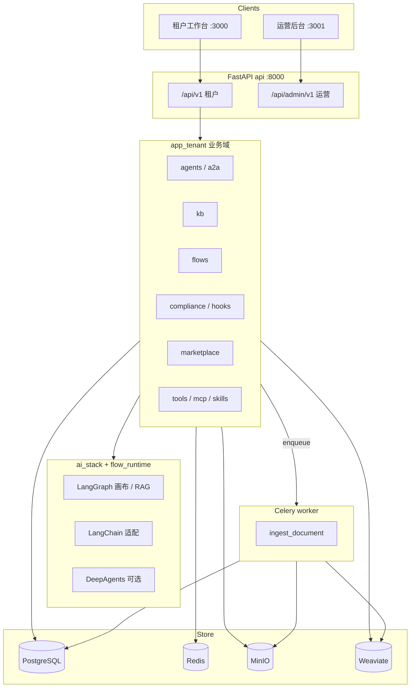
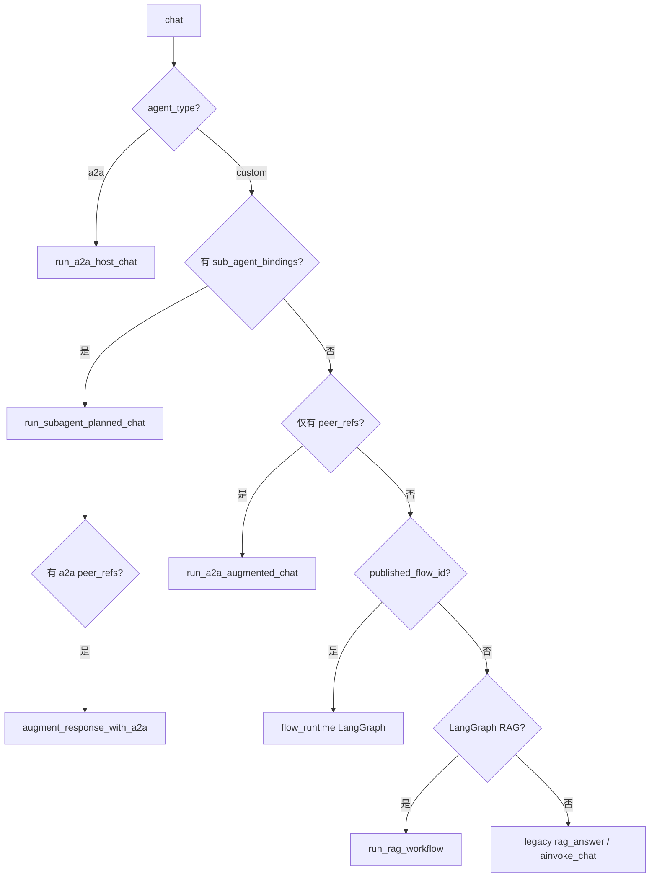

# AiEngine 技术方案

> 版本：v2.0 | 日期：2026-05-21 | 与当前代码库对齐  
> 需求基线：[prd.md](./prd.md) · 专题文档：[README.md](./README.md)

本文描述**仓库已实现**的架构与行为；细节见 `flows.md`、`platform-agents.md`、`a2a.md`、`ai-stack.md`。

---

## 目录

1. [概述](#1-概述)
2. [总体架构](#2-总体架构)
3. [仓库结构](#3-仓库结构)
4. [分层与模块](#4-分层与模块)
5. [多租户与权限](#5-多租户与权限)
6. [数据存储](#6-数据存储)
7. [API 概览](#7-api-概览)
8. [异步任务](#8-异步任务)
9. [流程编排](#9-流程编排)
10. [智能体对话](#10-智能体对话)
11. [合规、钩子与工具](#11-合规钩子与工具)
12. [应用市场](#12-应用市场)
13. [前端](#13-前端)
14. [部署](#14-部署)
15. [配置与环境变量](#15-配置与环境变量)
16. [实施状态](#16-实施状态)

---

## 1. 概述

**AiEngine** 是企业级私有化 AI 中台：多租户工作台 + 运营后台，提供知识库 RAG、React Flow 流程编排、平台内智能体（含 DeepAgents 内部协同）、A2A 外部互联、合规与工具/MCP、应用市场。

### 1.1 设计原则（代码中的落地）

| 原则 | 实现 |
|------|------|
| 元数据与文件分离 | PostgreSQL 业务表；MinIO 对象；Weaviate 向量 |
| 租户隔离 | ORM 查询带 `tenant_id`；向量检索 Filter；删除编排 `deletion/` |
| 编排同进程 | `flow_runtime` 节点 + `ai_stack.langgraph` 编译执行，无 Langflow 产品依赖 |
| 长任务异步 | 文档入库 `workers.tasks.ingest_document`（Celery 队列） |
| 双端 API | 租户 `/api/v1`；运营 `/api/admin/v1` |
| AI 栈可降级 | DeepAgents 未安装 → 平台 JSON 规划；MCP invoke 可为 mock |

### 1.2 与需求文档的差异

| 需求表述 | 当前实现 |
|----------|----------|
| Langflow 可视化编排 | **React Flow**（`@xyflow/react`）+ `graph_json` |
| Langflow 执行引擎 | **`flow_runtime` + LangGraph**（`LangGraphFlowRuntime`） |
| 独立 OCR/ASR 微服务 | 单 **worker** 容器，队列 `parse,ocr,asr,embed`（可选 multimodal 依赖） |

---

## 2. 总体架构



**启动顺序**（`apps/application.py` lifespan）：Alembic `upgrade head` → 租户/合规/市场/运营种子 → LangGraph checkpointer 初始化。

---

## 3. 仓库结构

```
AiEngine/
├── backend/
│   ├── app/
│   │   ├── main.py                 # uvicorn 入口
│   │   ├── apps/                   # FastAPI 工厂、路由汇总、启动迁移
│   │   ├── app_tenant/             # 租户 API（按域 views/services/models）
│   │   │   ├── agents/ a2a/ kb/ flows/ marketplace/ compliance/ …
│   │   │   └── router.py           # /api/v1
│   │   ├── admin/                  # 运营 API /api/admin/v1
│   │   ├── ai_stack/               # langchain / langgraph / deepagents
│   │   ├── flow_runtime/           # 节点 registry + LangGraphFlowRuntime
│   │   ├── models/                 # 核心 ORM（Agent、Flow、KB、Task…）
│   │   ├── core/                   # config、DB、deps、weaviate_store
│   │   ├── ai/                     # 遗留解析/RAG 门面（新代码优先 ai_stack）
│   │   ├── workers/                # Celery
│   │   └── deletion/               # 级联删除
│   ├── alembic/versions/           # 001 … 012
│   └── pyproject.toml
├── frontend/                       # 租户 Next.js 14
├── admin_frontend/                 # 运营 Next.js 14
├── docker/                         # middleware + app compose
└── docs/
```

---

## 4. 分层与模块

| 层 | 路径 | 职责 |
|----|------|------|
| 路由 | `app_tenant/*/views/` | 参数校验、依赖注入、调用 Service |
| 业务 | `app_tenant/*/services/` | 租户校验、编排、调用 AI/存储 |
| 仓储 | `app_tenant/*/repositories/`、`models/` | CRUD、分页 |
| 基础设施 | `core/`、`common/` | 配置、JWT、分页响应、异常 |

**租户业务域**（均有独立 `router`）：

| 域 | 前缀 | 说明 |
|----|------|------|
| system | `/tenants` `/users` `/roles` `/system/configs` | 租户、用户、RBAC、配置 |
| kb | `/kb` | 知识库、文档、检索 |
| flows | `/flows` | 流程版本、画布、发布、运行、编译预览 |
| agents | `/agents` | 智能体 CRUD、`POST …/chat` |
| a2a | `/a2a/peers` | 外部 Peer 登记与 Card 同步 |
| models | `/models` | 大模型配置（OpenAI 兼容） |
| compliance | `/compliance` | 敏感词、扫描、拦截日志 |
| hooks | `/hooks` | Webhook 定义与绑定 |
| tools / mcp / skills | `/tools` `/mcp` `/skill-packages` | 工具目录、MCP、技能包 |
| prompts | `/prompt-templates` | 提示词模板 |
| marketplace | `/marketplace` | 应用打包、审核、安装、评分 |
| tasks | `/tasks` | Celery 任务查询 |
| monitor | `/monitor` | 统计、报表、告警配置 |
| audit | `/audit` | 租户操作审计 |

**运营域**（`admin/`，前缀 `/api/admin/v1`）：平台管理员认证、租户运营、计费、风控、审计。

---

## 5. 多租户与权限

- 登录：`POST /api/v1/auth/login` 签发 JWT；`TenantContext` 注入 `tenant_id`、`user_id`。
- 数据访问：Service 层 `assert_tenant_access` + 查询 `tenant_filters`。
- 权限：角色-权限表 `sys_roles` / `sys_permissions` / `role_permissions`；路由依赖 `require_permissions`。
- 软删除：多数业务表 `deleted_at`（迁移 `004`）；删除智能体/KB 等走 `deletion/cascade.py`。

默认种子（`app_tenant/seeds/seed.py`）：租户 `admin` / `admin123`；运营 `platform` / `admin123`（`admin/seeds/admin_seed.py`）。

---

## 6. 数据存储

### 6.1 PostgreSQL 核心表

迁移链：`001_initial_schema` → … → `012_a2a_host_binding_keywords`。

| 分组 | 表名 | 说明 |
|------|------|------|
| 系统 | `sys_tenants`, `sys_users`, `sys_roles`, `sys_permissions`, `sys_configs` | 租户与用户体系 |
| 智能体 | `agt_agents` | `agent_type`: `custom` \| `a2a`；`config` JSONB |
| | `agt_model_configs` | 模型端点、加密 API Key |
| | `agt_sub_agent_bindings` | 平台内父子智能体 |
| | `agt_kb_bindings` | 智能体-知识库 M:N |
| A2A | `agt_a2a_peers` | 外部登记、Agent Card 缓存 |
| | `agt_a2a_peer_bindings` | 互联宿主 → peer（含 `trigger_keywords`） |
| | `agt_agent_a2a_peer_refs` | custom 智能体引用外部 peer |
| 流程 | `flow_flows`, `flow_versions` | `graph_json`；`external_flow_id` 预留未用 |
| 知识库 | `kb_bases`, `kb_documents`, `kb_document_chunks`, `kb_vector_refs` | 文档状态与向量引用 |
| 产品 | `prm_prompt_templates`, `skl_skill_packages`, `tool_tools`, `tool_mcp_services` | |
| | `hook_definitions`, `hook_bindings`, `cmp_*`, `mkt_*`, `task_records`, `aud_logs` | |
| 运营 | `adm_admins`, `adm_billing_*`, `adm_risk_*`, `adm_audit_logs` | 仅运营 API 使用 |

ORM **不在库级声明外键**（`001` 使用 `create_all`）；关联由应用层维护。

### 6.2 Weaviate

- Collection：`DocumentChunk`（`core/weaviate_store.py` 启动时 `ensure_schema`）。
- 属性：`tenant_id`, `kb_id`, `document_id`, `chunk_id`, `modality`, `content_preview`, `minio_key`, `page_no`。
- 向量：客户端自算 embedding（`sentence-transformers`，默认维度 384），`Vectorizer.none()` + HNSW cosine。
- 检索：按 `tenant_id` + `kb_id` Filter。

### 6.3 MinIO / Redis

- MinIO：文档原文件；路径与 `kb_documents` 记录关联。
- Redis：JWT 黑名单、Celery broker/result（常用 db `1`/`2`）、LangGraph checkpoint（`LANGGRAPH_REDIS_DB=0`，需 Redis Stack 或 Redis 8+，否则 MemorySaver）。

---

## 7. API 概览

统一响应：`{ code, message, data, trace_id }`（`common/response.py`）。中间件：`CORS`、`X-Trace-Id`。

### 7.1 租户 `/api/v1`（节选）

| 模块 | 关键端点 |
|------|----------|
| health | `GET /health` |
| auth | `POST /login`, `GET /me`, `POST /refresh` |
| agents | `GET/POST /agents`, `PATCH/DELETE /agents/{id}`, `POST /agents/{id}/chat` |
| a2a | `GET/POST /a2a/peers`, `POST /a2a/peers/probe`, `POST /a2a/peers/{id}/sync-card` |
| kb | CRUD + `POST /kb/{id}/documents/upload`, `POST /kb/{id}/search` |
| flows | CRUD + `PUT /flows/{id}/graph`, `POST /flows/{id}/publish`, `/run`, `/compile` |
| compliance | `/compliance/words`, `POST /compliance/scan`, `GET /compliance/logs` |
| tools | `GET /tools/catalog`, `POST /tools/{name}/invoke` |
| mcp | CRUD + `POST /mcp/{id}/sync`, `POST /mcp/{id}/tools/{name}/invoke` |
| marketplace | `POST /marketplace/apps/from-resources`, `/publish`, `/approve`, `/reject`, `/install`, `/apps/{id}/ratings` |
| monitor | `/monitor/stats`, `/trends`, `/report`, `/health`, `/alerts` |

完整路径以运行实例 **OpenAPI**（`/docs`）为准。

### 7.2 运营 `/api/admin/v1`

`auth/login`、`/tenants`（含 quota）、`/billing/plans`、`/billing/bills`、`/risk/events`、`/risk/ip-blacklist`、`/risk/rate-limits`、`/audit/logs`。

---

## 8. 异步任务

| 组件 | 说明 |
|------|------|
| Broker | `CELERY_BROKER_URL`（通常 Redis） |
| Worker 命令 | `celery -A app.workers.app worker -Q default,parse,ocr,asr,embed` |
| 主任务 | `ingest_document`：拉 MinIO → 解析/分片 → embedding → Weaviate upsert → 更新 PG 状态 |
| 可选依赖 | `[multimodal]`：`pytesseract`、`openai-whisper`；未安装时多模态文件仍可入库占位文本 |

任务记录表：`task_records`；API：`GET /tasks`、`POST /tasks/{id}/cancel|retry`。

---

## 9. 流程编排

```
React Flow 画布 → PUT /flows/{id}/graph → flow_versions.graph_json
执行：get_flow_runtime().run() → LangGraphFlowRuntime → ai_stack.langgraph.flow_runner
节点：flow_runtime/nodes/registry.py
```

**已注册节点类型**：`TextInput`、`TextOutput`、`ChatInput`/`ChatOutput`（别名）、`KnowledgeSearch`、`PromptTemplate`、`LLMCall`、`ConditionBranch`、`ParallelJoin`。

- 编译预览：`POST /flows/{id}/compile`（DAG 校验、并行层分析）。
- 智能体绑定 `published_flow_id` 时，对话走同一 LangGraph 执行链。
- 详见 [flows.md](./flows.md)。

---

## 10. 智能体对话

`POST /api/v1/agents/{id}/chat` 入口：`AgentService.chat`（`app_tenant/agents/services/agent.py`）。

执行前：**钩子** `BEFORE_CALL`、**合规** `check_input`；执行后：`check_output`、`AFTER_CALL`。



| 路径 | 条件 | 实现 |
|------|------|------|
| A2A 宿主 | `agent_type=a2a` | `a2a/invoke.run_a2a_host_chat` |
| 内部协同 | `agt_sub_agent_bindings` 非空 | DeepAgents 或平台 JSON 规划 → `chat_as_child` |
| 引用外部 | `agt_agent_a2a_peer_refs` | 先本地 RAG/流程/协同，再 `augment_response_with_a2a` |
| 画布流程 | `published_flow_id` + 已发布版本 | `get_flow_runtime().run` |
| RAG Graph | 绑 KB、`use_langgraph_rag` 未关闭 | `ai_stack.langgraph.runner` |
| 线性 RAG | 上述否 | `rag_answer` / 直连 LLM |

- 内部协同：[platform-agents.md](./platform-agents.md)
- A2A：[a2a.md](./a2a.md)
- LangChain/LangGraph/DeepAgents：[ai-stack.md](./ai-stack.md)

---

## 11. 合规、钩子与工具

### 11.1 合规

- 表：`cmp_sensitive_words`、`cmp_intercept_logs`。
- `ComplianceService`：对话入参/出参扫描；命中写日志。
- 流程 `POST /flows/{id}/run` 同样可走合规（与 agent 配置相关）。

### 11.2 钩子

- 表：`hook_definitions`（HTTP URL）、`hook_bindings`（scope: global / agent / flow）。
- **HTTP 钩子**：`httpx` 调用。
- **Python 钩子**：当前记录 `python_not_implemented` 并跳过（`hooks/services/executor.py`）。

### 11.3 工具与 MCP

| 类型 | 状态 |
|------|------|
| 内置工具 | `calculator`、`http_request`、`knowledge_search`（`tools/invoke.py`） |
| 自定义 HTTP 工具 | `tool_tools` 表配置 |
| MCP | `tools/list` 同步；无工具时占位名；**invoke 可能返回 `status: mock`** |
| 技能包 | `skl_skill_packages`：对话时注入系统提示片段 |
| 智能体配置 | `config.skill_package_id`、`config.mcp_service_ids` |

---

## 12. 应用市场

- 表：`mkt_categories`、`mkt_apps`、`mkt_ratings`、`mkt_installs`。
- 流程：从 KB/流程/智能体 **打包** → 草稿 → **提交审核**（`pending_review`）→ 运营 **通过/驳回** → 广场列表 → 租户 **安装**（复制 manifest 资源）→ **评分**（需已安装）。
- 权限：`marketplace:review` 审核待审列表。
- 种子：`marketplace_seed` 预置分类。

---

## 13. 前端

### 13.1 租户工作台（`frontend/`，`:3000`）

| 路径 | 功能 |
|------|------|
| `/login` | JWT 登录 |
| `/workbench/dashboard` | 概览 |
| `/workbench/agents` | 智能体列表（Tab：全部 / 智能体 / A2A 互联） |
| `/workbench/agents/chat` | 对话工作台（单智能体调试、会话） |
| `/workbench/kb`, `/workbench/kb/[id]` | 知识库 |
| `/workbench/flows`, `/workbench/flows/[id]/edit` | 流程列表与 React Flow 画布 |
| `/workbench/compliance` | 敏感词与日志 |
| `/workbench/prompts` | 提示词模板 |
| `/workbench/models` | 模型供应商 |
| `/workbench/hooks` | 钩子 |
| `/workbench/tools` | 工具 |
| `/workbench/skills` | 技能包 |
| `/workbench/mcp` | MCP |
| `/workbench/tasks` | 任务中心 |
| `/workbench/monitor` | 监控统计 |
| `/workbench/marketplace` | 应用市场 |
| `/system/*` | 用户、角色、配置、审计（系统管理区） |

导航：`frontend/lib/nav-config.ts`。API 客户端：`frontend/lib/api.ts`。

### 13.2 运营后台（`admin_frontend/`，`:3001`）

登录、租户、计费、风控、审计、个人资料；API 基址 `NEXT_PUBLIC_ADMIN_API_URL` → `/api/admin/v1`。

---

## 14. 部署

### 14.1 Compose 服务（实际）

**中间件** `docker/docker-compose.middleware.yml`：`postgres:15-alpine`、`redis:7-alpine`、`minio`、`weaviate:1.24.1`，网络 `aiengine-net`。

**应用** `docker/docker-compose.yml`：

| 服务 | 说明 |
|------|------|
| `api` | FastAPI，健康检查 `/api/v1/health` |
| `worker` | 单 Celery 进程，多队列 |
| `web` | 租户 Next.js |
| `admin-web` | 运营 Next.js `:3001` |
| `flower` | Celery 监控 `:5555` |

**不是** 多个独立 `worker-parse` / `worker-ocr` 容器；解析/OCR/ASR/向量化由同一 worker 按队列消费。

### 14.2 本地仅后端

中间件 Compose + `backend/.env`（`POSTGRES_HOST=localhost`）+ `alembic upgrade head` + `uvicorn app.main:app`。

详见 [database-setup.md](./database-setup.md)、[docker/README.md](../docker/README.md)。

---

## 15. 配置与环境变量

定义：`backend/app/core/config.py`、`backend/.env.example`、根 `.env.example`。

| 类别 | 变量示例 |
|------|----------|
| 应用 | `APP_ENV`, `SECRET_KEY`, `CORS_ORIGINS` |
| PostgreSQL | `POSTGRES_HOST`, `POSTGRES_PORT`, `POSTGRES_DB`, … |
| Redis | `REDIS_HOST`, `CELERY_BROKER_URL`, `LANGGRAPH_REDIS_DB`, `LANGGRAPH_REDIS_CHECKPOINT` |
| MinIO | `MINIO_ENDPOINT`, `MINIO_ACCESS_KEY`, … |
| Weaviate | `WEAVIATE_HOST`, `WEAVIATE_PORT` |
| RAG | `EMBEDDING_MODEL_NAME`, `DEFAULT_CHUNK_SIZE` |
| 种子 | `SEED_ADMIN_USERNAME`, `SEED_PLATFORM_ADMIN_USERNAME` |

**大模型 API Key** 存在 `agt_model_configs.api_key_encrypted`，由工作台「模型供应商」配置，非环境变量。

前端：`NEXT_PUBLIC_API_URL`（租户）、`NEXT_PUBLIC_ADMIN_API_URL`（运营）。

---

## 16. 实施状态

| 能力 | 状态 | 备注 |
|------|------|------|
| 多租户 / RBAC / JWT | ✅ | |
| 知识库入库与检索 | ✅ | Celery + Weaviate |
| 流程画布与 LangGraph 执行 | ✅ | 见 [flows.md](./flows.md) |
| 智能体 RAG / 画布 / 直连 LLM | ✅ | |
| DeepAgents 内部协同 | ✅ | 可选依赖，可降级 |
| A2A Peer / 宿主 / custom 引用 | ✅ | 对外暴露本平台 Card：未做 |
| 合规 / HTTP 钩子 | ✅ | Python 钩子未实现 |
| 工具 / MCP / 技能包 | 🔶 | MCP invoke 可能 mock |
| 应用市场审核与安装 | ✅ | |
| 监控报表 / 告警 Webhook | 🔶 | 基础聚合 + HTTP 告警 |
| 运营计费 / 风控 | ✅ | 后台 UI + API |
| 离线 OpenAPI 导出 / 离线部署手册 | ⬜ | 文档待补充 |

**后端测试**（`backend/tests/`）：health、deletion、langgraph、deepagents、a2a 等；无 marketplace/compliance 端到端测试文件。

---

## 附录：相关文档

| 文档 | 内容 |
|------|------|
| [README.md](./README.md) | 文档索引 |
| [prd.md](./prd.md) | 立项需求 |
| [database-setup.md](./database-setup.md) | 建库与迁移 |
| [flows.md](./flows.md) | 流程与 RAG Graph |
| [platform-agents.md](./platform-agents.md) | 内部协同 |
| [a2a.md](./a2a.md) | 外部互联 |
| [ai-stack.md](./ai-stack.md) | LangChain 模块与依赖 |

---

*变更实现时请同步更新本文「实施状态」与对应专题文档。*
