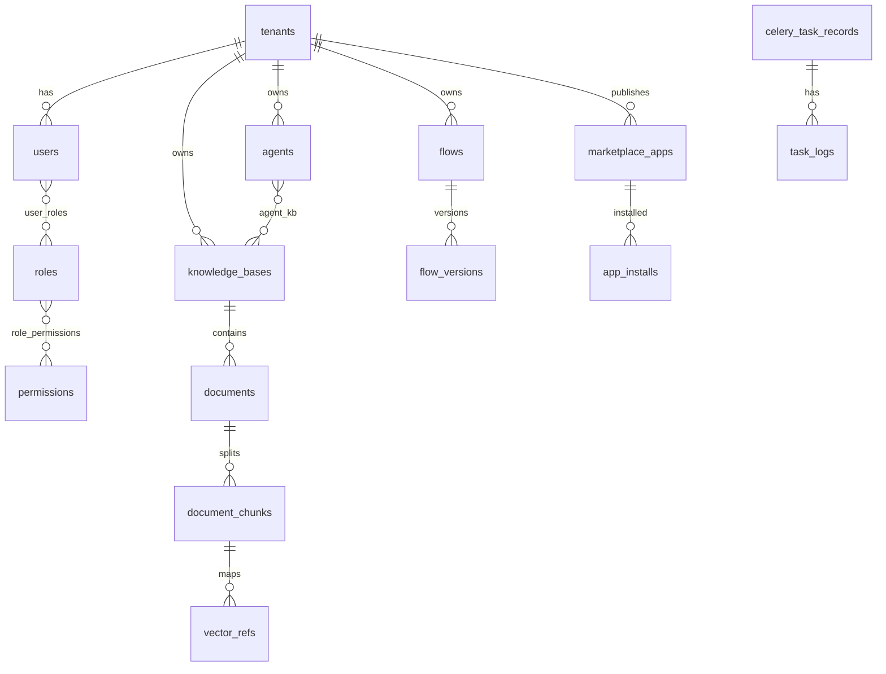
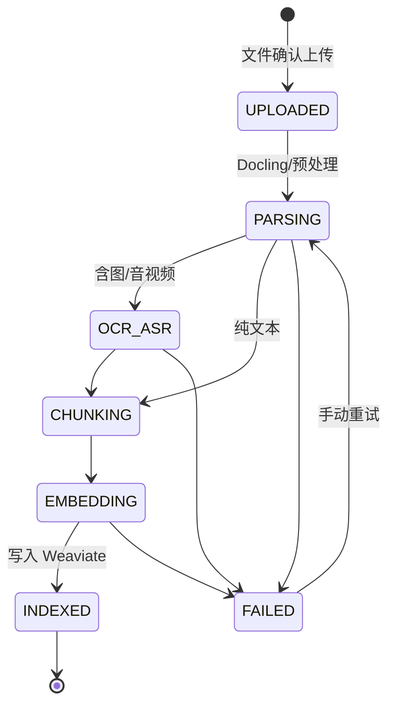
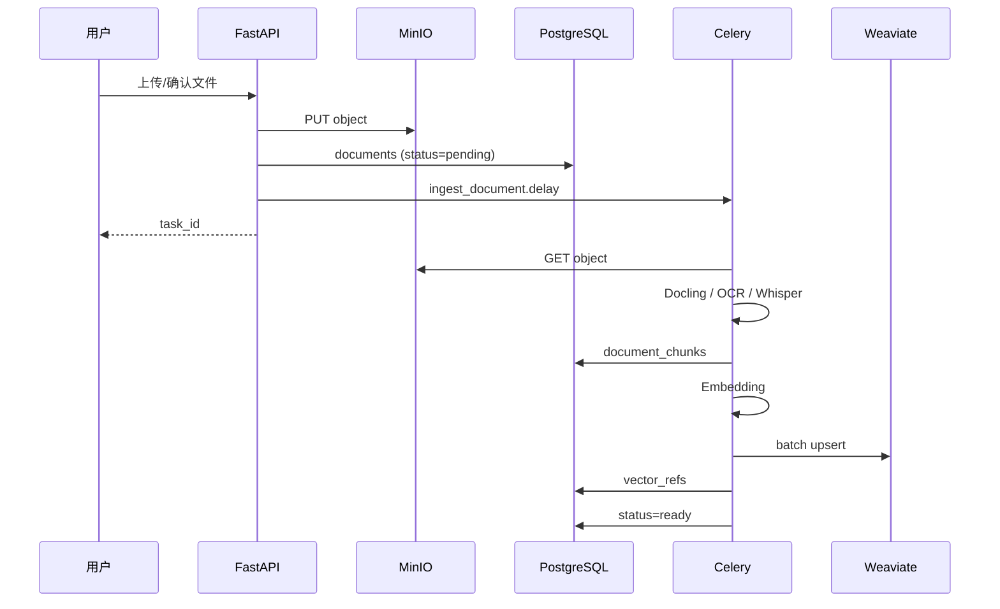

# AiEngine 技术方案

> 基于《一体化AI智能编排与RAG应用平台（多模态企业版）完整项目需求》编制  
> 版本：v1.1 | 日期：2026-05-21  
> **实现说明（编排）**：内置模块为 `app/flow_runtime/`（Builtin DAG），前端为 React Flow；第三方 Langflow / `@langflow/flow-builder` 为可选扩展，详见 [flow-runtime.md](./flow-runtime.md)。

---

## 目录

1. [方案概述](#1-方案概述)
2. [总体架构](#2-总体架构)
3. [工程目录结构](#3-工程目录结构)
4. [分层设计](#4-分层设计)
5. [多租户隔离](#5-多租户隔离)
6. [数据库设计](#6-数据库设计)
7. [Weaviate Schema](#7-weaviate-schema)
8. [API 设计规范](#8-api-设计规范)
9. [Celery 异步任务](#9-celery-异步任务)
10. [流程运行时与可选 Langflow 对接](#10-流程运行时与可选-langflow-对接)
11. [安全合规实现](#11-安全合规实现)
12. [前端技术方案](#12-前端技术方案)
13. [部署架构](#13-部署架构)
14. [非功能需求](#14-非功能需求)
15. [分阶段实施计划](#15-分阶段实施计划)
16. [风险与对策](#16-风险与对策)
17. [技术栈对照](#17-技术栈对照)

---

## 1. 方案概述

**AiEngine** 是企业级私有化 AI 中台，定位为：低代码可视化 AI 流程搭建、多模态知识库管理、智能体协同、应用生态复用的全流程解决方案。

### 1.1 核心设计原则


| 原则       | 实现方式                                                          |
| -------- | ------------------------------------------------------------- |
| 全异步 Web  | FastAPI 异步接口；耗时操作一律 Celery，不阻塞 Web                            |
| AI 能力内嵌  | Docling / PaddleOCR / Whisper / Embedding 以 Python 库调用，无独立微服务 |
| 流程同进程    | `flow_runtime` Builtin 执行 `graph_json`，无 iframe、无独立编排服务端口     |
| 存储三分离    | PostgreSQL（元数据）、MinIO（文件）、Weaviate（向量）                        |
| 租户贯穿     | `tenant_id` 在 PG / Weaviate / MinIO 路径 / Redis Key 全链路隔离      |
| 100% 私有化 | Docker Compose 一键部署；模型与数据本地 volume                            |


### 1.2 与需求文档映射

本方案覆盖需求文档 **第三章（架构）**、**第四章（存储）**、**第五章（多模态 AI）**、**第六章（10 大模块）** 的全部技术要求，技术栈严格遵循需求 **§2（不可修改）**。

---

## 2. 总体架构

```mermaid
flowchart TB
    subgraph FE["前端 Next.js 14"]
        UI[业务页面]
        FE["React Flow 画布"]
    end

    subgraph GW["接入层 FastAPI"]
        Auth[JWT + RBAC]
        RL[限流 / 分布式锁]
        API[REST API]
    end

    subgraph BL["业务逻辑层 — 10 大模块"]
        M1[系统管理]
        M2[安全合规]
        M3[模型中心]
        M4[智能体/编排]
        M5[工具/MCP]
        M6[RAG知识库]
        M7[应用市场]
        M8[任务中心]
        M9[监控统计]
        Hook[钩子引擎]
    end

    subgraph ASYNC["异步层 Celery"]
        W1[parse_worker]
        W2[ocr_worker]
        W3[embed_worker]
    end

    subgraph AI["AI 能力层"]
        FR[flow_runtime Builtin]
        Doc[Docling]
        OCR[PaddleOCR]
        WH[Whisper]
        EMB[Embedding / CLIP]
        WV_Q[Weaviate Client]
    end

    subgraph STORE["存储层"]
        PG[(PostgreSQL 15+)]
        Redis[(Redis 7+)]
        MinIO[(MinIO S3)]
        WV[(Weaviate 1.24+)]
    end

    FE -->|Axios| GW
    GW --> Redis
    GW --> BL
    BL --> FR
    BL --> AI
    BL -->|enqueue| ASYNC
    ASYNC --> AI
    ASYNC --> STORE
    BL --> STORE
    AI --> STORE
```


### 2.1 组件交互（需求 §3.2）

1. 前端经 Axios 调用 FastAPI，全接口鉴权 + 限流；高频读优先 Redis。
2. 耗时操作由 API 创建 Celery 任务入 Redis 队列，Worker 消费。
3. Docling / PaddleOCR / Whisper 等以库形式内嵌，由 Service 或 Celery 直接调用。
4. 上传文件 → MinIO → PG 元数据 → Celery 解析/向量化 → Weaviate + `vector_refs` 关联表。
5. 删除文件时级联：Weaviate 向量 → PG 元数据/关联 → MinIO 对象（失败入补偿队列）。

---

## 3. 工程目录结构

Monorepo 布局，前后端与部署配置同仓管理：

```
AiEngine/
├── docker/
│   ├── docker-compose.yml
│   ├── docker-compose.prod.yml
│   └── images/
│       ├── api/Dockerfile
│       ├── worker/Dockerfile
│       └── web/Dockerfile
├── backend/
│   ├── app/
│   │   ├── main.py
│   │   ├── core/
│   │   │   ├── config.py
│   │   │   ├── security.py
│   │   │   ├── tenant.py
│   │   │   └── redis.py
│   │   ├── api/v1/
│   │   │   ├── auth.py
│   │   │   ├── users.py
│   │   │   ├── tenants.py
│   │   │   ├── kb.py
│   │   │   ├── flows.py
│   │   │   ├── agents.py
│   │   │   ├── marketplace.py
│   │   │   ├── tasks.py
│   │   │   └── monitor.py
│   │   ├── models/
│   │   ├── schemas/
│   │   ├── services/
│   │   ├── hooks/
│   │   ├── compliance/
│   │   ├── ai/
│   │   │   ├── docling_parser.py
│   │   │   ├── paddle_ocr.py
│   │   │   ├── whisper_asr.py
│   │   │   ├── embedding.py
│   │   │   └── weaviate_store.py
│   │   ├── flow_runtime/       # Builtin DAG + 节点注册表
│   │   │   ├── builtin_runtime.py
│   │   │   ├── optional_langflow_adapter.py
│   │   │   ├── nodes/
│   │   │   └── templates/
│   │   └── celery_app/
│   │       ├── app.py
│   │       └── tasks/
│   │           ├── ingest.py
│   │           ├── ocr.py
│   │           └── embed.py
│   ├── alembic/
│   ├── tests/
│   └── pyproject.toml
├── frontend/
│   ├── app/
│   ├── components/
│   │   ├── flow/
│   │   └── multimodal/
│   ├── lib/api.ts
│   └── package.json
├── docs/
│   ├── 技术方案.md
│   └── api/                    # OpenAPI 规范（后续补充）
└── 一体化AI智能编排与RAG应用平台（多模态企业版）完整项目需求.md
```

---

## 4. 分层设计

### 4.1 接入层（FastAPI）


| 能力   | 说明                                             |
| ---- | ---------------------------------------------- |
| 统一响应 | `{ code, message, data, trace_id }`            |
| 中间件链 | CORS → RequestID → JWT → 租户注入 → RBAC → 限流      |
| 鉴权   | Access Token（短期）+ Refresh Token；登出写入 Redis 黑名单 |
| 文件上传 | 小文件 API 直传 MinIO；大文件 MinIO 预签名 POST            |


### 4.2 缓存层（Redis）


| Key 模式                     | 用途               | TTL 建议       |
| -------------------------- | ---------------- | ------------ |
| `session:{user_id}`        | 登录会话             | 系统配置         |
| `token:blacklist:{jti}`    | Token 失效         | = token 剩余寿命 |
| `cache:api:{hash}`         | 热点接口（KB 列表、模型列表） | 5–60 min     |
| `lock:ingest:{file_id}`    | 防重复解析            | 300s         |
| `ratelimit:{tenant}:{api}` | 租户/API 限流        | 1 min 窗口     |
| Celery broker/backend      | 任务队列与结果          | Celery 配置    |


缓存策略：核心配置支持主动失效；接口缓存带版本号或租户维度，避免脏读。

### 4.3 业务逻辑层 — 模块映射


| 需求模块        | Service 包                                 | 核心职责                    |
| ----------- | ----------------------------------------- | ----------------------- |
| 模块1 系统管理    | `services/system/`                        | 用户、RBAC、租户、配置、日志、缓存管理   |
| 模块2 安全合规    | `services/compliance/`                    | 敏感词、钩子、脱敏、水印            |
| 模块3 模型中心    | `services/models/`                        | 供应商、健康检查、提示词模板          |
| 模块4 智能体编排   | `app_tenant/agents/`, `app_tenant/flows/` | 智能体、`flow_runtime` 流程版本 |
| 模块5 工具/MCP  | `services/tools/`                         | 内置工具、MCP 发现与同步、技能包      |
| 模块6 RAG 知识库 | `services/kb/`                            | KB、文档、检索、问答             |
| 模块7 应用市场    | `services/marketplace/`                   | 应用打包、安装、审核              |
| 模块8 任务中心    | `services/tasks/`                         | Celery 任务查询、重试、监控       |
| 模块9 监控统计    | `services/monitor/`                       | 组件健康、业务报表、告警            |


跨模块公共组件：

- `TenantContext`：从 JWT 提取 `tenant_id`，Repository 层强制过滤。
- `HookExecutor`：前置/后置钩子链（Python 脚本 / HTTP）。
- `CompliancePipeline`：敏感词 Aho-Corasick + 警告/拦截策略。

### 4.4 AI 能力层封装


| 组件           | 封装类/模块                                          | 调用方               |
| ------------ | ----------------------------------------------- | ----------------- |
| Docling      | `DoclingParser.parse(bucket, key) -> ParsedDoc` | Celery `parse` 队列 |
| PaddleOCR    | `PaddleOCRService.ocr(bytes) -> OCRResult`      | Celery `ocr` 队列   |
| Whisper      | `WhisperASR.transcribe(path, lang) -> str`      | Celery `asr` 队列   |
| Embedding    | `EmbeddingService.embed_text/image`             | Celery `embed` 队列 |
| Weaviate     | `WeaviateStore.upsert/search/delete`            | Service + Celery  |
| flow_runtime | `get_flow_runtime().run(graph_json)`            | Flow API、智能体对话    |


---

## 5. 多租户隔离


| 层级         | 隔离方式                                                               |
| ---------- | ------------------------------------------------------------------ |
| PostgreSQL | 全业务表 `tenant_id` NOT NULL；复合索引 `(tenant_id, ...)`                  |
| Weaviate   | 推荐单 Collection + `tenant_id` 强制 filter；超大租户可 per-tenant Collection |
| MinIO      | `s3://{bucket}/{tenant_id}/{kb_id}/{file_id}`                      |
| Redis      | Key 前缀 `t:{tenant_id}:`                                            |
| Celery     | Task payload 含 `tenant_id`，Worker 上下文注入                            |
| 配额         | `tenant_quotas` 表 + Redis 计数（存储、向量数、并发任务、API 调用）                   |


配额校验时机：上传前（存储）、创建 KB 前（数量）、提交 Celery 任务前（并发）。

---

## 6. 数据库设计

### 6.1 核心 ER 关系




### 6.2 核心表清单（对应需求 §4.1.2）

**系统管理类**

- `tenants`, `users`, `roles`, `permissions`, `user_roles`, `role_permissions`
- `system_configs`, `operation_logs`, `audit_logs`, `login_logs`

**安全合规类**

- `sensitive_words`, `sensitive_word_categories`
- `hook_definitions`, `hook_bindings`, `intercept_logs`, `violation_stats`

**AI 资源类**

- `model_providers`, `model_configs`, `prompt_templates`

**智能体与编排类**

- `agents`, `agent_kb_bindings`, `agent_tool_bindings`
- `flows`, `flow_versions`, `tools`, `mcp_services`, `skill_packages`

**知识库类**

- `knowledge_bases`, `documents`, `document_chunks`
- `vector_refs`（`weaviate_uuid` ↔ `chunk_id`）
- `retrieval_logs`

**应用市场类**

- `marketplace_apps`, `app_categories`, `app_installs`, `app_templates`

**多模态类**

- `multimodal_files`, `parse_records`, `ocr_records`

**异步任务类**

- `celery_task_records`, `task_logs`

**统计类**

- `api_call_stats`, `token_usage`, `doc_process_stats`, `ocr_stats`, `cache_hit_stats`

### 6.3 关键字段设计

**documents**

```sql
status ENUM (
  'pending',      -- 待解析
  'parsing',      -- 解析中
  'embedding',    -- 向量化中
  'ready',        -- 正常可用
  'parse_failed',
  'embed_failed'
)
minio_bucket, minio_key, file_size, mime_type, kb_id, tenant_id
fail_reason TEXT
```

**vector_refs**

```sql
chunk_id UUID FK
weaviate_uuid VARCHAR
vector_type ENUM ('text','image','audio')
kb_id, tenant_id, document_id
created_at
```

**system_configs**

```sql
key VARCHAR UNIQUE
value JSONB          -- 连接信息等
is_encrypted BOOLEAN -- 密钥类字段 AES 加密
```

日志表（`operation_logs`, `audit_logs`）建议按月分区，应对高写入量。

---

## 7. Weaviate Schema

### 7.1 Collection 定义（概念）

```python
CLASS_NAME = "DocumentChunk"

PROPERTIES = [
    {"name": "tenant_id",     "dataType": ["text"], "indexFilterable": True},
    {"name": "kb_id",         "dataType": ["text"], "indexFilterable": True},
    {"name": "document_id",   "dataType": ["text"], "indexFilterable": True},
    {"name": "chunk_id",      "dataType": ["text"]},
    {"name": "modality",      "dataType": ["text"]},  # text | image | audio
    {"name": "content_preview","dataType": ["text"]},
    {"name": "minio_key",     "dataType": ["text"]},
    {"name": "page_no",       "dataType": ["int"]},
    {"name": "bbox",          "dataType": ["text"]},  # OCR 溯源 JSON
    {"name": "created_at",    "dataType": ["date"]},
]

# vectorizer: none — 应用侧 Embedding 后写入
# vectorIndexConfig: hnsw, distance: cosine
```

### 7.2 检索策略（需求 §5.3，SLA ≤500ms）


| 场景    | 方式                                              |
| ----- | ----------------------------------------------- |
| 文本搜文本 | query embedding + `nearVector` 或 hybrid（+ BM25） |
| 文本搜图  | text embedding 与 image vector 同空间（CLIP 对齐）或双路融合 |
| 以图搜图  | image CLIP vector + `nearVector`                |
| 混合检索  | Weaviate `hybrid` API，alpha 可 per-KB 配置         |


性能参数：`ef=128`，`limit` 默认 ≤20；热点 KB 可缓存 document_id 白名单。

### 7.3 向量维度

- 默认 384（`sentence-transformers` 小型号），可配置 768。
- 全局 `system_configs.embedding_model` 与 Weaviate 维度一致，变更需重建索引。

---

## 8. API 设计规范

### 8.1 约定

- Base URL：`/api/v1`
- 认证：`Authorization: Bearer <access_token>`
- 分页：`?page=1&size=20` → `{ items, total, page, size }`
- 租户：由 Token 解析，禁止客户端伪造 `tenant_id`

### 8.2 核心接口分组


| 分组  | 示例路径                                                                   | 说明                            |
| --- | ---------------------------------------------------------------------- | ----------------------------- |
| 认证  | `POST /auth/login`, `POST /auth/refresh`, `POST /auth/logout`          | JWT                           |
| 系统  | `GET/POST /users`, `/roles`, `/tenants`, `/configs`                    | RBAC                          |
| 知识库 | `GET/POST /kb`, `POST /kb/{id}/documents`, `POST /kb/{id}/search`      | RAG 核心                        |
| 任务  | `GET /tasks/{id}`, `POST /tasks/{id}/cancel`, `POST /tasks/{id}/retry` | 异步状态                          |
| 流程  | `GET/POST /flows`, `POST /flows/{id}/run`, `POST /flows/{id}/publish`  | `flow_runtime` + `graph_json` |
| 智能体 | `GET/POST /agents`, `POST /agents/{id}/chat`                           | 绑定 KB/模型                      |
| 市场  | `GET /marketplace/apps`, `POST /marketplace/apps/{id}/install`         | 应用生态                          |
| 监控  | `GET /monitor/health`, `GET /monitor/stats`                            | 运维                            |


### 8.3 权限装饰器示例

```python
@router.post("/kb/{kb_id}/documents")
@require_permissions("kb:document:upload")
async def upload_document(
    kb_id: UUID,
    ctx: TenantContext = Depends(get_tenant_context),
):
    ...
```

### 8.4 文件上传流程

```
1. POST /kb/{id}/documents/presign  → { upload_url, file_id }
2. 客户端直传 MinIO
3. POST /kb/{id}/documents/{file_id}/confirm → 创建 Celery ingest 任务
4. GET /tasks/{task_id} 轮询状态
```

---

## 9. Celery 异步任务

### 9.1 队列划分


| 队列        | Worker    | 任务类型                |
| --------- | --------- | ------------------- |
| `default` | CPU 轻量    | 导出、状态同步、通知          |
| `parse`   | CPU+IO    | Docling 文档解析        |
| `ocr`     | GPU/CPU 重 | PaddleOCR           |
| `asr`     | GPU/CPU   | Whisper 转写          |
| `embed`   | GPU 优先    | 分片向量化 + Weaviate 写入 |


### 9.2 文档入库状态机




### 9.3 流水线编排（Celery chain）

```python
# 概念代码
chain(
    parse_document.s(file_id),
    optional_ocr.s(),
    optional_whisper.s(),
    chunk_text.s(),
    embed_and_index.s(),
    finalize_document.s(),
).apply_async(queue='parse')
```

进度：`ingest:progress:{job_id}` 写入 Redis（0–100），API 可查询。

### 9.4 任务管理（需求 §8）

- 失败自动重试：`max_retries=3`, `countdown` 指数退避
- 任务记录落库 `celery_task_records` + `task_logs`
- Flower 监控 Worker 在线状态
- 支持取消：`revoke(task_id, terminate=True)`

---

## 10. 流程运行时与可选 Langflow 对接

> 详细说明见 **[flow-runtime.md](./flow-runtime.md)**。  
> **命名**：`app/flow_runtime/` = 本项目执行引擎；**Langflow** 仅指第三方 PyPI/npm 产品（可选）。

### 10.1 当前实现（P2 已落地）


| 层级    | 选型                                                                     |
| ----- | ---------------------------------------------------------------------- |
| 执行引擎  | `BuiltinFlowRuntime`，入口 `get_flow_runtime()`                           |
| 持久化   | `flow_flows` + `flow_versions.graph_json`                              |
| 前端画布  | React Flow（`@xyflow/react`），路径 `/workbench/flows/{id}/edit`            |
| 外部 ID | `flows.external_flow_id`（预留对接第三方 Flow）                                 |
| 可选扩展  | `optional_langflow_adapter.py`：检测 `pip install langflow`，当前仍委托 Builtin |


### 10.2 可选：第三方 Langflow 对接（未强制）

1. 安装并锁定 PyPI `langflow` 版本，在 `OptionalLangflowAdapter.run()` 接入官方 API。
2. 可将 `external_flow_id` 与 Langflow 内部 Flow ID 映射。

### 10.3 自定义节点（`flow_runtime/nodes/`）


| 节点类型       | 实现要点                                  |
| ---------- | ------------------------------------- |
| 多模态输入      | 接收 MinIO 引用或 base64                   |
| PaddleOCR  | 调用 `PaddleOCRService`，支持异步 task_id 回传 |
| Whisper 转写 | 调用 Celery `asr` 队列                    |
| RAG 检索     | 封装 `WeaviateStore.hybrid_search`      |
| 敏感词/钩子     | 调用 `CompliancePipeline`               |
| Celery 任务  | 触发异步任务并等待结果（可配置超时）                    |
| Redis 缓存   | 读/写缓存节点                               |


### 10.4 流程版本

- 每次保存创建 `flow_versions` 快照（`version`, `graph_json`, `editor_id`, `created_at`）。
- 发布：`flows.status = published`，运行时使用最新 published 版本。
- 回滚：将指定 `version` 标记为 current。

### 10.5 验证项

- Builtin 运行时 + React Flow 画布与 `/flows` API 联调
- 自定义节点注册（`nodes/registry.py`）与 `POST /flows/{id}/run`
- 可选：第三方 `langflow` 包真实执行（`OptionalLangflowAdapter` 待接满）

---

## 11. 安全合规实现

### 11.1 敏感词（需求 §2.1）

- 算法：`pyahocorasick` 构建 Trie，支持模糊匹配扩展。
- 词库存 Redis：`t:{tenant_id}:sensitive_words`，变更时主动刷新。
- 策略：`warn` | `block`，可按模块（输入/输出/OCR/ASR）配置。

### 11.2 钩子（需求 §2.2）


| 类型        | 实现                                        |
| --------- | ----------------------------------------- |
| Python 钩子 | 插件目录 + `RestrictedPython` 或子进程隔离执行，超时 10s |
| HTTP 钩子   | `httpx` 异步，`timeout=5s`                   |
| 绑定范围      | 全局 / 智能体 / 应用 / 流程（`hook_bindings` 表）     |


执行顺序：**前置钩子 → 敏感词(入) → 业务 → 敏感词(出) → 后置钩子**。

### 11.3 其他

- API 密钥：`cryptography.Fernet` 加密存 PG。
- 脱敏：手机号、邮箱、身份证等正则规则引擎。
- 水印：导出 PDF/图片时 PIL/reportlab 叠加，配置存 `system_configs`。

---

## 12. 前端技术方案

### 12.1 技术栈（需求 §2.2）

- Next.js 14 App Router + TypeScript
- TailwindCSS 统一主题
- **React Flow**（`@xyflow/react`）编排画布；`graph_json` 存后端
- Axios（`frontend/lib/api.ts`）

### 12.2 路由规划


| 路径                           | 页面              |
| ---------------------------- | --------------- |
| `/login`                     | 登录              |
| `/admin/users`               | 用户管理            |
| `/admin/tenants`             | 租户管理            |
| `/admin/config`              | 系统配置            |
| `/kb`                        | 知识库列表           |
| `/kb/[id]`                   | 文档管理与检索问答       |
| `/workbench/flows`           | 流程列表            |
| `/workbench/flows/[id]/edit` | React Flow 编排画布 |
| `/agents`                    | 智能体管理           |
| `/marketplace`               | 应用广场            |
| `/tasks`                     | 异步任务中心          |
| `/monitor`                   | 监控统计            |


### 12.3 关键组件

- `MediaUploader`：分片上传、进度条、MIME 校验
- `MediaPreview`：文档/图片/音频/视频预览
- `FlowCanvas` / `FlowNodeCard`：React Flow 画布，对接 `/flows` API
- `TaskProgress`：轮询 `/tasks/{id}` 或 SSE

### 12.4 鉴权与菜单

- Middleware 校验 Token；未登录跳转 `/login`
- 菜单树由 `GET /auth/menus` 按 RBAC 动态返回

---

## 13. 部署架构

### 13.1 Docker Compose 服务清单

```yaml
services:
  web:           # Next.js :3000
  api:           # FastAPI :8000（含 flow_runtime）
  worker-parse:
  worker-ocr:    # 可选 GPU profile
  worker-embed:  # 可选 GPU profile
  flower:        # :5555
  postgres:      # :5432  PG15+
  redis:         # :6379  Redis7+
  weaviate:      # :8080  1.24+
  minio:         # :9000 / console :9001
```

### 13.2 私有化离线

- 镜像来自内网 Registry，无公网拉取
- 模型目录挂载：`./models` → PaddleOCR / Whisper / Embedding
- `docker compose --profile gpu up` 启用 GPU Worker

### 13.3 健康检查

- 各中间件原生 healthcheck
- API `GET /health` 聚合：PG、Redis、MinIO、Weaviate、Celery ping
- 监控告警对接（邮件/Webhook，需求 §9.3）

### 13.4 备份


| 组件         | 策略                     |
| ---------- | ---------------------- |
| PostgreSQL | 每日 `pg_dump`，保留 7/30 天 |
| MinIO      | 纠删码或定期 mc mirror       |
| Weaviate   | 官方 backup API 定时快照     |


---

## 14. 非功能需求


| 指标          | 目标      | 方案                            |
| ----------- | ------- | ----------------------------- |
| 检索延迟        | ≤500ms  | HNSW + limit + 连接池            |
| OCR 不阻塞 Web | —       | 独立 ocr 队列                     |
| 接口并发        | 企业内网高并发 | Uvicorn workers + Redis 缓存    |
| 数据隔离        | 租户零泄漏   | 强制 tenant filter + 集成测试       |
| 可观测         | 运维可视    | Prometheus + JSON 日志 + Flower |


---

## 15. 分阶段实施计划


| 阶段            | 周期（估） | 交付物                         | 验收标准                  |
| ------------- | ----- | --------------------------- | --------------------- |
| **P0 基础设施**   | 2–3 周 | Compose、JWT+RBAC+租户、系统配置 UI | 一键启动全栈；用户登录与租户隔离      |
| **P1 RAG 核心** | 3–4 周 | KB CRUD、上传→入库流水线、检索问答       | 文档入库成功；检索≤500ms；溯源可用  |
| **P2 编排与智能体** | 3–4 周 | `flow_runtime`、自定义节点、智能体    | React Flow 画布；流程可发布运行 |
| **P3 安全与工具**  | 2–3 周 | 敏感词、钩子、MCP、技能包              | 拦截日志可查；MCP 工具同步       |
| **P4 应用市场**   | 2 周   | 模板打包/安装、应用广场                | 一键安装可用                |
| **P5 运维增强**   | 2 周   | 监控统计、报表告警、任务中心              | 组件健康可视；报表导出           |


---

## 16. 风险与对策


| 风险                     | 影响         | 对策                                             |
| ---------------------- | ---------- | ---------------------------------------------- |
| 第三方 Langflow API 变动    | 可选对接失效     | 默认 Builtin 不受影响；`OptionalLangflowAdapter` 锁定版本 |
| PaddleOCR/Whisper 内存高  | Worker OOM | 独立队列、并发上限、模型懒加载                                |
| Weaviate 多模态 Schema 复杂 | 检索不准       | 一期 text+CLIP image；音频先转写再文本向量                  |
| 删除级联失败                 | 脏数据        | `reconcile_storage` 定时补偿任务                     |
| 单机 GPU 不足              | OCR/ASR 慢  | `worker-ocr` 横向扩展 + 队列优先级                      |


---

## 17. 技术栈对照

需求 **§2** 锁定栈；**编排层实现对照**如下（与需求表述差异见 [flow-runtime.md](./flow-runtime.md)）：


| 需求文档                     | 当前实现                                            |
| ------------------------ | ----------------------------------------------- |
| Langflow（内嵌）             | `app/flow_runtime` Builtin + 可选 PyPI `langflow` |
| `@langflow/flow-builder` | React Flow（`@xyflow/react`）                     |


**后端：** FastAPI · flow_runtime · Docling · PaddleOCR · Whisper · Weaviate · PostgreSQL 15+ · MinIO · Redis 7+ · Celery · JWT+RBAC · SQLAlchemy · Docker Compose

**前端：** Next.js 14 · TypeScript · TailwindCSS · React Flow · Axios

---

## 附录 A：文档入库时序




## 附录 B：相关文档

- [数据库初始化.md](./数据库初始化.md) — PostgreSQL 建库、Alembic 迁移、种子数据
- `docs/api/openapi.yaml` — REST 完整规范
- `docs/deploy/offline-guide.md` — 离线部署手册

---

*本文档随实现迭代更新，变更请同步版本号与变更记录。*